# شرح البيبر رقم برقم ورسمة برسمة (بالعامية المصرية)


> Fine-Tuned Encoders or Prompted LLMs for Requirements Classification? The Verdict Inverts Under Distribution Shift


> الشرح ده اتكتب عشان يفسّر كل رقم وكل رسمة في البيبر وفي عرض الرسالة: الرقم ده إيه، جاي منين، وليه القيمة دي بالذات. كل رقم اتراجع على ملفات النتايج الخام في الريبو.


## قاموس المصطلحات: كل كلمة هتقابليها في البيبر، بالمصري ومع مثال من البيبر نفسها

القسم ده مش للقراية مرة واحدة، ده مرجع ترجعيله كل ما تقفي عند كلمة. كل مصطلح ليه: شرح قصير بالمصري، وبعدين مثال حقيقي من البيبر بتاعتك بالرقم اللي فيها، والرقم ده دايمًا معاه "هو إيه" و"جاي منين" و"ليه القيمة دي". لو الورقة أو الكود ما قالوش ليه، هقولك ده بصراحة وهقولك تفسيري أنا وأعلّمه إنه تفسيري.

جملة واحدة بس عن الفكرة العامة، عشان انتِ عارفاها: **requirement classification** هي إننا ناخد جملة متطلَّب برمجي ونديها label (FR ولا NFR، security ولا لأ، أو نوع الـ NFR من 11 نوع)، وخلاص، مش هنرجع للنقطة دي تاني.

---

### 1) نوعين من الموديلات وطرق تشغيلهم

**encoder (BERT / RoBERTa) مقابل decoder LLM**
- الـ encoder موديل بيقرا الجملة كلها مرة واحدة ويطلّع تمثيل رقمي ليها، وإحنا بنحط فوقه طبقة صغيرة اسمها classification head بتقول "الكلاس ده". هو ما بيكتبش كلام، بيختار من قايمة.
- الـ decoder LLM (زي Qwen وLlama وGemini) موديل بيولّد نص كلمة ورا كلمة. إحنا بنسأله سؤال وهو "يجاوب" بكلمة، وإحنا بنقرا الكلمة دي كـ label.
- مثال من البيبر: الـ encoders في Table III هما `bert-base-uncased` بحجم 0.11 مليار parameter و`roberta-base` بحجم 0.13 مليار؛ الـ LLMs المحلية من 2.61 مليار (Gemma-2-2B) لـ 8.03 مليار (Llama-3.1-8B)، والـ hosted هو Llama-3.3-70B بحجم 70.6 مليار. يعني أصغر LLM أكبر من BERT بحوالي 24 مرة (2.61/0.11)، ومع كده Table IV بتقول إن الإنكودرز المدرّبة بتاخد أحسن رقم في 5 من 6 أعمدة in-domain: BERT_w في FR/NFR (0.908) وأمان PROMISE (0.923)، وRoBERTa_w في التلات sub-types (0.936 / 0.837 / 0.724)؛ العمود السادس (أمان SecReq) لـ Qwen2.5-7B (0.846).

**fine-tuning**
- إنك تاخدي موديل متدرّب مسبقًا وتكمّلي تدريبه على بياناتك انتِ (المتطلبات المعنونة) عشان يتعلّم المهمة بالذات. الـ encoders في البيبر كلها fine-tuned؛ الـ LLMs لأ.

- كلمات هتقابليها في السطر الجاي، واحدة واحدة: **parameter** = رقم جوه الموديل بيتعدّل بالتدريب (BERT فيه 0.11 مليار منهم)؛ **classification head** = طبقة صغيرة فوق الـ encoder بتحوّل التمثيل الرقمي للجملة لدرجة لكل كلاس؛ **loss** = رقم بيقيس قد إيه إجابة الموديل غلط، والتدريب كله محاولة تصغيره؛ **learning rate** = حجم الخطوة اللي بنعدّل بيها الأوزان كل مرة (2×10⁻⁵ صغيرة جدًا عشان ما نبوّظش اللي الموديل متعلّمه قبل كده)؛ **batch** = عدد الجمل اللي بنحسب عليها الـ loss قبل كل تعديل (16 هنا)؛ **epoch** = مرور كامل على بيانات التدريب مرة واحدة؛ **AdamW** = اسم خوارزمية التعديل نفسها.

- الإعدادات الحقيقية (Section III-D): optimizer اسمه AdamW، learning rate = 2×10⁻⁵، batch = 16، أقصى طول 128 token، 3 epochs للمهام الثنائية و10 epochs للـ sub-types. الورقة ما بتقولش ليه القيم دي بالذات؛ المنطق المعتاد (تفسيري) إنها القيم القياسية من ورقة BERT الأصلية، والـ 10 epochs للـ sub-types لأنها 11 كلاس وفيهم كلاسات نادرة محتاجة وقت أطول.
- وفيه نسختين من كل encoder: **w** (weighted) و**u** (unweighted). الـ w معناها إن الكلاس النادر بياخد وزن أكبر في الـ loss (inverse-frequency)، والـ u من غير وزن كـ control على task الـ security بس. عشان كده في Table IV هتلاقي BERTu وRoBERTau عندهم رقم في عمود Security-PROMISE بس (0.907 و0.903) وباقي الأعمدة "--".

- مثال رقمي للـ w (تفسيري لطريقة الحساب؛ الورقة بتقول بس "inverse-frequency (balanced) class weighting in the loss"): صيغة balanced المعتادة في scikit-learn هي وزن الكلاس = n / (عدد الكلاسات × عدد items الكلاس). على security/PROMISE كله: security = 968/(2×125) = 3.87، non-security = 968/(2×843) = 0.57، يعني غلطة واحدة في security بتكلّف الـ loss حوالي 6.7 مرة غلطة في non-security (3.87/0.57). في الكود الوزن بيتحسب على بيانات التدريب لكل fold، بس النسبة تقريبًا نفسها لأن الـ folds طبقية. ده كل الفرق بين w وu، ونتيجته على نفس الخلية: BERTw 0.9235 مقابل BERTu 0.9069 (tab9)، يعني +0.017 macro-F1. وخدي بالك إن الوزن مش دايمًا بيكسب: في cross-dataset على PROMISE الـ u أحسن بشعرة (0.534 مقابل 0.528، tab2).


**prompting**
- بدل ما تدرّبي الموديل، بتكتبيله تعليمات نصية (prompt) وتحطي المتطلَّب جواها وتقوليله "جاوب بكلمة واحدة". Fig. 2 في البيبر هي الـ prompt الحرفي لمهمة FR/NFR: "Answer with exactly one word: FR or NFR".
- الـ 8 موديلات الـ prompted كلها بتشوف نفس التعليمات. وفيه دراستين فرعيتين على الموديلات المحلية بس: دراسة الصياغة (base / terse / verbose) على موديلين (Qwen2.5-7B وGemma-2-2B، 9 خلايا)، وسلّم الـ few-shot على الستة.

**zero-shot**
- الـ prompt من غير أي أمثلة؛ الموديل بيعتمد على معرفته المسبقة بس. الطبقة الـ hosted (Llama-3.3-70B) والـ commercial (Gemini) اشتغلوا zero-shot بس، والسبب مذكور في III-E: "under provider rate limits"، يعني حدود الاستخدام المجاني ما تسمحش بتشغيل الـ few-shot ladder كمان.

**few-shot و k**
- نفس الـ prompt بس بنحط جواه أمثلة محلولة قبل السؤال. الـ k هو عدد الأمثلة.
- في البيبر: على المهام الثنائية k ∈ {2, 4, 8} إجمالي (يعني 1/2/4 لكل كلاس)، وعلى الـ sub-types k ∈ {1, 2} لكل كلاس. الأمثلة بتتقطع من الـ corpus **قبل** ما تتكوّن frames التقييم عشان مفيش مثال يبقى test item في نفس الوقت. وده سبب رقم مهم: pool الأمثلة 4 لكل كلاس، فالمهام الثنائية بتخسر 8 items: 968 − 8 = 960 (PROMISE) و444 − 8 = 436 (SecReq). عشان كده هتشوفي n = 960 وn = 436 في جداول الـ McNemar مش 968 و444.

- شكل الـ prompt نفسه مع k: عند k = 2 الـ prompt بتاع Fig. 2 بيتحط فيه سطرين محلولين قبل السؤال، واحد FR وواحد NFR (الورقة بتسمّيهم "class-balanced exemplars")؛ عند k = 8 أربعة من كل كلاس. الأمثلة بتتسحب من نفس الـ pool (4 لكل كلاس) وبترتيب ثابت ("deterministic")، فكل الموديلات الستة بتشوف نفس الأمثلة بالظبط بنفس الترتيب؛ الفرق الوحيد بين k = 2 وk = 8 هو إن الموديل شاف أمثلة أكتر، مش أمثلة مختلفة.

- مثال رقمي من tab7_fewshot: Gemma-2-2B على FR/NFR بـ k = 4: macro-F1 نزل من 0.6706 (k = 0) لـ 0.6053، يعني gain = −0.0653، وp = 0.017 وsig بعد BH. ده مثال حي على جملة البيبر إن الـ few-shot "net-negative على المهام الثنائية".

- تنبيه عشان ما تفتكريش إن فيه غلطة مطبعية: نفس Gemma-2-2B على FR/NFR في Table IV رقمها 0.663 مش 0.6706. السبب إن tab7 وtab8 بيشتغلوا على العينة الأساسية بتاعة الـ 300 item (n_paired = 300)، بينما Table IV بتاخد الـ frame الكامل بتاع 960 item للموديلات المحلية. نفس الحكاية في دراسة الصياغة: Gemma على security/SecReq base = 0.8271 على 300 في tab8، وTable IV بتقول 0.821 على 436. القاعدة: أي رقم من tab7/tab8 مش هيطابق Table IV بالظبط لأن الـ n مختلف، والاتنين صح.


**open-weight local مقابل hosted API مقابل commercial API**
- **open-weight local**: أوزان الموديل منشورة وبتنزّليها وتشغّليها على جهازك (هنا 6 موديلات على T4 مجاني).
- **hosted API**: نفس فكرة الأوزان المفتوحة بس حد تاني بيشغّلها وانتِ بتبعتي طلبات (Llama-3.3-70B عبر Groq).

- **Groq** (مش Grok): شركة بتشغّل موديلات مفتوحة الأوزان على أجهزتها وبتديكي API بطبقة مجانية ليها حدود على عدد الطلبات (معلومة عامة؛ الورقة بتكتب بس "(Groq)" جنب اسم الموديل في Table III والجداول، وبتقول إن الطبقتين hosted وcommercial اشتغلوا zero-shot بس "under provider rate limits"). الحدود دي هي سبب إن n بتاع Llama-3.3-70B في الجداول 290 / 294 / 286 مش 300 (tab9)، وسبب طوابير الـ latency اللي هتشوفيها في قسم التكلفة.

- **commercial API**: موديل مغلق، ما تعرفيش حجمه، بتدفعي بالـ token (Gemini 3.1 Flash-Lite؛ Table III بتكتب حجمه n/a لأنه غير معلن ورافضين يخمّنوه).
- ليه التلات طبقات؟ الورقة ما بتقولش جملة صريحة؛ تفسيري إنها بتغطي الطيف اللي ممارس حقيقي ممكن يختار منه، من "مجاني على جهازي" لـ "بدفع لشركة" — وأقرب جملتين في الورقة: المقدمة بتتكلم عن تقنية "adoptable without a commercial API budget"، وRQ3 بيسأل عن "the cheapest freely available option that is good enough".

**4-bit NF4 quantisation**
- الأوزان أصلًا أرقام بـ 16 أو 32 bit؛ الـ quantisation بيضغطها لـ 4 bits لكل رقم بصيغة اسمها NF4 (NormalFloat 4، من ورقة Dettmers 2023 المُقتبسة). النتيجة: موديل 8 مليار parameter يدخل في ذاكرة كارت رخيص.
- الثمن: ممكن تقل الدقة شوية. الورقة بتعترف بده في Threats: "Local models ran 4-bit quantised, which may understate full-precision accuracy".

- ليه 4-bit أصلًا؟ حسبة تفسيرية (وحجم ذاكرة الكارت معلومة عامة مش من الورقة): Llama-3.1-8B فيه 8.03 مليار parameter؛ لو كل واحد بـ 16 bit (2 byte) الأوزان لوحدها ≈ 16 GB، وذاكرة الـ T4 كلها 16 GB، فمش هيدخل قبل ما نحسب أي حاجة. بـ 4 bits (نص byte) الأوزان ≈ 4 GB وبيدخل براحة. الورقة ما بتقدّرش قد إيه الدقة نقصت من الضغط؛ الجملة الوحيدة هي تحذير Threats اللي فوق.


**NVIDIA T4 / free tier**
- كارت GPU رخيص نسبيًا، هو اللي بتلاقيه في الطبقة المجانية (free tier) من خدمات الـ notebooks السحابية؛ الورقة بتوصفه "a single free-tier NVIDIA T4". كل الموديلات المحلية الستة اشتغلت عليه بالـ 4-bit، وتكلفة تدريب الـ encoders بتتحسب بنفس سعر الكارت ده (cost1 بتكتب cost_basis = "imputed T4 rental").
- وده مصدر سعر التكلفة: الورقة بتسعّر وقت الـ T4 كأنك مأجّراه من AWS (`g4dn.xlarge`، كارت T4 واحد) بـ $0.5260 للساعة. ليه الرقم ده؟ لأنه سعر الـ on-demand المنشور للماكينة دي؛ وفيه sensitivity بسعر الـ spot $0.3162/h في cost4_sensitivity.

---

### 2) الداتا

**corpus**
- مجموعة نصوص معنونة. عندك اتنين اتدمجوا في "unified corpus" بـ 1,412 متطلَّب. الرقم ده = 968 + 444، وهو بعد حذف 67 صف مكرر من 1,479 الخام (969 + 510). الـ 67 دول تكرار نصي حرفي، ومفيش ولا واحد مشترك بين الكوربسين (يعني مفيش تسريب بين PROMISE وSecReq).

- وفي نفس الصندوق في Fig. 1 وفي Table II هتلاقي "50 project groups": دول 47 مشروع PROMISE + 3 مواصفات SecReq (CEPS / CPN / GPS) = 50. الـ "group" هنا هو الوحدة اللي بتتحجز كاملة في الـ grouped folds (هتيجي في القسم 3): المشروع أو المواصفة كلها تروح يا تدريب يا اختبار.


**PROMISE_exp**
- الكوربس الأكاديمي الكلاسيكي (Lima 2019): 969 متطلَّب خام من 47 مشروع، بعد التنضيف 968. فيه labels لـ FR/NFR (444 FR / 524 NFR) ولـ 11 نوع NFR. الـ security فيه مشتق من sub-class اسمه SE: 125 item من 968 = 12.9% (125/968 = 0.1291).

**SecReq**
- كوربس صناعي (Knauss 2011) من 3 مواصفات أمنية: CEPS (124)، CPN (210)، GPS (176) = 510 خام (ده بعد إسقاط صف واحد label بتاعه بايظ، حسب stage1_manifest)؛ بعدين حذف التكرارات شال 66 صف (510 − 444)، ومع الصف الواحد اللي اتشال من PROMISE (969 − 968) يبقى إجمالي التكرارات 67، وهو الرقم اللي في Fig. 1. الـ label الوحيد فيه هو security/non-security: 177 security من 444 = 39.9% (177/444 = 0.3986). ماعندوش FR/NFR ولا sub-types، وعشان كده عمود FR/NFR في Table II عنده "---" لـ SecReq، وعشان كده الـ cross-dataset بيشتغل على مهمة security بس.

**label / class**
- الـ label هو التصنيف الصح المكتوب على كل item، والـ class هو أحد القيم الممكنة. في مهمة security فيه 2 classes، في all-11 فيه 11 class. الـ 11 بأعدادهم (من stage1_manifest): security 125، usability 85، operational 77، performance 66، look_and_feel 49، availability 31، maintainability 24، scalability 22، fault_tolerance 18، legal 15، portability 12 = 524.
- ومن هنا الأرقام 524 / 433 / 353: all-11 = 524 كلهم؛ top-6 = أكبر 6 كلاسات = 125+85+77+66+49+31 = 433؛ top-4 = 125+85+77+66 = 353. ليه عملوا نسخ مختصرة؟ الورقة بتقول: "several tail classes have single-digit support"، يعني كلاسات زي portability (12) لو اتقسمت على 5 folds هيبقى فيها 2-3 items في الـ test.

**class prior = base rate = prevalence**
- تلات أسماء لحاجة واحدة: نسبة كل كلاس في البيانات. أهم رقم في البيبر كلها: security prevalence = 12.9% في PROMISE مقابل 39.9% في SecReq، يعني فرق "تلات أضعاف" (39.9/12.9 ≈ 3.1). الورقة بتقول صراحة إن الفرق ده، مش المفردات، هو اللي بيعمل النتيجة الرئيسية.
- خدي بالك من اختلاف صغير: في ملفات النتايج (tab9) الـ frames بتاعة الموديلات المحلية فيها 12.6% و39.7% مش 12.9% و39.9% (البيبر نفسها بتذكر 12.7% و39.7% لعينات الـ 300 بتاعة دراسة الصياغة، لأن العينة النسبية بتدي ≈38/300 و≈119/300). السبب إن الـ frames ناقصة 8 أمثلة few-shot (4 لكل كلاس): (125−4)/960 = 121/960 = 12.6%، و(177−4)/436 = 173/436 = 39.7%. ونفس الحكاية مع "true NFR share 54.2%": (524−4)/960 = 520/960 = 54.2%، بينما على الكوربس الكامل هي 524/968 = 54.1%.

**distribution shift**
- إن البيانات اللي بتختبري عليها توزيعها مختلف عن اللي الموديل اتدرّب عليه. ممكن يكون شكل الجمل مختلف (vocabulary shift) أو نسبة الكلاسات مختلفة (prior shift). البيبر بتثبت إن اللي حصل هنا prior shift أساسًا (Fig. 4).

- في البيبر دي فيه تلات أنواع shift بيتراكبوا في ذراع الـ cross-dataset، وفرقيهم عشان تفهمي حدود الادعاء:
  1. **prior shift**: نسبة الكلاس اتغيرت، 12.9% security في PROMISE مقابل 39.9% في SecReq. ده اللي Fig. 4 بتثبت إنه المسيطر في أكبر انهيار (BERTw 0.923 → 0.528).
  2. **vocabulary / content shift**: شكل الجمل نفسه مختلف (أكاديمي ضد صناعي). الورقة بتعترف إنه موجود بدليل الاتجاه العكسي PROMISE → SecReq: الإنكودرز بيتوقعوا security **أقل** من الحقيقة (33.6% لـ BERT و29.1% لـ RoBERTa مقابل 39.9% صح)، والورقة بتقول "content differences contribute there too". (تفسيري: لو الـ prior لوحده كان هيشدهم ناحية 12.9%، فوصولهم لـ 33.6% معناه إن حاجة تانية في النص بتشتغل.)
  3. **definitional shift** (من Threats/External): تعريف "security" نفسه مختلف؛ في PROMISE اللابل مشتق من sub-class SE فهو "non-functional by construction"، بينما SecReq بيعلّم "any security-relevant sentence" حتى لو وظيفية.
- النتيجة بجملة واحدة: الورقة **ما بتقولش** إن prior shift هو الشرح الوحيد؛ بتقول إنه "the dominant term in the largest observed collapse" بس، وعلى زوج كوربسات واحد.


---

### 3) التقسيمات والأنظمة (regimes)

**in-domain**
- التدريب والاختبار من نفس الكوربس، بتقسيم عشوائي مع الحفاظ على نسب الكلاسات. ده اللي كل الأبحاث السابقة بتبلّغ عنه. مثال: BERTw على security/PROMISE in-domain = 0.923 macro-F1 (Table IV).

**cross-project**
- الاختبار على مشاريع كاملة الموديل ما شافش ولا جملة منها في التدريب. مثال: نفس BERTw ينزل لـ 0.865 على cross-project (Table V، Δ = −6%: (0.865−0.923)/0.923 = −0.063).

**cross-dataset**
- التدريب على كوربس والاختبار على التاني. ينفع بس لمهمة security لأنها الوحيدة الموجودة في الاتنين. مثال: BERTw متدرّب على SecReq ومختبَر على PROMISE = 0.528، يعني Δ = (0.5279−0.9235)/0.9235 = −42.8% (الأرقام بأربع خانات من tab2؛ Table V بتقرّبها لـ −43).

**regime / station**
- الـ regime هو نظام التقييم (واحد من التلاتة فوق)، والـ station كلمة الورقة للمحطة على الشريط الرمادي تحت Fig. 1: in-domain ← cross-project ← cross-dataset. الـ encoder "بيتعاد تدريبه في كل station"، والـ prompted "regime-invariant" لأنه ما بيتدرّبش، فرقمه ثابت وبيشتغل كخط مرجعي. في Fig. 3(a) الخط المرجعي ده هو الشريط الأصفر (من ~0.707 لـ ~0.900، مدى الـ 8 موديلات الـ prompted على security/PROMISE) والخطين الأزرق (BERT بدواير مليانة، RoBERTa بمربعات فاضية) بينزلوا خلاله.

- تفاصيل Fig. 3(a) اللي لازم تعرفي تقريها: حدود الشريط الأصفر هما أقل وأعلى موديل prompted reportable في عمود Security-PROMISE بتاع Table IV (tab9): تحت Qwen2.5-3B عند 0.707، وفوق Gemma-2-2B عند 0.900، والباقي جواهم (Llama-3.3-70B 0.891، Qwen2.5-7B 0.884، ...). الشريط مسطّح لأن الـ prompted ما بيتدرّبش فرقمه واحد في التلات محطات. الأرقام الستة المطبوعة هي الإنكودرين في التلات محطات: BERT 0.923 → 0.865 → 0.528، وRoBERTa 0.902 → 0.876 → 0.698 (tab2). لاحظي حاجتين: (1) في المحطة النص (cross-project) الاتنين خلاص دخلوا جوه الشريط وتحت أحسن prompted (0.900)، يعني تفوق الإنكودر ضاع قبل الـ cross-dataset أصلًا؛ (2) الخطين بيتقاطعوا هناك لأن RoBERTa (0.876) بقت فوق BERT (0.865) رغم إنها كانت تحته in-domain. السهم الرمادي "increasing distribution shift" مجرد تذكير إن المحطات مرتّبة من الأسهل للأصعب، مش محور بقيمة. المحور الرأسي من 0.4 لـ 1.0.


**fold**
- قطعة من البيانات. لما تقسمي البيانات 5 أجزاء، كل جزء fold. في كل دورة 4 folds تدريب و1 اختبار.

- بأرقام البيبر: PROMISE فيه 968 item، على 5 folds يبقى كل fold ≈ 194 (193 أو 194). وعشان التقسيم stratified (جاي بعد شوية) كل fold اختبار فيه ≈ 25 security (125/5) و≈ 169 non-security (843/5). في كل دورة الموديل بيتدرّب على ≈ 774 item (4 folds) ويتختبر على ≈ 194. SecReq: 444/5 ≈ 89 لكل fold، فيهم ≈ 35 security (177/5). ولما Fig. 1 تقول "107 folds" هي بتعد كل زوج (عيلة، دورة): 5 دورات × 6 عائلات in-domain لوحدهم 30، عشان كده الرقم 107 مش 14.


**k-fold cross-validation**
- تكرري الدورة k مرات بحيث كل item يبقى test مرة واحدة بالظبط. عشان كده الورقة بتقول "Every requirement is a test item exactly once" والـ encoder عنده prediction لكل الـ 968. الـ k هنا = 5؛ الورقة ما بتقولش ليه 5 بالذات، بس الكود بيقول إنه بيقلّل k لو كلاس فيه أقل من 5 items، وده ما حصلش في أي عيلة مبلّغ عنها.

**stratified**
- "طبقي": كل fold فيه نفس نسبة الكلاسات اللي في الكل. من غيرها ممكن fold يطلع فيه 3 security بس. الكود: `StratifiedKFold(n_splits=5, shuffle=True, random_state=42)`.

- مثال الفشل من غيرها (تفسيري بأرقام توضيحية، مش من الورقة): لو قسمتي الـ 125 security عشوائيًا على 5 folds ممكن fold يطلع فيه 15 وfold تاني 35؛ ساعتها F1 بتاع الكلاس النادر بيتأرجح من fold للتاني لسبب ما لوش علاقة بالموديل. الـ stratified بيثبّتها على ≈ 25 في كل fold.


**grouped folds**
- الـ group هنا هو المشروع. المشروع كله يروح لجهة واحدة، يا training يا test، ما يتقسمش. الكود: `StratifiedGroupKFold` والـ group = project. ليه SecReq عنده 3 folds cross-project مش 5؟ لأن SecReq فيه 3 groups بس (3 مواصفات CEPS/CPN/GPS)، فما ينفعش تعملي أكتر من 3 folds لو كل fold لازم يحجز مواصفة كاملة. الورقة بترجع الخسارة الأكبر على SecReq cross-project (−30% لـ BERTw) لإن SecReq "أصغر بكتير"؛ وتفسيري الإضافي: كل fold بيشيل مواصفة كاملة، يعني من 28% لـ 47% من الكوربس (124 / 210 / 176 صف قبل التنضيف) بيخرج من التدريب مرة واحدة.

- شوفيها بالأرقام الخام (stage1_manifest؛ مفيش أعداد لكل مواصفة بعد التنضيف): CEPS 124، CPN 210، GPS 176 = 510. التلات دورات cross-project على SecReq: احجزي CEPS للاختبار → تدريب على 386 (210+176)؛ احجزي CPN → تدريب على 300 بس (124+176)؛ احجزي GPS → تدريب على 334. يعني لما CPN تخرج، 41% من الكوربس الخام (210/510) بيغيب عن التدريب مرة واحدة، وفوق كده نسبة الـ security جوه كل مواصفة مش واحدة. الربط بين ده والـ −30% تفسيري؛ الورقة بتقول بس إن SecReq "much smaller".


**leave-one-project-out (LOPO)**
- حالة خاصة من grouped: 47 مشروع في PROMISE → 47 fold، كل مرة مشروع واحد بس في الـ test. الرقم 47 = عدد المشاريع. الكود بيقيّمه **pooled** (يجمّع كل الـ predictions ويحسب المقياس مرة واحدة) لأن 24 من الـ 47 test sets فيها كلاس واحد بس و2 فيهم item واحد، فحساب macro-F1 لكل مشروع لوحده ما لوش معنى.

- ليه pooled بالذات؟ تخيّلي مشروع فيه requirement واحد: accuracy بتاعته يا 0 يا 1، مفيش حاجة في النص. ومشروع كل جمله NFR: F1 لكلاس FR ما ينفعش يتحسب أصلًا (مفيش FR حقيقي). فبدل 47 رقم نصهم بلا معنى، الـ 47 قايمة predictions بتتلزق ورا بعض في قايمة واحدة بـ 968 item وبيتحسب المقياس مرة واحدة. أما لما الورقة في RQ2 تتكلم عن التشتت بين المشاريع (per-project accuracy في tab11b، وكل موديل عنده حد أدنى 0.000 وأقصى 1.000) فده حساب تاني على مستوى المشروع، وهو اللي بيدي الأطراف دي.

- خدي بالك: الورقة بتستبعد LOPO من عيلة الـ McNemar عشان ما يبقاش اختبار شبه مكرر (بيتفق مع grouped-CV على ~94% من الـ items). أما رقم "37 projects with comparable coverage" في RQ2 فجاي من ملف tab11b_per_project_spread.csv: دول المشاريع اللي كل الـ configurations غطّتها (spread_comparable = True)، ومالوش علاقة باستبعاد LOPO من McNemar.

**العد الكلي: 107 folds و14 families**
- 6 عائلات in-domain × 5 = 30؛ cross-project: fr_nfr 5 + security_promise 5 + security_secreq 3 + subtype_all 5 + top6 5 + top4 5 = 28؛ LOPO 47؛ cross-dataset 2 (الاتجاهين). 30 + 28 + 47 + 2 = 107. والعائلات: 6 + 6 + 1 + 1 = 14.
- تنبيه: هتشوفي رقم 107 تاني في الـ break-even (BERT ضد Llama-3.3-70B = 107 items). صدفة بحتة، مش نفس الحاجة.

**seed 42**
- الـ seed رقم بيثبّت العشوائية، فأي حد يشغّل الكود ياخد نفس التقسيم. القيمة 42 ما لهاش سبب علمي والورقة ما بتبرّرهاش؛ هي بس العرف الشائع في أكواد الـ ML (تلميح خارج البيبر لرواية Hitchhiker's Guide). المهم إنه مسجّل ومثبّت. نفس الـ 42 مستخدم للـ bootstrap.

**SHA-256 pinning**
- SHA-256 دالة بتاخد ملف وتطلّع بصمة فريدة؛ لو حرف واحد اتغير البصمة تتغير. الـ ids بتاعة الـ items مربوطة ببصمة ملف المصدر، فلو حد جاب نسخة مختلفة من PROMISE الـ ids ما هتتطابقش وهيعرف فورًا.

- ونفس الفكرة على مخرجات الـ pipeline: الورقة بتوصف كل مرحلة من السبعة إنها بتكتب "content-hashed artefact"، يعني كل ملف نتايج شايل بصمته هو كمان، فلو CSV اتغير في أي حرف البصمة تكشفه بنفس الطريقة.


**frozen splits**
- ملف التقسيم اتولّد مرة واحدة واتحفظ، وبيتقرا بس. ليه ما بيتعادش توليده؟ الورقة بتقول: عضوية الـ grouped folds بتعتمد على نسخة مكتبة scikit-learn اللي عملتها، فإعادة التوليد بنسخة تانية ممكن تدي folds مختلفة.

**training vs test items**
- training items هي اللي الموديل بيتعلم منها، test items هي اللي بيتقيّم عليها وما شافهاش. الـ prompted models عندها test items بس. في Fig. 1 المسار المتصل (فوق، أزرق) "consumes training folds"، والمسار المتقطع (تحت، أصفر) "consumes only test items".
- أحجام عينات الـ prompted: 300 لكل خلية ثنائية و200 لكل خلية sub-type. ليه 300؟ الكود بيقول: أكبر n بحيث حصة يوم واحد من API مجاني (900 طلب) تغطي التلات مجموعات: 3 × 300 = 900؛ وعند n = 300 فرق ~0.08 في macro-F1 يبقى قابل للكشف عند p < 0.05. وليه 200 للـ sub-types؟ الورقة والكود ما بيقولوش ليه 200 بالذات؛ الحاجة الوحيدة المشروحة هي الحد الأدنى اللي جاي. وليه all-11 طلع 218 مش 200؟ عشان الحد الأدنى 10 لكل كلاس اتطبّق بعد التوزيع النسبي فزوّد 18. الموديلات المحلية الستة جاوبت كمان على الـ frames الكاملة (960 / 960 / 436).

**evaluation frame**
- كلمة الورقة للقايمة الثابتة بتاعة test items لكل (task، dataset) بعد ما الـ 8 أمثلة few-shot اتشالت: 960 لـ FR/NFR، 960 لـ security/PROMISE، 436 لـ security/SecReq. الموديلات المحلية بتجاوب على الـ frame كله، والـ API models على عينة 300 منه (أو أقل لما الحصة تخلص). الـ frame هو اللي بيتعمل منه الـ pairing مع predictions الإنكودر، وبيتشال منه الـ 8 أمثلة عشان مفيش item يبقى مثال وسؤال في نفس الوقت.


---

### 4) المقاييس

هنستخدم مثال ثابت: مهمة security على PROMISE فيها 125 security و843 non-security (968 كلهم).

**accuracy**
- نسبة الإجابات الصح من الكل. مشكلتها مع البيانات غير المتوازنة: موديل بيقول "non-security" دايمًا هياخد 843/968 = 0.8709 accuracy وهو ما فهمش حاجة (ده رقم tab0_baselines بالظبط).

**precision**
- من كل اللي الموديل قال عليهم "security"، كام واحد فعلًا security؟ مثال: BERTw in-domain على security/PROMISE precision = 0.847 (tab6: 0.8473)؛ بعد cross-dataset نزلت لـ 0.210.

**recall**
- من كل الـ security الحقيقيين (125)، الموديل لقط كام؟ نفس الموديل: 0.888 in-domain → 0.720 cross-dataset. 0.72 × 125 = 90 item اتلقطوا.
- الفرق بين هبوط precision الحاد (0.847 → 0.210) وهبوط recall الخفيف (0.888 → 0.720) هو "بصمة" الـ prior shift في Fig. 4(b): الموديل لسه بيلاقي الـ security، بس بيلاقي كتير أوي زيادة.

- في Fig. 4(b) نفسها: الـ legend فيه "prec." = العمود الأزرق السادة و"rec." = العمود المخطّط (/////)، وتلات مجموعات: in-dom. / x-proj. / x-data. عنوان المحور الرأسي "security class" معناه إن دي precision وrecall لكلاس security بس (الكلاس الإيجابي)، مش macro. الرسمة بتطبع رقمين بس (0.2 و0.72) على الزوج الأخير لأنه الحاسم. الزوج النص (cross-project) من tab6: precision 0.735 وrecall 0.80، يعني الـ cross-project كمان بيكلّف precision (0.847 → 0.735) بس بشكل معقول؛ الانهيار لـ 0.21 خاص بالـ cross-dataset بس.


**F1 per class**
- المتوسط التوافقي (harmonic mean) لـ precision وrecall لكلاس واحد: F1 = 2PR/(P+R). الفكرة إنه متوسط بيعاقب لو واحد من الاتنين واطي: P = 0.21 وR = 0.72 بيدّوا 0.33، مش 0.47 اللي هو المتوسط العادي (0.21+0.72)/2. لكلاس security cross-dataset: 2×0.2103×0.72/(0.2103+0.72) = 0.3255 (tab6).

**macro-F1**
- متوسط بسيط لـ F1 لكل الكلاسات، كل كلاس بوزن واحد مهما كان حجمه. ده المقياس الأساسي في البيبر (الورقة بتقول بس إنه primary "with weighted F1 and accuracy alongside"؛ تفسيري للسبب: الكلاس النادر (security) هو المهم). وبيتحسب على "full declared label set": لو موديل عمره ما قال "portability" بياخد F1 = 0 على الكلاس ده ويدخل في المتوسط.
- مثال: BERTw cross-dataset: F1(security) = 0.3255، F1(non-security) = 0.7303 → macro = (0.3255+0.7303)/2 = 0.5279 = رقم Table V.

جدول 2×2 واحد بيطلّع كل أرقام Fig. 4 وTable V لنفس الخلية (BERTw متدرّب على SecReq ومختبَر على PROMISE، 968 item): الموديل قال "security" على 44.2% ≈ 428 item؛ الـ security الحقيقيين 125؛ اللي اتلقطوا صح TP = 0.72 × 125 = 90؛ اللي اتقال عليهم security غلط FP = 428 − 90 = 338؛ اللي فاتوا FN = 125 − 90 = 35؛ الباقي non-security صح TN = 843 − 338 = 505.

| | الموديل قال security | الموديل قال non-security |
|---|---|---|
| فعلًا security (125) | TP = 90 | FN = 35 |
| فعلًا non-security (843) | FP = 338 | TN = 505 |

ومنه: precision(sec) = 90/428 = 0.21، recall(sec) = 90/125 = 0.72، accuracy = (90+505)/968 = 0.615 (tab9: 0.6147)، F1(sec) = 0.3255؛ وللكلاس التاني precision(non-sec) = 505/540 = 0.935 وrecall(non-sec) = 505/843 = 0.599 → F1(non-sec) = 2×0.935×0.599/1.534 = 0.730؛ macro = 0.528؛ weighted = (125×0.3255 + 843×0.7303)/968 = 0.678. كل رقم في القسم ده طالع من الجدول الصغير ده.


**weighted-F1**
- نفس الفكرة بس كل كلاس بوزن حجمه. بيميل ناحية الكلاس الكبير. نفس الخلية: weighted-F1 = 0.678 وaccuracy = 0.615 بينما macro = 0.528 (tab9). لاحظي إزاي weighted بيخبّي الكارثة اللي macro بيكشفها؛ الورقة بتبلّغ weighted "alongside" مش كمقياس أساسي (والسبب ده تفسيري، الورقة ما بتصرّحش بيه).

**majority-class baseline**
- موديل غبي بيقول الكلاس الأكتر دايمًا. الصف الأخير في Table IV. الحساب لـ security/PROMISE: precision(non-sec) = 0.8709، recall = 1 → F1 = 2×0.8709/1.8709 = 0.931؛ F1(security) = 0 → macro = 0.931/2 = 0.4655 → "0.466" في الجدول. ولـ FR/NFR: النسبة 524/968 = 0.5413 → F1(NFR) = 2×0.5413/1.5413 = 0.7024 → macro = 0.351. الفكرة: أي رقم تحت ده معناه الموديل أسوأ من التخمين الأعمى؛ الورقة بتقول "every reportable model clears the majority-class baseline".

**stratified bootstrap 95% confidence interval**
- الـ bootstrap: نسحب من الـ test items عينة بنفس الحجم مع الإرجاع، نحسب macro-F1، ونكرر 2,000 مرة؛ الـ 95% CI هو المدى اللي فيه 95% من الـ 2,000 قيمة. الـ stratified معناها السحب جوه كل كلاس حقيقي لوحده عشان ما تطلعش عينة من غير أي security.
- ليه 2,000؟ الكود بيحدد N_BOOT = 2000 من غير سبب مكتوب؛ المنطق المعتاد (تفسيري) إنها قيمة قياسية كافية لتثبيت حدود الـ 95%.
- مثال: BERTw security/PROMISE in-domain macro-F1 = 0.9235 بـ CI من 0.8977 لـ 0.9463 (tab9)، عرضه 0.0486. الـ CI ده اللي بيظهر كخط أسود صغير (whisker) عند طرف كل عمود أفقي في figures الرسالة (image1).

- باقي عناصر image1 اللي مش مشروحة: (1) الخط الرمادي الرأسي في كل لوحة هو majority-class baseline، وهو نفس الأرقام اللي اتحسبت فوق: 0.351 لـ FR/NFR، 0.466 لـ Security-PROMISE، 0.376 لـ Security-SecReq (tab0)؛ أي عمود بيعدّيه يبقى أحسن من التخمين الأعمى. (2) لون العمود = الطبقة: أخضر غامق encoder، magenta commercial، بنفسجي hosted، أزرق local. (3) الـ n مكتوب في كل label، ولاحظي Llama-3.3-70B (Groq) عنده n = 290 / 294 / 286 مش 300: الـ 10 / 6 / 14 الناقصين هما ردود ضاعت بسبب حصص الـ free tier، وده المثال الحي لجملة الورقة عن "missing-not-at-random dropout" (هتيجي في القسم 8). (4) عرض الـ whisker بيقولك القوة الإحصائية: Gemini عند n = 60 عرض الـ CI بتاعه 0.17 / 0.26 / 0.22 في التلات لوحات (tab9: ci_width)، مقابل 0.049 لـ BERTw عند n = 968؛ الفرق ده هو المعنى البصري لـ "limited power" في مصطلح n ≈ 60.


---

### 5) الإحصاء: إزاي بنقول "أحسن" بجد

**paired comparison**
- مقارنة موديلين على نفس الـ items بالظبط، متطابقين بالـ requirement id مش بالترتيب. من غير pairing ممكن موديل يبان أحسن لأنه اتقيّم على items أسهل. كل الـ 260 مقارنة في البيبر paired.

- Fig. 1 بتقول إن المقارنة "aligned by requirement identifier rather than by position". مثال: item معيّن من PROMISE عنده prediction واحد من BERT (من الـ fold اللي كان فيه test) وإجابة واحدة من Qwen على الـ frame بتاع 960؛ الاتنين بيتربطوا بالـ id ده، مش بترتيب الصفوف في الملفين. والـ ids اللي موجودة عند الاتنين بس هي اللي بتدخل الاختبار.


**McNemar exact test (b و c)**
- اختبار بيبص بس على الـ items اللي الموديلين اختلفوا فيها: b = عدد اللي الـ encoder جابها صح والـ LLM غلط، c = العكس. اللي الاتنين صح فيها أو غلط فيها ما بتدخلش. "exact" يعني بنحسب الاحتمال بالظبط بتوزيع binomial، مش تقريب، وده أنسب للأعداد الصغيرة: p = binomtest(min(b,c), b+c, 0.5). الـ binomial هنا معناها توزيع عدد الصور لو رميتي عملة عادلة b+c مرة: لو الموديلين متساويين فعلًا، كل item فيه خلاف زي رمية عملة 50/50، وإحنا بنسأل إيه احتمال انقسام بالتطرف ده أو أكتر.
- مثال البيبر الشهير: BERTw in-domain ضد Qwen2.5-7B على security/SecReq، n = 436، b = 50، c = 55، p = 0.696 (tab4). يعني من 436 item، 105 بس فيهم خلاف، والخلاف شبه متساوي (50 ضد 55)، فالفرق (0.846 ضد 0.836) ما لوش دلالة. بعد BH بقى 0.774.

- الـ n في جداول McNemar اسمه n_paired = عدد الـ items اللي الموديلين **الاتنين** جاوبوا عليها، فهو بيساوي حجم خلية الـ prompted model: 960 / 436 للموديلات المحلية، 286–294 لـ Llama-3.3-70B على Groq، و59–60 لـ Gemini (tab4). عشان كده هتشوفي n مختلف في نفس الجدول لنفس الإنكودر.


**p-value**
- احتمال نشوف فرق زي ده أو أكبر لو الحقيقة إن الموديلين متساويين. p صغيرة = الفرق مستبعد إنه صدفة.

- بالمثال اللي فوق: b = 50 وc = 55 → p = 0.696 معناها "لو الموديلين فعلًا متساويين، هتشوفي انقسام بالحدة دي أو أحدّ في حوالي 70% من التجارب"، يعني عادي جدًا ومفيش دليل. عكسه أشد صف لـ Gemini في tab4: BERTw cross-dataset ضد Gemini على security/PROMISE، n = 60، b = 2، c = 21، p = 0.000066 (6.6×10⁻⁵)، يعني انقسام زي ده بيحصل 6 مرات في 100,000 لو الاتنين متساويين. وخدي بالك من الغلطة الشائعة: p **مش** احتمال إن الموديلين متساويين؛ هي احتمال البيانات دي لو افترضنا إنهم متساويين.


**alpha 0.05**
- العتبة: لو p < 0.05 نقول significant. الـ 0.05 عرف علمي مش رقم من البيبر (الكود: ALPHA = 0.05).

- في البيبر "significant" معناها بالظبط: p بعد تصحيح BH < 0.05. مثالين على جنبي الخط من tab4: Gemini ضد BERTw in-domain على security/SecReq p_bh = 0.0126 → significant (Encoder wins)؛ Gemini ضد BERTw in-domain على FR/NFR p_bh = 0.824 → n.s. والـ alpha هي نسبة الإنذارات الكاذبة اللي انتِ راضية بيها **لكل اختبار لوحده**، وده بالظبط سبب المصطلح الجاي.


**multiple-comparison problem**
- لو عملتِ 260 اختبار بعتبة 0.05، حتى لو مفيش أي فرق حقيقي هتلاقي حوالي 260 × 0.05 = 13 نتيجة "significant" بالصدفة. لازم تصحيح.

**Holm correction**
- الأشد: بيرتّب الـ p-values وبيقارن أصغرها بـ 0.05/260، والتالية بـ 0.05/259، وهكذا. بيتحكم في احتمال حصول ولو غلطة واحدة في العيلة كلها (FWER = family-wise error rate). النتيجة: 131 significant من 260.

**Benjamini-Hochberg (FDR)**
- أخف: بيتحكم في نسبة الاكتشافات الغلط بين اللي قلنا عليها significant (False Discovery Rate)، فبيسمح باكتشافات أكتر. النتيجة: 170 significant، مقابل 175 خام. الأحكام في البيبر مبنية على BH، والاتنين مبلّغين. ليه الاتنين؟ الورقة ما بتقولش سبب؛ تفسيري إنهم بيعرضوا الأشد والأخف تحفظًا.
- "one family" معناها إن التصحيح اتعمل على الـ 260 كلهم مرة واحدة، مش كل regime لوحده؛ ده أشد على الباحث لأنه بيزوّد عدد المقارنات في المقام.

- آلية BH بالظبط: رتّبي الـ m قيم p من الأصغر للأكبر؛ القيمة رقم i بتبقى significant لو p ≤ (i/m) × 0.05، وبشكل مكافئ p_bh ≈ p × m / i. يعني أصغر p بتتقارن بـ 0.05/m زي Holm، بس التالية بتتقارن بـ 2×0.05/m مش 0.05/(m−1)، وهكذا، فالعتبة بتتفتح أسرع.
- مثال محلول من عيلة الـ few-shot (tab7، m = 90): Gemma-2-2B على FR/NFR بـ k = 4: p الخام = 0.0167 → Holm 0.813 (اتقتلت) لكن BH 0.0349 (لسه significant)؛ وبـ k = 8: p الخام = 0.0032 → Holm 0.188 (اتقتلت)، BH 0.0090 (significant). نفس الظاهرة على العيلة الكبيرة: 175 خام → 170 BH → 131 Holm.


**significant مقابل n.s.**
- n.s. = not significant، بعد BH الـ p ≥ 0.05. في Fig. 3(b) الأجزاء الرمادية هي n.s.: 39 in-domain، 38 cross-project، 13 cross-dataset. الأزرق = encoder wins، والأصفر المخطّط = LLM wins. الأرقام: 67/39/0 → 38/38/14 → 3/13/48، والمجاميع 106 + 90 + 64 = 260.
- منين 106 و90 و64؟ security/PROMISE: 4 encoders (w/u × 2) × 8 LLMs = 32 in-domain و32 cross-dataset؛ security/SecReq cross-dataset 32؛ باقي الخلايا 2 encoders × 8 = 16، وأقل لما الـ gate استبعد LLMs (top-6: 2×7 = 14، all-11: 2×6 = 12). in-domain = 32+16+16+16+14+12 = 106.

- حاجتين في الرسمة نفسها ممكن يلخبطوكي: الشريحة الزرقا الرفيعة أول عمود الـ cross-dataset هي الـ 3 encoder wins، ومفيش رقم مكتوب عليها لأن الكود بيكتب الرقم جوه الشريحة بس لو قيمتها ≥ 10 (make_figs.py)؛ وعمود in-domain مفيش فيه ولا خط أصفر مخطّط خالص لأن LLM wins = 0 بالظبط، مش لأنه صغير. المحور الأفقي بيمتد بعد 106 شوية عشان يسع الـ "n = 106 / 90 / 64" المكتوبة عند طرف كل عمود.


---

### 6) الـ gate والـ parsing والتوليد

**reportability gate**
- تلات شروط لازم الخلية (model × task × dataset × regime) تعديها عشان رقمها يدخل أي جدول: (1) كل كلاس فيه ≥ 5 test items، (2) الخلية فيها ≥ 40 item، (3) الموديل عرف يجاوب بشكل مفهوم على ≥ 50% من الردود. الكود: MIN_CLASS_SUPPORT 5، MIN_N 40، MIN_PARSE_RATE 0.5. الورقة ما بتقولش ليه القيم دي بالذات؛ تفسيري: 5 لكل كلاس هو أقل عدد يخلي F1 للكلاس مش مجرد 0 أو 1، و40 عشان الـ McNemar يبقى ليه قوة.
- النتيجة: 6 من 87 خلية سقطت → 81 reportable (الرقم اللي في صندوق "Strict scoring" في Fig. 1). الستة: Gemini all-11 (availability = 1، maintainability = 1، scalability = 1 ...)، Gemini top-6 (availability = 2)، Llama-3.3-70B all-11 (maintainability = 4)، وNemotron × 3 (n = 21 < 40، وواحدة منهم parse 0%). الاستبعاد مش imputation: ما بيحطوش رقم مقدّر مكانها.

**parse rate / strict parsing / unparseable**
- الـ parse rate = نسبة الردود اللي القاعدة عرفت تطلّع منها label. القاعدة الصارمة: لو الرد بيبدأ بـ label يفوز؛ وإلا لو label واحد بس مذكور في أي مكان يفوز؛ لو الرد فيه اللابلين أو ولا واحد → unparseable **وبيتحسب غلط**. "word-boundary" معناها إن "FR" جوه كلمة "FRAME" ما تتحسبش.
- مثال: Qwen2.5-3B على all-11 parse rate = 0.947 (465 من 491)؛ Nemotron على FR/NFR = 0.0 (0 من 21). وفي الـ phrasing sub-study الـ parser قبل 99.98% من 11,518 رد، وده دليل الورقة إن هبوط Gemma مع الصياغة terse مش مشكلة تنسيق.

**greedy decoding / temperature 0 / max 12 new tokens**
- greedy = الموديل بيختار أعلى كلمة احتمالًا كل خطوة، من غير عشوائية؛ temperature 0 نفس المعنى. النتيجة: نفس السؤال يدي نفس الإجابة دايمًا، فالمصدر الوحيد للعشوائية هو اختيار الـ items. max 12 new tokens = الموديل ممنوع يكتب أكتر من 12 token. الورقة ما بتقولش ليه 12؛ تفسيري: الإجابة المطلوبة كلمة واحدة، و12 كافية لـ "NFR." أو "fault_tolerance" مع شوية زيادة، وبتوفّر وقت.

**token**
- الوحدة اللي الموديل بيقرا ويكتب بيها، تقريبًا 3/4 كلمة إنجليزية. الـ APIs بتسعّر بالـ token: Gemini $0.25 لكل مليون token داخل و$1.50 لكل مليون خارج؛ Llama-3.3-70B $0.59/$0.79. مثال من cost1: Qwen2.5-7B على security/SecReq استهلك 45,478 token داخل و1,101 خارج على 436 item، يعني ~104 token لكل prompt و~2.5 token لكل رد (45478/436 و1101/436).

---

### 7) التكلفة والوقت

**latency: median مقابل mean**
- latency = وقت الرد لكل item. الـ median (الوسيط) = القيمة في النص، والـ mean = المتوسط. الفرق مهم لما فيه طوابير: Llama-3.3-70B على Groq median = 0.094 s بس mean = 2.07 s (cost1، fr_nfr)، يعني المتوسط أكبر 22 مرة، لأن الـ free tier بيحطك في طابور أحيانًا. الكود بيعلّم الخلية "inflated" لو mean > 3 × median، وكل التوقعات بتستخدم الـ median. الـ encoders: 0.016 s؛ الموديلات المحلية 0.19–0.36 s؛ Gemini 0.61 s (Table في tab_cost).

**inference cost per 1,000 items**
- تكلفة تصنيف 1,000 متطلَّب. للموديلات المحلية والـ encoders = وقت GPU × سعر الساعة؛ للـ APIs = tokens × سعر الـ token. الـ encoder = $0.0024 لكل 1,000؛ تقدري تعيدي حسابها تقريبًا (تفسيري لطريقة الكود): 0.0161 s × 1,000 / 3,600 × $0.5260 ≈ $0.0024. الـ prompted من $0.0216 (Gemini على top-4) لـ $0.1132 (SmolLM3-3B على FR/NFR). النسب: 0.0216/0.0024 = 9× و0.1132/0.0024 = 47×، والوسيطين 0.0439/0.0024 = 18×. دي جملة الـ abstract "9–47× cheaper".

**one-off training cost C0**
- تكلفة تدريب موديل واحد جاهز للنشر، مرة واحدة. C0 = وقت تدريب أطول fold واحد × سعر الساعة. مثال: BERT على FR/NFR in-domain: 54.9 s → 54.9/3600 × 0.5260 = $0.0080. الوسيط على كل الخلايا $0.0093، والوسيط لوقت تدريب كل folds العيلة ~277 s (لكن C0 بياخد fold واحد لأن اللي هتنشريه موديل واحد).

**marginal cost per item**
- تكلفة كل item إضافي بعد التدريب. للـ encoder c_enc = $2.4 × 10⁻⁶ (يعني 0.0024/1000)؛ للبدائل c_alt على كل الـ 276 زوج من 2.16 × 10⁻⁵ (Gemini على top-4) لـ 1.132 × 10⁻⁴ (SmolLM3 على FR/NFR)؛ وc_enc نفسه من 2.3 لـ 2.4 × 10⁻⁶.

**break-even N\***
- عدد الـ items اللي بعده الـ encoder يبقى أرخص إجمالًا رغم تكلفة تدريبه: N* = C0 / (c_alt − c_enc) (Eq. 1). مثال: BERT ضد SmolLM3-3B: 0.0080 / (1.132×10⁻⁴ − 2.4×10⁻⁶) = 0.0080 / 1.108×10⁻⁴ = 72 item. ضد Llama-3.3-70B: 0.0080 / (7.74×10⁻⁵ − 2.4×10⁻⁶) = 107. على كل الـ 276 زوج المدى 46–552 والوسيط 215. الـ 276 = 36 خلية encoder × البدائل اللي عدّت الـ gate (8 عادة، 7 على top-6، 6 على all-11). في Fig. 5(b) المنطقة الزرقاء الفاتحة هي المدى 46–552 على المحور الأفقي (log)، والخط الأزرق بيبدأ من ~$0.008 (التدريب) وبيفضل شبه مسطح، والخطوط الصفرا (SmolLM3، Qwen2.5-7B، Qwen2.5-3B) بتبدأ من الصفر وبتعدّيه.

- تفاصيل Fig. 5(b): التلات خطوط الصفرا ليهم تلات أشكال، والكود (make_figs.py) اختارهم بقاعدة: من الـ 8 بدائل لخلية BERT (w) / FR/NFR / in-domain، مرتّبة بالتكلفة الحدية، خد الأرخص والوسيط والأغلى. المنقّط = Qwen2.5-3B (الأرخص، $2.66×10⁻⁵ لكل item)، المتقطع = Qwen2.5-7B (الوسيط، $4.39×10⁻⁵)، والمتصل = SmolLM3-3B (الأغلى، $1.132×10⁻⁴). النقطة اللي كل خط أصفر بيقطع فيها الخط الأزرق هي break-even الزوج ده بالظبط من cost3: SmolLM3 عند 72 item، Qwen2.5-7B عند 193، Qwen2.5-3B عند 331، والتلاتة جوه المنطقة المظلّلة 46–552. فرق مهم: المنطقة المظلّلة بتلخّص كل الـ 276 زوج، أما الخطوط فبتوصف خلية واحدة بس. الخط الأزرق بيبدأ من $0.0080 عند n = 1 (التدريب مدفوع خلاص) وعند n = 10,000 بيوصل 0.0080 + 2.4×10⁻⁶ × 10,000 = $0.032؛ عشان كده شكله مسطّح على محور log. والمحورين الاتنين log.


**Pareto frontier**
- مجموعة الخلايا اللي مفيش خلية تانية أحسن منها في الاتنين مع بعض (macro-F1 أعلى **و**تكلفة أقل). في Fig. 5(a) الخط المتقطع الرمادي هو الحد ده على خلية security/SecReq: BERT (w) دايرة زرقا عند ~$0.0023 و0.836، وQwen2.5-7B مثلث أصفر عند $0.0464 و0.846؛ الاتنين على الحد لأن Qwen أدق بـ 0.011 (0.8461 − 0.8356 = 0.0105) بس أغلى ~19× (الورقة بتقسم على وسيط الإنكودرز 0.0024: 0.0464/0.0024 = 19.3؛ لو قسمتي على رقم الخلية نفسها 0.0023 تطلع ≈20×). على كل الخلايا: 10 نقاط على الحد، 9 منهم encoders والوحيدة الـ prompted هي Qwen2.5-7B دي.

- كل النقط في Fig. 5(a) بأرقامها (cost1، خلية security/SecReq، macro-F1 @ تكلفة لكل 1,000 item): الدايرتين الزرق = fine-tuned encoders: BERT (w) 0.836 @ $0.0023 وRoBERTa (w) 0.824 @ $0.0024. المثلثات الصفرا = local 4-bit: Phi-4-mini 0.635 @ $0.0284، Qwen2.5-3B 0.741 @ $0.0327، Qwen2.5-7B 0.846 @ $0.0464، Gemma-2-2B 0.821 @ $0.049، Llama-3.1-8B 0.845 @ $0.0536، SmolLM3-3B 0.717 @ $0.070. المربع الأخضر = hosted API: Llama-3.3-70B 0.814 @ $0.0745. المعيّن الوردي = commercial API: Gemini 0.713 @ $0.0257. العنصر الخامس في الـ legend هو الخط المتقطع الرمادي = Pareto frontier.
- المحور الأفقي **log scale**: كل خطوة عليه = ×10 (0.001 → 0.01 → 0.1)، عشان $0.002 و$0.07 يبانوا في نفس الرسمة؛ لو كان عاديًا كانت الإنكودرز هتتلزق على الصفر.
- مثال صغير لإزاي نقطة تطلع من الحد: Llama-3.1-8B أقل من Qwen2.5-7B بـ 0.001 بس (0.845 مقابل 0.846) لكنه أغلى ($0.0536 > $0.0464)، يعني Qwen أحسن منه في الاتنين → "dominated" وبيخرج من الحد. وGemma-2-2B (0.821 @ $0.049) BERT بيغلبه في الاتنين (0.836 @ $0.0023) → برضه خارج. عشان كده الخط المتقطع بيلمس نقطتين بس في الخلية دي.


**Spearman rho (ρ)**
- معامل ارتباط بالرتب: لو ترتيب الموديلات في حاجة (أ) بيطابق ترتيبهم في حاجة (ب)، ρ قريبة من 1. في Fig. 4(c): ترتيب الـ 8 موديلات prompted في accuracy على FR/NFR بيطابق ترتيبهم في "قد إيه نسبة NFR اللي بيتوقعوها قريبة من الحقيقة 54.2%"، ρ = 0.95. المحور الأفقي هو predicted NFR share (من 14.9% لـ Qwen2.5-3B لـ 43.4% لـ Llama-3.3-70B)، والخط المتقطع "true rate" عند 54.2%، وكل الـ 8 علامات على شمال الخط (6 مثلثات صفرا + مربع أخضر + معيّن وردي، انظري تحت)، يعني كلهم بيقولوا NFR أقل من اللازم. الخط المتقطع مرسوم عند نسبة NFR الحقيقية في الـ frame بتاع 960 (520/960 = 54.2%)، والمحور الرأسي هنا accuracy مش macro-F1.

- شكل العلامة = الطبقة، بنفس ترميز legend Fig. 5(a): المثلث الأصفر = local 4-bit (6 موديلات)، المربع الأخضر = hosted API (Llama-3.3-70B)، المعيّن الوردي = commercial API (Gemini). ρ محسوبة على ترتيب الـ accuracy (الكود: acc = نسبة y_pred == y_true). الطرفين: Qwen2.5-3B تحت شمال (predicted NFR 14.9%، accuracy 0.597 من tab9) وLlama-3.3-70B فوق يمين (43.4%، accuracy 0.852)، وGemini جنبه عند حوالي 43% بـ accuracy 0.867.
- إزاي تقري ρ = 0.95 كرتب (تفسيري للحساب): رتّبي الـ 8 موديلات مرتين، مرة بالـ predicted NFR share ومرة بالـ accuracy. Qwen2.5-3B رتبته 1 في الاتنين (أقل نسبة وأقل accuracy). في الرسمة معيّن Gemini على شمال مربع Llama-3.3-70B بشعرة (يعني رتبته 7 في النسبة و8 في الـ accuracy، وLlama العكس)، فده تبديل واحد بين متجاورين. صيغة Spearman: ρ = 1 − 6Σd²/(n(n²−1))، ومع n = 8 المقام 504؛ ρ = 0.95 معناها Σd² ≈ 4، يعني حوالي تبديلين من النوع ده في الترتيب كله. لو الترتيبين كانوا متطابقين تمامًا كانت ρ = 1.


---

### 8) مصطلحات التشخيص والحدود

**threshold / prior adjustment**
- علاج الـ prior shift من غير labels جديدة: بدل ما تقولي "security" لما احتمال الموديل > 0.5، تعدّلي العتبة (أو تضربي الاحتمالات في نسبة prior الهدف على prior المصدر، Saerens 2002) عشان النسبة المتوقعة تقرب من 12.9% بدل 44.2%. الورقة ما طبّقتهوش عمدًا لأنه "هيغير الكمية اللي بنقيسها"، وسابته كخطوة تالية.
- مثال الـ 44.2%: من 968 item، 0.442 × 968 ≈ 428 اتقال عليهم security، وفيهم 90 صح (recall 0.72 × 125) → precision = 90/428 = 0.21. الرقم ده قريب من 39.9% (prior الكوربس اللي اتدرّب عليه)، وده معنى Fig. 4(a): الشريط الرمادي من "true rate in the test corpus" (12.9%) لـ "base rate of the training corpus" (39.9%)، والدايرة الزرقا BERT 0.442 خارج الشريط من اليمين، والمربع RoBERTa 0.197 جوه الشريط.

- الصف التاني في Fig. 4(a)، "PROMISE → SecReq"، هو الاتجاه العكسي ومش مذكور فوق. الشريط الرمادي نفسه من 12.9% لـ 39.9%، بس الشرطتين اتبدلوا: الشرطة السودا ("true rate in the test corpus") بقت عند 39.9% على اليمين لأن الاختبار دلوقتي على SecReq، والشرطة الرمادية ("base rate of the training corpus") عند 12.9% على الشمال لأن التدريب على PROMISE. الدايرة BERT عند 0.336 والمربع RoBERTa عند 0.291، الاتنين **جوه** الشريط و**تحت** النسبة الحقيقية 39.9%. الورقة بتقرا ده إن الإنكودرز في الاتجاه ده بيتوقعوا security أقل من اللازم و"content differences contribute there too"؛ يعني حكاية الـ prior قوية بالذات في اتجاه SecReq → PROMISE. ملاحظات على الرسم: الدايرة = BERT والمربع = RoBERTa زي Fig. 3(a) بالظبط، والشرطتين مرسومتين بلونين (سودا للاختبار، رمادية للتدريب) في الكود، ومفيش محور رأسي بأرقام لأن الصفين مجرد فئتين (اتجاهين) مش قيم.


**pre-training contamination**
- احتمال إن الـ LLM شاف PROMISE أو SecReq وهو بيتدرّب أصلًا (الكوربسين قدام وعامّين)، فرقمه in-domain يبقى منفوخ. الورقة بتقول ده "cuts in our favour": لو حصل فهو بيساعد الـ prompted بالظبط في المنطقة اللي الـ encoders كسبوا فيها، يعني تقدير فوز الإنكودرز in-domain أقل من الحقيقة مش أكتر، لأن أي تلوّث بيساعد الخصم؛ وما يقدرش يفسّر الانقلاب لأنه هيساعد الـ prompted في الاتنين regimes بالتساوي.

**missing-not-at-random dropout**
- إن بعض الردود اتفقدت لسبب مرتبط بالبيانات نفسها (مثلًا الـ quota خلصت في نص المهمة الأصعب)، فالناقص مش عشوائي وما ينفعش تعوّضيه بالتخمين. الورقة بتقول إن ده حصل "on some hosted configurations" بسبب حصص الـ free tier، وأوضح مثال في tab9 هو Nemotron (وصل لـ 21 item بس في كل خلية من 3، وفي FR/NFR parse rate = 0). الحل في البيبر: الـ gate يستبعد الخلية بدل ما يـ impute.

- والمثال اللي عدّى الـ gate بس اتخدش: Llama-3.3-70B على Groq n = 290 / 294 / 286 بدل 300 في التلات مهام الثنائية (tab9)، يعني 10 / 6 / 14 رد ضاعوا. Nemotron هو الحالة القصوى اللي سقطت، وLlama-3.3-70B هو الحالة اللي نجت بـ n ناقص شوية.


**n ≈ 60 والقوة الإحصائية**
- الطبقة التجارية (Gemini) جرت على حوالي 60 item لكل خلية بسبب حدود الـ free tier، فـ 23 من 26 مقارنة بتاعتها طلعت n.s. الورقة بتحذّر: "never significantly beaten" جزء منه راجع لقوة محدودة، مش لتفوق أكيد.

- منين 26؟ خلايا Gemini اللي عدّت الـ gate × نسخ الإنكودر اللي بتتقارن معاها (tab4): security/PROMISE in-domain 4 (w/u × 2) + cross-dataset 4 + cross-project 2؛ security/SecReq in-domain 2 + cross-project 2 + cross-dataset 4؛ FR/NFR 2 + 2؛ top-4 2 + 2 = 26 (خلايا Gemini على top-6 وall-11 سقطت في الـ gate). التلاتة اللي طلعوا significant: BERTw وBERTu cross-dataset على security/PROMISE (LLM wins، p_bh = 0.00014 و0.00055) وBERTw in-domain على security/SecReq (Encoder wins، p_bh = 0.0126). وليه "n ≈ 60" مش 60 بالظبط؟ لأن خلية top-4 طلعت n = 59 (تفسيري: التوزيع النسبي لـ 60 على 4 كلاسات مع التقريب).


---

### جدول مرجعي سريع: الأرقام اللي هتتكرر في كل قسم

| الرقم | هو إيه | جاي منين |
|---|---|---|
| 1,412 | حجم الكوربس الموحد | 968 + 444 بعد حذف 67 تكرار من 1,479 |
| 12.9% / 39.9% | prevalence الـ security | 125/968 و177/444 |
| 12.6% / 39.7% / 54.2% | نفس النسب على frames الموديلات المحلية (960 / 436) | tab9، بعد شيل 8 أمثلة: 121/960، 173/436، 520/960؛ الورقة نفسها بتطبع 12.7% و39.7% لعينات الـ 300 |
| 107 | عدد الـ folds | 30 + 28 + 47 + 2 |
| 87 / 81 | خلايا قبل وبعد الـ gate | 6 ساقطة |
| 76,115 | كل الـ predictions | 24,280 encoder + 35,049 prompted binary + 16,786 prompted sub-type؛ تفصيل الـ 24,280 تحت الجدول |
| 260 | اختبارات McNemar | 106 + 90 + 64 |
| 175 / 170 / 131 | significant خام / BH / Holm | tab4 |
| 0.923 → 0.528 | BERTw security/PROMISE in-domain → cross-dataset | Table V؛ −42.8% |
| 0.847 → 0.210 و0.888 → 0.720 | precision وrecall لكلاس security | tab6 |
| 44.2% | نسبة اللي BERT قال عليهم security بعد النقل | ≈ 428/968 |
| $0.0024 و$0.0216–$0.1132 | تكلفة 1,000 item، encoder وprompted | cost1؛ نسب 9–47× |
| 46–552 (وسيط 215) | break-even على 276 زوج | cost3 |
| 0.485 | أكبر تغيّر من صياغة الـ prompt | Gemma-2-2B security/SecReq: 0.828 − 0.343 |
| ρ = 0.95 | ارتباط accuracy مع predicted NFR share | Fig. 4(c) |

منين 24,280؟ كل encoder weighted عنده 9,760 prediction = 968 × 6 (FR/NFR: in-domain + cross-project + LOPO؛ security/PROMISE: in-domain + cross-project + cross-dataset) + 444 × 3 (security/SecReq: التلات regimes) + (524 + 433 + 353) × 2 (الـ sub-types التلاتة، in-domain + cross-project) = 5,808 + 1,332 + 2,620 = 9,760. وكل encoder unweighted (control على security بس) عنده 2,380 = 968 + 968 + 444 (security/PROMISE in-domain + cross-dataset، وsecurity/SecReq cross-dataset). المجموع 2 × 9,760 + 2 × 2,380 = 24,280. الورقة ما بتدّيش تفصيل مماثل لـ 35,049 و16,786.


لو رجعتِ للقاموس ده وانتِ بتقري أي قسم تاني ولقيتِ كلمة مش موجودة، دي غلطتي مش غلطتك؛ بس المفروض كل كلمة في البيبر عدّت من هنا.


## الشكل 1 (معمارية التجربة) وجدول 2 (الكوربس): كل صندوق وكل رقم

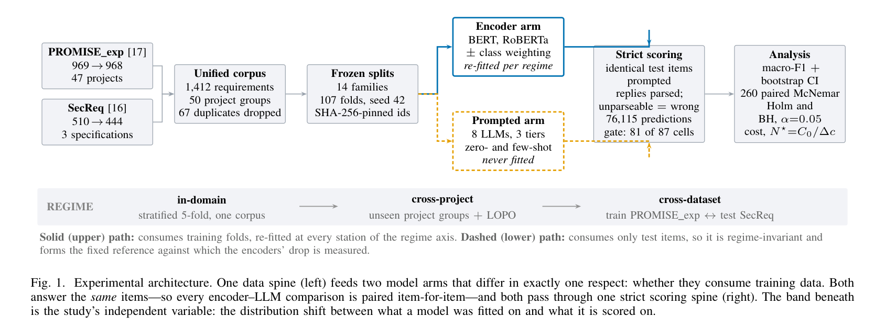

*الشكل 1 من البيبر: معمارية التجربة. ارجعي له وانتِ بتقري الجزء ده.*

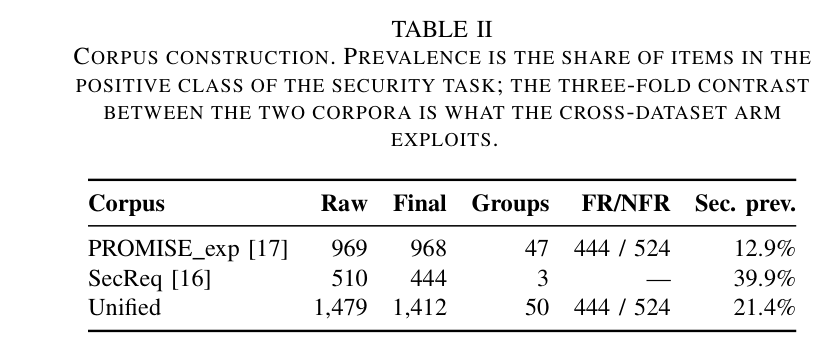

*جدول 2 من البيبر: بناء الكوربس.*


الفكرة العامة انتِ عارفاها: عندنا متطلبات برمجية، وبنصنّفها FR/NFR، وأمان/مش أمان، ونوع الـ NFR. خلاص، مش هنعيدها. اللي هنعمله هنا إننا هنمسك الشكل 1 وجدول 2 بالمِلّي: كل صندوق مرسوم، كل سطر جواه، كل رقم — إيه هو، جاي منين، وليه بالذات.

### الشكل 1 كصورة: إيه اللي مرسوم أصلاً؟

الشكل 1 عرضه الصفحة كلها (بيتحط فوق في الصفحة 3 من الورقة). لو بصيتي عليه هتلاقي:

- **8 صناديق** ماشية من الشمال لليمين — 6 منهم بخلفية رمادية فاتحة (المصدرين، Unified، Frozen، Strict scoring، Analysis) وصندوقين الذراعين بخلفية بيضا وإطار ملوّن (أزرق متصل للإنكودر، ذهبي مقطّع للـ prompted) — يعني الصندوق نفسه مرسوم بنفس ستايل المسار بتاعه، وإطاره أسمك من إطارات الصناديق الرمادية (0.9pt مقابل 0.4pt في ملف الـ TikZ). وخدي بالك إن آخر سطر في كل ذراع مكتوب **مايل (italic)**: "re-fitted per regime" في الإنكودر و"never fitted" في الـ prompted — الرسمة بتميّل بالذات السطر اللي هو الفرق الوحيد بين الذراعين: صندوقين فوق بعض على أقصى الشمال (المصدرين)، بعدين "Unified corpus"، بعدين "Frozen splits"، بعدين — في النص — صندوقين فوق بعض (الذراعين)، بعدين "Strict scoring"، وآخر حاجة "Analysis".
- **مسارين بلونين وخطّين مختلفين**: المسار العلوي (الـ Encoder arm) خط أزرق **متصل** وسميك؛ المسار السفلي (الـ Prompted arm) خط ذهبي **مقطّع (dashed)**. في ملف الـ TikZ ده مكتوب بالحرف: "Encoder path: solid, upper. Prompted path: dashed, lower. (Greyscale-safe)" — يعني اختاروا خط متصل ومقطّع عشان لو الورقة اتطبعت أبيض وأسود تفضلي تفرّقي بينهم من غير الألوان.
- الاتنين بيخرجوا من "Frozen splits" وبيرجعوا يتقابلوا تاني في "Strict scoring" (الأزرق داخل من فوق، الذهبي داخل من تحت).
- **شريط رمادي تحت الصناديق كله** مكتوب على شماله REGIME، وفيه 3 محطات: in-domain ← cross-project ← cross-dataset، بينهم سهمين رماديين. تحت كل محطة سطر صغير بيوصفها.
- **سطرين شرح تحت الشريط**: "Solid (upper) path: consumes training folds, re-fitted at every station of the regime axis. Dashed (lower) path: consumes only test items, so it is regime-invariant and forms the fixed reference against which the encoders' drop is measured."

- **نوعين أسهم**: الأسهم **الرمادية الرفيعة** (0.5pt في الـ TikZ) هي تدفّق الداتا المشترك للاتنين — من المصدرين لـ Unified، ومن Unified لـ Frozen، ومن Strict scoring لـ Analysis. أما الأسهم **الملوّنة السميكة** (0.9pt) فهي مسار كل ذراع لوحده: الاتنين بيطلعوا من نفس نقطة يمين "Frozen splits"، الأزرق بيطلع لفوق للـ Encoder arm والذهبي بينزل لتحت للـ Prompted arm، وبعدين الأزرق بيدخل Strict scoring من فوق والذهبي من تحت. يعني الرسمة بتقولك بالهندسة: الداتا واحدة (رمادي مشترك)، والاختلاف بيبدأ بعد الـ splits وبينتهي عند المصحّح.


الفكرة اللي الشكل عايز يقولها في سطر واحد (وهي في الـ caption): عمود بيانات واحد بيغذّي ذراعين مختلفين في حاجة واحدة بس — هل الموديل **بياكل training data ولا لأ** — والاتنين بيجاوبوا على **نفس العناصر** وبيعدّوا من **نفس المصحّح**. والشريط اللي تحت هو **المتغيّر المستقل** بتاع الدراسة كلها: قد إيه اللي الموديل اتدرّب عليه بعيد عن اللي بيتقاس عليه.

طب يلا نمسك صندوق صندوق.

---

### الصندوق 1 و 2: المصدرين (أقصى الشمال)

قبل الأرقام، حاجة صغيرة بتلخبط: جوه الصندوقين في الشكل هتلاقي **[17]** جنب PROMISE_exp و**[16]** جنب SecReq. دي مش أرقام بتاعة الداتا، دي أرقام المراجع في قايمة المراجع آخر الورقة: [17] = Lima et al. 2019 (اللي عملوا PROMISE_exp)، و[16] = Knauss et al. 2011 (اللي عملوا SecReq). نفس الرقمين بيتكرروا في جدول 2 جنب اسم كل كوربس.


#### PROMISE_exp: "969 → 968" و "47 projects"

- **969**: ده عدد الصفوف الخام في ملف `PROMISE_exp.arff` زي ما نزل من مصدره (Lima et al. 2019). الـ manifest بتاع المرحلة الأولى (`stage1_manifest.json`) بيسجّل `raw_rows: 969` و `expected_rows_per_literature: 969` — يعني الرقم اتطابق مع اللي الأدبيات بتقوله، ومفيش ولا سطر اتشال عشان مش مقروء (`unparseable_lines_dropped: 0`).
- **968**: العدد بعد شيل التكرارات المطابقة. 969 − 968 = **1** — يعني في PROMISE_exp كان فيه نص واحد بس مكرر بالحرف. ولو بصيتي على أرقام FR/NFR الخام في الـ manifest: NFR = 525 و FR = 444 قبل التنضيف، وبعده NFR = 524 و FR = 444. يعني الصف المكرر اللي اتشال كان **NFR**، وعشان كده الـ FR فضلوا 444 زي ما هم.
- **47 projects**: PROMISE_exp مجمّع من 47 مشروع مختلف، وكل متطلب عليه رقم المشروع بتاعه (عمود `project` في `unified.csv`؛ الأرقام من 1 لـ 49 بس رقمين ناقصين — 41 و44 — فـ 49 − 2 = 47؛ اتأكدت من ده بعدّ قيم عمود `project` في `unified.csv`). الرقم ده مهم جداً بعدين لأنه هو اللي هيتعمل عليه الـ grouping في الـ cross-project والـ LOPO (هنشرحهم تحت). المشاريع دي أحجامها متفاوتة جداً: أكبر مشروع (رقم 8) فيه 92 متطلب، وفيه مشروعين كل واحد فيه متطلب **واحد بس** (مشروع 22 ومشروع 39) — خدي بالك من المعلومة دي لأنها هتفسّر حاجة في الـ LOPO.

#### SecReq: "510 → 444" و "3 specifications"

- **510**: عدد الصفوف الخام في SecReq (Knauss et al. 2011). بس SecReq مش ملف واحد؛ هو **3 ملفات**، كل ملف "مواصفة" (specification) صناعية لنظام أمني:
  - **CEPS** (ePurse — محفظة إلكترونية): 124 صف.
  - **CPN**: 210 صف.
  - **GPS**: 176 صف.
  - 124 + 210 + 176 = **510** ✓.

- الأسامي دي اختصارات، وورقتنا ما بتفكّهاش (بتقول "3 specifications" وبس)، بس عشان ما تفتكريش إن GPS هي الأقمار الصناعية: في ورقة Knauss et al. 2011 الأصلية — يعني من برّه ورقتنا — **CEPS** = Common Electronic Purse Specifications (مواصفة محفظة إلكترونية؛ وعشان كده ملفها في الـ manifest اسمه `ePurse.csv`)، **CPN** = Customer Premises Network (مواصفة شبكة عند العميل)، **GPS** = Global Platform Specification (منصة الكروت الذكية). التلاتة مواصفات صناعية لأنظمة فيها أمان، وده سبب إن الأمان فيها شايع (39.9%).

  - وفي ملف GPS كان فيه سطر واحد قيمة الـ label بتاعه مش من القيم اللي الكود بيعرفها (الـ manifest بيسمّيه "malformed label" من غير ما يقول القيمة نفسها) فاتشال: الـ manifest بيقول `malformed_labels_dropped: 1` و `GPS: skipped 1`. السطر ده مش داخل في الـ 510.
- **444**: بعد شيل التكرارات. 510 − 444 = **66** صف اتشالوا. ليه كتير كده مقارنة بـ PROMISE؟ الـ manifest والكود بيسجّلوا العدد بس من غير سبب؛ تخميني إن مواصفات الأمان الصناعية فيها جُمل بتتكرر بالحرف (نفس الجملة القياسية بتتعاد في أكتر من مكان). ولو بصيتي على `unified.csv` بعد التنضيف: CEPS فضل 124 (ولا واحد اتشال)، CPN بقى 147 (210 − 147 = 63 اتشالوا)، GPS بقى 173 (176 − 173 = 3 اتشالوا). 0 + 63 + 3 = **66** ✓. يعني معظم التكرار كان جوه CPN.
  - نفس الـ 66 تقدري تشوفيهم من زاوية الـ label: الأمان في SecReq الخام 187 وبقى 177 (10 اتشالوا)، وغير الأمان 323 وبقى 267 (56 اتشالوا). 10 + 56 = **66** ✓ تاني.
- **3 specifications**: هي الـ 3 ملفات اللي فوق. الرقم ده هو "عدد مجموعات المشاريع" بتاع SecReq، وهو اللي هيخلّي الـ cross-project على SecReq يبقى **3 folds بس** (هنوصلها).

---

### الصندوق 3: Unified corpus — "1,412 requirements / 50 project groups / 67 duplicates dropped"

- **67 duplicates dropped**: 1 (من PROMISE) + 66 (من SecReq) = **67** ✓. الـ manifest بيقول `duplicate_texts_removed: 67`.
- **1,412**: الخام مع بعض 969 + 510 = **1,479** (ده الرقم اللي في جدول 2 في صف Unified تحت عمود Raw)، ناقص 67 = **1,412** ✓. أو بطريقة تانية: 968 + 444 = 1,412 ✓.
- **"none shared between corpora"** (جملة من نص الورقة، مش من الصندوق): الـ manifest فيه حقل `texts_appearing_in_BOTH_corpora: 0`. ليه ده مهم؟ لأن لو كان فيه جملة موجودة في PROMISE وفي SecReq بنفس الحروف، ساعتها لما ندرّب على واحد ونختبر على التاني (الـ cross-dataset) هيبقى فيه **تسريب (leakage)**: الموديل شاف إجابة السؤال قبل الامتحان. الصفر هنا معناه إن الـ cross-dataset نضيف.
- **50 project groups**: 47 (مشاريع PROMISE) + 3 (مواصفات SecReq) = **50** ✓. "مجموعة مشروع" (project group) يعني الوحدة اللي لما نعمل تقسيم مجمّع، بتروح كلها لجهة واحدة — يا training يا test — ومش بتتقسم.

خدي بالك من حاجة: كلمة "normalised" في الورقة (التنضيف) معناها هنا حاجة بسيطة جداً: توحيد المسافات وشيل الحروف الغير مطبوعة (control characters) وبس — مش lowercasing ولا شيل علامات ترقيم ولا حاجة تانية. ده مقصود عشان النص يوصل للموديلات زي ما هو تقريباً.

---

### الصندوق 4: Frozen splits — "14 families / 107 folds, seed 42 / SHA-256-pinned ids"

الأول مصطلحين:

- **fold** (طيّة): لما بنقسم الداتا لتدريب واختبار أكتر من مرة، كل تقسيمة اسمها fold. مثلاً "5-fold" يعني قسمنا الداتا 5 أجزاء، وفي كل مرة جزء بيبقى اختبار والـ 4 التانيين تدريب، فبنطلّع 5 نتايج.
- **split family** (عيلة تقسيم): مجموعة folds بتخدم تاسك واحد في regime واحد على داتاسِت واحد. يعني "in-domain FR/NFR على PROMISE" عيلة؛ "cross-project security على SecReq" عيلة تانية.

#### الـ 14 عيلة والـ 107 fold — جاية منين بالظبط

من `stage1_manifest.json` (قسم `splits`)، الـ 14 عيلة هي:

| # | العيلة | الـ regime | التاسك | الداتاسِت | folds |
|---|---|---|---|---|---|
| 1 | in_domain_fr_nfr | in-domain | FR/NFR | PROMISE | 5 |
| 2 | in_domain_security_promise | in-domain | security | PROMISE | 5 |
| 3 | in_domain_security_secreq | in-domain | security | SecReq | 5 |
| 4 | in_domain_subtype_all | in-domain | 11 sub-types | PROMISE | 5 |
| 5 | in_domain_subtype_top6 | in-domain | top-6 | PROMISE | 5 |
| 6 | in_domain_subtype_top4 | in-domain | top-4 | PROMISE | 5 |
| 7 | cross_project_fr_nfr_promise | cross-project | FR/NFR | PROMISE | 5 |
| 8 | cross_project_security_promise | cross-project | security | PROMISE | 5 |
| 9 | cross_project_security_secreq | cross-project | security | SecReq | **3** |
| 10 | cross_project_subtype_all_promise | cross-project | 11 sub-types | PROMISE | 5 |
| 11 | cross_project_subtype_top6_promise | cross-project | top-6 | PROMISE | 5 |
| 12 | cross_project_subtype_top4_promise | cross-project | top-4 | PROMISE | 5 |
| 13 | leave_project_out (LOPO) | cross-project | FR/NFR | PROMISE | **47** |
| 14 | cross_dataset | cross-dataset | security | PROMISE↔SecReq | **2** |

الجمع: in-domain 6 × 5 = **30**؛ cross-project 5 + 5 + 3 + 5 + 5 + 5 = **28**؛ LOPO **47**؛ cross-dataset **2**. 30 + 28 + 47 + 2 = **107** ✓. (ده نفس الجدول اللي في السلايد 6 من عرض الميثودولوجي: 30 / 28 / 47 / 2.)

طب ليه الأرقام دي بالذات؟

- **ليه 5 في الـ in-domain؟** الكود بيستخدم `StratifiedKFold(n_splits=5, shuffle=True, random_state=42)`. الورقة ما بتقولش ليه 5 مش 10 مثلاً؛ 5 هو الاختيار الشائع في المجال، وفيه قاعدة في الكود إن الـ k يقل بس لو فيه class أقل من 5 عناصر — وده ما حصلش في أي عيلة من اللي اتبلّغ عنها. **stratified** يعني كل fold فيه نفس نسبة الـ classes اللي في الداتا كلها (لو الأمان 12.9% في PROMISE، هيبقى 12.9% تقريباً في كل fold). بالأرقام الحقيقية من `splits.json`: 968 ÷ 5 مش عدد صحيح، فالـ folds بتطلع 194 / 194 / 194 / 193 / 193 عنصر اختبار (والتدريب 774 أو 775)، وفي عيلة security-PROMISE كل fold فيه **25 أمان بالظبط** (125 ÷ 5 = 25) — ده معنى stratified عملياً. وفي SecReq (444 ÷ 5): folds بحجم 89 / 89 / 89 / 89 / 88، فيهم 35 أو 36 أمان (177 ÷ 5 = 35.4).
- **ليه SecReq cross-project = 3 بس؟** لأن الـ cross-project بيستخدم `StratifiedGroupKFold` والـ group هو "المشروع". و SecReq فيه 3 مجموعات بس (CEPS / CPN / GPS)، فأقصى عدد folds ممكن تعمليه وانتِ بتحجزي مجموعة كاملة في كل مرة هو 3. التلات folds بالأرقام من `splits.json` — كل واحد "مواصفة كاملة محجوزة للاختبار": fold 1 اختبار CPN كله = 147 وتدريب 297 (= 124 CEPS + 173 GPS)؛ fold 2 اختبار GPS كله = 173 وتدريب 271 (= 124 + 147)؛ fold 3 اختبار CEPS كله = 124 وتدريب 320 (= 147 + 173). في كل مرة 147 + 173 + 124 = 444 ✓. في PROMISE فيه 47 مجموعة فيقدروا يعملوا 5 folds عادي.
- **ليه LOPO = 47؟** LOPO = Leave-One-Project-Out: في كل fold بنشيل مشروع واحد بس للاختبار ونتدرّب على الـ 46 الباقيين. عدد الـ folds = عدد المشاريع = 47. مثال من `splits.json`: `LOPO_holdout_1` بيختبر على 28 متطلب (مشروع رقم 1) ويدرّب على 940 (968 − 28 = 940 ✓). خدي بالك إن الـ LOPO معمول لتاسك FR/NFR بس (الـ manifest بيقول `task: fr_nfr`). وفاكرة المشروعين اللي فيهم متطلب واحد؟ عشان كده نتيجة الـ LOPO بتتحسب **pooled** (بنلم توقعات الـ 47 fold كلها في كومة واحدة ونحسب عليها) مش متوسط الـ 47 نتيجة: لأن 24 من الـ 47 مجموعة اختبار فيها class واحد بس (FR بس أو NFR بس)، ومجموعتين فيهم متطلب واحد، فالـ macro-F1 لكل fold لوحده هيبقى ملهوش معنى (الـ macro-F1 هيتشرح في صندوق Analysis؛ دلوقتي يكفي إنه متوسط F1 على الـ classes بالتساوي، فلو class مش موجود في fold أصلاً المتوسط بيبوظ).
- **ليه cross-dataset = 2؟** لأن فيه اتجاهين بس: درّبي على PROMISE واختبري على SecReq (`promise_to_secreq`: تدريب 968 / اختبار 444)، والعكس. وليه تاسك الأمان بس؟ لأن القاعدة في الكود: "كل زوج مرتّب من الكوربسات اللي بيشتركوا في تاسك عنده ≥ 2 classes في الجهتين" — و SecReq ما عندوش FR/NFR ولا sub-types، فالتاسك الوحيد المشترك هو security.

#### seed 42

الـ **seed** (البذرة) هو الرقم اللي بيتحط في مولّد الأرقام العشوائية عشان "العشوائية" تبقى قابلة للإعادة: أي حد يحط 42 هياخد نفس الخلطة بالظبط. **ليه 42؟** الورقة ما بتقولش ليه، وده ببساطة الرقم التقليدي اللي الناس بتستخدمه كـ default (من رواية Hitchhiker's Guide). المهم مش قيمته، المهم إنه **متسجّل**. ونفس الـ 42 بيتستخدم كمان في الـ bootstrap (هنشوفه في صندوق Analysis).

#### SHA-256-pinned ids

- **SHA-256** هو "بصمة" رياضية للملف: بتاخدي الملف كله وتطلّعي منه سلسلة 64 حرف؛ لو حرف واحد في الملف اتغيّر، البصمة كلها بتتغيّر. الـ manifest فيه البصمة دي لكل ملف من الـ 4 ملفات المصدر (ملف PROMISE والـ 3 ملفات بتوع SecReq).
- **pinned ids** يعني إن كل متطلب ليه معرّف ثابت (زي `promise_00000`) والمعرّفات دي مربوطة بالملف اللي ليه البصمة دي. فلو حد عاد التجربة على نسخة من الملف اتعدّلت (حتى مسافة زيادة)، البصمة مش هتطابق وهيعرف إن الـ ids مش هتتطابق مع الـ splits.

- عشان تشوفيها بعينك: بصمة ملف `PROMISE_exp.arff` في الـ manifest هي `7475c290…97d75` (64 حرف hex، بديكي أولها وآخرها بس). ولو نزّلتي الملف من نفس اللينك وطلّعتي الـ SHA-256 بتاعه وطلع مختلف، يبقى الملف اتغيّر ومفيش ضمان إن `promise_00000` عندك هو نفس السطر اللي عندهم.

- **وليه "frozen" (مجمّدة) و"consumed, never regenerated"؟** دي النقطة المهمة: الورقة بتقول إن **عضوية الـ grouped folds بتعتمد على إصدار المكتبة** (scikit-learn) اللي ولّدتها. يعني لو انتِ وزميلتك شغّلتوا `StratifiedGroupKFold` بنفس الـ seed 42 بس بنسختين مختلفتين من المكتبة، ممكن المشاريع تتوزّع على الـ folds بشكل مختلف. عشان كده الـ splits اتولّدت **مرة واحدة**، اتخزّنت كملف JSON فيه قوائم الـ ids بالحرف (`train_ids` و `test_ids` لكل fold)، وكل المراحل اللي بعدها بتقرا الملف ده وبس. والفايدة: الـ 12 configuration كلهم اتقارنوا على **نفس الـ folds بالظبط**، ولو حد جه بعد سنتين هيلاقي نفس الـ folds.

- وحاجة لطيفة تأكّد ليه ملف الـ splits هو المرجع مش الكود: الـ manifest بيسجّل إصدارات البيئة — Python 3.12.13 وpandas 2.3.3 وnumpy 2.0.2 — بس **ما بيسجّلش إصدار scikit-learn**، وهي بالذات المكتبة اللي جملة "عضوية الـ grouped folds بتعتمد على إصدار المكتبة" بتتكلم عنها. فلو حد حاول يعيد التوليد مش هيعرف يضبط الإصدار أصلاً؛ الحل الوحيد إنه يقرا `splits.json` زي ما هو — وده اللي الورقة بتقصده بـ "consumed, never regenerated".


---

### الصندوق 5 (فوق): Encoder arm — "BERT, RoBERTa / ± class weighting / re-fitted per regime"

- **Encoder**: نوع من موديلات اللغة (زي BERT) بيقرا الجملة كلها ويطلّع تمثيل رقمي ليها، وبنحط فوقه طبقة تصنيف صغيرة ونعمله **fine-tuning** (تدريب إضافي على داتا التاسك بتاعنا). ده الموديل اللي "بياكل" training data.
- **BERT, RoBERTa**: الاتنين هما `bert-base-uncased` (0.11 مليار parameter) و `roberta-base` (0.13 مليار) من جدول 3. (الـ **parameter** = رقم واحد من الأوزان اللي جوه الموديل وبتتعدّل في التدريب؛ 0.11 مليار يعني 110 مليون رقم.)
- **± class weighting**: كل واحد فيهم ليه نسختين — **(w)** weighted: في الـ loss (الـ **loss** = رقم الخطأ اللي الموديل بيحاول يقلّله أثناء التدريب) بنكبّر وزن الـ class النادر بعكس تكراره (inverse-frequency / balanced) عشان الموديل ما يتجاهلوش، و **(u)** unweighted: من غير الوزن ده، كـ control. النسخة (u) ما اتعملتش في كل حاجة، اتعملت على تاسك الأمان بس (in-domain على PROMISE والـ cross-dataset في الاتجاهين) — وهنشوف ده بالأرقام في حساب الـ 24,280 تحت.
- **re-fitted per regime**: الـ encoder بيتدرّب **من جديد** في كل محطة على training folds المحطة دي. يعني BERT بتاع in-domain غير BERT بتاع cross-project غير BERT بتاع cross-dataset — نفس الـ checkpoint الأصلي (الـ **checkpoint** = نسخة الأوزان المحفوظة اللي بنبدأ منها)، بس اتعمله fine-tuning على داتا مختلفة. وده بالظبط اللي بيخلّي الذراع ده **يتحرّك** على محور الـ regime.

---

### الصندوق 5 (تحت): Prompted arm — "8 LLMs, 3 tiers / zero- and few-shot / never fitted"

- **LLM** (Large Language Model): موديل توليدي كبير (زي Qwen أو Llama) بنبعتله نص فيه تعليمة (**prompt**) وهو بيرد بكلام. هنا بنقوله "ده متطلب، هو FR ولا NFR؟ رد بكلمة واحدة".
- **8 LLMs, 3 tiers**: 8 موديلات في 3 "طبقات" (tiers) حسب طريقة الوصول (جدول 3):
  - **local open** — 6 موديلات مفتوحة شغّالة محلياً على كارت T4 مجاني بضغط 4-bit (يعني كل وزن بيتخزّن في 4 بت بدل 16 عشان موديل بـ 8 مليار parameter يدخل في ذاكرة كارت صغير؛ الورقة بتقول في Threats إن ده ممكن يقلّل الدقة شوية عن النسخة الكاملة): Gemma-2-2B، SmolLM3-3B، Qwen2.5-3B، Phi-4-mini، Qwen2.5-7B، Llama-3.1-8B (أحجامهم من 2.61 لـ 8.03 مليار parameter).
  - **hosted** — موديل واحد: Llama-3.3-70B عن طريق API مجاني (اسم المزوّد Groq جاي من الـ `model_tag` في الأرتيفاكت — `groq-llama-3.3-70b-versatile`؛ الورقة نفسها بتقول "free API tiers" وبس).
  - **commercial** — موديل واحد: Gemini 3.1 Flash-Lite عن طريق API مجاني.
  - 6 + 1 + 1 = **8** ✓. (وفيه موديل تاسع — Nemotron — اتجرّب وسقط في البوابة، هنشوفه في صندوق Strict scoring.)
- **zero- and few-shot**: **zero-shot** يعني الـ prompt فيه التعليمة بس من غير أمثلة؛ **few-shot** يعني بنحط كام مثال محلول جوه الـ prompt (k = 2 أو 4 أو 8 مثال في المجموع للتاسكات الثنائية؛ 1 أو 2 لكل class في الـ sub-types). الأمثلة دي بتتقطع من الكوربس **قبل** ما نكوّن عينات الاختبار، فمستحيل مثال يبقى هو نفسه سؤال في الامتحان.

- **مين عمل few-shot فعلاً؟** مش الـ 8. الورقة بتقول في قسم الـ prompting: "the hosted and commercial arms run zero-shot only, under provider rate limits" — يعني Llama-3.3-70B وGemini **zero-shot بس**، وسلّم الـ few-shot (k = 0 / 2 / 4 / 8) اتعمل على **الـ 6 موديلات المحلية بس**. والـ notebook بتاع المرحلة 3 بيقول إن ده مقصود: الحصة اليومية المجانية للـ API بتتصرف كلها على الـ zero-shot core اللي بيتقارن عليه الكل، بدل ما تتوزّع على شوية few-shot ناقصة. وحاجة مهمة: الـ few-shot اتعمل على **نفس عينة الـ 300** (الـ core) مش على عينة جديدة — عشان k = 0 و2 و4 و8 يبقوا على نفس العناصر بالظبط ويتقارنوا ببعض بـ McNemar (اختبار مزدوج، هنشرحه في صندوق Analysis).

- **never fitted**: عمره ما اتدرّب على داتا التاسك. مفيش fine-tuning، مفيش training folds. وده سبب إنه **مش بيتحرّك** على محور الـ regime — هنرجعلها في الشريط.

---

### الصندوق 6: Strict scoring — أكتر صندوق فيه أرقام

#### "identical test items"

الاتنين — encoder و LLM — بيتقيّموا على **نفس المتطلبات**، ومتطابقين بالـ id (`promise_00123` مثلاً) مش بترتيب السطر في الملف. الفرق الوحيد في الحجم:

- الـ encoders بتغطي الكوربس كله: في كل عيلة، كل متطلب بيبقى test item **مرة واحدة بالظبط** (لأن في 5-fold كل عنصر بيقع في fold اختبار واحد).
- الـ LLMs بتجاوب على **عينة stratified** من نفس الكوربس: **300** عنصر لكل خلية ثنائية، و **200** لكل خلية sub-type (بتطلع **218** في نسخة الـ 11 class بسبب حد أدنى 10 لكل class). ليه 300؟ الكود بيقول بالحرف: 300 هو أكبر n بحيث الحصة اليومية المجانية لمزوّد واحد (900 طلب) تغطي التلات مجموعات: 3 × 300 = 900؛ وعند n = 300 فرق ~0.08 في الـ macro-F1 بيبقى قابل للكشف عند p < 0.05. أما الـ 200 بتاعة الـ sub-types، فـ notebook المرحلة 3b بيقول السبب: الـ NFRs كلهم 524 وtop-4 بيغطي 353 منهم، فـ 300 كانت هتبقى "كل الداتا تقريبًا" مش عينة؛ وكمان 3 tasks × 200 = 600 طلب بتدخل في حصة يوم واحد. وبيقول صراحة إن حجّة الـ power بتاعة الـ 300 ما بتتنقلش كما هي. وخدي بالك إن دي الأهداف؛ اللي وصل فعلًا من المزوّدين أقل: Gemini ≈ 60 لكل خلية، وLlama-3.3-70B من 286 لـ 294 على الثنائي ومن 141 لـ 169 على الـ sub-types (الورقة بتذكر في Threats إن الذراع التجاري اشتغل على n ≈ 60). والعينة **proportional** (بنفس نسبة الـ classes الأصلية، مش متوازنة) عشان الـ prior يفضل زي الحقيقة، مع أرضية 10 عناصر لكل class عشان مفيش class نادر يختفي.

**"proportional مع أرضية 10" بالأرقام الحقيقية** (حسبتها بنفس قاعدة دالة `stratified()` في الكود، مش رقم من الورقة):

- التاسك الثنائي على PROMISE: الإطار 960 عنصر فيه 121 أمان (125 − 4 أمثلة few-shot اتقطعت) = 12.6%، فـ 300 × 0.126 ≈ **38 أمان + 262 مش أمان**. على SecReq: 173 / 436 = 39.7% → 300 × 0.397 ≈ **119 أمان + 181 مش أمان**. الأرضية (10) هنا مش بتعمل حاجة لأن أصغر class أكبر من 10 بكتير.
- الـ all-11: الإطار 491 عنصر (524 − 3 أمثلة × 11 class). التوزيع النسبي لـ 200 بيدّي portability حوالي 200 × 9 / 491 ≈ 3.7 → 4 عنصر، legal ≈ 5، fault tolerance ≈ 6، scalability ≈ 8، maintainability ≈ 8. الأرضية بترفع كل واحد فيهم لـ 10 (وportability لـ 9 بس، لأن كل اللي موجود منه في الإطار 9 والأرضية "capped at the class's own support")، من غير ما تنقّص من الباقيين — عشان كده العينة بتكبر: 50 + 33 + 30 + 26 + 19 + 11 + 10 + 10 + 10 + 10 + 9 = **218** ✓. يعني الـ 18 الزيادة كلهم في الذيل.

**طب الـ 60 والـ 163 دول جايين منين؟** الأهداف 300 / 200، بس المزوّدين المجانيين ما وصلوهاش:

- **Gemini = 60 لكل خلية**: الـ notebook بيكتب في إعدادات المزوّد `daily_cap: 180` وبيقول بالحرف "Gemini's cap is 180 requests/day"، و180 ÷ 3 تاسكات = **60** لكل خلية (في الـ 3 الثنائية وفي الـ 3 sub-type كمان؛ `tab9_evaluability.csv` بيوريهم 60 / 60 / 60 و60 / 59 / 60). وده اللي الورقة بتقصده بـ "the commercial arm ran at n ≈ 60 per cell" في Threats، وبتقول إن عشان كده 23 من 26 مقارنة لـ Gemini طلعت غير حاسمة — قوة إحصائية قليلة، مش بالضرورة موديل أحسن.
- **Llama-3.3-70B = 163 على all-11** (و141 على top-6، و169 على top-4): الـ notebook بيقول إن طبقة الـ API "مش كاملة: حصتها اليومية المجانية قطعت الشغل"، فالرقم ده هو اللي لحق يتجاوب قبل ما الحصة تخلص. الورقة بتسمّي ده في Threats "missing-not-at-random dropout" (نقص مش عشوائي) وبتقول إن البوابة بتستبعد الخلايا المتأثرة بدل ما تعوّضها.
- وده بالظبط ليه البوابة موجودة (هنشوفها تحت): خلية بـ 60 عنصر على 11 class **لازم** يطلع فيها classes بعنصر واحد، والبوابة بتمسك ده.

- الـ 6 موديلات المحلية بتجاوب كمان على **الإطار الكامل** (full frame): 960 لـ PROMISE و 436 لـ SecReq — يعني 968 − 8 = 960 و 444 − 8 = 436، الـ 8 دول هما مخزون أمثلة الـ few-shot (4 لكل class × 2 classes) اللي اتقطعوا برّه.

- ونفس الحكاية للـ sub-types بس المخزون 3 لكل class (من إعدادات الـ notebook 3b: `fewshot_pool_per_class: 3`)، فالإطارات الكاملة: top-4 = 353 − 3 × 4 = **341**، top-6 = 433 − 3 × 6 = **415**، all-11 = 524 − 3 × 11 = **491** — والـ 3 أرقام دي مكتوبة بالحرف في تعليق الـ CONFIG بتاع الـ notebook.

**طب إزاي بيتعمل "زوج" بين عينة LLM بـ 300 وإنكودر جاوب على الكوربس كله؟** كده: كل id الـ LLM جاوب عليه، بنجيب توقّع الـ encoder لنفس الـ id من الـ fold اللي كان فيه test item — وده موجود دايماً لأن كل id بيبقى test item **مرة واحدة بالظبط** في كل عيلة. فحجم المقارنة بيساوي عدد اللي الـ LLM جاوبه: 300 لو الـ core، أو الإطار الكامل (960 / 436) للموديلات المحلية، أو أقل لو الحصة قطعت (60 لـ Gemini). مثال حقيقي من `tab4_mcnemar.csv`: BERT (w) in-domain ضد Qwen2.5-7B على security-SecReq → n = **436** = إطار SecReq الكامل بالظبط. والـ provenance بيسجّل السياسة دي في حقل `core_restricted_comparisons: true` — يعني المقارنة دايماً مقيّدة على العناصر اللي الطرفين جاوبوا عليها، مش على كل الكوربس.


#### "prompted replies parsed; unparseable = wrong"

الـ encoder بيطلّع class مباشرة، لكن الـ LLM بيطلّع **كلام**. فلازم **parser** (محلّل) يحوّل الكلام لـ label. القاعدة الصارمة: لو الرد بيبدأ بـ label، خدناه؛ وإلا لو فيه label واحد بس مذكور في أي مكان، خدناه؛ لو الرد فيه الاتنين ("FR or NFR") أو ولا واحد — الرد **unparseable** وبيتحسب **غلط**. مش بيتشال من الحساب، بيتحسب غلط. ليه؟ الورقة بتقول: ده أقسى من الطريقة المتساهلة في الأبحاث السابقة، بس ده اللي بيحصل في الواقع — لو النظام رجّع رد مش نافع، ده مش "معلش"، ده خطأ.

#### "76,115 predictions"

ده إجمالي صفوف مخزن التوقعات — كل رد من أي موديل على أي متطلب في أي إعداد. من `stage4_provenance.json`:

76,115 = **24,280** (encoders) + **35,049** (LLMs على التاسكات الثنائية) + **16,786** (LLMs على الـ sub-types) ✓.

**الـ 24,280 بتاعة الـ encoders** تقدري تحسبيها بنفسك من `predictions_finetuned.csv` — دي أوضح مثال على "كل متطلب test item مرة واحدة لكل عيلة":

| الموديل | الخلايا (تاسك × داتاسِت × regime) | الحساب | المجموع |
|---|---|---|---|
| BERT (w) | 6 خلايا على PROMISE بحجم 968: FR/NFR (in-domain، cross-project، LOPO) + security-PROMISE (in-domain، cross-project، cross-dataset) | 968 × 6 = 5,808 | |
| | 3 خلايا على SecReq بحجم 444: security-SecReq (in-domain، cross-project، cross-dataset) | 444 × 3 = 1,332 | |
| | sub-types × 2 regimes (in-domain، cross-project) | (524 + 433 + 353) × 2 = 1,310 × 2 = 2,620 | **9,760** |
| RoBERTa (w) | نفس الـ 15 خلية | | **9,760** |
| BERT (u) | security بس: in-domain PROMISE + cross-dataset (اختبار على PROMISE) + cross-dataset (اختبار على SecReq) | 968 + 968 + 444 | **2,380** |
| RoBERTa (u) | نفس الـ 3 خلايا | | **2,380** |
| **الإجمالي** | | 9,760 + 9,760 + 2,380 + 2,380 | **24,280** ✓ |

**الـ 35,049 والـ 16,786** جايين من مخزنين تانيين (`predictions_llm_repaired` و `predictions_subtype_repaired` — كلمة repaired لأن اتعمل عليهم "repair pass": إعادة تطبيق نفس الـ parser الصارم على الردود الخام المخزّنة، عشان اللي متخزّن واللي بيتحسب ما يختلفوش). الأول فيه كل ردود الـ LLMs على التاسكات الثنائية (FR/NFR وsecurity على الكوربسين): الـ zero-shot على العينات، والإطارات الكاملة للموديلات المحلية، وسلّم الـ few-shot (k = 2/4/8)، ودراسة الصياغة (terse/verbose)، وكمان ردود Nemotron الساقطة. والتاني نفس الحاجة للـ sub-types (all-11 / top-6 / top-4، مع few-shot k = 1/2 لكل class). الرقمين دول مش قابلين للتفكيك بجمعة بسيطة زي الـ encoders لأنهم بيجمعوا كل الإعدادات دي مع بعض (وبعضها ناقص بسبب حصص الـ API المجانية)، فأنا بديكي مصدرهم ومحتواهم من غير ما أخترع معادلة.

بس فيه تفكيك جزئي حقيقي موجود في `stage4_provenance.json` يستاهل تعرفيه: من الـ 76,115، اللي بيدخل في جداول النتايج الرئيسية (الـ headline) هو `head_rows` = **47,663** = 24,280 (كل الـ encoders) + **23,383** (ردود الـ LLMs الـ zero-shot بالـ prompt الأساسي بس). الباقي 76,115 − 47,663 = **28,452** صف هم سلّم الـ few-shot ودراسة الصياغة terse/verbose وردود Nemotron — بيتحللوا في الدراسات الفرعية، مش في الجداول الأساسية. يعني لما تشوفي جدول 4 أو 5، انتِ بتبصي على 47,663 توقّع مش على الـ 76 ألف كلهم.


#### "gate: 81 of 87 cells"

- **cell** (خلية) = موديل × تاسك × داتاسِت × regime. يعني "Qwen2.5-7B على security على SecReq" خلية، و"BERT (w) على FR/NFR على PROMISE في cross-project" خلية تانية.
- **87** = 36 خلية encoder + 51 خلية prompted. الـ 36: كل encoder weighted عنده 15 خلية (اللي في الجدول فوق) × 2 = 30، زائد unweighted 3 × 2 = 6 → 36 ✓ (وده الرقم `cells_reportable_encoder: 36` في الـ provenance). الـ 51: 8 LLMs × 6 خلايا (3 ثنائية: FR/NFR، security-PROMISE، security-SecReq + 3 sub-type: all/top-6/top-4) = 48، زائد 3 خلايا ثنائية لـ Nemotron = 51. 36 + 51 = **87** ✓ (وهو عدد صفوف `tab9_evaluability.csv`).
- **الـ gate (البوابة)**: خلية بتتبلّغ بس لو: (1) كل class فيها ≥ 5 عناصر اختبار، (2) الخلية فيها ≥ 40 عنصر، (3) الموديل عرف يـ parse ≥ 50% من ردوده. الورقة ما بتبرّرش كل رقم فيهم لوحده، لكن الكود بيكتب سبب من سطر جنب كل ثابت: `MIN_CLASS_SUPPORT = 5` "a class below this cannot carry 1/K of a macro average" (يعني class فيه أقل من 5 عناصر ما يستحملش يشيل 1/K من متوسط macro)، `MIN_N = 40` "below this no macro-F1 is reported at all"، و`MIN_PARSE_RATE = 0.50` "below this the cell was not measured, only failed" (موديل بيرد بكلام مش مفهوم في نص الوقت ما اتقاسش أصلًا، هو فشل). وتفسيري الإضافي للـ 40: عشان الـ CI (فاصل الثقة — هيتشرح في صندوق Analysis) ما يبقاش عرضه نص المقياس.
- **6 خلايا سقطت** (كلهم prompted، ولا خلية encoder سقطت لأن الـ encoders parse rate بتاعهم 1.0 و n بتاعهم كبير): Gemini على all-11 (classes زي availability و maintainability و scalability عندهم عنصر واحد بس في عينة الـ 60)، Gemini على top-6 (availability = 2)، Llama-3.3-70B على all-11 (maintainability = 4)، و Nemotron في التلات خلايا (n = 21 < 40، وواحدة منهم parse rate صفر). 87 − 6 = **81** ✓. والقاعدة: الخلية الساقطة **بتتشال مش بتتعوّض** بتقدير (imputation) — الورقة بتقول "excluded rather than imputed" من غير سبب؛ تفسيري إن التعويض هيدي رقم لموديل ما قدرش يجاوب أصلاً (وتعليق الكود بيقول كده صراحة لحالة الـ parse rate بس).

---

### الصندوق 7: Analysis — "macro-F1 + bootstrap CI / 260 paired McNemar / Holm and BH, α = 0.05 / cost, N* = C0/Δc"

ده صندوق "إزاي بنحكم"، والأقسام الجاية هتدخل فيه بالتفصيل، بس لازم تعرفي كل سطر فيه بيقول إيه:

- **macro-F1**: بنحسب F1 لكل class لوحده ونعمل متوسط بالتساوي — الـ class الصغير (الأمان 12.9%) بيتحسب زي الكبير بالظبط. وبيتحسب دايماً على **كل الـ labels المعلنة** للنسخة: لو موديل في top-6 عمره ما قال "availability"، بياخد F1 = 0 على الـ class ده وبيتعاقب.
- **bootstrap CI**: فاصل ثقة (confidence interval) بيتحسب بإعادة السحب: بناخد عينة الاختبار، نسحب منها بإرجاع **2,000** مرة، ونحسب macro-F1 كل مرة، فيطلع لنا مدى. "stratified" يعني السحب بيتم **جوه كل class حقيقي لوحده** عشان ولا عينة تفقد class نادر. الـ seed هنا برضه 42. ليه 2,000؟ الورقة ما بتقولش سبب الرقم؛ هو ثابت في الكود (`N_BOOT 2000`) وقيمة شائعة للـ bootstrap.
- **260 paired McNemar**: **McNemar** اختبار إحصائي لموديلين اتقيّموا على **نفس العناصر**، بيبص بس على العناصر اللي اختلفوا فيها: b = عدد اللي الـ encoder جابه صح والـ LLM غلط، و c = العكس، وبيسأل "هل الاختلاف ده ممكن يكون صدفة؟" (p = binomial test على min(b,c) من b+c بنسبة 0.5). الـ 260 = عدد أزواج (encoder، LLM) اللي اتقارنوا: 106 في in-domain + 90 في cross-project + 64 في cross-dataset = 260 ✓. ليه 260 مش عدد أكبر؟ لأن كل زوج بيتحسب بس في الخلايا اللي عدّت البوابة، والـ LOPO مستبعد من العيلة دي عشان ما يبقاش اختبار شبه مكرر للـ cross-project (بيتفق معاه في ~94% من العناصر).

- **مثال حقيقي بالأرقام من `tab4_mcnemar.csv`**: BERT (w) في in-domain ضد Qwen2.5-7B على security-SecReq، n = 436 (إطار SecReq الكامل). الاتنين اتفقوا في 331 عنصر (315 صح مع بعض + 16 غلط مع بعض)؛ الـ encoder صح لوحده **b = 50**، والـ LLM صح لوحده **c = 55**. الاختبار بيبص على الـ 105 دول بس: لو مفيش فرق حقيقي، المفروض يتوزّعوا نص ونص تقريباً، و50 مقابل 55 قريب جداً من كده → p = 0.696 (قبل التصحيح)، وبعد BH بقى 0.774 → الحكم "n.s." (no significant difference). خدي بالك إن الدقة الظاهرة مختلفة شوية (0.837 مقابل 0.849) بس الاختبار بيقول الفرق ده ممكن يبقى صدفة عادي.

- **Holm and BH, α = 0.05**: لما تعملي 260 اختبار، حتى لو مفيش فرق حقيقي هتلاقي بالصدفة كام واحد "significant". فبنصحّح: **Holm** طريقة محافظة، **BH** (Benjamini–Hochberg) أقل تشدداً. **α = 0.05** هي عتبة الدلالة التقليدية (5% احتمال خطأ). الورقة بتقول النتايج: 175 اختبار significant من غير تصحيح، 170 بعد BH، 131 بعد Holm، والأحكام النهائية مبنية على BH.

- **ليه لازم تصحيح أصلاً؟** لأن 260 اختبار × 0.05 = **13** اختبار هيطلعوا "significant" بالصدفة حتى لو مفيش أي فرق حقيقي في ولا واحد منهم.
  - **Holm بيعمل إيه؟** بيضبط احتمال إنك تغلطي **ولو مرة واحدة** في الـ 260 كلهم. بيرتّب الـ p-values من الأصغر للأكبر: الأصغر لازم يبقى أقل من 0.05 / 260 = **0.00019**، اللي بعده أقل من 0.05 / 259، وهكذا، وأول ما واحد يفشل الباقي كله بيتعتبر مش significant. عشان كده هو محافظ: بيسيب 131 بس.
  - **BH بيعمل إيه؟** بيضبط حاجة تانية: **نسبة الغلط جوه اللي قلتي عليهم significant** (false discovery rate). الـ p رقم i في الترتيب لازم يبقى أقل من (i / 260) × 0.05: الأول 0.00019 برضه، بس اللي في النص (i = 130) يكفيه 0.025، والأخير 0.05. العتبة بتتفتح كل ما تنزلي في الترتيب، فبيسيب أكتر: 170. الورقة بنت الأحكام على BH لأن السؤال هنا "قد إيه من الفروق دي حقيقي" مش "هل ولا فرق واحد فيهم غلط".

- **cost, N* = C0/Δc**: معادلة نقطة التعادل (break-even). **C0** = تكلفة تدريب encoder واحد مرة واحدة (بالدولار، من وقت الـ GPU × سعر الإيجار). **Δc** = الفرق في التكلفة لكل عنصر بين البديل الـ prompted والـ encoder (c_alt − c_enc). **N*** = بعد كام تصنيف بيبقى الـ encoder أرخص بالإجمالي. القسم بتاع الـ RQ3 هيفكّها بالأرقام.

---

### الشريط تحت: REGIME — المتغيّر المستقل

الـ **regime** (نظام التقييم) هو "قد إيه داتا الاختبار بعيدة عن داتا التدريب"، وده الشيء الوحيد اللي بيتغيّر في الدراسة كلها. التلات محطات من الشمال لليمين، والانزياح بيزيد:

| المحطة | السطر المكتوب تحتها | معناها |
|---|---|---|
| **in-domain** | stratified 5-fold, one corpus | تدريب واختبار من **نفس الكوربس**، بـ 5-fold stratified. ده "المرجع" اللي الأبحاث السابقة كلها بتبلّغه — التدريب والاختبار من نفس التوزيع. |
| **cross-project** | unseen project groups + LOPO | الاختبار على **مشاريع كاملة** الموديل ما شافهاش في التدريب (grouped folds)، زائد الـ LOPO على الـ 47 مشروع. نفس الكوربس، بس مشاريع جديدة. |
| **cross-dataset** | train PROMISE_exp ↔ test SecReq | التدريب على تاسك الأمان في كوربس والاختبار على التاني، في الاتجاهين (السهم ↔). نفس الـ labels (security / non-security)، بس ناس مختلفة عنونوا كوربس مختلف. |

**المسار المتصل (فوق) والمقطّع (تحت) — ليه ده أهم حاجة في الشكل:**

- الـ encoder (المتصل) **بياكل training folds**، فلما المحطة تتغيّر، الـ training folds بتتغيّر، والموديل بيتعاد تدريبه. فنتيجته **بتتحرّك** مع المحور: in-domain رقم، cross-project رقم تاني، cross-dataset رقم تالت. الفرق بين الأرقام دي هو "سقوط" الـ encoder.
- الـ LLM (المقطّع) **بيشوف test items بس**. مفيش training folds، فالمحطة لما تتغيّر مفيش حاجة تتغيّر عنده: نفس الـ prompt، نفس الموديل، نفس الرد على نفس المتطلب. عشان كده الورقة بتقول إن درجاته **regime-invariant by construction** — ثابتة عبر الأنظمة بحكم التصميم، مش بحكم إنه شاطر. في الشكل، المسار المقطّع بيمشي من Frozen splits للـ Prompted arm ومنه لـ Strict scoring (داخل من تحته)، زي المسار المتصل بالظبط؛ الشريط اللي تحت منفصل ومفيش مسار بيعدّي عليه — الفرق مكتوب في سطر الشرح تحت الشريط: المتصل "re-fitted at every station"، والمقطّع "regime-invariant".
- وده اللي بيخلّيه **الخط المرجعي الثابت (fixed reference line)**: بدل ما نقارن BERT في in-domain بـ BERT في cross-dataset وبس، بنقارن الاتنين بخط ثابت ما بيتحرّكش — فأي مسافة بين الـ encoder والخط ده بتتفتح أو بتتقفل بسبب الـ encoder وحده. من غير الخط ده مش هتعرفي هل الـ encoder وقع ولا التاسك نفسه بقى أصعب.

---

### جدول 2 (Corpus construction): عمود عمود

| Corpus | Raw | Final | Groups | FR/NFR | Sec. prev. |
|---|---|---|---|---|---|
| PROMISE_exp | 969 | 968 | 47 | 444 / 524 | 12.9% |
| SecReq | 510 | 444 | 3 | — | 39.9% |
| Unified | 1,479 | 1,412 | 50 | 444 / 524 | 21.4% |

- **Raw**: الصفوف الخام قبل شيل التكرارات (969، 510، ومجموعهم 1,479 — الرقم ده مش موجود في الشكل 1، موجود هنا بس).
- **Final**: بعد شيل التكرارات (968، 444، 1,412) — نفس أرقام الشكل 1.
- **Groups**: مجموعات المشاريع (47، 3، 50) — نفس الحكاية.
- **FR/NFR**: 444 FR و 524 NFR في PROMISE، ومجموعهم 444 + 524 = **968** ✓ (يعني كل متطلب في PROMISE ليه label FR أو NFR، مفيش ناقص). SecReq عليه شرطة (—) لأن SecReq **ما عندوش** الـ label ده أصلاً؛ عنده الأمان بس. وعشان كده صف Unified بيكرر نفس 444 / 524 (من PROMISE لوحده).
- **Sec. prev.** (security prevalence) = نسبة العناصر اللي في الـ class الإيجابي (security) لتاسك الأمان. الحساب:
  - PROMISE: 125 / 968 = 0.1291 → **12.9%** (الـ 125 هما المتطلبات اللي sub-type بتاعهم security).
  - SecReq: 177 / 444 = 0.3986 → **39.9%**.
  - Unified: (125 + 177) / 1,412 = 302 / 1,412 = 0.2139 → **21.4%** ✓. والجهة التانية: 843 + 267 = **1,110** مش أمان، و302 + 1,110 = 1,412 ✓ (نفس الأرقام في سلايد 5 من عرض الميثودولوجي).
  - **"three-fold"**: 39.9 / 12.9 ≈ 3.1، يعني الأمان في SecReq أكتر شيوعاً حوالي 3 مرات من PROMISE.

**ليه ده "the decisive property" (الخاصية الحاسمة)؟** لأن الـ cross-dataset بيدرّب على كوربس فيه الأمان 12.9% ويختبر على كوربس فيه الأمان 39.9% (أو العكس). موديل اتدرّب إنه "معظم الحاجات مش أمان" هيحمل التوقّع ده معاه — ده اسمه **prior** (الاعتقاد المسبق عن نسبة الـ class) — وهيلاقي نفسه في مكان النسبة فيه مختلفة تماماً. الورقة بتقول بالحرف: "That contrast, not vocabulary, drives the main result" — التباين في النسبة، مش اختلاف المفردات، هو اللي بيعمل النتيجة الأساسية. الجدول كله موجود عشان يبرّر السطر ده.

---

### الـ 11 sub-type والنسخ المختصرة (top-6 / top-4)

الـ **NFR sub-type** هو تصنيف الـ 524 NFR بتوع PROMISE لـ 11 نوع (تصنيف Cleland-Huang et al. 2007، اللي بيتماشى مع ISO/IEC 25010). الأعداد بعد التنضيف (من الـ manifest، وسلايد 5):

| الترتيب | الـ sub-type | العدد | مجموع تراكمي |
|---|---|---|---|
| 1 | security | 125 | 125 |
| 2 | usability | 85 | 210 |
| 3 | operational | 77 | 287 |
| 4 | performance | 66 | **353** ← top-4 |
| 5 | look & feel | 49 | 402 |
| 6 | availability | 31 | **433** ← top-6 |
| 7 | maintainability | 24 | 457 |
| 8 | scalability | 22 | 479 |
| 9 | fault tolerance | 18 | 497 |
| 10 | legal | 15 | 512 |
| 11 | portability | 12 | **524** ← all-11 |

- **top-4 = 353**: 125 + 85 + 77 + 66 = 353 ✓ — أكبر 4 أنواع بس، والعناصر بتوع الـ 7 أنواع الباقية **بتتشال** من الداتا (مش بتتحط في class "other").
- **top-6 = 433**: 353 + 49 + 31 = 433 ✓.
- **all-11 = 524**: 433 + 24 + 22 + 18 + 15 + 12 = 433 + 91 = 524 ✓ — وده بالظبط عدد الـ NFR في جدول 2.

**ليه فيه نسخ مختصرة أصلاً؟** الورقة بتقول: "several tail classes have single-digit support" — يعني في الذيل فيه classes عددها الكلي 12 و 15 و 18 عنصر، ولما نقسمهم 5-fold بيبقى في كل fold اختبار حوالي 2–4 عناصر بس للـ class ده (12 / 5 ≈ 2.4)، وفي عينة الـ LLM (200 → 218 عنصر) الحد الأدنى 10 لكل class بيحمي من ده، لكن Gemini وصلت لـ 60 عنصر بس في الخلية (بسبب حصة الـ API)، وساعتها طلع لـ availability وmaintainability وscalability عنصر واحد بس — وده اللي وقّعها في بوابة all-11. فالـ macro-F1 على 11 class بيبقى فيه ضجيج كبير من classes ما فيهاش عناصر كفاية، وعشان كده بيتقيّم كمان top-6 و top-4 كنسخ أنضف. وتذكّري: في كل نسخة، macro-F1 بيتحسب على **كل** الـ labels المعلنة للنسخة دي — فموديل في all-11 عمره ما قال "portability" بياخد صفر عليها.

---

### التلات تاسكات، وليه الأمان هو الوحيد المشترك

أسهل طريقة تفهمي بيها "3 تاسكات على نفس المتطلب" إنك تبصي على صفين حقيقيين من `unified.csv` (الأعمدة: id، text، label_fr_nfr، label_nfr_subtype، label_security، project، source_dataset):

| id | text | fr_nfr | subtype | security | project |
|---|---|---|---|---|---|
| `promise_00000` | The system shall refresh the display every 60 seconds. | NFR | performance | non-security | 1 |
| `secreq_00000` | Successful authentication is a prerequisite for the processing of any on-line or offline CEPS transaction | (فاضي) | (فاضي) | security | CEPS |

شايفة؟ متطلب PROMISE عليه **3 labels** على نفس السطر: هو NFR، ونوعه performance، ومش أمان (لأن نوعه مش SE). أما صف SecReq فالخانتين الأولانيين **فاضيين** — ده هو بالظبط الشرطة (—) اللي في جدول 2، وده سبب إن الأمان هو التاسك الوحيد المشترك. وخدي بالك من عمود project: في PROMISE رقم (1)، وفي SecReq اسم المواصفة (CEPS) — وده اللي بيتعمل عليه الـ grouping في الـ cross-project. وشكل الـ id (`promise_00000`، `secreq_00000`) هو المعرّف اللي الـ splits والمقارنات كلها متعلّقة بيه.


| التاسك | الـ labels | PROMISE | SecReq | مصدر الـ label |
|---|---|---|---|---|
| Binary FR/NFR | FR / NFR | ✓ (444 / 524) | ✗ | label أصلي في PROMISE |
| Binary security | security / non-security | ✓ (125 / 843) | ✓ (177 / 267) | أصلي في SecReq؛ **مشتق** في PROMISE |
| NFR sub-type | 11 (أو 6 أو 4) | ✓ (524 / 433 / 353) | ✗ | label أصلي في PROMISE |

- **الـ FR/NFR** والـ **sub-type** موجودين في PROMISE بس، لأن SecReq اتعمل عشان سؤال واحد: "الجملة دي ليها علاقة بالأمان ولا لأ؟" ومفيش فيه FR/NFR.
- **الأمان** هو الوحيد اللي موجود في الكوربسين، وعشان كده هو **الوحيد** اللي ينفع نعمل عليه cross-dataset (فاكرة قاعدة الكود: تاسك مشترك عنده ≥ 2 classes في الجهتين). وده اللي الورقة بتسمّيه "the property the cross-dataset arm exploits".
- **إزاي اتشتق في PROMISE؟** PROMISE ما فيهوش label اسمه "security"؛ فيه sub-type اسمه **SE** جوه الـ NFR. فالورقة بتعرّف: security = (NFR و sub-type = SE) → 125 عنصر؛ non-security = كل الباقي = 968 − 125 = **843** (يعني الـ 444 FR كلهم + الـ 399 NFR الباقيين: 444 + 399 = 843 ✓). خدي بالك إن الـ 125 دي هي نفس الـ 125 في جدول الـ sub-types — نفس العناصر بالظبط.
- **الـ caveat التعريفي** (وده مذكور في قسم Threats to Validity تحت "External"): في PROMISE، الأمان **non-functional by construction** — لأنه مشتق من sub-type بتاع NFR، فمستحيل متطلب FR يتحسب security حتى لو كان بيتكلم عن تشفير. أما SecReq فبيعنون **أي جملة ليها علاقة بالأمان**، سواء كانت وظيفية أو غير وظيفية. يعني نفس اسم الـ label ("security") بس **التعريف مش متطابق 100%**. ونتيجة كده: الـ cross-dataset شايل انزياحين مش واحد — انزياح **توزيعي** (12.9% مقابل 39.9%) وانزياح **تعريفي** (إيه اللي بيتحسب أمان أصلاً). والورقة بتقول ده بصراحة كتهديد للـ validity، وبتقول كمان إن الشغل كله على زوج كوربسات واحد بس.

---

### خلاصة سريعة تشيليها في دماغك

- الشكل 1 بيقول: داتا واحدة (1,412 = 968 + 444، بعد شيل 67 = 1 + 66 تكرار) → splits مجمّدة (14 عيلة، 107 = 30 + 28 + 47 + 2 fold، seed 42، ids مربوطة بـ SHA-256) → ذراعين (encoders بتتدرّب من جديد في كل محطة؛ 8 LLMs عمرهم ما اتدرّبوا) → مصحّح واحد صارم (76,115 = 24,280 + 35,049 + 16,786 توقع؛ 81 من 87 خلية عدّت البوابة) → تحليل (macro-F1 + bootstrap 2,000، 260 McNemar مصحّحين بـ Holm و BH عند 0.05، ونقطة تعادل N* = C0/Δc).
- الشريط تحت هو اللي بيتغيّر: in-domain → cross-project → cross-dataset. الـ encoders بيتحرّكوا عليه، والـ LLMs خط ثابت بنقيس عليه.
- جدول 2 موجود عشان رقمين: **12.9%** (125/968) و **39.9%** (177/444). الفرق التلات أضعاف ده هو الرافعة اللي الورقة كلها واقفة عليها.


## الـ 107 fold والـ 14 عيلة، ليه 5 folds، ليه 28 و47 و2، والعينات 300/200، والـ 12 موديل

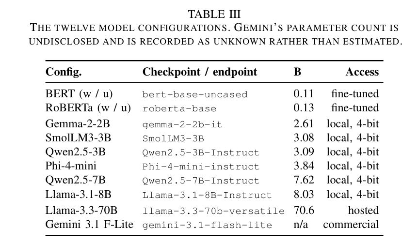

*جدول 3 من البيبر: الـ 12 تكوين (configuration).*


انتِ عارفة الفكرة العامة: عندنا requirements وبنصنّفها FR/NFR أو security/non-security أو sub-type. اللي مش واضح هو "الماكينة" اللي جوّه: إيه اللي بيتقسم، وإزاي، وليه الأرقام دي بالذات. خلّينا نمشي حتة حتة، وكل رقم هنقول: هو إيه، جاي منين، وليه.

### 1) يعني إيه split family ويعني إيه fold؟ (رسمة بالكلام)

**fold** = تقسيمة واحدة للداتا لجزئين: جزء **train** (الموديل بيتعلم منه) وجزء **test** (بنقيس عليه). الـ fold في ملف الـ splits هي حرفياً لستتين من الـ ids: دول للتدريب ودول للاختبار.

**split family** (عيلة تقسيم) = مجموعة folds بتخدم سؤال واحد على task واحد على corpus واحد بنظام تقييم واحد. مثلاً: "in-domain على FR/NFR على PROMISE" دي عيلة، جواها 5 folds.

تخيّليها كده: خدي 968 كارت (كل كارت = requirement من PROMISE). العيلة "in-domain FR/NFR" بتقولك: اخلطي الكروت (بـ seed 42 عشان الخلطة تتكرر بالظبط كل مرة؛ الـ seed = رقم بداية مولّد العشوائية، وقيمته نفسها اختيارية — أي رقم ثابت كان هيعمل نفس الشغل، و42 هي العادة الشائعة في المجال. ونفس الـ SEED = 42 بيتعاد استخدامه في Stage 3 لسحب الـ few-shot exemplars والـ core sample بـ `random_state=SEED`، فالعينة الـ prompted مجمّدة هي كمان)، وقسّميهم 5 أكوام متساوية تقريباً. الـ fold رقم 1 = "الكومة 1 هي الـ test، والأربع كوم التانيين هما الـ train". الـ fold رقم 2 = "الكومة 2 هي الـ test والباقي train"... لحد الـ fold 5. كده كل كارت وقع في الـ test مرة واحدة بالظبط، ووقع في الـ train 4 مرات.

كلمة **frozen** (مجمّدة) اللي الورقة بتكررها معناها: التقسيمة دي اتعملت مرة واحدة، اتخزّنت في ملف JSON، والمراحل اللي بعدها بتقرا الملف ومش بتعيد التقسيم أبداً. السبب المذكور في الورقة وفي الـ deck (slide 6): الـ StratifiedGroupKFold (هنشرحه تحت) بيدي folds مختلفة حسب نسخة مكتبة scikit-learn، فلو حد أعاد التوليد ممكن يطلع folds تانية والمقارنات تبوظ.

### 2) الـ 14 عيلة وإزاي 107 = 30 + 28 + 47 + 2

الرقم **107** في Fig. 1 (صندوق "Frozen splits: 14 families, 107 folds, seed 42") مش رقم سحري؛ هو مجرد **مجموع** عدد الـ folds في الـ 14 عيلة. الجدول ده مأخوذ حرفياً من block الـ `splits` في `stage1_manifest.json`:

| # | اسم العيلة في الـ manifest | task | regime | folds |
|---|---|---|---|---|
| 1 | in_domain_fr_nfr | FR/NFR (PROMISE) | in_domain | 5 |
| 2 | in_domain_security_promise | security (PROMISE) | in_domain | 5 |
| 3 | in_domain_security_secreq | security (SecReq) | in_domain | 5 |
| 4 | in_domain_subtype_top4 | sub-type top-4 | in_domain | 5 |
| 5 | in_domain_subtype_top6 | sub-type top-6 | in_domain | 5 |
| 6 | in_domain_subtype_all | sub-type all-11 | in_domain | 5 |
| 7 | cross_project_fr_nfr_promise | FR/NFR (PROMISE) | cross_project | 5 |
| 8 | cross_project_security_promise | security (PROMISE) | cross_project | 5 |
| 9 | cross_project_security_secreq | security (SecReq) | cross_project | **3** |
| 10 | cross_project_subtype_top4_promise | sub-type top-4 | cross_project | 5 |
| 11 | cross_project_subtype_top6_promise | sub-type top-6 | cross_project | 5 |
| 12 | cross_project_subtype_all_promise | sub-type all-11 | cross_project | 5 |
| 13 | leave_project_out | FR/NFR (PROMISE) | cross_project_lopo | **47** |
| 14 | cross_dataset | security (PROMISE↔SecReq) | cross_dataset | **2** |

الحساب:
- in-domain: 6 عيلات × 5 = **30**
- cross-project: 5 + 5 + 3 + 5 + 5 + 5 = **28**
- LOPO (leave-one-project-out): **47**
- cross-dataset: **2**
- المجموع: 30 + 28 + 47 + 2 = **107** ✓

وليه 14 عيلة بالذات؟ لأن عندنا 6 "خلايا" task×corpus (FR/NFR على PROMISE، security على PROMISE، security على SecReq، والتلات أحجام للـ sub-types على PROMISE)، وكل خلية منهم ليها عيلة in-domain وعيلة cross-project = 12، زائد عيلة LOPO واحدة (على FR/NFR بس) وعيلة cross-dataset واحدة (على security بس) = 14. الأرقام 3 و47 و2 اللي شاذّة عن الـ 5 هي بالظبط الأسئلة اللي هنجاوبها في البنود 4 و5 و6.

### 3) ليه 5 folds؟ وإيه اللي بتعمله stratified 5-fold CV؟

**CV = cross-validation**: بدل ما تقسّمي مرة واحدة train/test وتقيسي مرة، بتكرّري التقسيم k مرات بحيث كل item يبقى test مرة. النتيجة النهائية مش متوسط 5 أرقام في الورقة دي؛ الكود بيعمل **pooled scoring**: بيجمّع الـ predictions بتاعة الـ 5 folds في جدول واحد (كل requirement ليها prediction واحد، من الموديل اللي ما شافهاش في التدريب) وبيحسب macro-F1 (متوسط الـ F1 بتاع كل class على حدة بوزن متساوي، مهما كان الـ class صغير — اتشرح في القاموس) مرة واحدة على الـ 968 كلهم. عشان كده Table IV بتقول "n = 968" لخلية encoder. وخدي بالك إن الـ test في كل fold = 1/5 = **20%** من الكوربس والـ train = **80%**.

**stratified** (طبقي): لما نقسّم لـ 5 أكوام، مش بنقسّم عشوائي بحت؛ بنحافظ إن نسبة كل class في كل كومة تساوي نسبتها في الـ corpus كله. الدالة اللي بتعمل ده في الكود: `StratifiedKFold(n_splits=5, shuffle=True, random_state=42)`.

الأحجام الفعلية (قسمة بسيطة):
- PROMISE (968 item): كل fold فيه test ≈ 968 ÷ 5 = **193.6 ≈ 194** item، وtrain = 968 × 4/5 = **774.4** في المتوسط (الـ folds الفعلية 774/774/774/775/775) (ملف `summary_finetuned.csv` بيقول mean_train_n = 774.4 بالظبط). لو الـ task هي security، الـ 125 security item بيتوزّعوا ≈ 125 ÷ 5 = **25** لكل fold test، والـ 843 non-security ≈ 169 لكل fold.
- SecReq (444 item): test ≈ 444 ÷ 5 = **88.8 ≈ 89**، train = **355.2** (نفس الملف). الـ 177 security ≈ 35 في كل fold.
- sub-types: all-11 على 524 NFR → train 419.2؛ top-6 على 433 → train 346.4؛ top-4 على 353 → train 282.4 (كلهم = 4/5 من الحجم).

**الـ folds الحقيقية من `splits.json` (مش تقريب):** الـ "≈ 194" و"≈ 25" اللي فوق هما فعلاً كده بالظبط، وده اللي بيوريكي الـ stratification بتعمل إيه:
- in_domain_security_promise: الـ test في الـ 5 folds = **194 / 194 / 194 / 193 / 193** item، وفي كل fold منهم بالظبط **25 security** (والباقي 169 أو 168 non-security). 125 ÷ 5 = 25 من غير كسر، فالتوزيع طلع مثالي.
- in_domain_fr_nfr: كل fold فيه **104–105 NFR** و**88–89 FR** (524 ÷ 5 = 104.8 و444 ÷ 5 = 88.8).
- in_domain_security_secreq: test = **89 / 89 / 89 / 89 / 88**، فيهم **35–36 security** (177 ÷ 5 = 35.4).

قارني ده بسحب عشوائي بحت من غير stratification: عينة 194 من كوربس فيه 12.9% security ممكن تطلع مرة بـ 15 security ومرة بـ 35، وساعتها الفرق بين الـ folds كان هيبقى من الحظ مش من الموديل. الـ stratification بتقفل مصدر الضوضاء ده.


**ليه 5 وليس 10 أو 3؟** الورقة ما بتقولش جملة "اخترنا 5 لأن..."؛ بتقول إن الـ in-domain arm هو "the in-distribution reference arm prior work reports"، يعني بيقلّد اللي المجال بيعمله. تفسيري (مش من الورقة): 5-fold هو الـ convention الشائع في أبحاث تصنيف الـ requirements، وبيدي توازن: كل موديل بيتدرّب على 80% من الداتا (قريب من "كل الداتا") وكل item بيتختبر مرة، مقابل تدريب 5 موديلات بس مش 10. الرقم موجود كـ config واحد في الكود: `"n_folds_in_domain": 5`.

**هل الكود ممكن يقلّل الـ 5؟** أيوه، وده مهم تفهميه: في `stratified_cv_splits` فيه حماية: لو أي class عدد أعضائه أقل من عدد الـ folds، يبقى مستحيل يظهر في كل fold، فالكود بيقلّل k لـ `max(2, أصغر class)` ويطلع warning. هل ده حصل؟ **لا**. أصغر class في أي عيلة in-domain هو **portability = 12** item (في task all-11) (من `final_class_balance` في الـ manifest)، و12 ≥ 5، فالشرط ما اتفعّلش في أي عيلة من الـ 14. عشان كده كل الـ in-domain families بـ 5 folds بالظبط. (فيه كمان حالة singleton: class بعضو واحد بيتشال بـ warning؛ برضه ما حصلتش.)

### 4) ليه cross-project SecReq بـ 3 folds مش 5؟ وإيه StratifiedGroupKFold؟

**cross-project** معناه: الـ test فيه مشاريع كاملة الموديل عمره ما شاف منها ولا requirement. عشان كده مش ينفع نستخدم StratifiedKFold العادي (اللي بيوزّع الـ items عشوائي وممكن يحط requirement من مشروع X في الـ train وأخوها من نفس المشروع في الـ test).

الدالة المستخدمة: `StratifiedGroupKFold(n_splits=k, shuffle=True, random_state=42)` مع `groups = project`. بتعمل حاجتين في نفس الوقت:
1. **Group**: المشروع كله يا إما في الـ train يا إما في الـ test؛ عمره ما يظهر على الجهتين. تعليق الكود بيقول ده هو "the entire point": لو مشروع اتشارك بين train وtest، ده مش cross-project أصلاً، ده in-domain "لابس اسم تاني" وهينفخ الرقم اللي RQ2 بتطرح منه.
2. **Stratified**: مع الحفاظ على ده، بتحاول تخلّي نسبة الـ classes في كل fold قريبة من الـ corpus.

**ليه SecReq = 3 folds؟** لأن الـ "project" في SecReq هو مواصفة صناعية كاملة، وعندنا **3** بس: CEPS (ePurse)، CPN، GPS. الكود بيحسب `k = min(n_folds, n_groups)` = min(5, 3) = **3**، وبيطلع warning "only 3 project(s); reducing to 3 folds". يعني كل fold بيحجز مواصفة كاملة كـ test ويدرّب على الاتنين التانيين؛ الـ 3 folds المجمّدة فعلاً (من `splits.json` على الكوربس بعد الـ dedup، 444 item):
- fold 1: test = **CPN** كلها = **147** item (31 security / 116 non = **21.1%** security)، train = الاتنين التانيين = **297**.
- fold 2: test = **GPS** = **173** (63 / 110 = **36.4%**)، train = **271**.
- fold 3: test = **CEPS** = **124** (83 / 41 = **66.9%**)، train = **320**.

متوسط الـ train = (297 + 271 + 320) ÷ 3 = **296** item، وده بالظبط الرقم اللي في `summary_finetuned.csv` (لو حسبتيها بالتقريب 444 × 2/3 = 296 برضه). ملحوظة جانبية: الأحجام **قبل** الـ dedup كانت CEPS 124، CPN 210، GPS 176 (من الـ manifest) — يعني CPN خسرت 63 نص مكرر، GPS خسرت 3، وCEPS ما خسرتش حاجة؛ الـ folds بتتبني على الأرقام اللي بعد الـ dedup مش دي.

نقطة زيادة من تعليقات الكود عشان تفهمي ليه العيلة دي مميزة: نسبة الـ security في التلات مواصفات مختلفة جداً (CEPS 67%، CPN 21%، GPS 36%)، فدي الذراع الوحيدة اللي الـ **prior** (النسبة القبلية للـ class) بتتغير بشدة بينما تعريف الـ label والمعلّقين والمجال ثابتين. (الرقم 67/21/36 من تعليق `CROSS_PROJECT_PLAN` في notebook Stage 1.)

على PROMISE (47 مشروع) الـ 5 folds ممكنة عادي: كل fold بيجمّع كام مشروع. تعليق الكود بيقول أحجام الـ folds المجمّعة على الكوربسين بتتراوح 26–258 item. حاجة مهمة للـ sub-types: 3 من الـ 15 fold بتاعة cross-project sub-types ناقصها class نادر جداً (مثلاً portability وfault_tolerance في fold 3 لـ all-11)، لأن class فيه 12 عضو على مستوى الـ corpus مش ممكن يظهر في 5 folds مفصولة بالمشروع. الحل: نفس الـ pooled scoring، والرقم لكل fold لوحده ما يتقالش كـ macro-F1 مستقل.

**مثال محسوب من `splits.json` عشان الـ 26–258 يبقى ملموس:**
- cross_project_fr_nfr_promise، fold 1: الـ test = المشاريع {6, 11, 18, 30, 31, 40} = **123** item (75 NFR / 48 FR)، والـ train = الـ 41 مشروع الباقيين = **845**.
- fold 2 من نفس العيلة: 13 مشروع = **258** item (109 NFR / 149 FR)، وهو أكبر fold في كل الـ cross-project families، والـ train = **710**.
- أصغر fold: **26** item في cross_project_subtype_top6_promise fold 5 = 7 مشاريع صغيرة (مشروع 27 لوحده 10 items)، فيهم 17 security، 3 look_and_feel، 3 operational، 2 usability، 1 performance، و**صفر availability** — ده الـ fold اللي class كامل غايب منه.
- في cross_project_subtype_all_promise، fold 1 وfold 3 فيهم maintainability = **1** بس (وfold 3 هو اللي ناقصه portability وfault_tolerance خالص).

لاحظي إن train + test = 968 دايماً، فمتوسط الـ train لسه **774.4** (نفس رقم in-domain في `summary_finetuned.csv`) رغم إن الـ folds هنا مش متساوية (train بين 710 و845) بعكس in-domain (774 / 775). وكل ده سبب زيادة للـ pooled scoring: رقم fold بـ 26 item ناقصه class مش رقم ينفع يتقارن لوحده.


### 5) ليه 47 fold للـ LOPO، وليه بتتحسب pooled، وليه مش في عيلة McNemar

**LOPO = Leave-One-Project-Out**: أقصى درجة من الـ cross-project. الدالة `LeaveOneGroupOut()` على الـ 47 مشروع بتاعة PROMISE → **47 fold**، كل fold: مشروع واحد كامل هو الـ test، والـ 46 الباقيين train. متوسط الـ train = 968 − (968 ÷ 47) = 968 − 20.6 = **947.4** (موجود في `summary_finetuned.csv`). موجودة على FR/NFR بس.

**ليه موجودة أصلاً** وإحنا عندنا cross-project بـ 5 folds؟ تعليق الكود: 47 نقطة لكل مشروع هي اللي بتخلّي "variance statement" ممكن: "الـ encoder بيخسر كذا على المشروع الوسيط وكذا على الأسوأ". رقم pooled واحد بيخبي بالظبط ده (وده اللي طلع في tab11b — جدول توزيع الدقة لكل مشروع: الرقم اللي بيتحسب لكل مشروع هناك هو **accuracy** مش macro-F1، لنفس سبب الـ class الواحد اللي هنشرحه تحت؛ الـ accuracy معرّفة على أي fold حتى لو فيه class واحد. على الـ **37** مشروع اللي كبيرة كفاية للمقارنة على FR/NFR، كل موديل عنده مشروع دقته 0.0 ومشروع دقته 1.0؛ الوسيط (median) للإنكودرز BERT-w وRoBERTa-w = **0.9167**، والموديلات المحلية الصغيرة وسيطها بين **0.5455** (SmolLM3-3B) و**0.75** (Phi-4-mini)).

**ليه pooled مش per-fold؟** لأن الـ folds دي مش قابلة للتقييم فرادى: من الـ 47 test set، **24** فيهم class واحد بس (كله FR أو كله NFR)، و**2** فيهم requirement واحد بس. لو حسبتي macro-F1 لكل fold: الـ class الغايب هياخد F1 = 0 وبرضه هنقسم على 2 → الرقم بينزل غصب عنه بسبب حجم الـ fold مش بسبب الموديل. فالحل: نجمّع الـ 968 prediction (كل requirement اتختبرت مرة واحدة بموديل ما شافش مشروعها) ونحسب رقم واحد. الأرقام الـ pooled دي — 0.8549 (BERT) و0.8592 (RoBERTa) — موجودة في tab9_evaluability.csv وsummary_finetuned.csv؛ وخدي بالك إن Table V نفسها ما فيهاش صف LOPO: عمود cross-project فيها هو الـ grouped arm (0.843 / 0.853)، والورقة بتستخدم LOPO بس في فقرة "aggregate scores hide per-project failure".

**مثال محسوب على ليه الـ per-fold macro-F1 مش هينفع في LOPO:** أحجام الـ test في الـ 47 fold بتتراوح من **1** لـ **92** item (مشروع 22 ومشروع 39 فيهم requirement واحدة بس؛ مشروع 8 هو الأكبر بـ 92). وبالتالي كل موديل LOPO بيتدرّب على 968 − حجم المشروع، يعني بين **876** و**967** item (المتوسط 947.4). خدي مشروع 24: **5** requirements كلهم NFR. موديل جاب الـ 5 صح كلهم: F1(NFR) = 1.0، لكن F1(FR) = 0 لأن class FR مش موجود أصلاً في الـ test فبيتحسب صفر، فالـ macro-F1 = (1.0 + 0) ÷ 2 = **0.5** لموديل مثالي! نفس الـ 5 predictions دي لما تتجمّع مع الـ 963 التانيين في جدول واحد بتتحسب صح. عشان كده الـ 47 موديل بيتقيّموا pooled ورقم واحد.


**ليه مش في عيلة الـ 260 McNemar؟** (McNemar = اختبار إحصائي بيقارن موديلين على نفس الـ items، بيبص بس على الحالات اللي واحد صح والتاني غلط.) الـ LOPO بيتفق مع الـ grouped cross-project على ~94% من الـ items، فلو دخّلناه هنعمل اختبارات شبه مكررة (near-duplicate) وننفخ عدد الاختبارات في التصحيح. عشان كده الـ McNemar family = 260 = in-domain 106 + cross-project 90 + cross-dataset 64، والـ LOPO بره.

### 6) ليه cross-dataset بـ 2 folds بس، وعلى security بس؟

**cross-dataset**: ندرّب على corpus كامل ونختبر على الكوربس التاني كامل. الكود (`cross_dataset_splits`) بيولّد fold لكل **زوج مرتّب** (ordered pair) من الكوربسات اللي بيشتركوا في task **وعند الاتنين ≥ 2 classes للـ task ده**. عندنا كوربسين → زوجين مرتبين → **2 folds**:
- `promise_to_secreq`: train على 968 من PROMISE، test على 444 من SecReq.
- `secreq_to_promise`: train على 444 من SecReq، test على 968 من PROMISE.

(الأرقام دي بالظبط mean_train_n في `summary_finetuned.csv`: 968 و444.)

**ليه security بس؟** الـ FR/NFR labels موجودة في PROMISE بس، والـ sub-type labels في PROMISE بس؛ SecReq عندها security بس (الـ manifest بيقول `label_fr_nfr: {}` لـ SecReq). فـ security هي الـ task الوحيدة اللي الكوربسين بيحملوها بـ classين. الكود بيسجّل كل task اتخطّت بالاسم، عشان الغياب يبقى حاجة متسجّلة ومعروف سببها مش فجوة محدش لاحظها. وتعليق الكود بيحذّر من حاجة الورقة بتقولها برضه: PROMISE بيعرّف security كـ sub-type من NFR (فبالبناء non-functional)، بينما SecReq بيعلّم أي جملة ليها علاقة بالأمان حتى لو functional، فجزء من اللي بنقيسه **definitional shift** (تغيّر في *تعريف* الـ label نفسه) مش بس distribution shift (تغيّر في توزيع الداتا). مثال توضيحي (تفسيري، الجملة من عندي مش من الكوربس): جملة زي "The system shall encrypt the password before storing it" هي requirement **وظيفية** (بتقول النظام يعمل إيه). في PROMISE هتتعلّم F، وبما إن security في PROMISE موجودة بس جوّه الـ 11 sub-type بتوع الـ NFR، فهي **non-security بالبناء**. في SecReq نفس الجملة هتتعلّم **security** لأن SecReq بيعلّم أي جملة ليها علاقة بالأمان. يعني موديل اتدرّب على PROMISE عمره ما شاف جملة وظيفية متعلّمة security، فجزء من الهبوط في الـ cross-dataset سببه إن تعريف الـ label اتغيّر، مش بس إن الداتا اتغيّرت (الورقة بتقول ده في قسم Threats: "definitional as well as distributional shift").

وده جدول "الخطة" من نفس الـ notebook (مين بيروح لأنهي regime)، وهو نفس الـ 14 = 6 × 2 + 1 + 1 بس من الناحية التانية:

| task | in-domain | cross-project | cross-dataset |
|---|---|---|---|
| FR/NFR (PROMISE) | ✓ | ✓ (+ LOPO) | ✗ (SecReq ما عندهاش FR/NFR) |
| security (PROMISE) | ✓ | ✓ | ✓ (→ SecReq) |
| security (SecReq) | ✓ | ✓ (3 folds) | ✓ (→ PROMISE) |
| sub-type top-4 / top-6 / all-11 | ✓ | ✓ | ✗ (SecReq ما عندهاش sub-types) |

يعني 6 خلايا task×corpus كل واحدة عندها in-domain وcross-project = 12 عيلة، + LOPO على FR/NFR + cross-dataset على security = 14.


### 7) التلات "محطات" و"encoders re-fitted per station" يعني إيه عملياً؟

**regime** = نظام تقييم = مستوى الـ distribution shift (اختلاف الداتا اللي بنختبر عليها عن اللي دربنا عليها). التلات محطات بالترتيب: in-domain (نفس الكوربس، خلط عشوائي) → cross-project (مشاريع غير مشوفة) → cross-dataset (كوربس تاني بالكامل). ولو عايزة تربطي الشريط ده بجدول الـ 14 عيلة في البند 2: محطة in-domain = العيلات 1–6 (30 fold)؛ محطة cross-project = العيلات 7–12 (28 fold) **زائد** LOPO (العيلة 13، 47 fold) — الشريط في Fig. 1 مكتوب فيه "unseen project groups + LOPO" فالاتنين في نفس المحطة؛ محطة cross-dataset = العيلة 14 (2 folds).

**ربط سريع بصناديق Fig. 1** (الشرح الكامل لكل صندوق في S1، فمش هنكرره): "station" (محطة) و"regime" نفس الحاجة — 3 نقط على الشريط اللي تحت الرسمة، وصندوق الـ Encoder arm مكتوب فيه "re-fitted per regime" وهو نفس معنى "re-fitted per station" اللي في النص. الـ "50 project groups" في صندوق Unified corpus = 47 مشروع PROMISE + 3 مواصفات SecReq، ودول الوحدات اللي الـ StratifiedGroupKFold والـ LOPO بيمسكوها كوحدة واحدة. الـ "SHA-256-pinned ids" في صندوق Frozen splits معناها إن كل id في ملف الـ splits مربوط ببصمة الملف المصدر، فالـ split ما ينفعش يتطبّق غير على نفس نسخة الداتا بالظبط (تفاصيل في S1 والقاموس). والمسار المتصل (encoders) هو اللي بيستهلك الـ train folds — 107 مرة لكل encoder موزون — أما المسار المقطّع (prompted) فبيشوف test items بس، صفر تدريب؛ الحاجة الوحيدة اللي بياخدها من الداتا هي الـ few-shot exemplars، ودول بيتشالوا من الـ frame زي ما هنشوف في البند 8.


**"re-fitted per station"** عملياً معناه: عند كل عيلة، الـ encoder بيتدرّب **من الصفر** (من الـ checkpoint الأساسي — يعني نسخة الأوزان المحفوظة للموديل المتدرّب مسبقاً، قبل أي fine-tuning — bert-base أو roberta-base) على الـ train بتاع كل fold، ويتنبأ على الـ test بتاعه، ويتشال. يعني:
- عيلة بـ 5 folds = **5 موديلات** بتتدرّب.
- LOPO = 47 موديل. cross-dataset = 2. cross-project SecReq = 3.
- كل encoder موزون (BERT-w أو RoBERTa-w) بيمشي على الـ 14 عيلة كلها → **107 موديل** لكل واحد.
- الـ unweighted control (BERT-u، RoBERTa-u) بيمشي على 2 عيلة بس (in_domain_security_promise = 5 folds + cross_dataset = 2 folds) → **7 موديلات** لكل واحد.
- الإجمالي: 2 × 107 + 2 × 7 = **228** تدريب (مجموع عمود n_folds في `summary_finetuned.csv` = 228 ✓).

الوقت: BERT على in-domain FR/NFR أخد 273.5 ثانية للـ 5 folds ≈ 55 ثانية للموديل الواحد على كارت NVIDIA T4 (كارت GPU مجاني، تفاصيله في البند 9)؛ LOPO أخد 3,149 ثانية للـ 47 ≈ **67** ثانية للموديل الواحد. ليه أطول من الـ 55؟ لأن كل موديل LOPO بيتدرّب على ≈ 947 item (كل الكوربس ناقص مشروع واحد) مقابل 774 في الـ 5-fold، ووقت التدريب بيتناسب مع عدد الأمثلة. (الأرقام من `summary_finetuned.csv`؛ القسمة حسبتي أنا.)

وده اللي بيخلّي الـ "عدد predictions" يتقفل: كل encoder موزون بيعمل prediction واحد لكل item في كل عيلة: 968 × 6 عيلات على PROMISE (fr_nfr ×3 regimes: in-domain، cross-project، LOPO؛ security ×3: in-domain، cross-project، cross-dataset) + 444 × 3 على SecReq + (524 + 433 + 353) × 2 للـ sub-types = 5,808 + 1,332 + 2,620 = **9,760** prediction. الـ unweighted: 968 × 2 + 444 = **2,380**. المجموع 2 × 9,760 + 2 × 2,380 = **24,280** encoder predictions (الرقم اللي في الورقة).

### 8) العينات في الذراع الـ prompted: 300 و200 و218 و960 و436 و8 و10

الـ **prompted models** (LLMs بتجاوب على prompt من غير تدريب) ما عندهاش train/test؛ بنسألها على items وبس. بس مين الـ items؟

**الـ frame أولاً (960 / 960 / 436).** قبل أي عينة، الكود بيشيل من كل خلية الـ **few-shot exemplars** (الأمثلة اللي بتتحط في الـ prompt). الـ pool = **4 أمثلة لكل class** (config: `fewshot_pool_per_class: 4`؛ **k** = العدد الكلي للأمثلة اللي بتتحط في الـ prompt؛ السلم للـ tasks الثنائية هو k ∈ {2, 4, 8} إجمالي، يعني 1 / 2 / 4 مثال لكل class، فأكبر k = 8 على task ثنائية = 4 لكل class، والـ pool لازم يكفيه — تعليق الكود: "≥ max(k)/n_classes, so k=8 is satisfiable". للـ sub-types السلم k ∈ {1, 2} **لكل class** فالـ pool = 3 لكل class مع هامش. وخدي بالك: الـ few-shot runs بتتعمل على الـ CORE subset بس (الجاي تحت)، أما zero-shot فبيغطي الـ frame الكامل عند الموديلات المحلية؛ تفاصيل نتايج الـ few-shot في S6). فلكل task ثنائية: 2 classes × 4 = **8** items بتتشال، عشان مثال في الـ prompt عمره ما يبقى test item. وده مصدر الـ 960 = 968 − 8 على PROMISE، و436 = 444 − 8 على SecReq. الـ "frame" ده هو مجموعة الأسئلة الكاملة للذراع الـ prompted. (للـ sub-types الـ pool = 3 لكل class لأن k ≤ 2 لكل class: all-11: 524 − 33 = 491؛ top-6: 433 − 18 = 415؛ top-4: 353 − 12 = 341؛ وكلها موجودة في tab9 كـ n للموديلات المحلية.)

ملحوظة: الـ 8 items دي بتفضل بتتقيّم عند الـ encoders (968 مش 960)، عشان كده الـ n بتاع encoder 968 وبتاع Gemma 960 في نفس الخلية؛ الـ McNemar بيتعمل على التقاطع. مثال من tab4: BERT-w (in-domain) ضد Qwen2.5-7B على security/SecReq اتقارنوا على n_paired = **436** مش 444، يعني الـ 8 exemplars اتشالوا من ناحية الـ encoder عشان الاتنين يتقارنوا على نفس الـ items بالظبط (50 item صح عند BERT بس، 55 صح عند Qwen بس، p = 0.696، مش دال).

**الـ core sample (300 لكل خلية ثنائية).** الـ API models عندها quota (حد أقصى لعدد الطلبات) يومية مجانية، فمش هينفع كل موديل يجاوب على 960. الكود بيعرّف subset ثابت اسمه CORE: `core_eval_n: 300`. **ليه 300 بالذات؟** تعليق الكود حرفياً: 300 هو أكبر n بحيث الـ quota اليومية المجانية الكاملة لمزوّد API واحد (900 request) تغطي التلات خلايا الثنائية: 3 × 300 = **900**. وبيضيف: عند n = 300، فرق macro-F1 حوالي **0.08** تقدري تلاحظيه كفرق حقيقي (statistically significant) عند p < 0.05، وده أقل بكتير من الفروق الملحوظة بين الموديلات. (الكود بيقول الجملة دي كتبرير power ولا بيوضح الحسبة؛ فخديها كما هي مصدرها.)

**200 للـ sub-types.** notebook Stage 3b: الـ NFRs 524 بس وtop-4 بيغطي 353 منهم، فـ 300 كانت هتبقى "كل الداتا تقريباً" مش عينة؛ فاتحدّت بـ 200 عشان تبقى subset حقيقي، وعشان 3 tasks × 200 = **600** يدخل في quota يوم واحد. وبيقول صراحة إن حجّة الـ power بتاعة 300 ما بتتنقلش كما هي.

**ليه proportional مش balanced؟** ده أهم قرار في الجزء ده. `stratified(df, n, min_per_class=10)` بتوزّع الـ n على الـ classes **بنفس نسبتهم في الـ frame** (largest-remainder rounding عشان المجموع يطلع n بالظبط). على الـ frames بعد شيل الأمثلة: security = 121 ÷ 960 = **12.6%** على PROMISE، و173 ÷ 436 = **39.7%** على SecReq (الأرقام 121 و173 هي min_class_support في tab9 لموديل محلي؛ في الكوربس الكامل 12.9% و39.9%). لو عملنا balanced (150 security + 150 non) كنا هنخلّي PROMISE يبان زي SecReq، ونمسح الـ **prior shift** (تغيّر نسبة الـ class) اللي هو **نفسه** الآلية اللي RQ2 بتدرسها، وكمان macro-F1 على العينة كان هيبقى غير قابل للمقارنة مع macro-F1 على الـ frame الكامل ومع الـ encoders. حسبة العينة (من القاعدة): PROMISE security: 300 × 121/960 = 37.8 → **38** security + **262** non؛ SecReq: 300 × 173/436 = 119.0 → **119** + **181**.

**إزاي الـ largest-remainder rounding طلّعت 38 / 262 بالظبط؟** الحصص الدقيقة: 300 × 121/960 = **37.8** security و300 × 839/960 = **262.2** non-security. ناخد الجزء الصحيح: 37 + 262 = 299، ناقص واحد عن 300. الـ 1 المتبقي بيروح للـ class اللي كسره أكبر: .8 (security) أكبر من .2، فـ security بتاخده → **38 / 262** = 300 ✓. بعدها فحص الـ floor: الاتنين ≥ 10، فمفيش تغيير. على SecReq الحصص 119.0 و181.0 من غير كسر أصلاً.


**الـ floor = 10 وليه all-11 طلعت 218 مش 200.** بعد التوزيع النسبي، أي class طلع نصيبه أقل من 10 بيترفع لـ 10 (أو لحجم الـ class نفسه لو أصغر)، **من غير إعادة توزيع** على الباقي. الهدف: عمر class ما يختفي من العينة، لأن macro-F1 يبقى غير معرّف ليه. على الثنائي ما بيأثرش (38 و119 أكبر من 10). على all-11 (frame 491): التوزيع النسبي لـ 200 بيدي maintainability 8، scalability 8، fault_tolerance 6، legal 5، portability 4 (=9 في الـ frame فبتترفع لـ 9 بس) → الرفع للـ floor بيضيف 2 + 2 + 4 + 5 + 5 = **18** → 200 + 18 = **218**. (الكود نفسه بيقول: "it is why the all-11 core holds 218 items rather than 200" وإن portability بقت ~4.1% من CORE = 9 ÷ 218 مقابل ~1.8% من الـ frame = 9 ÷ 491.)

وعشان تشوفي الـ 11 class كلهم مش الخمسة اللي اترفعوا بس، التوزيع النسبي للـ 200 على frame الـ all-11 (491 item = 524 − 33 exemplar) قبل الـ floor، بنفس قاعدة الـ rounding: security **50**، usability **33**، operational **30**، performance **26**، look_and_feel **19**، availability **11**، maintainability **8**، scalability **8**، fault_tolerance **6**، legal **5**، portability **4** → المجموع 200 ✓. الست الأوائل فوق الـ 10 فبيفضلوا زي ما هم؛ الخمسة الأخيرة بيترفعوا (10، 10، 10، 10، و9 لـ portability لأن الـ frame فيه 9 بس) → 218. (حسبتها أنا من أرقام الـ frame بنفس قاعدة الكود؛ الـ 218 نفسه مكتوب في تعليق الكود.)


**مين جاوب على إيه (tab9، عمود n):** (أسامي الملفات دي هتتكرر، فخديها مرة واحدة: **tab9** = جدول القابلية للتبليغ (evaluability) لكل خلية، **tab10** = مقارنة like-for-like على الـ items المشتركة بس، **tab11b** = توزيع الدقة لكل مشروع. و"خلية" هنا = صف في tab9 = موديل × task × كوربس × regime.)
- الـ 6 موديلات المحلية (Gemma-2-2B، SmolLM3-3B، Qwen2.5-3B، Phi-4-mini، Qwen2.5-7B، Llama-3.1-8B): الـ frame الكامل → **960 / 960 / 436** للثنائي، و**341 / 415 / 491** للـ sub-types. (ما عندهمش quota؛ بيتشغّلوا على T4.)
- Llama-3.3-70B (hosted على Groq): **290 / 294 / 286** على الثنائي، و**169 / 141 / 163** على top-4 / top-6 / all-11. قريبة من 300 و200 مش بالظبط. الناقص هو طلبات الطبقة المجانية بتاعة Groq رفضتها (rate limiting؛ في config Stage 3 الحدود: 25 request في الدقيقة و900 في اليوم). على الثنائي النقص صغير: 300 − 290 = 10، 300 − 294 = 6، 300 − 286 = 14 item. على الـ sub-types أكبر: notebook الإصلاح (stage3b-repair) بيقول إن **145** صف ضاعوا كده، وإن الفقد **مش عشوائي** (missing-not-at-random): maintainability خسر **60%** من عناصره. وده بالظبط السبب إن خلية all-11 بتاعة Llama-70B نزلت لـ 163 item وفيها maintainability = **4** بس، أقل من الـ 5 اللي الـ gate بتطلبها، فاتستبعدت (tab9: "class support<5"). الكود بيقول إن إزالة الانحياز ده محتاجة "top-up run" (تشغيل تكميلي للـ items الناقصة)، وإن تغطية الـ API models "بتتبلّغ" مش بتتفرض.
- Gemini 3.1 Flash-Lite (commercial): **59–60** في كل خلية. السبب المذكور في الكود: quota Gemini المجانية = **180** request/يوم مقابل خطة 900، و180 ÷ 3 = 60. خدي بالك إن الـ 60 دول **مش عينة نسبية جديدة**: هما الـ items من الـ core اللي الـ quota لحقت تجاوب عليها قبل ما تقف (Stage 4 بيوصفها "capped at 60 items by its free quota")، فنسبة الـ classes فيهم تقريبية بس: على security/PROMISE فيهم **7** security من 60 = 11.7% (tab9 عمود min_class_support)، وهو رقم بالكاد فوق الـ ≥ 5 اللي الـ gate بتطلبها؛ لو كان سحب نسبي كان هيطلع 60 × 121/960 ≈ 8. وخلية top-4 فيها 59 مش 60 لأن طلب واحد ما رجعش (المصدر ما بيقولش ليه). التمن اللي بتدفعيه مع n صغير هو عرض الـ CI (فترة الثقة 95%، tab9 عمود ci_width): عند n = 960 العرض ≈ **0.057–0.060**؛ عند n ≈ 290 (Llama-70B) **0.077–0.094**؛ عند n = 60 (Gemini) **0.17–0.27** (security/PROMISE بالذات 0.264). وده بيديكي إحساس بجملة "0.08 عند n = 300" اللي فوق: عند n = 300 عرض الـ CI حوالي 0.08–0.09، فالفرق اللي أصغر من كده بيغرق في الضوضاء.
- فحجم الخلية الـ prompted بيتراوح من **59** (Gemini top-4) لـ **960**، وده اللي caption جدول 4 في الورقة بيكتبه "n = 59–960" (للخلايا الـ prompted)؛ أما الـ deck ونص RQ1 فبيكتبوا "n = 59–968" لأنهم بيحسبوا الإنكودرز كمان.

**الـ pairing بالـ id مش بالمكان.** كل prediction متخزّن مع requirement id (مربوط بـ SHA-256 للمصدر). لما نعمل McNemar بين encoder وLLM، الكود بيطابق بالـ id: الـ 60 item بتوع Gemini بيتقارنوا بالـ predictions بتاعة BERT على **نفس** الـ 60 item. عشان كده مقارنة بـ n=60 لسه paired وصالحة، بس أقل power، وعشان كده فيه جداول like-for-like (tab10) بتعيد الترتيب على الـ items المشتركة بس.

### 9) Table III: الـ 12 configuration، الـ hyper-parameters، الـ class weighting، والموديل التاسع

**الجدول** (الأرقام من main.tex Table III، وحدة B = مليار parameter):

| الفئة | Config | Checkpoint | B | ملاحظة |
|---|---|---|---|---|
| encoder (fine-tuned) | BERT (w / u) | bert-base-uncased | 0.11 | 110 M |
| encoder (fine-tuned) | RoBERTa (w / u) | roberta-base | 0.13 | 125 M مقرّبة |
| local open، 4-bit | Gemma-2-2B | gemma-2-2b-it | 2.61 | |
| local open، 4-bit | SmolLM3-3B | SmolLM3-3B | 3.08 | |
| local open، 4-bit | Qwen2.5-3B | Qwen2.5-3B-Instruct | 3.09 | |
| local open، 4-bit | Phi-4-mini | Phi-4-mini-instruct | 3.84 | |
| local open، 4-bit | Qwen2.5-7B | Qwen2.5-7B-Instruct | 7.62 | |
| local open، 4-bit | Llama-3.1-8B | Llama-3.1-8B-Instruct | 8.03 | |
| hosted | Llama-3.3-70B | llama-3.3-70b-versatile | 70.6 | Groq free API |
| commercial | Gemini 3.1 Flash-Lite | gemini-3.1-flash-lite | n/a | closed weights |

ليه 12؟ 4 encoder configs (BERT وRoBERTa، كل واحد weighted وunweighted) + 8 prompted LLMs = 12. الـ "w/u" في صف واحد بس بيتعدّوا اتنين. الـ prompted موزّعة على 3 tiers (local open 6، hosted 1، commercial 1)، ومع الـ encoder tier يبقوا 4 فئات. الـ 110 M و125 M من slide 7؛ 0.125 بتتقرّب لـ 0.13 في الجدول. الـ n/a لـ Gemini: عدد الـ parameters غير معلن، والورقة بتسجّله "unknown" بدل ما تخمّن.

**4-bit NF4 (NormalFloat 4-bit، طريقة الضغط المستخدمة) على T4:** الـ 6 موديلات المحلية بتشتغل مضغوطة (quantised) لـ 4 bits على كارت NVIDIA T4 مجاني (16 GB). تعليق الكود: Llama-3.1-8B في fp16 محتاج ~16 GB ومش هيدخل؛ وبيخلّي الدقة موحّدة لكل الموديلات عشان ما يبقاش فيه confound (الصغير fp16 والكبير 4-bit).

**الـ hyper-parameters بتاعة الـ encoders**، سطر لكل واحد:
- **AdamW**: الـ optimiser (خوارزمية تحديث الأوزان)؛ نسخة من Adam بـ weight decay منفصل (weight decay = تصغير الأوزان شوية في كل خطوة عشان الموديل ما يحفظش الداتا)، وهي الافتراضية لـ fine-tuning الـ BERT.
- **lr = 2×10⁻⁵**: learning rate = حجم الخطوة في كل تحديث؛ صغيرة لأننا بنعدّل موديل متدرّب مسبقاً، مش بنبنيه من الصفر. (الورقة والكود ما بيقولوش ليه 2e-5 تحديداً؛ تفسيري: هي واحدة من القيم القياسية اللي ورقة BERT الأصلية بتوصي بيها للـ fine-tuning.)
- **batch 16**: كام requirement بيتحسب عليهم gradient واحد (الـ gradient = اتجاه تعديل الأوزان اللي بيقلّل الخسارة). (`train_bs: 16`.) ليه 16؟ الورقة والكود ما بيقولوش؛ تفسيري: 16 جوّه النطاق اللي ورقة BERT الأصلية بتوصي بيه للـ fine-tuning (batch 16 أو 32).
- **max length 128**: أقصى عدد tokens في الـ requirement؛ الأطول بيتقص. الـ requirements قصيرة فـ 128 كافية (تفسيري).
- **linear decay بدون warm-up**: الـ lr بيبدأ من 2e-5 وينزل خطياً لصفر على مدار كل الخطوات؛ من غير فترة "تسخين" في الأول. (في الكود: `get_linear_schedule_with_warmup(optim, 0, steps)`، الـ 0 = صفر warm-up.)
- **full precision**: fp32 (كل رقم في الموديل متخزّن بـ 32 bit)، مش mixed precision (خلط 16 و32 bit عشان السرعة). في الـ manifest القيمة اسمها "none_fp32" يعني من غير أي quantisation.
- **3 epochs للثنائي، 10 للـ sub-types**: epoch = مرور كامل على الـ train. ليه 3 بالذات للثنائي؟ الورقة والكود ما بيقولوش؛ تفسيري: 3 جوّه النطاق اللي ورقة BERT الأصلية بتوصي بيه (2–4 epochs). أما الـ 10 فالكود بيبرّرها، شوفي تحت.

**ليه الـ sub-types بياخدوا 10؟** تعليق الكود بيعمل الحسبة: all-11 بتتدرّب على ~419 مثال (= 524 × 4/5)؛ بـ batch 16 يعني 419 ÷ 16 ≈ 26 خطوة في الـ epoch، × 3 epochs ≈ **80 خطوة optimiser** لمشكلة بـ 11 class، وده مش كفاية؛ baseline ضعيف كان هيخلّي حد يقول إن المقارنة ظلمت الـ encoder. فـ 10 epochs ≈ 262 خطوة — حسبتي أنا من نفس الأرقام، مش رقم مكتوب في الكود. (للمقارنة، حسبتي برضه: الثنائي 774 ÷ 16 ≈ 48 خطوة × 3 ≈ 145.) نقطة الكود المهمة: الـ override **مربوط بالـ task مش بالعيلة**، عشان الـ in-domain والـ cross-project لنفس الـ sub-type task ياخدوا نفس الـ 10؛ لو واحد أخد 3 والتاني 10 كان الـ generalisation gap هيبقى مخلوط بفرق الـ epochs. وبيقول: الميل ده **في صالح الـ encoder (الـ baseline)** مش الـ LLMs، وده اللي بيخلّيه مقبول.

**class weighting = inverse frequency (balanced).** في الـ loss (دالة الخسارة اللي الموديل بيقللها)، كل class بياخد وزن عكس تكراره، بالمعادلة اللي sklearn بتستخدمها: وزن الـ class = n ÷ (عدد الـ classes × عدد أعضاء الـ class). مثال بأرقام security على PROMISE: 968 item، 125 security، 843 non-security:
- وزن security = 968 ÷ (2 × 125) = **3.87**
- وزن non-security = 968 ÷ (2 × 843) = **0.57**
- النسبة بينهم = 3.87 ÷ 0.57 ≈ **6.7** = 843 ÷ 125؛ يعني غلطة في security item بتتحسب على الموديل 6.7 مرة قد غلطة في non-security.

(الكود بيحسب الأوزان على الـ train بتاع كل fold مش على الكوربس كله؛ على fold in-domain الـ train ≈ 774 item فيهم ≈ 100 security، فالأرقام بتطلع قريبة جداً من دي.) الهدف: من غير الأوزان، الموديل ممكن يتعلم "قول non-security دايماً" ويجيب accuracy 87% وmacro-F1 0.4655 (الـ majority baseline في tab0_baselines). منين الرقمين دول؟ لو الموديل قال non-security للـ 968 كلهم: accuracy = 843 ÷ 968 = **0.871**. F1 بتاع non-security: precision = 843 ÷ 968 = 0.871 (كل اللي قال عليهم non-security، 87% منهم فعلاً كده)، recall = 1.0 (لقى كل الـ non-security)، فـ F1 = 2 × 0.871 × 1.0 ÷ (0.871 + 1.0) = **0.931**. F1 بتاع security = **0** (recall صفر، ما لقاش ولا واحد). macro-F1 = (0.931 + 0) ÷ 2 = **0.4655** ✓. يعني accuracy عالية جداً ومacro-F1 نص؛ عشان كده الورقة بتقيس بـ macro-F1 مش accuracy.

**ليه الـ unweighted control موجود على security PROMISE in-domain وcross-dataset بس؟** config Stage 2: `control_families: ["cross_dataset", "in_domain_security_promise"]`. التعليق: عشان أثر عدم التوازن يتقاس على **الجهتين** بتوع الـ generalisation gap (جوّه الكوربس وعبر الكوربسات)، مش على جهة التحويل بس. وليه security بالذات؟ الكود بيقول إن الـ control "للـ imbalance claim"؛ وتفسيري للباقي: security هو الـ task اللي فيه الاختلال الحاد (12.9%)، بينما FR/NFR شبه متوازن (444 / 524) فمفيش claim عن الاختلال محتاج control. النتيجة: BERT-u وRoBERTa-u ليهم 3 خلايا بس في tab9 (security/PROMISE in-domain، security/PROMISE cross-dataset، security/SecReq cross-dataset)، والأثر في `class_weighting_effect.csv` (delta = weighted − unweighted في macro-F1) صغير: BERT in-domain **+0.0166** (0.9235 مقابل 0.9069)، وعلى cross-dataset **−0.0062** (مقيّم على PROMISE) و**−0.0117** (مقيّم على SecReq). RoBERTa: in-domain **−0.0013** (0.9023 مقابل 0.9035)، cross-dataset **−0.0091** على PROMISE و**+0.0176** على SecReq. لاحظي إن الإشارة بتتقلب بين الإنكودرين وبين الخلايا، فالـ weighting لا هو اللي بيفسّر فوز الإنكودرز in-domain ولا هو اللي بيفسّر انهيارهم في الـ cross-dataset؛ كله في حدود ±0.02.

**الموديل التاسع: Nemotron.** hosted Nemotron-3-Nano-30B (عبر OpenRouter free route). حصل على **21** item بس في كل خلية ثنائية → 3 × 21 = **63** prediction. الـ gate بيطلب n ≥ 40، فالتلات خلايا سقطت (tab9: exclusion_reason "n<40"؛ خلية FR/NFR كمان parse rate 0%؛ وخلية security/PROMISE فيها security support = 2 < 5). الـ predictions لسه في الـ raw store بس ما بتدخلش أي جدول. الكود ما بيقولش ليه 21 بالذات (بيوصف الـ free routes بإنها rate-limited؛ config OpenRouter: 15 request في الدقيقة و900 في اليوم). أما الـ parse rate 0% على FR/NFR فالكود بيفسّرها: في stage3b-repair (النقطة R8) لقوا **18** صف في الـ binary store عبارة عن "تفكير بصوت عالي" مقطوع بيسمّي الـ classين من غير ما يجاوب (زي "We need to decide if the requirement is functional or non-functional")، **17** منهم بتوع openrouter-nemotron و1 بتاع Qwen2.5-7B؛ الـ parser القديم كان بيطلّع منهم NFR بالصدفة، فالإصلاح علّمهم unparseable (= غلط في الـ strict scoring). وده اللي بيخلّي tab9 يقول n_parsed = 0 من 21 في خلية FR/NFR. وده اللي بيخلّي عدد الصفوف في tab9 = **87**. الحسبة (صف = خلية = موديل × task × كوربس × regime): BERT-w عنده **15** خلية = FR/NFR × 3 regimes (in-domain، cross-project، LOPO) + security/PROMISE × 3 (in-domain، cross-project، cross-dataset) + security/SecReq × 3 + الـ 3 sub-types × 2 (in-domain، cross-project) = 3 + 3 + 3 + 6؛ RoBERTa-w **15** كمان؛ BERT-u وRoBERTa-u **3** لكل واحد؛ الـ 8 LLMs × 6 خلايا (3 ثنائي + 3 sub-types) = **48**. المجموع 15 + 15 + 3 + 3 + 48 = **84**، زائد 3 بتوع Nemotron = **87** ✓. الـ gate (بوابة القابلية للتبليغ، تفاصيلها في S3) ليها 3 شروط: كل class ليه ≥ 5 test items، n ≥ 40، parse rate ≥ 50%. اللي سقط **6**: Nemotron × 3 (n = 21 < 40)، Gemini all-11 (7 classes تحت الـ 5: availability 1، maintainability 1، scalability 1، look_and_feel 2، portability 2، fault_tolerance 4، legal 4)، Gemini top-6 (availability = 2)، Llama-70B all-11 (maintainability = 4). فالـ reportable = 87 − 6 = **81** ✓ (نفس الرقم في صندوق Strict scoring في Fig. 1: "gate: 81 of 87 cells").

### خلاصة سريعة تحفظيها

- 107 = 30 + 28 + 47 + 2، من 14 عيلة، والرقم مجرد مجموع folds.
- 5 = convention للـ in-domain؛ الكود بيقللها بس لو class < 5 أعضاء، وأصغر class = 12 فما قللش.
- 3 على SecReq cross-project = عدد المواصفات (CEPS/CPN/GPS)؛ StratifiedGroupKFold بيمنع المشروع يظهر على الجهتين.
- 47 = عدد مشاريع PROMISE؛ pooled لأن 24 test set بـ class واحد و2 بـ item واحد؛ بره الـ McNemar عشان ~94% تطابق مع الـ grouped.
- 2 = زوجين مرتبين للكوربسين، وsecurity هي الـ task الوحيدة المشتركة.
- 300 = 900 ÷ 3 quota يومية، وبتكشف فرق ~0.08؛ 200 للـ sub-types؛ 218 = 200 + floor 10؛ 960 = 968 − 8 exemplars؛ proportional عشان الـ prior هو موضوع الدراسة.
- 228 تدريب encoder؛ 24,280 prediction؛ 12 config = 4 + 6 + 1 + 1.


## الشكل 2 (البرومبت)، الـ parsing الصارم، macro-F1، الـ bootstrap، البوابة 81/87، واختبار McNemar والـ 260

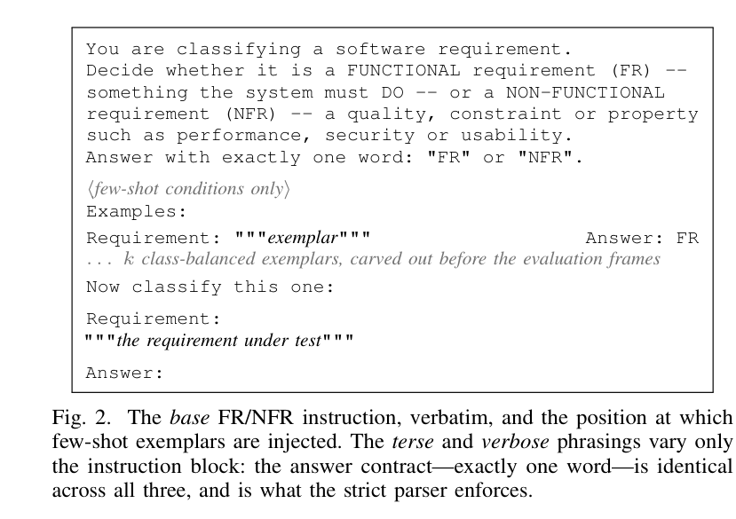

*الشكل 2 من البيبر: نص البرومبت الأساسي (base) بالحرف.*


الجزء ده هو "ماكينة القياس" بتاعة الورقة كلها: إزاي بنكلّم الـ LLM، إزاي بنحوّل رده لـ label، إزاي بنحسب رقم واحد للخلية، إزاي بنحط حوله فترة ثقة، إمتى نرفض نقول رقم أصلًا، وإزاي نقرر إن الفرق بين موديلين "حقيقي" مش صدفة. كل رقم في جداول النتائج مرّ من الماكينة دي، فلو فهمتيها هتقدري تدافعي عن أي رقم في الورقة.

---

### 1) الشكل 2: البرومبت سطر بسطر

**البرومبت (prompt)** هو النص اللي بنبعته للموديل اللغوي كرسالة مستخدم واحدة، وهو الطريقة الوحيدة اللي بنوجّه بيها الموديل لأنه مش بيتدرب. الشكل 2 في الورقة (صفحة 4، الصندوق اللي بخط الآلة الكاتبة) بيعرض البرومبت "الأساسي" (**base**) لتاسك FR/NFR **بالحرف** زي ما اتبعت للموديل. خدي بالك إن الشكل مرسوم كصندوق بإطار أسود، وجواه سطور بخط monospace (الخط اللي كل حروفه بنفس العرض، بيوحي إن ده كود/نص حرفي)، وفيه سطرين بخط مائل رمادي — دول مش جزء من البرومبت، دول تعليق للقارئ.

خلّينا نمشي على السطور:

| السطر في الشكل | بيعمل إيه |
|---|---|
| `You are classifying a software requirement.` | بيحدد الدور: "انت بتصنّف متطلّب برمجي". سطر واحد بيسمّي التاسك. |
| `Decide whether it is a FUNCTIONAL requirement (FR) -- something the system must DO -- or a NON-FUNCTIONAL requirement (NFR) -- a quality, constraint or property such as performance, security or usability.` | بيعدّد **الفئتين بالاسم** وبيدّي تعريف قصير لكل واحدة. ده اللي الورقة بتسمّيه "enumerating the label vocabulary": الموديل لازم يعرف الكلمات المسموح يرد بيها. |
| `Answer with exactly one word: "FR" or "NFR".` | ده **عقد الإجابة** (answer contract): كلمة واحدة بالظبط. السطر ده هو اللي الـ parser الصارم (هنشرحه بعد شوية) بيفرضه. |
| `⟨few-shot conditions only⟩` (رمادي مائل) | تعليق: الكتلة الجاية بتظهر **بس** في حالات الـ few-shot. |
| `Examples:` ثم `Requirement: """exemplar"""  Answer: FR` | مكان حقن الأمثلة. كل مثال = نص المتطلّب بين تلات علامات تنصيص + السطر `Answer:` وبعده الـ label الصح. |
| `… k class-balanced exemplars, carved out before the evaluation frames` (رمادي) | تعليق: بيتكرر البلوك ده k مرة، بالتساوي بين الفئات، والأمثلة اتشالت من الكوربس **قبل** ما نكوّن مجموعات التقييم. |
| `Now classify this one:` | فاصل بيقول للموديل "خلاص الأمثلة خلصت، ده السؤال". |
| `Requirement:` ثم `"""the requirement under test"""` | المتطلّب اللي بنختبره فعلًا، بين تلات علامات تنصيص عشان حدوده تبقى واضحة. |
| `Answer:` | البرومبت بينتهي هنا مفتوح، والموديل بيكمّل بعدها. |

في الكود، الأمثلة بتتحط بالظبط بين التعليمة والمتطلّب: `{instr}\n\n{shots}Requirement:\n"""{text}"""\n\nAnswer:` — يعني نفس الهيكل اللي في الشكل.

#### التلات صياغات: base / terse / verbose

الورقة عملت دراسة فرعية اسمها **prompt sensitivity** (حساسية البرومبت): نفس الموديل، نفس العناصر، بس التعليمة بتتغيّر. التلات صياغات من الكود:

- **base** (الأساسية): اللي في الشكل 2 فوق — 3 أسطر: دور + تعريف الفئتين + عقد الإجابة.
- **terse** (المقتضبة): سطر واحد بس، ولأمن المتطلّبات مثلًا: `Is this requirement security-related? Reply "security" or "non-security".` ولـ FR/NFR: `Is this requirement functional or non-functional? Reply "FR" or "NFR".`
- **verbose** (المطوّلة): فقرة أطول تبدأ بـ `Task: ...` وفيها تعريفات أكتر (مثلًا لأمن المتطلّبات بتعدّد authentication, authorisation, access control, confidentiality, integrity, availability, auditing, encryption) وبتنتهي بنفس عقد الإجابة `respond with exactly one word`.

خدي بالك من نقطة مهمة جدًا هتظهر في نتائج RQ2: الـ **terse هي الوحيدة اللي مصاغة كسؤال بنعم/لا في أول الجملة** ("Is this requirement security-related?"). الـ base والـ verbose بيقولوا "قرّري بين X و Y"، لكن terse بتقول "هل هو X؟". الورقة بتقول إن ده اللي خلّى Gemma-2-2B تجاوب security على 96.7% من عناصر SecReq و51.3% من PROMISE_exp (بينما النسبة الحقيقية 39.7% و12.7%)، فنزل الـ macro-F1 بتاعها على SecReq من 0.827 (base) لـ 0.343 (terse) ورجع 0.828 (verbose): فرق 0.485. مش هنفصّل ده هنا (ده قسم النتائج)، بس لازم تعرفي إن الفرق بين الصياغات هو "الكتلة الأولى بس"، وعقد الإجابة ثابت في التلاتة — وده اللي كابشن الشكل 2 بيأكّده.

الدراسة الفرعية دي اتعملت على موديلين بس (Qwen2.5-7B وGemma-2-2B) على التاسكات الثنائية. ليه اتنين مش الستة؟ الكود بيقول: عشان النتيجة ما تبقاش "artefact" لموديل واحد، لكن مش كل الستة لأن ده سؤال ثانوي والميزانية أولى بيها تغطية الـ few-shot. (على الـ sub-types اتعملت بموديل واحد بس، Qwen2.5-7B.)

#### الـ decoding: temperature 0، greedy، 12 توكن

- **Greedy decoding**: الموديل في كل خطوة بيختار التوكن الأعلى احتمالًا، من غير أي عشوائية. في الكود: `temperature: 0.0` و`do_sample: False`. ليه؟ عشان لو بعتنا نفس البرومبت مرتين نجيب نفس الرد بالظبط، فتبقى "العشوائية الوحيدة في الذراع ده هي اختيار العينة" (item sampling) زي ما الورقة بتقول. والكود بيعلّق إن الـ seed هنا مش محتاج لأن مفيش sampling أصلًا.
- **max_new_tokens = 12**: أقصى عدد توكنات جديدة الموديل مسموح يولّدها. **التوكن (token)** هو وحدة النص اللي الموديل بيتعامل بيها (كلمة أو جزء كلمة). ليه 12؟ تعليق الكود بيقول: `longest valid label is ~4 tokens` — أطول label صالح (زي `non-security` أو `fault_tolerance`) بيتقطّع لحوالي 4 توكنات، فـ 12 بتدّي تلات أضعاف المساحة اللي محتاجينها، وفي نفس الوقت مش بتسيب الموديل يكتب فقرة شرح طويلة (اللي بتكلّف وقت وفلوس ومش مطلوبة). ملاحظة: ده اللي بيخلّي بعض الردود بتتقطع في نص "تفكير" — وده بيدخل في الـ parser تحت.
- `max_input_chars = 2000`: أطول متطلّب في الكوربسين أقل من 2000 حرف، فمفيش قص بيحصل فعليًا.

#### الـ few-shot: k وحوض الأمثلة

**Few-shot** يعني نحط في البرومبت أمثلة محلولة قبل السؤال؛ **zero-shot** يعني من غير أمثلة.

- على التاسكات الثنائية (FR/NFR وsecurity): k ∈ {2, 4, 8} **إجمالي**. الكود بيشرح: مع فئتين، k=2 يعني مثال واحد لكل فئة، k=4 اتنين لكل فئة، k=8 أربعة لكل فئة. ليه أربع نقاط (0, 2, 4, 8)؟ عشان نعرف هل الفايدة "بتتشبّع" (تبطّل تزيد) — تلات نقاط ما كانتش هتبيّن ده.
- **حوض الأمثلة (pool)** = 4 لكل فئة في الثنائي. ليه 4؟ الكود: `>= max(k)/n_classes` يعني 8 ÷ 2 = 4، فأكبر k ينفع يتحقق. وهنا سر رقم بتشوفيه كتير: الموديلات المحلية بتقيّم على **960** عنصر من PROMISE مش 968، و**436** من SecReq مش 444 — لأن 4 أمثلة × 2 فئة = 8 عناصر اتشالت من الكوربس قبل تكوين مجموعات التقييم: 968 − 8 = 960، و444 − 8 = 436. (الإنكودرز بالعكس بتتقيّم على الـ 968/444 كاملين لأن مفيش أمثلة بتتشال منها.)
- على الـ sub-types: k ∈ {1, 2} **لكل فئة** (مش إجمالي). ليه أقل؟ الكود: k=1 لوحده بيحط 11 مثال في البرومبت على all-11، وk=2 بيحط 22، وأكبر من كده ممكن يفيض على سياق الموديلات الصغيرة. الحوض هنا 3 لكل فئة (الكود: `>= max(k)=2, with headroom`). وتقدري تتأكدي بنفسك: all-11 بيتقيّم على 491 = 524 − 33 (11 فئة × 3)، top-6 على 415 = 433 − 18 (6 × 3)، top-4 على 341 = 353 − 12 (4 × 3).
- الاختيار **deterministic** (ثابت): الكود بيلف على الفئات بالترتيب الأبجدي وياخد من كل فئة بالدور، فنفس k بيدّي نفس الأمثلة في كل مرة.
- **ليه الأمثلة بتتشال قبل تكوين مجموعات التقييم؟** عشان المثال ما يبقاش هو نفسه عنصر اختبار — وإلا الموديل يكون "شاف الإجابة" في البرومبت وده غش.
- الموديلات المستضافة (Llama-3.3-70B) والتجارية (Gemini) اتشغّلت **zero-shot بس**. السبب اللي الورقة بتقوله: حدود الطلبات (rate limits) في الطبقات المجانية للمزوّدين — (وتفسيري إن الـ few-shot كان هيضاعف عدد الطلبات على حصة يومية محدودة — الورقة بتكتفي بذكر الـ rate limits.)

---

### 2) الـ parser الصارم: 5 ردود وإزاي كل واحد بيتحسب

**الـ parser** هو الكود اللي بياخد الرد الخام للموديل (نص) ويطلّع منه label (أو يقول "مش قادر"). وهنا الورقة بتاخد موقف صارم مقصود.

القاعدة (من الكود `parse_label`):

1. نظّف الرد: لو فيه `<think>...</think>` (بعض الموديلات بتكتب تفكيرها جواها) شيله؛ لو فيه `<think>` مفتوحة من غير قفلة، فالرد اتقطع في نص التفكير وبيتحسب فاضي.
2. حوّل لحروف صغيرة ودوّر على أشكال كل label **على حدود الكلمات**. للثنائي: جانب `NFR` بيتعرّف بـ `nfr` / `non-functional` / `nonfunctional` / `non functional`، وجانب `FR` بـ `fr` / `functional` (بس مش لو قبلها `non`). لأمن المتطلّبات: `non-security` / `non security` / `nonsecurity` مقابل `security` (بس مش لو قبلها `non`).
3. **قاعدة 1 — الـ label اللي بيفتح الرد بيكسب**: لو رد الموديل بيبدأ (الموضع 0) بأحد الجانبين، ده القرار، حتى لو الشرح اللي بعده ذكر الجانب التاني.
4. **قاعدة 2 — لو مفيش label في الأول، لازم يكون فيه جانب واحد بس مذكور في أي مكان**؛ ساعتها ده القرار.
5. غير كده — الرد ذكر **الاتنين** أو **ولا واحد** — بيتحسب **unparseable** (غير قابل للتحليل) **وبيتسجّل غلط**، مش بيتحذف.

**حدود الكلمات (word boundary)** معناها إن الكود بيستخدم تعبير منتظم (regex) بيشترط إن قبل الـ label وبعده مفيش حرف أو رقم: `(?<![a-z0-9])fr(?![a-z0-9])`. ليه؟ تعليق الكود نفسه: عشان `fr` ما "تطلعش" جوه `free` أو `from`، وعشان `security` ما تتحسبش من ذيل كلمة `non-security`.

خمس ردود مثال، وإزاي كل واحد بيتحسب (كلها مبنية على قواعد الكود؛ الرد 2 و4 هما الأمثلة اللي في تعليقات الكود نفسها):

| # | الرد الخام (بعد التنظيف) | القاعدة اللي اشتغلت | النتيجة |
|---|---|---|---|
| 1 | `NFR` | label في الموضع 0 → قاعدة 1 | NFR، parsed. |
| 2 | `non-security\n\nThis is about functionality rather than security` | `non-security` في الموضع 0 → قاعدة 1، وكلمة `security` اللي في الآخر متتحسبش لأن الرد اتقرر من أوله | non-security، parsed. |
| 3 | `I think this one is FR.` | مفيش label في الأول؛ جانب واحد بس (FR) مذكور → قاعدة 2 | FR، parsed. |
| 4 | `We need to decide if the requirement is functional or non-functional` | مفيش label في الأول؛ الجانبين مذكورين (functional + non-functional) → ده تعداد مش قرار | unparseable → **غلط**. |
| 5 | `This requirement is free from ambiguity.` | `fr` جوه `free` و`from` مش بتطابق بسبب حدود الكلمات؛ ولا label مذكور | unparseable → **غلط**. |

الكود بيحكي إن النسخة القديمة من الـ parser (اللي كانت بتدوّر على أطول label الأول) "حلّت بالصدفة" 18 صف مخزّن من نوع الرد 4 — الردود دي دلوقتي بتترفض بدل ما تتحسب بحظ الـ substring.

**ليه صارم كده؟** الورقة بتقول إن ده "أقسى عن قصد" من البروتوكولات المتساهلة في الأبحاث السابقة، وإنه بيطابق الواقع: في نظام حقيقي، رد مش قابل للاستخدام مش "إعادة محاولة ببلاش" — هو فشل في التصنيف. وفيه سبب تاني من الكود (stage3b-repair R3): النسخة القديمة كانت بتحسب macro-F1 على العناصر اللي اتحلّلت بس، فالموديل اللي بيرد بكلام ملهوش معنى كان بيتحذف له العنصر من المقام — يعني الفشل كان بيتكافأ. دلوقتي الرقم الرسمي هو **strict** (unparseable = غلط).

**الـ idempotent repair pass**: نفس دالة الـ parser بتتطبّق مرتين — مرة وقت التوليد، ومرة تانية في مرحلة "إصلاح" بتعدّي على كل الردود الخام المؤرشفة وتعيد تحليلها. **Idempotent** يعني لو طبّقتيها مرة أو عشر مرات النتيجة واحدة. الهدف: "التنبؤ المخزّن والتنبؤ المتقيّم ما يقدروش يختلفوا في صمت" — الورقة بتقول إن نفس القاعدة بتتطبق وقت التوليد وفي مرحلة الإصلاح، ودالتا الـ parsing في المرحلتين 3 و3b بتنفّذوا نفس القاعدتين. وفي النتائج، الـ parser قبل 99.98% من الـ 11,518 رد بتوع دراسة الصياغة، فمعظم الأخطاء اللي هنشوفها هي ردود "صحيحة الشكل بس غلط" مش مشكلة تنسيق.

---

### 3) المقاييس من الصفر، بالأرقام الحقيقية

خلّينا نعرّف الحاجات دي على فئة واحدة (مثلًا `security`):

- **TP** (true positive): عناصر أمنية فعلًا وقال عليها أمنية.
- **FP** (false positive): مش أمنية وقال أمنية.
- **FN** (false negative): أمنية وقال مش أمنية.
- **Precision** (الدقة) = TP ÷ (TP + FP): من كل اللي قال عليهم أمني، كام واحد أمني بجد؟
- **Recall** (الاستدعاء) = TP ÷ (TP + FN): من كل الأمني الحقيقي، لقى كام؟
- **F1** = 2 × P × R ÷ (P + R): المتوسط التوافقي للاتنين؛ بيعاقب لو واحد منهم واطي.
- **Accuracy** (الدقة الكلية) = عدد الصح ÷ عدد الكل، بغض النظر عن الفئة.
- **Macro-F1** = متوسط الـ F1 لكل فئة، بالتساوي، **على كل الفئات المعلنة** (declared label set). الكلمة "معلنة" مهمة: لو التاسك فيه 11 فئة والموديل عمره ما توقّع فئة منهم، الفئة دي F1 بتاعها = 0 وبتتحسب في المتوسط برضه (الكود: `labels=labelset, zero_division=0`).
- **Weighted-F1** = نفس الفكرة بس كل فئة بتتوزن بحجمها، فالفئة الكبيرة بتسيطر.

**مثال حقيقي لفئة واحدة (من tab6):** BERT(w) على security/PROMISE in-domain: precision(security) = 0.8473، recall(security) = 0.888.
F1(security) = 2 × 0.8473 × 0.888 ÷ (0.8473 + 0.888) = 1.5048 ÷ 1.7353 ≈ 0.867.
والـ macro-F1 المنشور للخلية دي 0.9235، فلازم F1(non-security) ≈ 2 × 0.9235 − 0.867 ≈ 0.98 (ده استنتاج حسابي مني، مش رقم منشور).

**Worked example 1 — الـ majority-class baseline على security/PROMISE = 0.4655.**
الـ **majority-class baseline** هو "موديل" غبي بيقول دايمًا الفئة الأكبر. على PROMISE فيه 843 non-security من 968 (125 security). لو قلنا دايمًا non-security:
- accuracy = 843 ÷ 968 = 0.8709 (tab0 بيقول 0.8709 ✓).
- F1(non-security): precision = 0.8709 (كل اللي قلنا عليه non-sec، 87% منه فعلًا كده)، recall = 1.0 (لقينا كل الـ non-sec). F1 = 2 × 0.8709 × 1 ÷ (1.8709) = 0.931.
- F1(security) = 0 (عمرنا ما قلناها؛ TP = 0).
- macro-F1 = (0.931 + 0) ÷ 2 = **0.4655** ✓.
شوفي الفرق: الغبي ده accuracy بتاعه 0.87 (يبان محترم!) بس macro-F1 بتاعه 0.47. ده بالظبط ليه الـ accuracy مقياس مضلّل لما فئة واحدة نادرة.

**Worked example 2 — FR/NFR baseline = 0.3512.** الأغلبية NFR: 524 من 968 → accuracy 0.5413. F1(NFR) = 2 × 0.5413 ÷ 1.5413 = 0.702. F1(FR) = 0. macro = 0.702 ÷ 2 = **0.351** ✓. (وبنفس الطريقة security/SecReq: 267 ÷ 444 = 0.6014 → F1 = 0.751 → macro = **0.3755** ✓.)

**Worked example 3 — الـ sub-type baselines 0.1308 / 0.0747 / 0.035.** الأغلبية في التلاتة هي `security` (125 عنصر):
- top-4 (353 عنصر، 4 فئات): 125 ÷ 353 = 0.3541 → F1(security) = 2 × 0.3541 ÷ 1.3541 = 0.523 → macro = 0.523 ÷ 4 = **0.1308** ✓.
- top-6 (433، 6 فئات): 125 ÷ 433 = 0.2887 → F1 = 0.448 → ÷ 6 = **0.0747** ✓.
- all-11 (524، 11 فئة): 125 ÷ 524 = 0.2385 → F1 = 0.385 → ÷ 11 = **0.035** ✓.
ليه بيصغّر كل ما الفئات تزيد؟ لأن الـ baseline بيجيب F1 لفئة واحدة بس، والـ macro بيقسم على K = عدد الفئات؛ يعني الرقم ≈ (1/K) × F1 لفئة واحدة، وكمان نسبة الفئة نفسها بتقل لما نضيف فئات تانية للمقام.

**ليه macro هو المقياس الأساسي؟** الورقة بتقول "الموديل بيتعاقب على كل فئة عمره ما توقّعها"، وده جوهر التاسك: في security الفئة النادرة (12.9% في PROMISE) هي المهمة. الـ accuracy والـ weighted-F1 بيدّوا الفئة الكبيرة وزن أكبر، فبيخبّوا فشل الفئة النادرة. مثال من tab9 لنفس الخلية BERT(w) security/PROMISE in-domain: macro-F1 = 0.9235، weighted-F1 = 0.9652، accuracy = 0.9649 — التلاتة متقاربين هنا لأن الموديل كويس على الفئتين. بس على الـ baseline الغبي فوق: accuracy 0.87 مقابل macro 0.47 — الفجوة دي هي اللي macro بيكشفها. الورقة بتبلّغ الـ weighted والـ accuracy "alongside" (جنبه) من غير ما تقول ليه؛ تفسيري إنهم للاكتمال.

---

### 4) الـ stratified bootstrap CI: 2,000 إعادة عينة، seed 42

**فترة الثقة (confidence interval, CI)** هي مدى بيقول: "لو كررنا القياس على عينات مشابهة، الرقم غالبًا هيقع هنا". والـ **bootstrap** طريقة لحسابها من غير معادلات: بنسحب من عينتنا نفسها عينات جديدة بنفس الحجم **مع الإرجاع** (العنصر ممكن يتكرر أو يختفي)، ونحسب macro-F1 لكل عينة، ونشوف توزيع الأرقام.

تفاصيل الورقة والكود (`strat_boot_ci`):
- **2,000** إعادة عينة (`N_BOOT = 2000`). الكود/الورقة ما بيقولوش ليه 2,000 بالذات؛ المنطق المعتاد (تفسيري) إنه عدد كبير كفاية عشان الـ percentiles تستقر، ومش ضخم لدرجة إنه ياخد وقت على 87 خلية.
- **Stratified** (طبقي): السحب بيتعمل **جوه كل فئة حقيقية على حدة** — لو الفئة فيها 7 عناصر، بنسحب 7 مع الإرجاع من الـ 7 دول. ليه؟ تعليق الكود: الـ bootstrap العادي (i.i.d.) ممكن "يفقد فئة نادرة بالكامل، يدّيها 0، ولسه يقسم على K" — وده كان بيحصل فعلًا: على خلية Gemini all-11 (60 عنصر) كان بيختفي في المتوسط 1.37 فئة في كل إعادة عينة (لحد 5)، فالحد الأدنى للفترة كان بينزل لرقم مصطنع. الطبقي بيثبّت توزيع الفئات، وهو "الكمية اللي macro-F1 معرّف عليها".
- **seed 42**: بذرة مولّد الأرقام العشوائية، عشان نفس الفترات تطلع لو حد أعاد التشغيل. (42 اختيار تقليدي في الكود العلمي، مفيش سبب إحصائي وراه.)
- الفترة 95% = الـ percentile 2.5 و97.5 من الـ 2,000 قيمة (الكود: `np.percentile(s, [2.5, 97.5])`). يعني بنشيل أقل 2.5% وأعلى 2.5% من الأرقام والباقي هو الفترة.

**مثالين من tab9:**
- BERT(w)، security، PROMISE، in-domain: macro-F1 = 0.9235، CI = [0.8977, 0.9463]، عرض = 0.0486. الخلية فيها n = 968 و125 security.
- Gemini، security، PROMISE: macro-F1 = 0.8287، CI = [0.6981, 0.9619]، عرض = 0.2638 — أكتر من 5 أضعاف عرض BERT.

**ليه فترة Gemini واسعة كده؟** لأن n = 60 بس (Gemini اتقيّمت على عينة صغيرة بسبب حصة الـ API)، والأهم إن فيها **7 عناصر security بس** (عمود `min_class_support` في tab9). لما بنعمل bootstrap جوه فئة من 7 عناصر، تغيير عنصر واحد بيقلب F1 بتاع الفئة دي بشكل كبير، والـ macro بياخد نص وزنه من الفئة دي. مع 125 عنصر، عنصر واحد بيفرق أقل بكتير. الرسالة: رقم 0.8287 مش "غلط" بس **مش دقيق** — الحقيقة ممكن تكون في أي حتة من 0.70 لـ 0.96.

---

### 5) بوابة الـ reportability: 87 خلية، 6 مستبعدة، 81 مقبولة

**الخلية (cell)** = موديل × تاسك × كوربس × regime. مثلًا (BERT(w)، security، SecReq، cross_dataset) خلية؛ (Gemini، subtype_top6، PROMISE، prompted) خلية تانية. tab9 فيه 87 صف = 87 خلية: خلايا الـ 12 تكوين + 3 خلايا للموديل التاسع (Nemotron) اللي اتجرّب.

**البوابة** (من الكود `cell()` والثوابت) — الخلية بتتبلّغ بس لو التلاتة اتحققوا:

| القاعدة | الثابت | ليه (من تعليق الكود) |
|---|---|---|
| كل فئة معلنة فيها ≥ 5 عنصر اختبار | `MIN_CLASS_SUPPORT = 5` | "فئة أقل من كده ما تقدرش تشيل 1/K من متوسط macro" — F1 محسوب على عنصرين مش قياس. |
| الخلية فيها ≥ 40 عنصر | `MIN_N = 40` | "تحت كده مفيش macro-F1 بيتبلّغ خالص". |
| الموديل حلّل ≥ 50% من ردوده | `MIN_PARSE_RATE = 0.50` | "تحت كده الخلية ما اتقاستش، هي فشلت وبس". |

الورقة/الكود ما بيقولوش ليه 5 و40 و50% بالذات وليس 4 أو 30؛ التعليقات بتدّي المنطق (فئة من عنصرين مش قياس؛ نص الردود غير مفهومة = الموديل ما فهمش التاسك) وده اجتهاد تصميمي مش مشتق من معادلة.

**الست خلايا المستبعدة، بالسبب الحرفي من tab9:**

| # | الخلية | n | السبب في tab9 | الفئات الضعيفة |
|---|---|---|---|---|
| 1 | Gemini، subtype_all (all-11) | 60 | class support<5 | availability=1، maintainability=1، scalability=1، look_and_feel=2، portability=2، fault_tolerance=4، legal=4 |
| 2 | Gemini، subtype_top6 | 60 | class support<5 | availability=2 |
| 3 | Llama-3.3-70B، subtype_all | 163 | class support<5 | maintainability=4 |
| 4 | Nemotron، fr_nfr | 21 | n<40; parse<0.5 | — (نسبة التحليل 0.0: ولا رد واحد اتفهم) |
| 5 | Nemotron، security/PROMISE | 21 | class support<5; n<40 | security=2 |
| 6 | Nemotron، security/SecReq | 21 | n<40 | — |

لاحظي إن خلية Gemini all-11 بترقم macro-F1 = 0.7889 وهو رقم "حلو" — بس 7 من الـ 11 فئة فيها أقل من 5 عناصر، فسبع أعشار الرقم ده مبني على عنصر أو اتنين. وخلية Llama-70B all-11 بـ 0.7524 على 163 عنصر سقطت بسبب فئة واحدة (maintainability = 4 — واحد أقل من الحد). Nemotron جاب 21 عنصر بس في كل خلية (3 × 21 = 63 تنبؤ، وده رقم الـ deck) بسبب حصة المزوّد، وفي FR/NFR ما اتفهمش منه ولا رد.

**ليه استبعاد مش تعويض (impute)؟** الورقة بتقول "excluded rather than imputed". التعويض يعني نخمّن رقم للخلية الناقصة أو نحسبها من العناصر اللي وصلت؛ لكن الفقد هنا مش عشوائي (الـ deck بيسميه "missing-not-at-random": حصص المزوّد هي اللي قطعت) فأي تخمين هيبقى منحاز. الاستبعاد بيخلّي الجداول أصغر بس صادقة، والخلية المستبعدة بتتلوّن رمادي في الأشكال بدل ما تترتّب. وده ليه فيه "—" لخلايا Gemini top-6/all-11 وLlama-70B all-11 في الجدول IV (أما الشرطات في صفوف BERT_u/RoBERTa_u فسببها إن الكنترول ده ما اتدرّبش هناك أصلًا: اتعمل بس على أمان PROMISE in-domain وعلى cross-dataset).

---

### 6) اختبار McNemar من الصفر

السؤال: الفرق بين موديلين على نفس العناصر — هو فرق حقيقي ولا ممكن يطلع بالصدفة؟

**Paired** (مزدوج): الموديلين اتقيّموا على **نفس العناصر بالظبط**، متطابقين بمعرّف المتطلّب (id) مش بالترتيب. الكود بياخد تقاطع الـ ids بين الإنكودر والـ LLM، ولو أقل من 40 ما بيعملش اختبار.

لكل عنصر بنسأل: الإنكودر صح؟ الـ LLM صح؟ فبنطلع بجدول 2×2:

| | LLM صح | LLM غلط |
|---|---|---|
| **Encoder صح** | a (الاتنين صح) | **b** (الإنكودر بس صح) |
| **Encoder غلط** | **c** (الـ LLM بس صح) | d (الاتنين غلط) |

McNemar بيبص **بس** على الخليتين المتعارضتين b وc (discordant). ليه؟ لأن a وd مش بتفرّق بين الموديلين — لو الاتنين صح أو الاتنين غلط، مفيش دليل إن حد أحسن. لو الموديلين متساويين فعلًا، فكل عنصر اختلفوا فيه ليه فرصة 50% يروح لـ b أو لـ c، زي عملة معدنية. فالاختبار الدقيق (**exact**) هو: احسب احتمال إن عملة عادلة مرمية (b + c) مرة تدّي نتيجة متطرفة زي اللي شفناها أو أكتر. في الكود: `binomtest(min(b, c), b + c, 0.5)` — اختبار ذو الحدين ثنائي الاتجاه. "Exact" يعني الاحتمال محسوب بالظبط من توزيع ذي الحدين مش بتقريب كاي-تربيع، وده أنسب لأعداد صغيرة.

**الـ p-value**: احتمال نشوف اختلاف بالحجم ده (أو أكبر) لو الموديلين متساويين فعلًا. **α = 0.05**: العتبة؛ لو p < 0.05 بنقول "significant" (دال إحصائيًا) — يعني بنقبل مخاطرة 5% إننا نقول فيه فرق وهو مش موجود.

**مثال 1 (tab4) — الحالة "0.846 مقابل 0.836 عمرها ما وصلت للدلالة":** BERT(w) in-domain مقابل Qwen2.5-7B على security/SecReq. n = 436 عنصر مشترك. accuracy: الإنكودر 0.8372، الـ LLM 0.8486. b = 50 (الإنكودر بس صح)، c = 55 (الـ LLM بس صح).
- عدد صح الإنكودر = 0.8372 × 436 ≈ 365؛ صح الـ LLM ≈ 370. فـ a = 365 − 50 = 315، d = 436 − 315 − 50 − 55 = 16 (وفعلًا 315 + 55 = 370 ✓).
- الاختلافات = 105 عنصر، اتقسمت 50 مقابل 55. لو عملة عادلة اترمت 105 مرة، فرصة تطلع انقسام بالبعد ده أو أكتر = **p = 0.696** — يعني حوالي 70% تطلع كده بالصدفة. بعد تصحيح BH (تحت) p = 0.774. الحكم: **n.s.** (not significant). الفرق 0.846 مقابل 0.836 في الـ macro-F1 (أو 5 عناصر من 436 في الـ accuracy) ماينفعش نبني عليه جملة "Qwen بيتفوّق".
- ملحوظة: McNemar بيشتغل على صح/غلط لكل عنصر (accuracy)، مش على الـ F1 مباشرة؛ الـ 0.846/0.836 هما macro-F1 للخليتين والاختبار هو اللي بيقول هل الفرق بينهم مبني على اختلافات كفاية.

**مثال 2 (tab4) — حالة حاسمة:** BERT(w) in-domain مقابل Qwen2.5-3B على FR/NFR/PROMISE. n = 960، accuracy 0.9083 مقابل 0.5969. b = 344، c = 45. من 389 اختلاف، 344 راحت للإنكودر. احتمال عملة عادلة تعمل كده ≈ 4 × 10⁻⁵⁸ — الكود بيسجّلها **p = 0.0**. الحكم: **Encoder wins**، وبيفضل كده بعد Holm وBH. (للاكتمال: a = 872 − 344 = 528، d = 43.)

---

### 7) ليه 260 اختبار بالظبط؟

**الأسرة (family)** = كل اختبارات Encoder–LLM اللي الورقة بتصحّحها مع بعض: 260. جاية من tab4 وبتتقسم بالـ regime: **106 in-domain + 90 cross-project + 64 cross-dataset = 260**.

في كل خلية (تاسك × كوربس × regime)، عدد الاختبارات = (عدد نسخ الإنكودر المتاحة) × (عدد الـ LLMs اللي عدّت البوابة):

| تاسك / كوربس | regime | إنكودرز × LLMs | اختبارات |
|---|---|---|---|
| security / PROMISE | in-domain | 4 × 8 | 32 |
| security / PROMISE | cross-dataset | 4 × 8 | 32 |
| security / SecReq | cross-dataset | 4 × 8 | 32 |
| FR/NFR / PROMISE | in-domain | 2 × 8 | 16 |
| FR/NFR / PROMISE | cross-project | 2 × 8 | 16 |
| security / PROMISE | cross-project | 2 × 8 | 16 |
| security / SecReq | in-domain | 2 × 8 | 16 |
| security / SecReq | cross-project | 2 × 8 | 16 |
| top-4 | in-domain | 2 × 8 | 16 |
| top-4 | cross-project | 2 × 8 | 16 |
| top-6 | in-domain | 2 × 7 | 14 |
| top-6 | cross-project | 2 × 7 | 14 |
| all-11 | in-domain | 2 × 6 | 12 |
| all-11 | cross-project | 2 × 6 | 12 |

الجمع: 3 × 32 + 7 × 16 + 2 × 14 + 2 × 12 = 96 + 112 + 28 + 24 = **260** ✓. وبالـ regime: in-domain = 32 + 16 + 16 + 16 + 14 + 12 = 106 ✓؛ cross-project = 16 × 4 + 14 + 12 = 90 ✓؛ cross-dataset = 32 + 32 = 64 ✓.

ليه الأرقام دي:
- **4 نسخ إنكودر** (BERT w/u، RoBERTa w/u) موجودة بس في خلايا الأمن اللي اتعمل فيها الكنترول غير الموزون (unweighted): security/PROMISE in-domain، وcross-dataset في الاتجاهين (tab9 فيه صفوف BERT/RoBERTa unweighted بس هناك). في الباقي فيه النسختين الموزونتين بس → 2.
- **8 LLMs** = 6 محلية + Llama-3.3-70B + Gemini. على **top-6** خلية Gemini سقطت من البوابة (availability = 2) → 7. على **all-11** سقطت Gemini وLlama-70B → 6. (Nemotron مش في أي حتة لأن الـ 3 خلايا بتاعته سقطت.)
- كل تاسك عنده regime-ين: in-domain وcross-project. تاسك الأمن بس عنده **cross-dataset** كمان، لأنه التاسك الوحيد اللي موجود بنفس الـ labels في الكوربسين (PROMISE_exp وSecReq)، فهو الوحيد اللي ينفع ندرّب على كوربس ونختبر على التاني.

**ليه LOPO مش في الأسرة؟** LOPO (leave-one-project-out) هو تقسيم تاني لنفس تجربة cross-project على نفس الـ 968 متطلّب (موجود عشان جدول per-project). تعليق الكود: تنبؤاته بتتفق مع تقسيم grouped-CV على **~94%** من العناصر، فلو دخل الاتنين كانت الأسرة هتبقى 276 اختبار وفيها 16 اختبار "شبه مكرر" (2 إنكودر موزون × 8 LLMs على FR/NFR): 276 − 16 = 260. المشكلة مش بس التكرار: حجم الأسرة هو اللي BH وHolm بيقسموا عليه، فتضخيمه بنسخ مكررة بيغيّر التصحيح ويختبر نفس الفرضية مرتين. القاعدة: "تقسيم واحد لكل إنكودر".

---

### 8) المقارنات المتعددة: Holm مقابل Benjamini–Hochberg

لو عملتي 260 اختبار كل واحد عند α = 0.05، حتى لو **مفيش أي فرق حقيقي** في أي منهم، هتتوقعي 260 × 0.05 = **13** اختبار يطلعوا "دالّين" بالصدفة. ده "مشكلة المقارنات المتعددة"، والحل إننا نشدّد العتبة.

- **Holm** (family-wise error rate): بيضمن إن احتمال حصول **ولو خطأ واحد** إيجابي كاذب في الأسرة كلها ≤ 5%. صارم. الطريقة: رتّبي الـ p تصاعديًا، اضربي أصغر واحدة في n، اللي بعدها في (n−1)، ... ثم خدي الحد الأقصى التراكمي (عشان الترتيب ما يتقلبش).
- **Benjamini–Hochberg (BH)** (false discovery rate): بيضمن إن **نسبة** الإيجابيات الكاذبة وسط اللي قلنا عليهم دالّين ≤ 5%. أقل صرامة. الطريقة: رتّبي، اضربي الـ i-th في n/i، ثم خدي الحد الأدنى التراكمي من فوق.

**مثال توضيحي بسيط مش من الورقة** (3 اختبارات بـ p = 0.01، 0.03، 0.04؛ n = 3):

| الترتيب i | p الخام | Holm: p × (n − i + 1) ثم max تراكمي | BH: p × n / i ثم min تراكمي من فوق |
|---|---|---|---|
| 1 | 0.01 | 0.01 × 3 = 0.03 → 0.03 | 0.01 × 3/1 = 0.03 → 0.03 |
| 2 | 0.03 | 0.03 × 2 = 0.06 → 0.06 | 0.03 × 3/2 = 0.045 → 0.04 |
| 3 | 0.04 | 0.04 × 1 = 0.04 → max(0.06, 0.04) = 0.06 | 0.04 × 3/3 = 0.04 → 0.04 |

خام: التلاتة دالّين. Holm: واحد بس (0.03). BH: التلاتة (0.03، 0.04، 0.04 كلهم < 0.05). ده بالظبط الفرق في الورقة: **175 دالّ خام → 170 بعد BH → 131 بعد Holm**. الأرقام دي من أعمدة `sig_raw`/`sig_bh`/`sig_holm` في tab4 (اتحقّقت منها بعدّ الصفوف). الـ 5 اللي BH شالهم هما اختبارات كانت p بتاعتها قريبة من 0.05؛ Holm شال 44 من الـ 175 الخام (يعني 39 زيادة عن اللي BH شالهم) — دول اللي التصحيح الصارم ما رحمهمش.

**الأحكام مبنية على BH**: عمود `verdict` في tab4 بيتحدد من `p_bh` — لو < 0.05، الفايز هو اللي عنده c > b (LLM) أو b > c (Encoder)؛ غير كده n.s. بالأحكام دي: in-domain 67 Encoder / 39 n.s. / 0 LLM؛ cross-project 38 / 38 / 14؛ cross-dataset 3 / 13 / 48. الورقة بتبلّغ Holm كمان عشان القارئ المحافظ يعرف إن حتى تحت أصرم تصحيح لسه 131 اختبار دالّ. الورقة ما بتقولش ليه BH هو الأساسي بالذات؛ المنطق المعتاد (تفسيري) إن في أسرة كبيرة من 260 اختبار استكشافي، التحكم في نسبة الاكتشافات الكاذبة هو المعيار الأنسب، وHolm بيتعرض كتحقق.

مثال حقيقي على تأثير التصحيح من tab4: BERT(w) in-domain مقابل Gemini على security/PROMISE: n = 60، b = 5، c = 0، p خام = 0.0625 (مش دالّ أصلًا)، بعد BH = 0.0903، بعد Holm = 1.0. شوفي إزاي Holm رفع الرقم لـ 1.0 لأنه ضرب في عدد كبير.

---

### 9) الحرّاس (sentinels) وفحص "زي بزي" (like-for-like)

**الحارسان (dummy sentinels):** الورقة بتشغّل "موديلين غبيين" على نفس السكورر بالظبط:
1. **Majority-class**: دايمًا الفئة الأكبر — أرقامه في tab0 (0.3512 / 0.4655 / 0.3755 / 0.1308 / 0.0747 / 0.035) اللي حسبناها فوق.
2. **Stratified-random**: بيرمي label عشوائي بنفس نسب الفئات الحقيقية.

الغرض (من الـ deck): "أي موديل تحت الحارس بيتعلّم عليه، مش بيتعذر له". يعني لو موديل بـ 3 مليار باراميتر جاب أقل من "قول دايمًا NFR"، ده لازم يظهر مش يتخبّى. والورقة بتقول إن كل موديل مقبول عدّى الـ majority-class baseline. (الأرقام الفعلية للـ stratified-random مش في tab0، فمش هكتب لها رقم.)

**فحص like-for-like (tab10):** مشكلة: أحجام الخلايا مختلفة جدًا — من **59** عنصر (Gemini على top-4) لـ **968** (الإنكودرز على PROMISE)، لأن كل موديل جاوب على عدد مختلف بسبب حصص الـ API. فلو رتّبنا الموديلات بالـ macro-F1 مباشرة، ممكن يطلع الترتيب "أثر للتغطية" (موديل اتقيّم على عينة أسهل). الحل: نعيد حساب macro-F1 لكل الموديلات على **تقاطع العناصر اللي كل الموديلات جاوبتها**. الكود بيقصر الأول على صفوف الـ core المخزّنة (علامة `in_core`) وبعدين بياخد التقاطع الفعلي للـ ids.

من tab10 على top-4: 59 عنصر مشترك (min support في التقاطع = 10 لكل فئة، فوق حد البوابة): RoBERTa(w) = 0.966، Llama-3.3-70B = 0.9298 → الفرق +0.036 لصالح الإنكودر، وهو الرقم اللي في الورقة ("0.966 against 0.930"). الخلاصة: الترتيب مش بسبب اختلاف التغطية. الجدول بيعمل نفس الحاجة على باقي التاسكات (60 عنصر مشترك للثنائيات، 218 لـ all-11، 141 لـ top-6) وبيسمّي الموديلات اللي اتشالت من التقاطع: Nemotron في التلات كتل الثنائية (ومعاه BERT/RoBERTa unweighted على SecReq لأنهم ما اتدرّبوش in-domain هناك)؛ Gemini من top-6؛ وGemini وLlama-70B من all-11 لأن خلاياهم سقطت من البوابة (كتلة top-4 ما اتشال منها حد).

الكود بيحكي كمان إن نسخة قديمة من الجدول ده كانت شالت الإنكودرز من التقاطع بالغلط، فطلع الـ LLM "فايز" في التلات كتل — وإن RoBERTa بـ 0.9660 مقابل 0.9298 هو اللي قلب الوضع لما اتصلّح. ده مثال حي على ليه الفحص ده لازم يتعمل بشكل صريح مش بالافتراض.

---

### خلاصة تاخديها في إيدك

- البرومبت 3 أسطر + مكان أمثلة + السؤال؛ التلات صياغات بتغيّر أول كتلة بس؛ terse هي الوحيدة سؤال نعم/لا وده سبب الـ 0.485.
- Greedy، temperature 0، 12 توكن (≈ 3 × أطول label)؛ أمثلة few-shot بتتشال قبل التقييم فالمحلي بيتقيّم على 960/960/436.
- Parser: label في الأول يكسب، وإلا label واحد بس، وإلا غلط. حدود الكلمات عشان `fr` و`non-security`.
- macro-F1 على كل الفئات المعلنة؛ الـ baseline الغبي 0.4655 على أمن PROMISE بينما accuracy بتاعه 0.87.
- CI من 2,000 bootstrap طبقي؛ n = 60 و7 عناصر أمنية = فترة عرضها 0.26.
- البوابة: ≥5 لكل فئة، ≥40 عنصر، ≥50% parse؛ 6/87 ساقطة، بالاسم والسبب.
- McNemar على b وc بس؛ 50/55 → p = 0.696 (n.s.)؛ 344/45 → p ≈ 0 (Encoder wins).
- 260 = 106 + 90 + 64 = 3×32 + 7×16 + 2×14 + 2×12؛ LOPO برّه عشان ~94% تطابق.
- 260 × 0.05 = 13 إيجابي كاذب متوقع → BH (170) وHolm (131) من 175 خام؛ الأحكام على BH.
- الحرّاس عشان الفشل يبان، وlike-for-like على 59 عنصر عشان الترتيب ما يبقاش أثر تغطية.


## RQ1: جدول 4 (in-domain) صف صف وعمود عمود، ورسومات الـ deck بتاعة RQ1 والـ sub-types

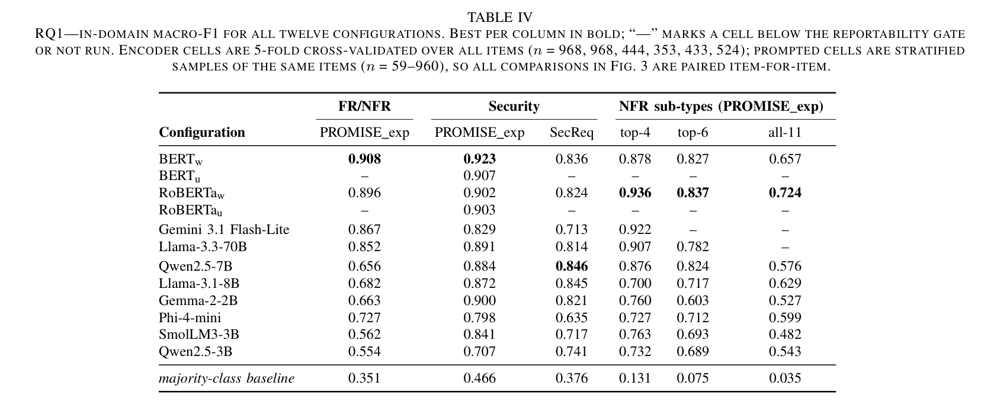

*جدول 4 من البيبر: macro-F1 جوّه الدومين (in-domain) للـ 12 تكوين.*

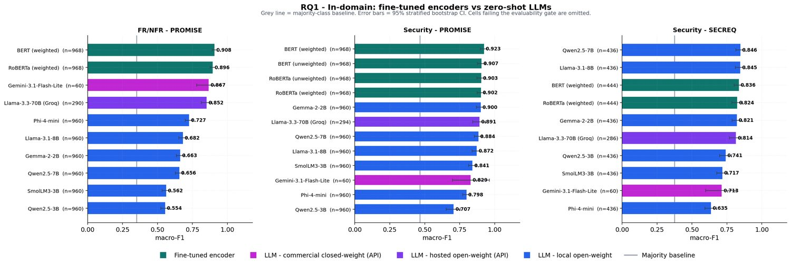

*من عرض الرسالة: RQ1 – الإنكودرز المدرّبة مقابل الـ LLMs بالـ zero-shot، 3 خلايا ثنائية.*

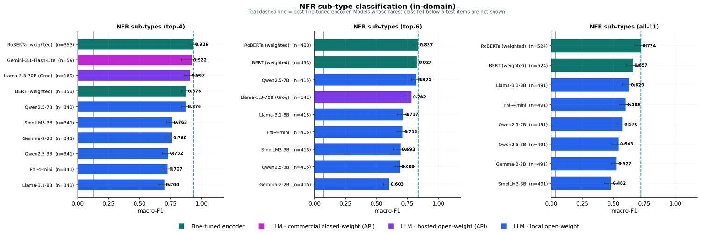

*من عرض الرسالة: تصنيف الأنواع الفرعية للـ NFR (top-4 / top-6 / all-11).*


خدي نفس. الجزء ده هو أول نتيجة في الورقة (Section IV-A)، وهو اللي بيجاوب على RQ1: لو قيسنا بالطريقة اللي المجال متعوّد عليها، يعني **in-domain** (الموديل بيتدرّب وبيتقاس جوّه نفس الكوربس)، مين بيكسب: الـ encoders المدرّبة (BERT / RoBERTa) ولا الـ LLMs اللي بنسألها بـ prompt؟ الجواب الخام معروف من ملاحظاتك القديمة: "الـ encoders أحسن في 5 من 6". اللي ناقصك هو تفهمي **الجدول نفسه** خلية خلية، و**كل شرطة** فيه معناها إيه، و**كل رقم** جاي منين. يلا.

### أولاً: هيكل جدول 4 — 6 أعمدة × 13 صف

**الأعمدة الستة** هي 6 "خلايا" task × dataset. كل عمود فيه رقم واحد بس هو الـ **macro-F1** (هشرحه بعد شوية):

| العمود | التاسك | الكوربس | n بتاع الـ encoders | ليه الرقم ده |
|---|---|---|---|---|
| FR/NFR | وظيفي ولا غير وظيفي | PROMISE | 968 | كل PROMISE بعد إزالة التكرارات: 969 خام − 1 مكرّر = 968 (444 FR + 524 NFR) |
| Security (PROMISE) | أمني ولا لأ | PROMISE | 968 | نفس الـ 968 بس اللابل اتقلب: 125 security / 843 غير أمني |
| Security (SecReq) | أمني ولا لأ | SecReq | 444 | SecReq بعد التنضيف: 510 خام → 444 (177 security / 267 غير أمني) |
| NFR sub-types top-4 | 4 أنواع NFR | PROMISE | 353 | security 125 + usability 85 + operational 77 + performance 66 = 353 |
| NFR sub-types top-6 | 6 أنواع | PROMISE | 433 | الـ 353 + look & feel 49 + availability 31 = 433 |
| NFR sub-types all-11 | كل الـ 11 نوع | PROMISE | 524 | كل الـ NFR في PROMISE = 524 (الـ 433 + maintainability 24 + scalability 22 + fault tolerance 18 + legal 15 + portability 12 = 524) |

خدي بالك من حاجة: الـ n دي (968, 968, 444, 353, 433, 524) هي n بتاعة **الـ encoders بس**. ليه؟ لأن الـ encoder بيتقاس بـ **5-fold cross-validation**: بنقسم الكوربس 5 أجزاء، كل مرة ندرّب على 4 ونختبر على الخامس، فكل requirement بيبقى test item مرة واحدة بالظبط، وبكده الـ encoder عنده prediction لكل الكوربس. أما الـ prompted models فمش كده، ودي نقطة مهمة جداً بتفسّر أرقام كتير في الرسومات:

- الموديلات **المحلية** الستة (Gemma, SmolLM3, Qwen ×2, Phi, Llama-8B) جاوبت على "الـ frame الكامل" = الكوربس ناقص الأمثلة اللي اتشالت للـ few-shot. عشان كده هتلاقي n=960 مش 968 على PROMISE (968 − 8 = 960؛ الـ 8 دول 4 أمثلة لكل class × 2 class)، و n=436 مش 444 على SecReq (444 − 8). وفي الـ sub-types: 341 بدل 353، و415 بدل 433، و491 بدل 524. الورقة ما بتقولش صراحة كام مثال لكل class في الـ sub-types، بس الحسبة ثابتة: 353−341 = 12 = 4 classes × 3، و433−415 = 18 = 6 × 3، و524−491 = 33 = 11 × 3 — يعني 3 أمثلة لكل class اتشالت — ودي مش مجرد استنتاج من الفرق، دي حاجة الكود بيأكدها: الـ harness بتاع الـ sub-types (stage3b-subtype-harness) بيحدّد fewshot_pool_per_class = 3، مقابل 4 لكل class في الـ harness الثنائي (stage3-llm-harnes)؛ عشان كده 353−12=341، 433−18=415، 524−33=491.
- الموديل **المستضاف** Llama-3.3-70B كان المفروض ياخد عيّنة 300 لكل خلية binary، لكن فعلياً n = 290 / 294 / 286 (FR/NFR / Security-PROMISE / Security-SecReq)، و169 على top-4 و141 على top-6. ليه أقل من 300؟ الورقة في الـ Threats بتقول إن حدود الـ free tier سبّبت "dropout" في بعض الخلايا المستضافة، مش أكتر من كده.
- الموديل **التجاري** Gemini جري على n ≈ 60 بس لكل خلية (60 على الخلايا الـ binary، و59 على top-4). ده أصغر n في الجدول كله، وهو سبب إن "n = 59–960" مكتوبة في caption الجدول: الـ 59 هي خلية Gemini top-4 والـ 960 هي الموديلات المحلية على PROMISE.

**الصفوف الـ 13**: 12 configuration + صف الـ baseline في الآخر.

1. BERT_w (weighted)
2. BERT_u (unweighted)
3. RoBERTa_w
4. RoBERTa_u
5. Gemini 3.1 Flash-Lite (تجاري، API)
6. Llama-3.3-70B (مفتوح لكن مستضاف على Groq، API)
7–12. الستة المحليين: Qwen2.5-7B, Llama-3.1-8B, Gemma-2-2B, Phi-4-mini, SmolLM3-3B, Qwen2.5-3B
13. *majority-class baseline*

**weighted / unweighted يعني إيه؟** الـ encoder بيتدرّب بـ loss فيه "class weighting": كل class بياخد وزن عكس تكراره (inverse-frequency)، فالـ class النادر (زي security اللي 12.9% بس من PROMISE) بيتعاقب الموديل أكتر لو غلط فيه. الـ unweighted هو نفس الموديل من غير الأوزان دي — **control** عشان نعرف الأوزان بتفرق ولا لأ.

### ثانياً: الشُّرَط (—) في الجدول — 13 شرطة، نوعين مختلفين تماماً

الـ caption بتقول: الشرطة معناها "خلية تحت الـ reportability gate **أو** ما اتعملتش". دول حالتين مختلفتين ولازم تفرّقي بينهم:

**النوع الأول: ما اتعملتش (not run) — 10 شُرَط.** صفّي BERT_u و RoBERTa_u فيهم رقم واحد بس (0.907 و 0.903 في عمود Security PROMISE) و5 شُرَط في باقي الأعمدة. السبب: الـ unweighted control اتعمل **على تاسك الأمان بس**، وفي in-domain على PROMISE بس (نسخة الـ Word من الورقة بتقول بالنص إن الـ unweighted اتعمل على "security task's in-domain PROMISE_exp and cross-dataset families"). ليه هناك بالذات؟ الورقة ما بتقولش ليه بالظبط، بس المنطق المعتاد هو إن الأمان في PROMISE هو أكتر مكان الـ class weighting المفروض يفرق فيه (12.9% بس security)، فده المكان الطبيعي لتجربة control (ده تفسيري). النتيجة: الفرق طلع صغير جداً — BERT_w 0.923 مقابل BERT_u 0.907 (فرق 0.016)، وRoBERTa_w 0.902 مقابل RoBERTa_u 0.903 (الـ unweighted أعلى بـ 0.001!). يعني in-domain الأوزان مش بتعمل فرق كبير. الشُّرَط دي مش "فشل"، دي "ما اتقاستش".

**النوع الثاني: سقطت في الـ gate — 3 شُرَط.** الـ reportability gate هي 3 شروط لازم أي خلية تعدّيها عشان تتكتب في الجدول: (1) كل class فيه ≥ 5 عناصر اختبار، (2) الخلية فيها ≥ 40 عنصر، (3) الموديل قدر يتـparse ≥ 50% من إجاباته. اللي سقط:

| الخلية | n | السبب (من tab9_evaluability) | الرقم اللي كان هيتكتب لو مافيش gate |
|---|---|---|---|
| Gemini × top-6 | 60 | class support < 5: availability = 2 عنصر بس | 0.789 |
| Gemini × all-11 | 60 | 7 classes تحت 5: availability=1, maintainability=1, scalability=1, look_and_feel=2, portability=2, fault_tolerance=4, legal=4 | 0.789 |
| Llama-3.3-70B × all-11 | 163 | maintainability = 4 | 0.752 |

ليه سقطوا؟ افتكري قاعدة العيّنة في Section III-B: 200 عنصر لكل خلية sub-type، بتتوزّع **بنسبة الـ class prior** (proportional) **مع حد أدنى 10 لكل class** (floor of ten). availability هي 31 من 433 = 7.2% من top-6، فلو القاعدة اتطبّقت كاملة كان المفروض ياخد على الأقل 10 عناصر. لكن خلية Gemini فيها 60 عنصر بس مش 200 — الـ deck (slide الـ Threats) بيقول إن حدود الـ free tier "capped the commercial sub-type sample"، يعني الكوتة قطعت العيّنة قبل ما تكمل، فالحد الأدنى ما اتحققش، والـ artefact بيسجّل إن اللي وصل فعلاً لـ availability هو 2. نص الورقة نفسه في الـ Threats بيذكر بس إن حدود الـ free tier سبّبت dropout في خلايا مستضافة (hosted configurations)؛ جملة إن الكوتة قطعت عيّنة الـ sub-types التجارية دي من الـ deck مش من الورقة. بس المهم: عنصرين ما ينفعش تحسبي عليهم F1 لـ class، فالخلية كلها ما تتكتبش. الورقة اختارت **الاستبعاد بدل التخمين** ("excluded rather than imputed"). خدي بالك: الأرقام اللي في العمود الأخير في الجدول اللي فوق (0.789، 0.752) موجودة في الـ artefact بس **مش في الورقة**، وأنا حاطّاها لك عشان تفهمي إن الـ gate ما بتشيلش الموديلات الوحشة، بتشيل الخلايا اللي رقمها مش موثوق.

### ثالثاً: macro-F1 وصف الـ baseline — الحسبة بالكامل

**macro-F1** = متوسط الـ F1 لكل class على حدة، بالتساوي. والـ F1 لكل class = التوافقي بين precision (من اللي قلت عليهم "أمني"، كام واحد أمني فعلاً) وrecall (من الأمنيين الحقيقيين، كام واحد لقيته). المهم في الـ macro إنه بيتحسب **على كل الـ label set المعلن**، فالموديل اللي عمره ما بيقول class معيّن بياخد F1 = 0 على الـ class ده، وده بيسحب المتوسط لتحت.

صف الـ **majority-class baseline** هو موديل غبي بيقول أكتر class طول الوقت. أرقامه (0.351 / 0.466 / 0.376 / 0.131 / 0.075 / 0.035) كلها بتتحسب بنفس الوصفة. خدي مثال FR/NFR:

- الأغلبية هي NFR: 524/968 = 0.5413 (دي الـ accuracy بتاعه).
- على class NFR: recall = 1 (لقاهم كلهم لأنه بيقول NFR دايماً)، precision = 0.5413. F1 = 2 × 0.5413 / (1 + 0.5413) = 0.7024.
- على class FR: عمره ما قالها → F1 = 0.
- macro-F1 = (0.7024 + 0) / 2 = **0.351**. ✓

نفس الحسبة للباقي: Security PROMISE الأغلبية "غير أمني" 843/968 = 0.8709 → F1 = 2×0.8709/1.8709 = 0.931 → /2 = **0.466**. SecReq: 267/444 = 0.6014 → F1 = 0.7511 → /2 = **0.376**. وفي الـ sub-types الأغلبية هي security (125 عنصر): top-4: 125/353 = 0.3541 → F1 = 0.5231 → **/4** = 0.131. top-6: 125/433 = 0.2887 → F1 = 0.448 → **/6** = 0.075. all-11: 125/524 = 0.2385 → F1 = 0.3852 → **/11** = 0.035.

شايفة ليه الـ baseline بيقل كل ما الـ classes تزيد؟ لأنك بتقسمي F1 واحد على عدد classes أكبر. وده اللي بيخلي جملة الورقة "every reportable model clears the majority-class baseline" (كل موديل قابل للتقرير فوق الـ baseline) جملة سهلة على الـ sub-types (أقل موديل على all-11 هو SmolLM3 بـ 0.482، أعلى من 0.035 بـ 14 مرة تقريباً) لكن ليها معنى على FR/NFR: Qwen2.5-3B بـ 0.554 فوق 0.351، بس بـ 0.203 بس. الـ baseline ده مش للزينة — الورقة بتقول إنه بيجري في نفس الـ scorer (هو والـ stratified-random baseline)، والـ deck بيكمّل الجملة: أي موديل ينزل تحته بيتعلّم عليه (flagged) مش يتعذر (excused) — الجزء الأخير ده من الـ deck مش من نص الورقة.

### رابعاً: الفائز في كل عمود (البولد) و"5 من 6"

| العمود | الفائز (بولد) | macro-F1 | أقرب منافس |
|---|---|---|---|
| FR/NFR | BERT_w | 0.908 | RoBERTa_w 0.896، ثم Gemini 0.867 |
| Security PROMISE | BERT_w | 0.923 | BERT_u 0.907، RoBERTa_u 0.903، RoBERTa_w 0.902، Gemma-2-2B 0.900 |
| Security SecReq | **Qwen2.5-7B** | 0.846 | Llama-3.1-8B 0.845، BERT_w 0.836 |
| top-4 | RoBERTa_w | 0.936 | Gemini 0.922، Llama-70B 0.907، BERT_w 0.878 |
| top-6 | RoBERTa_w | 0.837 | BERT_w 0.827، Qwen2.5-7B 0.824 |
| all-11 | RoBERTa_w | 0.724 | BERT_w 0.657، Llama-3.1-8B 0.629 |

5 أعمدة فيهم encoder على القمة (BERT_w في الاتنين binary على PROMISE، RoBERTa_w في التلات sub-types)، وعمود واحد — SecReq — فيه LLM محلي 4-bit (Qwen2.5-7B) فوق بـ 0.846 مقابل 0.836. **بس الورقة بتقول إن الفرق ده "never reaches significance"**. يعني إيه بالظبط؟

هنا بييجي الـ **McNemar test**. الاختبار ده بيقارن موديلين على **نفس العناصر بالظبط** (paired) وبيبص بس على العناصر اللي اختلفوا فيها: b = عدد العناصر اللي الـ encoder صحّ فيها والـ LLM غلط، و c = العكس. لو الاتنين بنفس الجودة، يبقى الاختلافات دي زي رمي عملة: نص نص. الـ exact test بيحسب احتمال إنك تشوفي انقسام زي ده أو أشد بالصدفة. من tab4_mcnemar، الصف بتاع BERT_w مقابل Qwen2.5-7B على SecReq:

- n_paired = 436 (الـ frame بتاع Qwen، لأن الـ encoder عنده كل الـ 444 فالتقاطع هو الـ 436).
- b = 50 (BERT بس صح)، c = 55 (Qwen بس صح). الفرق كله 5 عناصر من 105 اختلاف.
- p = 0.696: احتمال إنك ترمي عملة 105 مرة وتطلع انقسام زي 50/55 أو أبعد هو 70%. ده مش دليل على أي حاجة.
- بعد تصحيح **Benjamini–Hochberg (BH)** بقت 0.774. BH هو تصحيح لأننا عاملين 260 اختبار كعيلة واحدة، ولو ما صحّحناش هيطلع لنا حاجات "significant" بالصدفة البحتة (من كل 20 اختبار واحد بيطلع تحت 0.05 بالصدفة). الـ 0.774 أبعد كمان عن عتبة 0.05.

فـ "never reaches significance" معناها: نعم رقم Qwen أعلى بـ 0.010، لكن لو أعدنا التجربة بعيّنة تانية ممكن جداً يتقلب. مش ممكن نقول "Qwen غلب BERT". (وبالمناسبة، نفس الحكاية مع RoBERTa_w مقابل Qwen: b=48، c=57، p=0.435، BH 0.519 — n.s. برضه.)

### خامساً: التلات ملاحظات اللي بتقيّد الترتيب

**(1) الحجم مش بيرتّب النتائج.** Gemma-2-2B (2.61 مليار parameter، شغال 4-bit على T4 مجاني) جاب 0.900 على Security PROMISE، أعلى من Llama-3.3-70B المستضاف (70.6 مليار) اللي جاب 0.891. الفرق 0.009 بس، والـ CI بتاعهم متداخل (Gemma [0.870, 0.929] وLlama-70B [0.843, 0.937] من tab9) — وخدي بالك إن الورقة ما فيهاش اختبار paired بين LLM وLLM، الـ McNemar كله encoder مقابل LLM، فما تقوليش "Gemma غلبت الـ 70B بشكل significant"؛ قولي "جابت رقم أعلى وموديل أصغر 27 مرة (70.6 ÷ 2.61) مش أوحش". **لكن** خدي بالك إن الـ 70B **أحسن بوضوح** على FR/NFR: 0.852 مقابل 0.663 لـ Gemma. يعني "الحجم مش بيرتّب" مش معناها "الحجم مش مهم"، معناها إن الترتيب بيتغيّر من تاسك لتاسك.

**(2) الموديلات المفتوحة الصغيرة بتنهار على FR/NFR وبتفضل كويسة على الأمان.** بصّي على عمود FR/NFR للستة المحليين: من 0.554 (Qwen2.5-3B) لـ 0.727 (Phi-4-mini). كلهم تحت الـ API models (0.852، 0.867) بمسافة كبيرة. لكن نفس الستة على Security PROMISE: من 0.707 (Qwen2.5-3B) لـ 0.900 (Gemma) — أربعة منهم فوق 0.84. ليه؟ الورقة **مش بتفسّر هنا**؛ بتأجّل التفسير لـ Section IV-C وFig. 4(c): الموديلات دي مش عاجزة تقرا المتطلّب، لكن عندها **prior** غلط. الـ prior هو النسبة اللي الموديل "بيفترضها" لكل class قبل ما يقرا أي حاجة. الحقيقة إن 54.2% من PROMISE هي NFR، لكن الموديلات الـ prompted بتقول NFR أقل من كده بكتير — من 14.9% (Qwen2.5-3B) لـ 43.4% (Llama-70B) — وترتيب دقتهم بيمشي مع قد إيه الـ prior بتاعهم قريب من الحقيقة (Spearman ρ = 0.95). يعني Qwen2.5-3B اللي جاب 0.554 هو نفسه اللي بيقول NFR على 14.9% بس من العناصر: بيميل لـ FR بشكل منهجي. ليه الأمان ما بينهارش بنفس الشكل؟ الورقة ما بتقولش صراحة في RQ1؛ التفسير المعتاد (وده تفسيري مش نص الورقة) إن مفردات الأمان مميزة أكتر، فالـ prior بيلعب دور أقل. احفظي فكرة الـ prior دي، هتتكرر في RQ2 بس على الـ encoders.

**(3) ميزة الـ encoder بتتوسّع مع حجم الـ label set.** الحسبة من الـ artefact بـ 4 خانات عشرية (الورقة بتقرّب لـ 3؛ الـ deck بيكتب الحسبة بـ 4 خانات بالنص: 0.9356−0.9216 · 0.8367−0.8235 · 0.7240−0.6287):

| الـ variant | أحسن encoder | أحسن prompted | الهامش |
|---|---|---|---|
| top-4 | RoBERTa_w 0.9356 | Gemini 0.9216 | 0.9356 − 0.9216 = **+0.014** |
| top-6 | RoBERTa_w 0.8367 | Qwen2.5-7B 0.8235 | 0.8367 − 0.8235 = **+0.013** |
| all-11 | RoBERTa_w 0.7240 | Llama-3.1-8B 0.6287 | 0.7240 − 0.6287 = **+0.095** |

خدي بالك إن "أحسن prompted" بيتغيّر: على top-4 هو Gemini، على top-6 Qwen2.5-7B (لأن Gemini سقط في الـ gate)، على all-11 Llama-3.1-8B (لأن Gemini وLlama-70B سقطوا). الهامش على top-4 وtop-6 صغير (حوالي 0.01، الـ deck بيقول "still within noise")، لكن على all-11 بيقفز لـ 0.095 — 7 أضعاف. التفسير في الورقة: "as expected if supervision mainly buys the long tail". يعني الـ 5 classes اللي بتتضاف في all-11 (maintainability 24، scalability 22، fault tolerance 18، legal 15، portability 12) هي classes نادرة (كلها أقل من 25 عنصر)، والـ encoder اللي شاف أمثلة منها في التدريب بيعرفها، أما الـ LLM الـ zero-shot ما عندوش غير اسم الـ class في الـ prompt وبيخمّن — ده معنى "supervision buys the long tail" بكلامي. الـ macro-F1 بيعاقب على كل class بالتساوي، فالغلط في الـ 5 classes النادرة دول بيحسب زي الغلط في security بالظبط.

### سادساً: إعادة الحساب "like-for-like" على 59 عنصر — ليه كانت لازمة

فيه مشكلة في الهوامش اللي فوق: RoBERTa اتقاس على 353 عنصر، Gemini على 59، Llama-70B على 169، والمحليين على 341. لما تقارني رقمين محسوبين على مجموعات مختلفة، ممكن الفرق يكون بسبب إن عيّنة حد فيهم أسهل بالصدفة، مش بسبب الموديل. عشان كده الورقة عملت **إعادة حساب على التقاطع**: الـ 59 عنصر اللي **كل** الموديلات جاوبت عليهم (وهي عملياً عيّنة Gemini، لأنها الأصغر والجوّانية في الكل). من tab10_like_for_like على top-4:

- RoBERTa_w: **0.966**
- Llama-3.3-70B: **0.930** (0.9298)
- Gemini: 0.922 (نفس رقمه بالظبط، لأن خليته أصلاً هي الـ 59 دول)
- Qwen2.5-7B: 0.907
- BERT_w: 0.898

الهامش على العناصر المشتركة: 0.966 − 0.930 = **+0.036**. أكبر من الـ +0.014 الأصلي، والترتيب "encoder الأول" اتأكد؛ عشان كده الورقة بتقول "the ordering is not an artefact of coverage". لاحظي حاجتين ظريفتين: على الـ 59، "أحسن prompted" بقى Llama-70B مش Gemini، وBERT_w **طلع** من 0.878 (على 353 عنصر) لـ 0.898 (على الـ 59) — يعني الـ 59 دول عيّنة أسهل شوية من الكوربس كله. الأرقام بتتحرّك على عيّنة صغيرة، وده بالظبط سبب إن الحسبة دي لازمة: لازم الكل يتقاس على نفس العناصر قبل ما نقول مين فوق مين. الـ min class support على الـ 59 دول هو 10 (يعني أقل class فيه 10 عناصر)، فلسه فوق عتبة الـ 5.

### سابعاً: الحكم الـ paired: 67 / 39 / 0 من 106

الـ 106 اختبار in-domain (من الـ 260 الكلية) = 32 على Security PROMISE (4 encoders × 8 LLMs) + 16 FR/NFR (2 × 8) + 16 SecReq + 16 top-4 + 14 top-6 (2 × 7، لأن Gemini سقط) + 12 all-11 (2 × 6) = 106. النتيجة، والحكم على الـ BH-adjusted p عند α = 0.05:

- **67 Encoder wins**: الـ encoder أحسن بشكل significant.
- **39 n.s.** (ties): مش حاسمة.
- **0 losses**: ولا مرة واحدة الـ LLM كان أحسن بشكل significant.

توزيع الـ 39 تعادل بيقولك حاجة: 18 منهم على Security PROMISE (من 32)، و9 على SecReq (من 16) — يعني الأمان هو المكان اللي الـ LLMs بتقرب فيه فعلاً. وفي المقابل FR/NFR 14 مكسب من 16، وall-11 11 من 12. وخدي بالك من تحفّظ الورقة نفسها في الـ Threats: Gemini جري على n ≈ 60، و9 من 10 اختباراته الـ in-domain طلعت n.s. (وعلى كل الـ regimes 23 من 26). عيّنة 60 مش بتقدر تحسم فرق صغير، فجزء من "الـ encoders ما اتغلبتش أبداً" هو **قلة قوة إحصائية**، مش تفوّق مضمون. الورقة بتقولها بصراحة، وانتِ لازم تقوليها لو حد سألك.

### ثامناً: رسمة الـ deck الأولى (image1) — RQ1 In-domain، تلات panels

الرسمة عبارة عن 3 لوحات جنب بعض: **FR/NFR – PROMISE**، **Security – PROMISE**، **Security – SECREQ**. في كل لوحة:

- **المحور الأفقي** = macro-F1 من 0 لـ 1.0 (علامات عند 0.25، 0.50، 0.75، 1.00).
- **كل صف** = موديل، اسمه على الشمال ومعاه (n=…) اللي شرحناه فوق، ورقمه مكتوب عند طرف الشريط.
- **الصفوف مترتّبة** من أعلى macro-F1 (فوق) لأقل (تحت)، مش بترتيب الجدول.
- **لون الشريط = الـ tier**: أخضر مزرق (teal) = fine-tuned encoder، بنفسجي فاتح/ماجنتا = LLM تجاري مغلق (Gemini)، بنفسجي غامق = LLM مفتوح مستضاف (Llama-70B على Groq)، أزرق = LLM مفتوح محلي. في الـ legend تحت.
- **الخط الرمادي الرأسي** = majority baseline بتاع اللوحة: عند 0.351 في FR/NFR، 0.466 في Security PROMISE، 0.376 في SecReq. كل الأشرطة على يمينه — ده تصوير جملة "كل موديل فوق الـ baseline".
- **الشرطة السودا الأفقية** عند طرف كل شريط = **95% stratified bootstrap CI**. الـ CI (confidence interval) = المدى اللي لو أعدنا أخد عيّنة كتير الرقم هيقع فيه 95% من المرات. بيتحسب بـ **bootstrap**: 2,000 مرة نسحب عيّنة بالإرجاع من نفس العناصر ونحسب macro-F1، ونتشوف من 2.5% لـ 97.5%. و**stratified** معناها السحب بيتم جوّه كل class لوحده، عشان ما يحصلش إن عيّنة تخرج من غير ولا عنصر security (وساعتها الـ F1 يبوظ).

**ليه أشرطة Gemini عريضة؟** لأن عرض الـ CI بيعتمد على n. Gemini n=60. من tab9: Gemini على Security PROMISE الـ CI من 0.698 لـ 0.962 (عرض 0.264!)، على FR/NFR من 0.780 لـ 0.950 (عرض 0.170)، على SecReq من 0.598 لـ 0.817 (عرض 0.219). قارني بـ BERT_w على Security PROMISE بـ n=968: من 0.898 لـ 0.946 (عرض 0.049) — أضيق 5 مرات. الشريط العريض معناه "الرقم ده ممكن يكون في أي حتة من هنا لهنا"، وده نفس سبب إن 9 من 10 اختبارات Gemini طلعت n.s.

**مين بيتداخل مع مين (من ci_lo/ci_hi في tab9):**

- *FR/NFR*: BERT_w [0.891, 0.926] وRoBERTa_w [0.876, 0.915] متداخلين — ما تقوليش BERT أحسن من RoBERTa. Gemini [0.780, 0.950] بيغطي الاتنين وكمان Llama-70B [0.813, 0.890]. أما المحليين (Phi 0.727 بـ CI [0.699, 0.752] وتحت) بعيدين تماماً عن الـ encoders — فجوة واضحة.
- *Security PROMISE*: الأربع encoders (0.923، 0.907، 0.903، 0.902) وGemma (0.900، CI [0.870, 0.929]) وLlama-70B (0.891، [0.843, 0.937]) وQwen2.5-7B (0.884، [0.855, 0.911]) كلهم متداخلين مع بعض في الـ CI — وأغلب اختبارات الـ paired في العمود ده تعادل (18 من 32)، بس مش كلها: BERT_w ضد Qwen2.5-7B وضد Llama-3.1-8B طلعوا Encoder wins رغم تداخل الـ CI (tab4_mcnemar.csv؛ التفاصيل في التنبيه تحت). اللي برّه الكتلة دي بوضوح: Phi-4-mini 0.798 [0.771, 0.827] وQwen2.5-3B 0.707 [0.654, 0.754].
- *SecReq*: أضيق لوحة. Qwen2.5-7B [0.813, 0.879]، Llama-8B [0.811, 0.879]، BERT_w [0.800, 0.868]، RoBERTa_w [0.785, 0.861]، Gemma [0.786, 0.855]، Llama-70B [0.769, 0.856] — ست موديلات في كتلة واحدة متداخلة. الواضح تحتهم: Phi-4-mini 0.635 [0.592, 0.675]. لاحظي إن في اللوحة دي شريطين أزرق (Qwen2.5-7B وLlama-3.1-8B) **فوق** شريط BERT الأخضر — دي الصورة البصرية للـ "استثناء الوحيد".

**تنبيه مهم: تداخل الـ CI مش هو معيار التعادل.** الشرطتين السودا لما يتداخلوا بيقولولك إن كل رقم لوحده فيه عدم يقين كبير، لكن الحكم الرسمي في الورقة هو الـ **McNemar الـ paired**، وده بيبص على العناصر اللي الموديلين اختلفوا فيها بس، فممكن يلاقي فرق الـ CI المتداخل بيخبّيه. مثال حقيقي من tab4_mcnemar.csv على Security PROMISE (n_paired = 960):

- BERT_w ضد Qwen2.5-7B: b = 38 (BERT بس صح)، c = 18 (Qwen بس صح)، p = 0.0105، بعد BH = 0.0173 → **Encoder wins** — رغم إن CI بتاع BERT_w [0.898, 0.946] وبتاع Qwen2.5-7B [0.855, 0.911] متداخلين.
- BERT_w ضد Llama-3.1-8B: b = 41، c = 21، p = 0.0151، BH = 0.0243 → **Encoder wins** برضه.
- في المقابل BERT_w ضد Gemma-2-2B: b = 30، c = 22، p = 0.332، BH = 0.407 → **n.s.** — هنا التداخل والتعادل متفقين.

القاعدة اللي تاخديها: الـ CI للصورة، والـ McNemar للحكم. لو حد سألك "ليه الأشرطة متداخلة وبرضه فيه encoder win؟" الجواب: لأن الـ paired test بيشيل التباين المشترك (نفس العناصر للاتنين) وبيحكم على الـ 56 أو 62 عنصر اللي اختلفوا فيهم بس.


### تاسعاً: رسمة الـ deck التانية (image2) — NFR sub-types، تلات panels

نفس البنية: لوحات **top-4**، **top-6**، **all-11**، أشرطة أفقية مترتّبة، نفس ألوان الـ tiers، نفس الـ error bars السودا، والخط الرمادي الرأسي هو الـ baseline (0.131 / 0.075 / 0.035 — قريب جداً من الصفر، عشان كده شكله لازق في المحور). الإضافة هنا: **خط teal متقطّع رأسي** = أحسن encoder في اللوحة (0.936 / 0.837 / 0.724). الخط ده بيخليكِ تشوفي بعينك كل شريط prompted "قد إيه بعيد عن أحسن encoder" — وهو نفس الهامش اللي حسبناه (+0.014، +0.013، +0.095). العنوان الفرعي بيقول: "Models whose rarest class fell below 5 test items are not shown" — يعني الـ gate: Gemini مش موجود في top-6 وall-11، وLlama-70B مش موجود في all-11.

**اللي تاخدي بالك منه في كل لوحة:**

- *top-4* (10 أشرطة): RoBERTa_w 0.936 فوق، وبعده مباشرة **موديلين prompted** — Gemini 0.922 (n=59، CI عريض [0.838, 0.985] بيوصل تقريباً لـ 1) وLlama-70B 0.907 [0.860, 0.950] — والاتنين **فوق BERT_w** 0.878 [0.839, 0.914]. الـ CI بتاع RoBERTa [0.908, 0.961] متداخل مع الاتنين. يعني على 4 classes بمفردات واضحة، الـ API models بتلحق الـ encoder تقريباً. Qwen2.5-7B 0.876 [0.837, 0.910] عملياً على نفس مستوى BERT_w. الباقي (SmolLM3 0.763 وتحت) بعيد.
- *top-6* (9 أشرطة): RoBERTa_w 0.837، BERT_w 0.827، Qwen2.5-7B 0.824 — تلاتة متداخلين [0.796, 0.874]، [0.789, 0.863]، [0.782, 0.860]. Llama-70B 0.782 بـ n=141 وCI [0.707, 0.853] عريض ومتداخل معاهم برضه. بعدين فجوة، وباقي المحليين من 0.717 لـ 0.603.
- *all-11* (8 أشرطة): RoBERTa_w 0.724 [0.673, 0.769] وحيد فوق. BERT_w 0.657 [0.607, 0.705] وLlama-3.1-8B 0.629 [0.578, 0.673] متداخلين مع بعض. الـ CI بتاع Llama-8B العلوي (0.6732) بيلمس بالكاد الحد السفلي لـ RoBERTa (0.6728) — فرق 0.0004، يعني عملياً حافّة التداخل. الترتيب هنا اتقلب عن الـ binary: Llama-3.1-8B اللي كان تحت في FR/NFR (0.682) بقى أحسن prompted على 11 class، وQwen2.5-7B اللي كان بيلحق الـ encoders على top-6 نزل لـ 0.576. الخط المتقطع عند 0.724 بعيد عن كل الأشرطة الزرقا — دي "supervision pulls away on the long tail" بالصورة.

### خلاصة تقوليها في دقيقة

جدول 4 = 12 configuration + baseline على 6 خلايا. الـ encoders الأحسن في 5 من 6؛ الاستثناء (Qwen2.5-7B على SecReq 0.846 مقابل 0.836) فرقه 5 عناصر من 105 اختلاف وp = 0.696 فمش بيتحسب. 10 شُرَط "ما اتعملتش" (الـ unweighted control على أمان PROMISE بس) و3 شُرَط "سقطت في الـ gate" (class فيه أقل من 5 عناصر). الحجم مش بيرتّب (Gemma 0.900 > Llama-70B 0.891 على الأمان)، الصغار بينهاروا على FR/NFR بسبب prior غلط مش بسبب عدم فهم، والهامش بيكبر من +0.014 لـ +0.095 مع 11 class لأن التدريب بيشتري الـ classes النادرة. على الـ 59 عنصر المشتركة الهامش +0.036. وعلى 106 اختبار paired: 67 مكسب، 39 تعادل، صفر خسارة — مع تحفّظ إن Gemini بـ n=60 ما كانش عنده قوة يحسم. كل ده هو "reference arm" اللي RQ2 هتقلبه.


## RQ2: الشكل 3 (الانقلاب)، جدول 5 (الانتقال) صف صف، رسومات الـ deck للـ RQ2، ونتيجة الـ LOPO

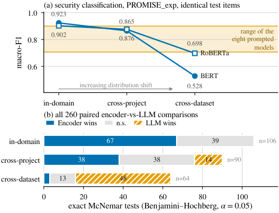

*الشكل 3 من البيبر: الانقلاب (a) على نفس عناصر PROMISE_exp، (b) الـ 260 اختبار McNemar.*

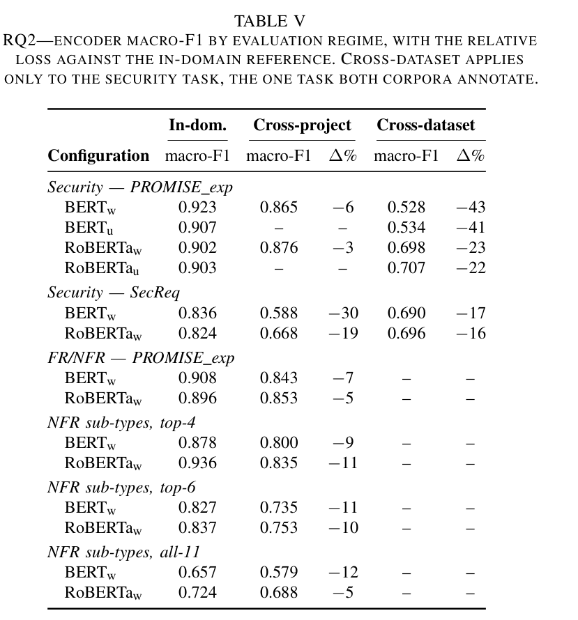

*جدول 5 من البيبر: macro-F1 للإنكودرز حسب نظام التقييم.*

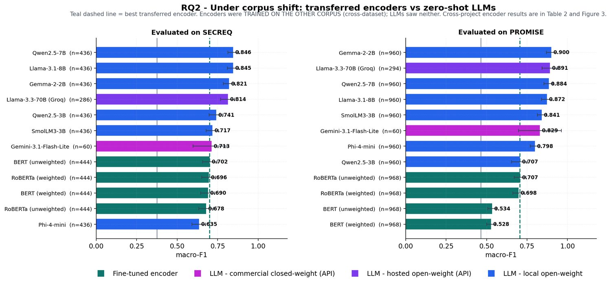

*من عرض الرسالة: RQ2 – الإنكودرز المنقولة (cross-dataset) مقابل الـ LLMs.*

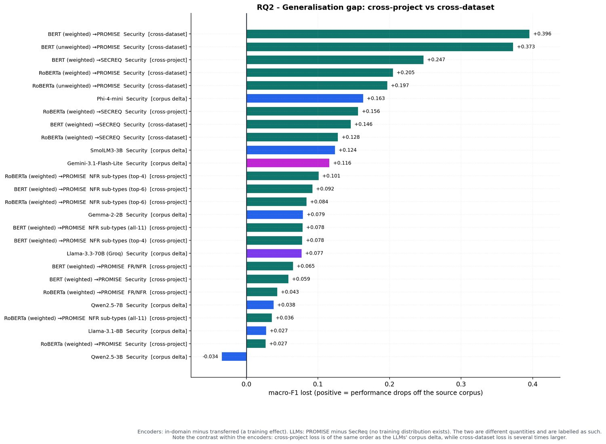

*من عرض الرسالة: فجوة التعميم – cross-project مقابل cross-dataset.*


الجزء ده هو قلب الورقة. كل اللي فات كان بيقول "جوّه الدومين الـ encoders بتكسب"؛ هنا بنسأل: طب لو البيانات اللي بنختبر عليها مش شبه اللي اتدرّبنا عليها؟ خدي نفس، وهنمشي على الشكل 3 نقطة نقطة، وبعدين الجدول 5 صف صف، وبعدين رسمتين من الـ deck، وفي الآخر نتيجة الـ LOPO. كل رقم هقولك هو إيه، جاي منين، وليه.

### أولاً: مصطلحات هتقابلك في القسم ده

- **macro-F1**: بتحسبي F1 لكل class لوحده (F1 = المتوسط التوافقي بين الـ precision والـ recall)، وبعدين بتاخدي المتوسط البسيط بينهم. يعني الـ class الصغير (security مثلاً، 125 عنصر بس من 968) بيتحسب بنفس وزن الـ class الكبير. عشان كده هو مقياس قاسي على الموديل اللي بيهمل class.
- **precision** (الدقة): من كل اللي الموديل قال عليهم "security"، كام واحد فعلاً security؟ **recall** (الاستدعاء): من كل الـ security الحقيقيين، الموديل لقى كام؟
- **regime** (نظام التقييم): تلات محطات بتزوّد الـ **distribution shift** (اختلاف التوزيع بين بيانات التدريب وبيانات الاختبار):
  - **in-domain**: تقسيم 5-fold جوّه نفس الكوربس (الـ fold = قطعة من البيانات؛ كل مرة قطعة تبقى اختبار والباقي تدريب).
  - **cross-project**: بنحجز مشاريع كاملة ما شافهاش الموديل في التدريب.
  - **cross-dataset**: بندرّب على كوربس (SecReq مثلاً) ونختبر على الكوربس التاني (PROMISE_exp).
- **prompted model / LLM**: موديل لغوي كبير بنسأله بـ **prompt** (تعليمة نصية) من غير ما نعمله أي تدريب. **fine-tuned encoder** (BERT / RoBERTa): موديل بندرّبه على بيانات معنونة. الحرف (w) معناه **weighted**: أوزان في الـ loss بتخلّي الـ class النادر يتحسب أكتر؛ (u) = **unweighted** من غير أوزان (نسخة control).
- **McNemar test**: اختبار إحصائي بيقارن موديلين على **نفس العناصر بالظبط** (paired). بيبص بس على العناصر اللي اختلفوا فيها: b = عدد العناصر اللي الـ encoder صحّ فيها والـ LLM غلط، c = العكس. لو b و c قريبين من بعض → مفيش فرق حقيقي (**n.s.** = not significant). **BH** (Benjamini–Hochberg) و**Holm** طرق تصحيح عشان إحنا عاملين 260 اختبار مرة واحدة ومش عايزين نتيجة تطلع "دالّة" بالصدفة.
- **prior** (البريور / معدل الأساس): نسبة كل class في الكوربس. في PROMISE_exp نسبة الـ security = 125/968 = 12.9%، وفي SecReq = 177/444 = 39.9%. الفرق ده هو اللي هيطلع لنا في آخر القسم.

---

### ثانياً: الشكل 3 لوحة (a) — الخطين اللي بيقعوا في الشريط

**إيه اللي مرسوم بالظبط؟**

- المحور الأفقي (x): 3 محطات مكتوبة بالترتيب: `in-domain` ← `cross-project` ← `cross-dataset`. المحطات دي مش أرقام، هي درجات shift بتزيد من الشمال لليمين، وتحتهم سهم رمادي مكتوب عليه "increasing distribution shift" (الكود بيرسمه من x=0 لـ x=1.68 عند y=0.432، يعني تحت الخطوط خالص، ولونه رمادي فاتح `#8a8a8a` عشان ما يلفتش الانتباه عن البيانات).
- المحور الرأسي (y): macro-F1، الكود بيحدده من 0.405 لـ 1.005 (فبتشوفي أرقام 0.5 لـ 1.0 على المحور).
- **خطين أزرق** (لون `#0072B2`، ده لون الـ encoders في كل رسومات الورقة):
  - **BERT (w)**: دايرة زرقا مليانة. القيم: 0.923 → 0.865 → 0.528.
  - **RoBERTa (w)**: مربع أبيض بحواف زرقا. القيم: 0.902 → 0.876 → 0.698.
  - كل قيمة مكتوبة جنب النقطة بتاعتها بـ 3 خانات عشرية، والاسم مكتوب يمين آخر نقطة.
- **شريط برتقالي** (لون `#E69F00` بشفافية 17% وخطين رفيعين فوق وتحت): مكتوب جنبه "range of the eight prompted models". حدوده:
  - **الحد الأدنى 0.707** = Qwen2.5-3B (في `tab9_evaluability.csv` قيمته 0.7067 على 960 عنصر من PROMISE_exp).
  - **الحد الأعلى 0.900** = Gemma-2-2B (0.8999 على نفس الـ 960).
  - الكود بيحسبهم ببساطة كـ `min` و`max` لـ macro-F1 الـ 8 موديلات prompted على security/PROMISE (`prompted.macro_f1.min()` و`.max()`).

**ليه الشريط ما بيتحركش عبر المحطات التلاتة؟** لأن الموديلات الـ prompted **ما بتتدربش أصلاً**. مفيش "بيانات تدريب" تتغير لما ننقل من in-domain لـ cross-dataset، فدرجتها على عناصر PROMISE_exp هي هي نفسها في المحطات التلاتة. عشان كده هي بتشتغل كـ **خط مرجع ثابت** (الورقة بتسميه "fixed reference line")، والـ encoders هي اللي بتتحرك.

**ليه عنوان اللوحة (a) بيقول "identical test items"؟** لأن الـ 3 نقط بتوع BERT (w) كلها محسوبة على **نفس الـ 968 عنصر** من PROMISE_exp. اللي بيتغيّر هو **إيه اللي اتدرّب عليه الموديل**:

| المحطة | اتدرّب على إيه؟ | اتقاس على إيه؟ | BERT (w) | RoBERTa (w) |
|---|---|---|---|---|
| in-domain | 4/5 من PROMISE_exp (كل fold) | الخُمس المتبقّي، ومجموع الـ 5 folds = الـ 968 | 0.923 | 0.902 |
| cross-project | مشاريع PROMISE_exp من غير المشاريع المحجوزة | المشاريع المحجوزة، مجموعها = الـ 968 | 0.865 | 0.876 |
| cross-dataset | **SecReq كله** (444 عنصر) | **PROMISE_exp كله** (968) | 0.528 | 0.698 |

(الورقة بتقول "Every requirement is a test item exactly once within each encoder family"، يعني الـ 968 كلهم بيتقاسوا مرة واحدة في كل عيلة تقسيم، وعشان كده الـ n في tab9 = 968 في المحطات التلاتة.)

**"fall through the band" (بيقعوا وبيعدّوا الشريط)**: في in-domain الخطين فوق الشريط (0.923 و0.902 > 0.900). في cross-project لسه جوّه أو على حافة الشريط (0.865 و0.876 أقل من 0.900 بس أعلى من 0.707، وشكلياً على الرسمة الاتنين قاعدين جوّه المنطقة البرتقالية). في cross-dataset RoBERTa واقع على الحد الأدنى بالظبط تقريباً (0.698 مقابل 0.707، يعني أقل من أضعف LLM بـ 0.009)، وBERT واقع **تحت الشريط بمسافة كبيرة** (0.528). يعني أحسن encoder في الدنيا بقى أسوأ من أضعف موديل prompted، على نفس الأسئلة.

خدي بالك من التفصيلة اللطيفة: في in-domain وcross-project الاتنين قريبين جداً من بعض (فرق 0.021 و0.011)، لكن في cross-dataset الفرق بينهم 0.170. يعني نوع الـ encoder ما بيفرقش في المحطات الآمنة، لكن بيفرق جداً لما الكوربس يتغيّر (هنشوف ليه في القسم اللي بعده عن الـ prior shift).

---

### ثالثاً: الشكل 3 لوحة (b) — 260 حكم McNemar

**إيه اللي مرسوم؟** 3 شرايط أفقية (stacked bars) تحت بعض، كل شريط مقسوم 3 ألوان:

- **أزرق** = Encoder wins (الرقم مكتوب بالأبيض جوّه القطعة).
- **رمادي فاتح** (`#e2e2e2`) = n.s. (مفيش فرق دال).
- **برتقالي مخطّط بخطوط مايلة** (hatch `/////`) = LLM wins. الخطوط دي مقصودة عشان لو الرسمة اتطبعت أبيض وأسود تفضلي تفرقيها عن الرمادي.

المحور الأفقي مكتوب عليه "exact McNemar tests (Benjamini–Hochberg, α = 0.05)": يعني الحكم في كل اختبار اتاخد بعد تصحيح BH عند مستوى دلالة 5%. الكود بيكتب الرقم جوّه القطعة **بس لو القطعة ≥ 10 اختبارات** (`if v >= 10`)، وعشان كده ما بتشوفيش "0" في صف in-domain ولا "3" في صف cross-dataset مكتوبين، بس القطعة الزرقا الصغيرة موجودة.

| الصف (regime الـ encoder) | Encoder wins | n.s. | LLM wins | n = |
|---|---|---|---|---|
| in-domain | 67 | 39 | 0 | 106 |
| cross-project | 38 | 38 | 14 | 90 |
| cross-dataset | 3 | 13 | 48 | 64 |

**الأرقام دي جاية منين؟** من `tab4_mcnemar.csv`: 260 صف، كل صف = مقارنة encoder واحد (في regime معيّن) ضد LLM واحد على نفس العناصر. الكود بيعمل `crosstab(encoder_regime, verdict)` وخلاص. وليه 106 و90 و64 بالذات؟

- **106 in-domain** = security/PROMISE 32 (4 نسخ encoder × 8 LLMs) + FR/NFR 16 (2 × 8) + security/SecReq 16 + top-4 16 + top-6 14 (2 × 7 لأن خلية Gemini سقطت من بوابة القابلية للتقرير) + all-11 12 (2 × 6 لأن Gemini وLlama-70B سقطوا) = 106.
- **90 cross-project** = FR/NFR 16 + security/PROMISE 16 + security/SecReq 16 + top-4 16 + top-6 14 + all-11 12 = 90. (مفيش 32 هنا لأن النسخ الـ unweighted ما اتدرّبتش في cross-project.)
- **64 cross-dataset** = security/PROMISE 32 (4 encoders × 8) + security/SecReq 32 = 64.
- المجموع 106 + 90 + 64 = 260.

**يعني إيه "67–39–0 بتبقى 3–13–48"؟** إنك لو اتفرّجتي على العمود الأول بس (in-domain) هتستنتجي "الـ encoders أحسن، وعمرها ما اتغلبت بشكل دال ولا مرة من 106". ولو اتفرّجتي على العمود الأخير بس (cross-dataset) هتستنتجي العكس تماماً: "الـ LLMs أحسن في 48 من 64، والـ encoders كسبت 3 بس". **نفس الـ 12 موديل، نفس المُصحّح (scorer)، نفس الاختبار الإحصائي**، والاستنتاج انقلب. ده معنى كلمة "inverts" في عنوان الورقة: مش إن الكل نزل، ده إن اللي كان كسبان بقى خسران.

تفصيلة إضافية من الـ CSV عشان تفهمي الـ 3 والـ 48:
- الـ 48 فوز للـ LLMs = 30 على security/PROMISE (من 32 ممكنة! الاتنين الباقيين n.s.) + 18 على security/SecReq.
- الـ 3 فوز للـ encoders كلها على security/SecReq وكلها ضد **Phi-4-mini** بالذات (أضعف موديل على SecReq بـ 0.635): RoBERTa (w) وBERT (u) وRoBERTa (u) المنقولين من PROMISE. يعني حتى الـ 3 انتصارات دي مش انتصارات على LLM قوي.
- الـ 14 فوز للـ LLMs في cross-project: 11 منهم على security/SecReq (وده هيتفسّر تحت لما نتكلم عن الـ −30%)، و2 على top-4 و1 على top-6.

---

### رابعاً: الجدول 5 (tab_transfer.tex) صف صف مع حساب كل Δ%

**قاعدة الجدول**: كل صف = encoder واحد على task واحد. عمود In-dom. هو المرجع، وبعده عمودين لكل regime: الـ macro-F1 و**Δ%** = نسبة الخسارة بالنسبة للمرجع:

Δ% = (F1 بعد الانتقال − F1 in-domain) ÷ F1 in-domain × 100

الجدول بيكتب 3 خانات عشرية والـ Δ% مقرّبة لأقرب عدد صحيح، بس الحسابات تحت بالأرقام الأصلية بـ 4 خانات من `tab2_main_transfer.csv` و`tab9_evaluability.csv` و`tab3_generalisation_gap.csv` (اللي فيه الـ relative_drop_pct محسوبة جاهزة). الشرطة (--) معناها "الخلية دي ما اتقاستش" مش "صفر".

**كتلة 1: Security — PROMISE_exp** (الاختبار دايماً على الـ 968 عنصر)

| Config | In-dom. | Cross-project | Δ% | Cross-dataset | Δ% |
|---|---|---|---|---|---|
| BERT (w) | 0.923 | 0.865 | −6 | 0.528 | −43 |
| BERT (u) | 0.907 | -- | -- | 0.534 | −41 |
| RoBERTa (w) | 0.902 | 0.876 | −3 | 0.698 | −23 |
| RoBERTa (u) | 0.903 | -- | -- | 0.707 | −22 |

- BERT (w): (0.8649 − 0.9235) / 0.9235 = −0.0586 / 0.9235 = **−6.3%** → مكتوبة −6. و(0.5279 − 0.9235) / 0.9235 = −0.3956 / 0.9235 = **−42.8%** → مكتوبة −43. ده رقم العنوان: "the best in-domain encoder loses 42.8%".
- BERT (u): (0.5341 − 0.9069) / 0.9069 = −0.3728 / 0.9069 = **−41.1%** → −41. الشرطة في cross-project لأن النسخة الـ unweighted اتعملت كـ control على أمان PROMISE جوّه الدومين وعلى الـ cross-dataset بالاتجاهين بس. خدي بالك: الورقة بتقول بس "an unweighted control on the security task"؛ تحديد العيلات دي جاي من `tab9_evaluability.csv` (3 خلايا unweighted لكل إنكودر)، فمفيش لها cross-project أصلاً.
- RoBERTa (w): (0.8756 − 0.9023) / 0.9023 = −0.0267 / 0.9023 = **−3.0%** → −3. و(0.6975 − 0.9023) / 0.9023 = −0.2048 / 0.9023 = **−22.7%** → −23.
- RoBERTa (u): (0.7066 − 0.9035) / 0.9035 = −0.1969 / 0.9035 = **−21.8%** → −22.

لاحظي: الـ weighting (w مقابل u) ما بيفرقش تقريباً في الانتقال: BERT −42.8 مقابل −41.1، وRoBERTa −22.7 مقابل −21.8. يعني المشكلة مش في أوزان الـ loss، المشكلة في الانتقال نفسه.

**كتلة 2: Security — SecReq** (الاختبار على الـ 444 عنصر بتوع SecReq)

| Config | In-dom. | Cross-project | Δ% | Cross-dataset | Δ% |
|---|---|---|---|---|---|
| BERT (w) | 0.836 | 0.588 | −30 | 0.690 | −17 |
| RoBERTa (w) | 0.824 | 0.668 | −19 | 0.696 | −16 |

- BERT (w): (0.5883 − 0.8356) / 0.8356 = −0.2473 / 0.8356 = **−29.6%** → −30. و(0.6898 − 0.8356) / 0.8356 = −0.1458 / 0.8356 = **−17.4%** → −17. ده "الاتجاه العكسي" (تدريب على PROMISE_exp، اختبار على SecReq) اللي الورقة بتقول عنه "milder still".
- RoBERTa (w): (0.6676 − 0.8237) / 0.8237 = −0.1561 / 0.8237 = **−19.0%** → −19. و(0.6958 − 0.8237) / 0.8237 = −0.1279 / 0.8237 = **−15.5%** → −16.
- مفيش صفوف (u) هنا لأن ما اتعملش لهم in-domain على SecReq، فمفيش مرجع تحسبي منه Δ (قيمهم cross-dataset موجودة في tab2: BERT (u) 0.7015 وRoBERTa (u) 0.6782، وبتظهر في رسمة الـ deck تحت، بس مش في الجدول 5).

**غريبة تستاهل وقفة**: على SecReq، الـ cross-project (−30%) **أسوأ** من الـ cross-dataset (−17%)! يعني BERT المتدرّب على PROMISE_exp كوربس تاني خالص بيعمل على SecReq أحسن من BERT المتدرّب على جزء من SecReq نفسه. ليه؟ الورقة بتقول "the much smaller SecReq" وبس، لكن من تصميم التقسيم (SOURCES.md / stage 1) الحكاية واضحة:
- SecReq فيه **3 مجموعات مشاريع بس** (3 مواصفات صناعية: CEPS، CPN، GPS). الـ cross-project بيبقى `StratifiedGroupKFold` بـ **3 folds بس**: كل fold بيتدرّب على مواصفتين ويتقاس على التالتة كلها.
- يعني في كل fold الموديل شايف حوالي ثلثين الكوربس الصغير (444 عنصر) وبيتحط قدام مواصفة صناعية كاملة ما شافش منها ولا جملة، ومكتوبة على الأرجح بأسلوب وشركة مختلفين.
- في الـ cross-dataset بالمقابل الموديل بيتدرّب على PROMISE_exp **كله** (968 عنصر، أكتر من ضعف SecReq) فبيشوف تنوّع أكتر. (الجزء الأخير ده تفسيري أنا؛ الورقة بتذكر بس صِغر SecReq.)
- وده بيفسّر الـ 11 فوز للـ LLMs في cross-project اللي شفناهم في لوحة (b): كلهم على security/SecReq، لأن الإنكودرز هناك على 0.588 (BERT بأوزان) و0.668 (RoBERTa بأوزان) macro-F1 — الـ 11 خسارة موزّعة 6 على BERT و5 على RoBERTa — بينما Qwen2.5-7B على 0.846 من غير تدريب (والاختبار نفسه بيقارن الـ accuracy: 0.601 و0.672 مقابل 0.72–0.85).

**كتلة 3: FR/NFR — PROMISE_exp** (524 NFR + 444 FR = 968)

| Config | In-dom. | Cross-project | Δ% |
|---|---|---|---|
| BERT (w) | 0.908 | 0.843 | −7 |
| RoBERTa (w) | 0.896 | 0.853 | −5 |

- BERT: (0.8432 − 0.9083) / 0.9083 = −0.0651 / 0.9083 = **−7.2%**. RoBERTa: (0.8525 − 0.8956) / 0.8956 = −0.0431 / 0.8956 = **−4.8%** → −5.

**كتلة 4–6: NFR sub-types**

| Variant | Config | In-dom. | Cross-project | Δ% | الحساب |
|---|---|---|---|---|---|
| top-4 (353 عنصر) | BERT (w) | 0.878 | 0.800 | −9 | (0.8001 − 0.8780)/0.8780 = −0.0779/0.8780 = −8.9% |
| top-4 | RoBERTa (w) | 0.936 | 0.835 | −11 | (0.8347 − 0.9356)/0.9356 = −0.1009/0.9356 = −10.8% |
| top-6 (433) | BERT (w) | 0.827 | 0.735 | −11 | (0.7349 − 0.8272)/0.8272 = −0.0923/0.8272 = −11.2% |
| top-6 | RoBERTa (w) | 0.837 | 0.753 | −10 | (0.7528 − 0.8367)/0.8367 = −0.0839/0.8367 = −10.0% |
| all-11 (524) | BERT (w) | 0.657 | 0.579 | −12 | (0.5788 − 0.6572)/0.6572 = −0.0784/0.6572 = −11.9% |
| all-11 | RoBERTa (w) | 0.724 | 0.688 | −5 | (0.6884 − 0.7240)/0.7240 = −0.0356/0.7240 = −4.9% |

**ليه الـ cross-dataset شرطة في كل الـ tasks ما عدا security؟** لأن الـ cross-dataset محتاج **نفس الـ task بنفس الـ labels على الكوربسين**. FR/NFR والـ sub-types موجودين في PROMISE_exp بس (SecReq مش معنون بيهم)، وsecurity هو الوحيد اللي "native in SecReq and derived in PROMISE_exp from the SE sub-class". الـ stage 1 بيولّد الـ cross-dataset تلقائياً لأي زوج كوربسات بيشتركوا في task فيه ≥ 2 class على الجهتين، وده ما طلعش غير security باتجاهين (عشان كده الـ 2 folds cross-dataset من الـ 107).

**جملة الورقة "3–12% on PROMISE_exp, up to 30% on SecReq" جاية منين؟** من عمود Δ% في cross-project: أقل خسارة على PROMISE_exp = RoBERTa security −3.0%، وأكبر خسارة = BERT all-11 −11.9% ≈ 12%. والـ 30% = BERT على SecReq −29.6%. (الـ deck في سلايد 14 بيقول نفس الحاجة بالنقاط بدل النسب: "2.7–10.1 points" = 0.0267 لـ 0.1009، و"24.7 points (29.6%)" = 0.2473.)

**"ahead or tied in 76 of 90"** = 38 (Encoder wins) + 38 (n.s.) من صف cross-project في لوحة (b). الورقة بتعتبر التعادل "مش خسارة"، فالـ encoder لسه ماسك في 76/90 = 84% من المقارنات، والـ 14 الباقيين أغلبهم على SecReq زي ما شفنا. ده اللي الورقة بتسميه "survivable" (محتمَل) وبتقول إنه التدهور اللي NoRBERT كانت متوقعاه: حقيقي بس معتدل.

---

### خامساً: الأرقام الـ headline بحسابها

- **0.923 → 0.528 على نفس العناصر = −42.8%**: (0.5279 − 0.9235) / 0.9235 = −0.3956 / 0.9235 = −0.4284. الـ 0.3956 دي هي أطول شريط في رسمة الـ deck (image4) اللي هنشوفها تحت. سلايد 13 في الـ deck بيقول إن ده "nearly seven times the cross-project drop": 0.3956 / 0.0586 = 6.75 مرة.
- **RoBERTa أمتن: −22.7%**: (0.6975 − 0.9023) / 0.9023.
- **الاتجاه العكسي أخف: −17.4%**: (0.6898 − 0.8356) / 0.8356 (BERT (w) متدرّب على PROMISE_exp ومتقاس على SecReq).

**الـ "corpus delta" بتاع الموديلات الـ prompted: من −0.034 لـ +0.163**. دي حاجة تانية خالص، وخدي بالك من الفرق:
- للـ encoders، الفجوة اسمها **train_gap** = F1 in-domain − F1 بعد الانتقال، على **نفس الكوربس اختبار**. دي أثر تدريب: نفس الأسئلة، اتغيّر اللي الموديل اتعلّمه.
- للـ prompted، مفيش "تدريب" يتغيّر، فمفيش train_gap ممكن تتحسب. اللي اتحسب هو **corpus_delta** = F1 على PROMISE_exp − F1 على SecReq، لنفس الموديل بنفس الـ prompt. دي بتقيس **صعوبة الكوربس** بس (الأسئلة اتغيّرت، الموديل ما اتغيّرش).
- من `tab3_generalisation_gap.csv`:

| Model | F1 PROMISE | F1 SecReq | corpus_delta |
|---|---|---|---|
| Qwen2.5-3B | 0.7067 | 0.7410 | **−0.0343** (أحسن على SecReq!) |
| Llama-3.1-8B | 0.8724 | 0.8450 | +0.0274 |
| Qwen2.5-7B | 0.8840 | 0.8461 | +0.0379 |
| Llama-3.3-70B | 0.8910 | 0.8140 | +0.0770 |
| Gemma-2-2B | 0.8999 | 0.8209 | +0.0790 |
| Gemini-3.1-Flash-Lite | 0.8287 | 0.7128 | +0.1159 |
| SmolLM3-3B | 0.8408 | 0.7172 | +0.1236 |
| Phi-4-mini | 0.7985 | 0.6353 | **+0.1632** |

  فالمدى "−0.034 لـ +0.163" هو من Qwen2.5-3B لـ Phi-4-mini. الورقة بتحط المدى ده جنب نسب الخسارة (42.8% / −23% / −17%) وبتقول بالنص إن الموديلات الـ prompted "move only with corpus difficulty (−0.034 to +0.163)". وملاحظة مني (مش كلام الورقة): أكبر corpus delta عند الـ LLMs هو 0.163، وده أقل من نص خسارة BERT (0.3956 ÷ 2 = 0.198). بس لازم تقوليها في المناقشة بوضوح: **الكميتين مش نفس الحاجة**، وعشان كده الـ deck بيكتب [cross-dataset] و[corpus delta] كعلامات مختلفة في الرسمة.

- **48 من 64 فوز للـ LLMs و3 للـ encoders**: شرحناهم فوق من tab4.

---

### سادساً: رسمتين الـ deck للـ RQ2

**image3 (سلايد 12): "RQ2 – Under corpus shift: transferred encoders vs zero-shot LLMs"**

لوحتين جنب بعض، كل واحدة شرايط أفقية مترتبة من الأعلى للأقل، مع علامة خطأ (error bar) سودا صغيرة = فاصل ثقة 95% (من `ci_lo`/`ci_hi` في tab9، محسوب بـ bootstrap 2000 عينة). الألوان (الـ legend تحت): **teal غامق** = fine-tuned encoder، **magenta** = LLM تجاري (Gemini)، **بنفسجي** = LLM مفتوح مستضاف (Llama-70B على Groq)، **أزرق** = LLM مفتوح محلي. الخط **المتقطع الـ teal** الرأسي = "best transferred encoder" (أحسن encoder منقول). فيه كمان خط رمادي فاتح رأسي عند ~0.37 في اليسار و~0.47 في اليمين؛ الـ deck ما بيكتبش هو إيه، لكن القيمتين بيطابقوا الـ majority-class baseline في tab0 (0.3755 لـ SecReq و0.4655 لـ PROMISE)، فده تفسيري ليه.

- **يسار "Evaluated on SECREQ"**: الأسئلة هي الـ 444 (أو 436 للـ LLMs المحلية = 444 − 8 أمثلة few-shot محجوزة). الـ encoders الـ teal هنا **متدرّبين على PROMISE_exp** (cross-dataset). الترتيب: Qwen2.5-7B 0.846، Llama-3.1-8B 0.845، Gemma-2-2B 0.821، Llama-3.3-70B 0.814 (n=286 لأن حدود الـ API)، Qwen2.5-3B 0.741، SmolLM3-3B 0.717، Gemini 0.713 (n=60 وعشان كده الـ error bar عريضة جداً)، **BERT (u) 0.702** (أحسن encoder منقول، وهنا الخط المتقطع)، RoBERTa (w) 0.696، BERT (w) 0.690، RoBERTa (u) 0.678، وفي الآخر Phi-4-mini 0.635. يعني 7 LLMs فوق أحسن encoder، وLLM واحد بس (Phi) تحتهم — وده بالظبط اللي فسّر الـ 3 انتصارات للـ encoders في McNemar.
- **يمين "Evaluated on PROMISE"**: الأسئلة الـ 968 (960 للمحلية). الـ encoders **متدرّبين على SecReq**. الترتيب: Gemma-2-2B 0.900، Llama-3.3-70B 0.891 (n=294)، Qwen2.5-7B 0.884، Llama-3.1-8B 0.872، SmolLM3-3B 0.841، Gemini 0.829 (n=60)، Phi-4-mini 0.798، Qwen2.5-3B 0.707، **RoBERTa (u) 0.707** (الخط المتقطع)، RoBERTa (w) 0.698، BERT (u) 0.534، BERT (w) 0.528. الـ encoders الأربعة في القاع، وBERT بنسختيه تحت الكل بفرق كبير.

الجملة اللي الـ deck بيلخّص بيها: "Best transferred encoder on SecReq: 0.7015 (unweighted BERT) — Qwen2.5-7B reaches 0.8461 with no tuning at all." الفرق 0.8461 − 0.7015 = 0.1446.

**image4 (سلايد 14): "RQ2 – Generalisation gap: cross-project vs cross-dataset"**

شريط أفقي واحد لكل صف من `tab3_generalisation_gap.csv` (26 صف)، مترتبين من أكبر خسارة فوق لأصغر (أو سالبة) تحت. المحور الأفقي "macro-F1 lost (positive = performance drops off the source corpus)": الرقم الموجب = الأداء نزل. اللون بنفس دليل image3.

**قواعد الـ labels**:
- `BERT (weighted) →PROMISE Security [cross-dataset]`: encoder، السهم بيقول "متقاس على PROMISE"، والقوس المربع بيقول الـ regime. الرقم = train_gap.
- `[cross-project]`: نفس الشيء بس الـ regime هو حجز مشاريع.
- `Phi-4-mini Security [corpus delta]`: موديل prompted، مفيش سهم لأن مفيش "منقول على"، والقوس بيقول إن الكمية دي corpus delta (PROMISE − SecReq).

**الترتيب من فوق لتحت** (القيم من tab3): BERT (w)→PROMISE cross-dataset **+0.396**؛ BERT (u)→PROMISE cross-dataset +0.373؛ BERT (w)→SECREQ cross-project +0.247؛ RoBERTa (w)→PROMISE cross-dataset +0.205؛ RoBERTa (u)→PROMISE cross-dataset +0.197؛ **Phi-4-mini corpus delta +0.163** (أول LLM في القايمة، السادس)؛ RoBERTa (w)→SECREQ cross-project +0.156؛ BERT (w)→SECREQ cross-dataset +0.146؛ RoBERTa (w)→SECREQ cross-dataset +0.128؛ SmolLM3 +0.124؛ Gemini +0.116؛ RoBERTa top-4 +0.101؛ BERT top-6 +0.092؛ RoBERTa top-6 +0.084؛ Gemma +0.079؛ BERT all-11 +0.078؛ BERT top-4 +0.078؛ Llama-70B +0.077؛ BERT FR/NFR +0.065؛ BERT security cross-project +0.059؛ RoBERTa FR/NFR +0.043؛ Qwen2.5-7B +0.038؛ RoBERTa all-11 +0.036؛ Llama-3.1-8B +0.027؛ RoBERTa security cross-project +0.027؛ وآخر واحد **Qwen2.5-3B −0.034** (الشريط الوحيد اللي رايح شمال الصفر).

**الـ footnote تحت الرسمة** (نصها): "Encoders: in-domain minus transferred (a training effect). LLMs: PROMISE minus SecReq (no training distribution exists). The two are different quantities and are labelled as such. Note the contrast within the encoders: cross-project loss is of the same order as the LLMs' corpus delta, while cross-dataset loss is several times larger." يعني الرسالة مش "الـ LLMs أحسن"، الرسالة: خسارة الـ encoder في cross-project (0.027–0.101 على PROMISE) في نفس رتبة الـ corpus delta بتاع الـ LLMs (من −0.034 لـ +0.163)، لكن خسارة cross-dataset (0.197–0.396 على PROMISE) أكبر بكتير. وده اللي بيمهّد لسؤال "ليه؟" اللي إجابته الـ prior shift في القسم الجاي.

---

### سابعاً: "Aggregate scores hide per-project failure" — نتيجة الـ LOPO

**LOPO** = Leave-One-Project-Out: في PROMISE_exp فيه 47 مشروع؛ بندرّب على 46 ونختبر على المشروع الـ 47، ونكرّر 47 مرة (عشان كده 47 fold في الـ 107). الهدف: بدل رقم واحد للكوربس كله، نشوف الموديل بيعمل إيه **على كل مشروع لوحده**، لأن الممارس في الشركة عنده مشروع واحد مش متوسط 47 مشروع.

**ليه 37 مشروع مش 47؟** كود الـ stage 4 بيبني `tab11_per_project.csv` وبيعدّي المشاريع اللي فيها **أقل من 5 عناصر** (`if len(g) < 5: continue`)، لأن accuracy على 3 عناصر مثلاً مالهاش معنى. الـ 10 مشاريع الساقطة فيهم 25 عنصر بس مجمّعين (968 − 943 = 25 عنصر، والـ 943 هي `n_items` بتاعة الـ encoders في tab11b).

**ليه "with comparable coverage"؟** لأن مش كل موديل شاف نفس الـ 37 مشروع. الـ LLMs المحلية الست شافوا الـ 37 كلهم (935 عنصر، تغطية 99.2%)، لكن Gemini (محدود بـ 60 عنصر بسبب حدود الـ API المجاني) لمس 4 مشاريع بس بـ 25 عنصر (تغطية 2.7%)، وLlama-3.3-70B لمس 16 مشروع بـ 237 عنصر (25.1%). الكود بيحط علامة `spread_comparable = True` بس لو التغطية ≥ 80% (والتغطية = الأصغر بين نسبة المشاريع ونسبة العناصر مقارنة بأحسن موديل تغطية)، وبيقول في التعليق إن مقارنة تشتّت محسوب على 4 مشاريع بتشتّت محسوب على 37 هتعكس النتيجة غلط. عشان كده الجملة في الورقة بتتكلم عن الـ encoders والـ "small open models" بس، ومش بتذكر Gemini ولا Llama-70B.

**المقياس هنا accuracy لكل مشروع مش macro-F1، ليه؟** لأن من الـ 37 مشروع، 17 مشروع فيهم class واحد بس (في tab11: `folds_with_all_classes = 20` من 37)؛ مشروع كله FR مثلاً مافيهوش NFR فالـ F1 بتاع NFR مش معرّف والـ macro-F1 بتبقى NaN. الـ accuracy (نسبة الإجابات الصح) دايماً معرّفة.

**الأرقام من `tab11b_per_project_spread.csv` (task = fr_nfr, corpus = promise)**:

| Model | n_projects | median | s.d. | min | max |
|---|---|---|---|---|---|
| BERT (w) | 37 | **0.9167** | **0.1979** | 0.0 | 1.0 |
| RoBERTa (w) | 37 | 0.9167 | 0.1932 | 0.0 | 1.0 |
| Phi-4-mini | 37 | 0.7500 | 0.2128 | 0.0 | 1.0 |
| Llama-3.1-8B | 37 | 0.6667 | 0.2553 | 0.0 | 1.0 |
| Gemma-2-2B | 37 | 0.6364 | 0.2629 | 0.0 | 1.0 |
| Qwen2.5-7B | 37 | 0.6364 | 0.2399 | 0.0 | 1.0 |
| Qwen2.5-3B | 37 | 0.5714 | 0.3011 | 0.0 | 1.0 |
| SmolLM3-3B | 37 | **0.5455** | 0.2922 | 0.0 | 1.0 |

- **"every configuration has a project scored 0.000 and one scored 1.000"**: عمود min = 0.0 وmax = 1.0 لكل الـ 8 صفوف. مثال حقيقي: BERT (w) على المشروع رقم 25 (5 عناصر بس) جاب 0.0 (غلط في الخمسة)، وعلى المشروع 45 (39 عنصر) جاب 1.0. الـ 1.0 سهل يحصل في مشاريع صغيرة كلها class واحد؛ والـ 0.0 بيحصل لما مشروع صغير يبقى كله في الـ class اللي الموديل بيفشل فيه.
- **median (الوسيط)**: لو رتّبتي الـ 37 رقم accuracy من الأصغر للأكبر، الوسيط هو الرقم اللي في النص (الـ 19). للـ encoders = 0.9167، يعني نص المشاريع الموديل جاب فيها ≥ 91.7%. للموديلات المفتوحة الصغيرة الوسيط من 0.5455 (SmolLM3) لـ 0.7500 (Phi-4-mini) — ده مدى الورقة "0.545–0.750".
- **s.d. (الانحراف المعياري)**: بيقيس قد إيه الأرقام متفرّقة حوالين المتوسط (الكود بيستخدم `ddof=1` يعني العيّنة). للـ encoders 0.1979 (BERT، وده اللي الورقة بتكتبه "0.198") و0.1932 (RoBERTa). للصغيرة من 0.2128 (Phi) لـ 0.3011 (Qwen2.5-3B) — مدى الورقة "0.213–0.301". يعني الـ LLMs الصغيرة مش بس أوطى في النص، كمان أكتر تذبذباً من مشروع لمشروع.
- الورقة بتقول "only the middle separates them": الطرفين (0 و1) واحد للكل، والفرق الوحيد بين العيلتين هو الوسيط والتشتّت.

**الدرس العملي**: رقم واحد للكوربس (زي 0.908 لـ BERT على FR/NFR) بيخبّي إن في مشاريع معيّنة نفس الموديل بيجيب صفر. لو انتِ ممارِسة وعندك مشروع واحد، الـ "corpus-level average" ضعيف كمُتنبّئ باللي هيحصل لك، ولازم تختبري على مشروعك أنتِ. وده بيربط الـ RQ2 بالتهديدات (threats to validity) بعدين: الأداء المتوسط مش ضمانة.

---

### ملخص القسم في 5 سطور

1. لوحة (a): الـ encoders (0.923 / 0.902) فوق شريط الـ LLMs (0.707–0.900) في in-domain، وبيقعوا لـ 0.528 / 0.698 في cross-dataset على نفس الـ 968 عنصر؛ الشريط ثابت لأن الـ LLMs ما بتتدربش.
2. لوحة (b): 67–39–0 من 106 in-domain بتبقى 3–13–48 من 64 cross-dataset، والمحطة الوسطى 38–38–14 من 90 (الـ encoder "ماسك" في 76 = 38 + 38).
3. جدول 5: cross-project بيكلّف 3–12% على PROMISE_exp (−3.0 لـ −11.9) و30% على SecReq (−29.6؛ الورقة بترجعها لصِغر SecReq، وتفسيري أنا إن سببها إن عنده 3 مواصفات = 3 folds بس)؛ cross-dataset بيكلّف BERT 42.8% وRoBERTa 22.7%، والاتجاه العكسي 17.4%.
4. الـ LLMs بتتحرك بـ corpus delta من −0.034 لـ +0.163 — كمية مختلفة (صعوبة كوربس مش فجوة تدريب)، والـ deck بيعلّمها [corpus delta] بدل [cross-dataset].
5. LOPO: على 37 مشروع كل موديل عنده مشروع بـ 0.000 ومشروع بـ 1.000؛ الفرق في الوسيط (0.917 مقابل 0.545–0.750) والتشتّت (0.198 مقابل 0.213–0.301).


## الآلية: الشكل 4 (a/b/c) بالتفصيل، precision/recall بمثال محسوب، صياغة البرومبت (0.485)، والـ few-shot

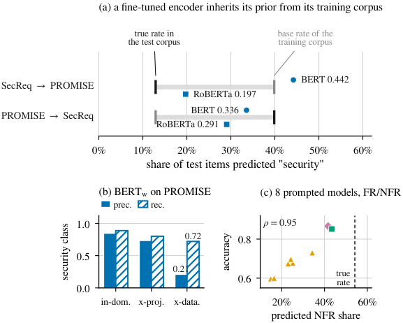

*الشكل 4 من البيبر: عيب واحد بتلات مصادر (a) البريور الموروث، (b) precision/recall، (c) الـ 8 موديلات prompted.*

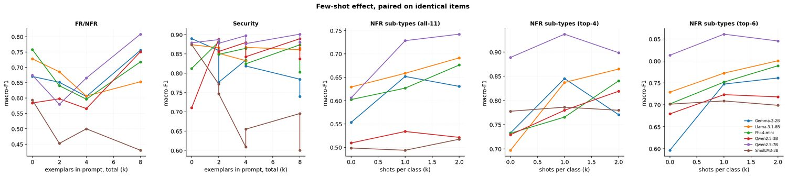

*من عرض الرسالة: أثر الـ few-shot، مقارنات مزدوجة على نفس العناصر.*


القسم ده هو "ليه". القسمين اللي قبله قالوا إن الـ **encoder** (يعني BERT وRoBERTa بعد ما اتعملهم fine-tuning على بياناتنا) بيقع لما ننقله من كوربس لكوربس، وإن الـ **prompted models** (الموديلات اللغوية اللي بنسألها بسؤال مكتوب من غير تدريب) بتكسب في الحالة دي. هنا الورقة بتسأل: **إيه اللي بيحصل جوه الموديل بالظبط لما بيقع؟** وبتجاوب بكلمة واحدة: **prior**. خدي بالك إن الكلمة دي هتتكرر كتير، فخلينا نثبّتها من الأول.

**prior** (أو class prior أو base rate): يعني نسبة كل فئة في الداتا قبل ما تبصي على أي نص. في PROMISE فيه 125 requirement أمنية من 968، يعني لو موديل "أعمى" بيرمي كلمة security بنسبة 12.9% عشوائي هيكون ماشي مع الـ prior بتاع الكوربس. الفكرة الكبيرة في القسم ده: **المهمة دي محتاجة الموديل يعرف الـ prior ده، والـ prior مش مكتوب جوه نص المتطلب.** فكل موديل بيجيبه من مكان تاني، والمكان ده غالبًا غلط.

كلمة تانية هتتكرر: **macro-F1**. هي مقياس الجودة الأساسي في الورقة: بنحسب F1 لكل فئة لوحدها (F1 = المتوسط التوافقي بين precision وrecall، وهنشرحهم بالتفصيل تحت) وبعدين ناخد **المتوسط البسيط** بين الفئات. ليه macro؟ عشان الفئة الصغيرة (security = 12.9%) تبقى بنفس وزن الفئة الكبيرة، فالموديل اللي بيتجاهل الأمن ما يطلعش شكله كويس.

الأرقام في القسم ده جاية من خمس مصادر: الشكل 4 في الورقة (`fig_prior_shift.png`)، الكود اللي رسمه (`make_figs.py`، دالة `fig_prior_shift`)، وثلاث جداول من Stage 4: `tab6_perclass.csv` (precision/recall لكل فئة)، `tab8_prompt_sensitivity.csv` (الصياغة)، و`tab7_fewshot.csv` (الـ few-shot).

---

### 1. الشكل 4 لوحة (a): الـ encoder "بيورّث" الـ prior من كوربس تدريبه

#### إيه المرسوم بالظبط

اللوحة العليا عبارة عن **سطرين أفقيين** على محور x واحد. المحور x مكتوب عليه *share of test items predicted "security"* وبيمشي من 0% لـ 60% (علامات كل 10%). في كل سطر بتشوفي:

| العنصر | شكله في الرسم | معناه |
|---|---|---|
| علامة رأسية **سودا** | خط قصير أسود | النسبة **الحقيقية** للأمن في كوربس **الاختبار** (مكتوب فوقها "true rate in the test corpus") |
| علامة رأسية **رمادي** | خط قصير رمادي | النسبة الحقيقية للأمن في كوربس **التدريب** (مكتوب فوقها "base rate of the training corpus") |
| شريط رمادي فاتح سميك | بيوصّل بين العلامتين | "المسافة" اللي الـ prior اتحرك فيها لما بدّلنا الكوربس |
| دايرة زرقا مكتوب جنبها BERT | نقطة | نسبة العناصر اللي BERT(w) قال عليها security بعد النقل |
| مربع أزرق مكتوب جنبه RoBERTa | نقطة | نفس الكلام لـ RoBERTa(w) |

الـ (w) يعني الـ **weighted variant**: النسخة اللي اتدرّبت بـ class weighting (وزن أكبر للفئة الصغيرة في الـ loss، بعكس التكرار)، وهي النسخة اللي الورقة بتستخدمها كمرجع في الشكل ده (الكود بيسحب `bert-base-uncased-weighted` و`roberta-base-weighted`).

#### السطر الأول: SecReq → PROMISE

معناه: الموديل **اتدرّب على SecReq** و**اتقاس على PROMISE**. ده الاتجاه اللي فيه أكبر انهيار في الورقة كلها (Table V: macro-F1 من 0.9235 لـ 0.5279، يعني −42.8%).

- **12.9%** (العلامة السودا): النسبة الحقيقية للأمن في PROMISE. جاية من `stage1_manifest.json`: 125 security من 968 → 125 ÷ 968 = 0.1291 ≈ 12.9%. الكود بيحسبها فعليًا من ملف التنبؤات: `(d.y_true == 'security').mean()` على تنبؤات الـ in-domain (اللي بتغطي الكوربس كله مرة واحدة بالظبط).
- **39.9%** (العلامة الرمادي): النسبة الحقيقية للأمن في SecReq، كوربس التدريب. 177 ÷ 444 = 0.3986 ≈ 39.9%.
- **BERT 0.442**: BERT(w) المنقول قال "security" على 44.2% من عناصر PROMISE. في الرسم الدايرة الزرقا واقعة **يمين** العلامة الرمادي، يعني **عدّى حتى الـ prior بتاع كوربس التدريب** (44.2% > 39.9%)، مش بس بعيد عن الحقيقة (12.9%). الورقة بتقول إنه "close to the 39.9% prior of the corpus it was trained on" — قريب منه، ومش بالضرورة مساويه.
- **RoBERTa 0.197**: RoBERTa(w) قال security على 19.7% بس (المربع الأزرق قريب من العلامة السودا). لسه أعلى من الحقيقة (12.9%) لكن أقرب لها بكتير. وده بيتماشى مع إن RoBERTa خسر أقل في Table V: 0.9023 → 0.6975، يعني (0.6975 − 0.9023) ÷ 0.9023 = −22.7% (الجدول بيطبعها مقرّبة −23%) بدل −42.8%. الورقة بتقول: "RoBERTa carries less of its source prior across ... and loses correspondingly less accuracy".

#### السطر التاني: PROMISE → SecReq

الاتجاه العكسي: اتدرّب على PROMISE (prior 12.9%) واتقاس على SecReq (حقيقة 39.9%). هنا الشريط الرمادي بيبدأ من 12.9% (رمادي، لأنه دلوقتي كوربس التدريب) وينتهي عند 39.9% (أسود، كوربس الاختبار) — نفس الشريط بس الألوان اتعكست.

- **BERT 0.336**: قال security على 33.6% من عناصر SecReq.
- **RoBERTa 0.291**: 29.1%.

وخدي بالك من حاجة مهمة الورقة بتقولها بصراحة وما بتخبيهاش: في الاتجاه ده **الموديلين تحت الحقيقة** (33.6% و29.1% أقل من 39.9%)، مش فوقها — النقطتين في الرسم جوه الشريط الرمادي، على شمال العلامة السودا. لو كانت القصة كلها "الموديل بيقلّد prior كوربس تدريبه" كان المفروض يقول security على حوالي 12.9% بس. هو قال أكتر من كده بكتير، لكن لسه ما وصلش للحقيقة. الورقة بتفسّر: "so content differences contribute there too" — يعني في الاتجاه ده فيه جزء من الخطأ سببه اختلاف المحتوى/المفردات فعلًا، مش الـ prior لوحده. عشان كده الورقة بتقول إن الـ prior هو "the dominant term in the **largest** observed collapse" (SecReq → PROMISE)، مش المصطلح الوحيد في كل الحالات. ده مثال على الصدق في التقرير: "we report it as measured".

#### "share of test items predicted security" بتتحسب إزاي

الرقم ده مش macro-F1 ولا accuracy — هو مجرد **عدّ**. مخزن التنبؤات (`predictions_finetuned.parquet`) فيه سطر لكل requirement فيه العمود `y_true` (الحقيقة) و`y_pred` (اللي الموديل قاله) و`eval_regime` (in_domain / cross_project / cross_dataset). الكود بيفلتر على task = security وعلى الموديل والكوربس والـ regime، وبعدين:

```
(d.y_pred == 'security').mean()
```

يعني: عدد الصفوف اللي `y_pred` فيها = security، مقسوم على عدد الصفوف كلها. لـ BERT(w) على PROMISE تحت cross_dataset: عدد الصفوف 968 (الكوربس كله، لأن في الـ cross-dataset فيه fold واحد بس في كل اتجاه بيختبر على الكوربس كله — الـ **fold** هو قطعة من الداتا بتتحجز للاختبار)، والنسبة طلعت 0.442.

نفس السطر بالظبط لكن على `y_true` بدل `y_pred` بيدّي الحقيقة (12.9%). فالمقارنة عادلة: نفس العناصر، نفس طريقة العدّ.

---

### 2. الشكل 4 لوحة (b): precision بتنهار والـ recall بيصمد

#### المرسوم

اللوحة السفلية اليسار عنوانها "(b) BERTw on PROMISE". محور y مكتوب عليه *security class* وبيمشي من 0 لـ 1.0 (علامات عند 0 و0.5 و1.0). محور x فيه تلات "محطات":

- **in-dom.** = **in-domain**: تدريب واختبار على PROMISE بـ 5-fold (الكوربس بيتقسم 5 قطع، كل قطعة بتبقى اختبار مرة والباقي تدريب).
- **x-proj.** = **cross-project**: اختبار على مشاريع من PROMISE ما شافهاش في التدريب.
- **x-data.** = **cross-dataset**: تدريب على SecReq، اختبار على PROMISE.

في كل محطة عمودين جنب بعض:

- عمود **أزرق مصمت** = **prec.** (precision).
- عمود **أبيض بحواف زرقا ومخطط بشرط مايلة** (hatched) = **rec.** (recall).

الكود بيكتب الرقم فوق العمودين بس في المحطة الأخيرة ("label only the decisive pair"): بتشوفي **0.21** فوق الأزرق و**0.72** فوق المخطط. الرقم الدقيق في `tab6_perclass.csv` هو 0.2103، والرسم بيقرّبه لخانتين.

#### الأرقام التلاتة من tab6_perclass

| المحطة | precision (أمن) | recall (أمن) | المصدر |
|---|---|---|---|
| in_domain | 0.8473 (الورقة: 0.847) | 0.888 | `tab6_perclass.csv` سطر BERT (weighted), security, promise, in_domain, security |
| cross_project | 0.7353 (0.735) | 0.80 (0.800) | نفس الملف، cross_project |
| cross_dataset | 0.2103 (0.21) | 0.72 | نفس الملف، cross_dataset |

بصّي على الشكل: العمود المخطط (recall) بيقصر شوية شوية (0.888 → 0.80 → 0.72)، لكن العمود الأزرق (precision) بينزل من فوق 0.8 لـ 0.2 في المحطة الأخيرة — ده أوضح حاجة في اللوحة.

#### precision و recall يعني إيه؟ بالأرقام الحقيقية

خلينا نعرّفهم على فئة "security" بالذات:

- **recall** (استدعاء): من كل العناصر اللي **فعلًا** أمنية، الموديل لقى منها كام؟ = (أمنية وقال عليها أمنية) ÷ (كل الأمنية).
- **precision** (دقة): من كل العناصر اللي الموديل **قال** عليها أمنية، كام منها كانت أمنية بجد؟ = (أمنية وقال عليها أمنية) ÷ (كل اللي قال عليها أمنية).

دلوقتي نحطّ الأرقام الحقيقية لـ BERT(w) تحت cross-dataset على PROMISE:

1. العناصر الأمنية الحقيقية: **125** (من `stage1_manifest.json`، وهو نفسه عمود support في `tab6_perclass.csv`).
2. عدد اللي قال عليها security: 44.2% × 968 = 427.9 ≈ **428**.
3. recall = 0.72 → لقى 0.72 × 125 = **90** عنصر من الـ 125 الأمنية. (فاته 35 بس.)
4. precision = الـ 90 الصح ÷ الـ 428 اللي قال عليهم security = 90 ÷ 428 = **0.2103**. ✔ ده بالظبط الرقم في الجدول.

يعني من كل 428 مرة قال فيها "security"، حوالي 338 مرة كان غلطان. الموديل ما فقدش قدرته يتعرّف على الأمن (90 من 125 لسه بيلاقيهم) — هو بقى **يشوف أمن في كل حتة**.

#### ليه ده توقيع الـ prior shift مش المفردات الغريبة

الورقة بتقول: فيه تفسيرين ممكنين للانهيار، وكل واحد له علاج مختلف:

1. **unfamiliar vocabulary** (مفردات غريبة): الموديل ما فهمش نصوص PROMISE لأنها مكتوبة بأسلوب مختلف عن SecReq.
2. **shifted class prior**: الموديل فاهم النص، لكن "عتبة" قراره اتظبطت على كوربس فيه 39.9% أمن، فبيقول أمن أكتر من اللازم.

الاتنين بيدّوا نفس macro-F1 الواطي، لكن بيدّوا **بصمة مختلفة** على precision/recall:

- لو المشكلة **مفردات**: الموديل مش هيتعرّف على الجملة الأمنية لما تتكتب بأسلوب جديد → هيفوّتها → **recall ينهار**. والـ precision ممكن يفضل عالي لأن اللي بيمسكه غالبًا يكون أمن واضح.
- لو المشكلة **prior**: الموديل لسه بيمسك الأمن الحقيقي (recall ثابت نسبيًا) لكن بيمسك معاه كمية كبيرة من غير الأمن → **precision ينهار**.

اللي حصل هو الاحتمال التاني: recall نزل من 0.888 لـ 0.72 (نزول موجود لكن محدود)، والـ precision نزل من 0.847 لـ 0.21 (انهيار). ومن هنا الجملة اللي الورقة بتلخّص بيها الموضوع:

> "the model still finds the security requirements, it simply cannot stop finding them."

يعني: "لسه بيلاقيهم، بس مش قادر يبطّل يلاقيهم." ده بالظبط سلوك موديل عنده prior غلط، مش موديل ما فهمش.

ليه ده مهم عمليًا؟ لأن العلاج مختلف: المفردات الغريبة علاجها بيانات معنونة من الكوربس الجديد (غالي)، أما الـ prior الغلط فعلاجه تعديل عتبة القرار (رخيص، وهنرجع له في آخر القسم).

---

### 3. الشكل 4 لوحة (c): الـ prompted models عندها نفس العيب، من مصدر تاني

#### المرسوم

اللوحة السفلية اليمين عنوانها "(c) 8 prompted models, FR/NFR". ده **scatter plot** (رسم نقاط متفرقة، كل نقطة = موديل):

- **محور x**: *predicted NFR share* — نسبة العناصر اللي الموديل قال عليها NFR، من 10% لـ 62% (علامات عند 20% و40% و60%).
- **محور y**: *accuracy* — نسبة الإجابات الصح من كل الإجابات (مش macro-F1)، من 0.55 لـ 0.92.
- **خط رأسي متقطع** مكتوب جنبه "true rate": النسبة الحقيقية لـ NFR = **54.2%**.
- **ثمان نقاط**، شكلها حسب الـ **tier** (الفئة/الطبقة):
  - **مثلث** برتقالي = open local (الموديلات الستة اللي شغّالة على الـ GPU المحلي بـ 4-bit، يعني نسخة مضغوطة من الموديل عشان تنفع على كارت مجاني).
  - **مربع** أخضر = open hosted (Llama-3.3-70B على Groq).
  - **معيّن** (diamond) وردي/بنفسجي = commercial (Gemini-3.1-Flash-Lite).
- في الركن الشمال فوق: **ρ = 0.95**.

#### مين العناصر اللي في اللوحة دي؟ (من make_figs.py)

الكود بيفلتر مخزن تنبؤات الـ LLM (`predictions_llm_repaired.parquet`) على:

- `task == 'fr_nfr'` (تاسك FR/NFR بس)،
- `prompt_id == 'base'` (الصياغة الأساسية بس، مش terse ولا verbose)،
- `shot_k == 0` (**zero-shot** بس: يعني السؤال من غير أي أمثلة محلولة جواه)،
- واستبعاد `openrouter-nemotron-3-nano-30b-a3b` (Nemotron)، لأن خلاياه فشلت في بوابة القابلية للتقرير: n = 21 أقل من الحد الأدنى 40 — راجعي `tab9_evaluability.csv`. عشان كده الورقة بتقول "the eight **reportable** models".

بعدين لكل موديل بيحسب حاجتين: `pred` = نسبة `y_pred == 'NFR'`، و`acc` = نسبة `y_pred == y_true`. والخط المتقطع = نسبة `y_true == 'NFR'` على كل العناصر المجمّعة من الثمان موديلات. (الـ 54.2% قريبة من 524 ÷ 968 = 54.1% بتاعة الكوربس كله؛ الفرق الصغير — وده تفسيري — لأن الموديلات المحلية بتجاوب على إطار الـ 960 بعد سحب الأمثلة (تقريبًا 520 NFR و440 FR)، أما المستضاف Llama-3.3-70B فغطّى 290 عنصر بس وGemini غطّى 60 (حصة Gemini المجانية 180 طلب/يوم ÷ 3 مجموعات) — شوفي عمود n في `tab9_evaluability.csv`. فالنسبة المجمّعة = (6×520 + 157 + 33) ÷ (6×960 + 290 + 60) = 3,310 ÷ 6,110 = 54.2%، وده بالظبط الخط المنقّط في الرسمة.)

#### إيه اللي بتشوفيه

**كل النقاط الثمانية على شمال الخط المتقطع.** يعني كل موديل بيقول NFR **أقل** من الحقيقة. أقلهم Qwen2.5-3B بـ **14.9%** (مثلث في أقصى الشمال، accuracy حوالي 0.6)، وأعلاهم Llama-3.3-70B بـ **43.4%** (المربع الأخضر، لسه تحت 54.2%). الأرقام دي من نص الورقة (القسم IV-C).

**النقاط بتطلع لفوق كل ما بتروح يمين.** كل ما الموديل قرّب من النسبة الحقيقية، دقته زادت. بالعين: مثلثين عند ~15–16% دقتهم ~0.6، تلات مثلثات متلمّمة عند ~22–24% دقتهم ~0.68–0.71، مثلث عند ~35% حوالي 0.72، والمربع والمعيّن عند ~42–43% دقتهم ~0.85–0.87 (قراءة تقريبية من الرسم).

#### ρ = 0.95 يعني إيه (Spearman rank correlation)

**Spearman ρ** هو **ارتباط رتبي**: بدل ما تحسبي الارتباط بين الأرقام نفسها، بترتّبي كل متغيّر من 1 لـ 8 وتحسبي الارتباط بين الترتيبين. الكود عامل كده بالحرف: `g.pred.rank().corr(g.acc.rank())`. لو الموديل اللي رتبته الأولى في "قرب النسبة من الحقيقة" هو نفسه الأول في الدقة، والتاني هو التاني، وهكذا لحد الثامن، ρ = 1.0 بالظبط. لو الترتيب معكوس تمامًا ρ = −1.

بصيغة Spearman: ρ = 1 − 6·Σd² / (n·(n²−1)) حيث d = فرق الرتبة لكل موديل و n = 8. لو ρ = 0.95: 6·Σd² / (8 × 63) = 0.05 → Σd² ≈ 4.2. يعني (تفسيري للرقم، مش من الورقة) الترتيبين متطابقين تقريبًا مع اختلاف بسيط قد ما يكون موديلين جنب بعض اتبدلوا مكانهم مرتين (كل تبديل بين جارين بيدّي d² = 1 + 1 = 2، فتبديلين = 4 → ρ = 1 − 24/504 = 0.952). ده ارتباط قوي جدًا: **ترتيب الموديلات في الدقة هو تقريبًا نفس ترتيبهم في قد إيه ضبطوا الـ prior صح.**

#### الاستنتاج

الجملة الأساسية في الورقة: "The small open models' apparent 'collapse' on FR/NFR is thus not an inability to read the requirement but a systematic bias toward answering FR." يعني الموديلات الصغيرة اللي جابت أرقام وحشة على FR/NFR في Table IV مش "مش فاهمة" — هي عندها **ميل منهجي تقول FR**. وده نفس العيب اللي شفناه في BERT في لوحة (a)، بس المصدر مختلف: BERT جابه من كوربس تدريبه، والـ prompted model جابه من الـ pre-training بتاعه ومن صياغة السؤال — وده اللي القسم الجاي بيثبته.

---

### 4. القسم IV-C (1): دراسة الصياغة — إعادة صياغة السؤال بتحرّك الـ prior

لوحة (c) بتقول فيه **ارتباط** بين الـ prior والدقة. الارتباط ما بيثبتش سببية. عشان تثبتي إن الـ prior هو **السبب**، لازم تحرّكيه بإيدك وتشوفي الدقة هتتحرك ولا لأ. ده اللي دراسة الصياغة بتعمله. الورقة بتقولها كده: "which makes the link causal rather than correlational".

#### التصميم

- **موديلين**: Qwen2.5-7B وGemma-2-2B. (الورقة ما بتقولش ليه الاتنين دول بالذات؛ من Table IV، Qwen2.5-7B هو الأقوى محليًا في 3 خلايا من 6 (أمان SecReq 0.846، top-4 0.876، top-6 0.824 — بينما Gemma بتاخد أمان PROMISE وPhi بياخد FR/NFR وLlama-3.1-8B بياخد all-11)، وGemma-2-2B هو أصغر موديل محلي (2.61 مليار)؛ فالاختيار على الأرجح بيمثّل طرفي الحجم، وده تفسيري، فالمنطق المعتاد إنهم بيمثّلوا طرفي الحجم — وده تفسيري.)
- **تلات صياغات**: base (الأساسية اللي في الشكل 2)، terse (مختصرة)، verbose (مطوّلة). الصياغات بتغيّر **كتلة التعليمة بس**؛ عقد الإجابة — كلمة واحدة بالظبط — ثابت في التلاتة، والـ parser الصارم (القاعدة اللي بتحوّل رد الموديل لـ label) بيفرضه.
- **الخلايا**: كل موديل على 3 تاسكات ثنائية (FR/NFR على PROMISE، security على PROMISE، security على SecReq) = 6 خلايا، زائد Qwen2.5-7B على 3 مستويات للأنواع الفرعية (all-11، top-4، top-6) = 3 خلايا. المجموع **9 خلايا** (`tab8_prompt_sensitivity.csv` فيه 9 صفوف بالظبط). (الورقة ما بتقولش ليه Gemma ما عملتش الأنواع الفرعية.)
- **حجم كل خلية** (عمود n_paired): 300 للخلايا الثنائية، 218 لـ all-11، 200 لـ top-4 وtop-6. الـ 300 جاية من قرار Stage 3: أكبر n تخلّي حصة يوم واحد من API مجاني (900 طلب) تغطي التلات مجموعات: 3 × 300 = 900. والـ 218 بدل 200 لأن العينة الطبقية بتحط حد أدنى 10 عناصر لكل فئة بعد التوزيع النسبي، و11 فئة بيزوّدوا العدد لـ 218.
- **paired** يعني كل صياغة اتجرّبت على **نفس العناصر بالظبط**، فأي فرق سببه الصياغة مش العينة.

#### spread يعني إيه، والأرقام

**spread** في الجدول = أعلى F1 من التلاتة − أقل F1 من التلاتة. مثال Gemma-2-2B على SecReq security: 0.8279 (verbose) − 0.3433 (terse) = 0.4846 ≈ **0.485**. (لاحظي إنه verbose − terse مش base − terse؛ base − terse = 0.8271 − 0.3433 = 0.4838، رقم قريب جدًا.)

| الموديل | التاسك | base | terse | verbose | spread |
|---|---|---|---|---|---|
| Gemma-2-2B | FR/NFR PROMISE | 0.6706 | 0.6654 | 0.6875 | 0.0221 |
| Gemma-2-2B | security PROMISE | 0.8895 | 0.5558 | 0.9010 | 0.3452 |
| Gemma-2-2B | security SecReq | 0.8271 | 0.3433 | 0.8279 | 0.4846 |
| Qwen2.5-7B | FR/NFR PROMISE | 0.6747 | 0.6779 | 0.6697 | 0.0082 |
| Qwen2.5-7B | security PROMISE | 0.8787 | 0.8193 | 0.8716 | 0.0594 |
| Qwen2.5-7B | security SecReq | 0.8509 | 0.6290 | 0.8484 | 0.2219 |
| Qwen2.5-7B | all-11 | 0.6060 | 0.5905 | 0.6264 | 0.0359 |
| Qwen2.5-7B | top-4 | 0.8888 | 0.8679 | 0.8620 | 0.0268 |
| Qwen2.5-7B | top-6 | 0.8130 | 0.8489 | 0.8050 | 0.0439 |

- **الوسيط 0.044**: لو رتّبتي الـ 9 قيم في عمود spread (0.0082, 0.0221, 0.0268, 0.0359, **0.0439**, 0.0594, 0.2219, 0.3452, 0.4846) القيمة الخامسة (النص) هي 0.0439 ≈ 0.044. يعني **في نص الحالات الصياغة فرقها أقل من 0.044 macro-F1** — أمر ثانوي. الورقة والشريحة 17 بيقولوا كده بصراحة: "phrasing is usually second-order".
- **الطرف الأقصى 0.485**: Gemma-2-2B على SecReq security. الشريحة 17 في الديك بتحطها في تلات صناديق: base **0.827** / terse **0.343** / verbose **0.828**. بصّي على base وverbose: متطابقين تقريبًا (فرق 0.0008). يعني الصياغة المطوّلة ما عملتش حاجة، والمختصرة دمّرت الموديل.
- **Gemma على PROMISE security**: base 0.8895 → terse 0.5558 (خسارة 0.3337 عن الـ base)، والـ spread = verbose 0.901 − terse 0.5558 = **0.3452 ≈ 0.345**. ده الرقم اللي الديك بيقول عنه "Gemma-2-2B also loses 0.345 on PROMISE security to the terse phrasing" — هو بيقصد الـ spread، والفرق عن الـ base نفسه 0.334؛ رقمين قريبين وبيوصفوا نفس الحدث.
- **Qwen2.5-7B على SecReq**: base 0.8509 → terse 0.629 (spread 0.2219). نفس الاتجاه، بس أقل: "Qwen2.5-7B shifts the same way but less far".

#### الآلية: الـ terse بيقلب الـ prior

ليه terse بالذات؟ الورقة بتقول: "it is the only variant phrased as a **leading yes/no question**" — الصياغة الوحيدة المكتوبة كسؤال أيوه/لأ موجّه (زي "هل ده متطلب أمني؟"). سؤال زي ده بيشدّ الموديل الصغير ناحية "أيوه". والدليل في التنبؤات نفسها:

| | Gemma-2-2B قال "security" على | النسبة الحقيقية في العينة |
|---|---|---|
| SecReq (300 عنصر) | **96.7%** | 39.7% |
| PROMISE (300 عنصر) | **51.3%** | 12.7% |

الـ 39.7% و12.7% هي نسب الأمن جوه عينات الـ 300 (استنتاج من n_paired = 300 في tab8: 38/300 = 12.7% و119/300 = 39.7%؛ الإطار الكامل كان هيدّي 12.6%) — مش الكوربس كله — العينة طبقية نسبية فبتحافظ على الـ prior تقريبًا: 39.9% و12.9% في الكوربس بقوا 39.7% و12.7% في العينة). و96.7% يعني الموديل قال "security" على 0.967 × 300 ≈ 290 من 300 عنصر — بقى شبه موديل بيقول أيوه على كل حاجة. طيب macro-F1 بيبقى قد إيه في الحالة دي؟ (حساب تقريبي مني، مش من الورقة:) بيقرب من موديل الأغلبية العكسي: F1 للأمن معقول (recall عالي، precision ≈ 39.7%)، لكن F1 لغير الأمن ينهار لأنه شبه ما بيقولش non-security خالص. وده يفسّر الـ 0.343.

**ده مش مشكلة تنسيق.** ممكن تقولي: يمكن الموديل تحت terse بيرد بصيغة غريبة والـ parser بيرفضها وبيحسبها غلط. الورقة قفلت الباب ده: الـ parser الصارم قبل **99.98%** من الـ **11,518** رد في الدراسة الفرعية. يعني الإجابات كانت **مقروءة وسليمة الشكل، وغلط في المضمون** ("well-formed and simply wrong"). (الـ 11,518 هو عدد الردود الكلي اللي الورقة بتذكره للدراسة الفرعية؛ الورقة ما بتفصّلش تركيبه. لو حسبتي الخلايا المزدوجة لوحدها: (6 × 300 + 218 + 200 + 200) × 3 صياغات = 2,418 × 3 = 7,254 رد بس، أقل من 11,518 — فعلى الأرجح الرقم بيحسب كل ردود الدراسة الفرعية بما فيها الإطارات الأكبر اللي الموديلات المحلية بتجاوب عليها، وده تفسيري مش كلام الورقة.)

#### التشبيه اللي بيربط القصة كلها

> "Rewording the question re-set the model's prior exactly as re-training on another corpus re-set the encoder's."

إعادة صياغة السؤال ظبّطت الـ prior بتاع الموديل المُوجَّه، بالظبط زي ما إعادة التدريب على كوربس تاني ظبّطت الـ prior بتاع الـ encoder. الفعل واحد (الـ prior اتحرّك)، والفاعل مختلف (كلمات في البرومبت vs. كوربس تدريب). وده بيخلّي علاقة لوحة (c) **سببية**: حرّكنا الـ prior بإيدنا، الدقة اتحرّكت. الورقة بتربط ده بأدبيات الـ calibration وترتيب الأمثلة (Zhao et al. 2021، Lu et al. 2022) اللي لاحظت نفس عدم الاستقرار.

---

### 5. القسم IV-C (2): الـ few-shot — بيساعد بس لما يكون بيحمل معلومة عن الـ prior

#### التصميم و الـ 90 مقارنة

**few-shot** يعني نحط جوه البرومبت أمثلة محلولة (requirement + إجابته) قبل العنصر اللي عايزين نصنّفه؛ **zero-shot** = من غير أمثلة (k = 0). الأمثلة **deterministic** (ثابتة، مش عشوائية) و**class-balanced** (نفس العدد من كل فئة) ومسحوبة من الكوربس **قبل** تكوين إطارات التقييم، فالمثال عمره ما يبقى عنصر اختبار في نفس الوقت (pool = 4 لكل فئة).

- **الموديلات**: الستة المحلية بس (Gemma-2-2B، Llama-3.1-8B، Phi-4-mini، Qwen2.5-3B، Qwen2.5-7B، SmolLM3-3B). ليه؟ لأن المستضاف (Llama-3.3-70B على Groq) والتجاري (Gemini) اشتغلوا zero-shot بس "under provider rate limits" — حدود الطلبات المجانية ما تسمحش بتكرار كل عنصر 3–4 مرات.
- **السلّم الثنائي**: k ∈ {2, 4, 8} إجمالًا (يعني 1/2/4 مثال لكل فئة). الورقة ما بتقولش ليه القيم دي بالذات؛ المنطق الواضح إن 8 = 4 لكل فئة = حجم الـ pool كله، والباقي تضعيفات — وده تفسيري.
- **سلّم الأنواع الفرعية**: k ∈ {1, 2} **لكل فئة** (يعني 11 أو 22 مثال في all-11).
- **حجم كل مقارنة** (n_paired في `tab7_fewshot.csv`): 300 للثنائي، 218 لـ all-11، 200 لـ top-4 وtop-6 — نفس عينات الـ core بتاعة دراسة الصياغة.
- **الحساب**: 6 موديلات × 3 خلايا ثنائية × 3 قيم k = **54** مقارنة ثنائية. 6 موديلات × 3 مستويات (all-11/top-4/top-6) × 2 قيم k = **36** مقارنة للأنواع الفرعية. 54 + 36 = **90** (`tab7_fewshot.csv` فيه 90 صف).
- كل مقارنة **paired**: نفس العناصر بـ k = 0 وبـ k، والفرق بيتختبر بـ **McNemar** (اختبار إحصائي بيبص بس على العناصر اللي الحالتين اختلفوا فيها: كام عنصر صح مع k=0 وغلط مع k، والعكس) مع تصحيح **BH** (Benjamini–Hochberg: لما تعملي 90 اختبار في مرة واحدة، شوية منهم هيطلعوا "دالّين" بالصدفة؛ BH بيرفع العتبة عشان يحدّ من ده). "BH-significant" = لسه دالّ بعد التصحيح.

**gain** في الجدول = macro-F1 عند k − macro-F1 عند k = 0. مثال أول صف: Gemma-2-2B، FR/NFR، k = 2: 0.6516 − 0.6706 = −0.019.

#### الأرقام الإجمالية (اتأكدت منها من الـ CSV)

| المجموعة | عدد المقارنات | متوسط الـ gain | BH-significant | متوسط الدالّة | مكاسب/خسائر بين الدالّة |
|---|---|---|---|---|---|
| ثنائي (FR/NFR + security) | 54 | **−0.007** (−0.0069) | 30 | **−0.027** (−0.0272) | 12 / 18 |
| أنواع فرعية | 36 | **+0.062** (+0.0616) | 14 | **+0.114** (+0.1143) | 14 / 0 |
| الكل | 90 | وسيط **+0.024** (+0.02445) | **44** | — | **26 / 18** |

تحققي من الجمع: 30 + 14 = 44 دالّة. مكاسب: 12 (ثنائي) + 14 (فرعي) = 26. خسائر: 18 (ثنائي) + 0 (فرعي) = 18. 26 + 18 = 44. ✔

قراءة الجدول:

- **الوسيط +0.024** موجب، فلو بصّيتي على الرقم ده لوحده هتقولي "few-shot بيساعد شوية". لكن ده بيخبّي انقسام حاد.
- **الثنائي**: المتوسط سالب بشوية (−0.007)، لكن الأهم إن **30 من 54** فرق دالّ إحصائيًا، ومتوسط الدالّة **−0.027** — يعني لما الأمثلة بتأثر فعلًا على المهام الثنائية، غالبًا بتأثر **بالسلب** (18 خسارة مقابل 12 مكسب). أمثلة من الجدول: SmolLM3-3B على PROMISE security k = 4: 0.8739 → 0.6088 (−0.2651، دالّ). Phi-4-mini على FR/NFR k = 4: 0.7582 → 0.5965 (−0.1617، دالّ). في المقابل Phi-4-mini على SecReq security كسب +0.1788 عند k = 2 (0.67 → 0.8488، دالّ). فالتأثير مش موحّد حتى جوه الموديل الواحد.
- **الأنواع الفرعية**: المتوسط +0.062، و**14 من 36** دالّة، **وكلها مكاسب** بدون استثناء واحد، بمتوسط **+0.114**. أمثلة: Gemma-2-2B على top-6 k = 2: 0.5964 → 0.7613 (+0.1649). Llama-3.1-8B على top-4 k = 2: 0.6971 → 0.8648 (+0.1677). Qwen2.5-7B على all-11 k = 2: 0.606 → 0.7423 (+0.1364).

#### التفسير (وده لبّ القسم)

الورقة بتربط ده بالـ prior تاني:

- **الفئات الثنائية (FR/NFR، security/non-security) اتفاقية مألوفة**: الموديل شاف الكلمات دي مليون مرة في الـ pre-training وعنده prior جاهز عنها. لما تحطي أمثلة، انتي مش بتعلّميه حاجة جديدة — انتي **بتشوّشي prior موجود** (الأمثلة القليلة ممكن تشدّه ناحية فئة أو تانية حسب صدفة ترتيبها ومحتواها). ده اللي الورقة بتسميه **Tang et al.'s over-prompting effect**: زيادة الأمثلة في البرومبت ممكن تبوّظ الدقة.
- **تصنيف الـ 11 نوع (usability، operational، look_and_feel، fault_tolerance، legal، ...) تصنيف غريب**: مفيش موديل عنده prior معقول عن الفرق بين "operational" و"maintainability" في سياق PROMISE. هنا الأمثلة هي **"الجملة الوحيدة اللي بتقول الفئات دي يعني إيه"** ("the exemplars are the only statement of what the classes are"). فبتساعد، وبتساعد بقوة.

بمعنى تاني: الـ few-shot مفيد **بالظبط في المكان اللي بيحمل فيه معلومة عن الـ prior** اللي الموديل ما عندوش. الديك (الشريحة 16) بيختمها: "few-shot is a tool for unfamiliar label sets, not a default."

#### شكل الـ few-shot في الديك (image5.png)

الشكل عنوانه "Few-shot effect, paired on identical items" وفيه **خمس لوحات** جنب بعض، كل لوحة:

- **محور y**: macro-F1 (مداه مختلف من لوحة للتانية — مثلًا 0.45–0.80 في FR/NFR و0.60–0.90 في Security — فما تقارنيش ارتفاع الخطوط بين لوحتين بالعين).
- **محور x**: في اللوحتين الأولانيين "exemplars in prompt, total (k)" بقيم 0، 2، 4، 8؛ في التلات لوحات الباقيين "shots per class (k)" بقيم 0، 1، 2.
- **ست خطوط ملوّنة**، خط لكل موديل (الـ legend في اللوحة الأخيرة): Gemma-2-2B (أزرق)، Llama-3.1-8B (برتقالي)، Phi-4-mini (أخضر)، Qwen2.5-3B (أحمر)، Qwen2.5-7B (بنفسجي)، SmolLM3-3B (بني). النقطة عند k = 0 هي الـ zero-shot.

اللوحات من الشمال لليمين:

1. **FR/NFR**: الخطوط بتتزحلق: كلها تقريبًا بتنزل عند k = 2 و4 وبعدين أغلبها بترجع تطلع عند k = 8 (Qwen2.5-7B مثلًا 0.6747 → 0.5797 → 0.6656 → 0.8084). SmolLM3-3B بتفضل تحت الـ zero-shot طول الطريق (0.5937 → 0.4523 → 0.4999 → 0.43) وتقفل عند أوطى نقطة. ده الـ "zig-zag": الأمثلة بتخبّط الـ prior، مش بتحسّنه بثبات.
2. **Security**: اللوحة دي فيها **خليتين لكل موديل** (security على PROMISE وsecurity على SecReq، الاتنين بنفس اللون)، الخطوط الرأسية الصغيرة بتظهر عند k = 2 و4 و8: بتوصّل قيمتي الكوربسين لنفس الموديل عند نفس k. وعند k = 0 مرسومة نقطة واحدة بس لكل موديل (قيمة PROMISE)، فقيمة SecReq الابتدائية موجودة في tab7 مش في الرسم. من الـ CSV: SmolLM3-3B (بني) بينهار على PROMISE من 0.8739 لـ 0.6088 عند k = 4، وعلى SecReq من 0.733 لـ 0.6004 عند k = 8. Gemma (أزرق) بتنزل في الكوربسين (PROMISE 0.8895 → 0.7844، SecReq 0.8271 → 0.7398 عند k = 8). أما Phi-4-mini (أخضر) وQwen2.5-3B (أحمر) بيطلعوا: Phi على SecReq 0.67 → 0.8488 عند k = 2، وQwen2.5-3B على PROMISE 0.7107 → 0.8883. وQwen2.5-7B (بنفسجي) وLlama (برتقالي) شبه مسطّحين فوق 0.85.
3. **NFR sub-types (all-11)**: الخطوط أغلبها **بتطلع** من k = 0 لـ k = 2 (Qwen2.5-7B من 0.606 لـ 0.7423، Llama من 0.6291 لـ 0.6916). Qwen2.5-3B وSmolLM3 شبه مسطّحين حوالين 0.5.
4. **top-4**: كلها بتطلع عند k = 1 (Gemma 0.7328 → 0.8452، Llama 0.6971 → 0.8372)، وبعضها بيهدى أو ينزل شوية عند k = 2.
5. **top-6**: أوضح صعود: Gemma من 0.5964 لـ 0.7613، Llama من 0.7289 لـ 0.8005.

الرسالة البصرية: اللوحتين الثنائيتين مليانة تقاطعات وهبوط، والتلات لوحات الفرعية أغلب خطوطها ماشية لفوق. ده بالظبط الجدول اللي فوق، بس مرسوم.

---

### 6. "عيب واحد، تلات مصادر"

دلوقتي اجمعي التلات نتايج:

| المصدر | الموديل | الدليل | الـ prior جه منين |
|---|---|---|---|
| 1 | Encoder منقول (BERT/RoBERTa) | لوحة (a) و(b): 44.2% متوقّع مقابل 12.9% حقيقي؛ precision 0.847 → 0.21 والـ recall 0.888 → 0.72 | من **كوربس التدريب** (SecReq بـ 39.9%) |
| 2 | Prompted model (zero-shot) | لوحة (c): كل الثمانية بيقللوا NFR (14.9%–43.4% مقابل 54.2%)، ρ = 0.95 مع الدقة | من **الـ pre-training** (ميل جاهز يقول FR) |
| 3 | Prompted model + صياغة | دراسة الصياغة: Gemma تحت terse بتقول security على 96.7%/51.3%، spread 0.485 | من **كلمات السؤال** |

والجملة الجامعة في الورقة: "This task needs a class prior that cannot be read off the requirement text, and each approach acquires one somewhere it should not." المهمة محتاجة prior، والـ prior مش موجود في نص المتطلب، فكل طريقة بتجيبه من مكان غلط. **ولا عيلة من الاتنين معايرة (calibrated) على الكوربس اللي قدامها.** وده السبب إن رقم in-domain عالي (زي 0.923) مش كافي عشان تقولي "الموديل ده آمن للنشر" — لأن الرقم ده بيقيس الموديل وهو ماشي مع prior كوربسه، ومش بيقولك هيعمل إيه لما الـ prior يتغيّر: "neither is safe to deploy on an in-distribution score alone".

(ونتيجة الـ few-shot بتكمّل الصورة من زاوية تانية: الأمثلة بتساعد بالظبط لما بتكون هي مصدر الـ prior الوحيد.)

---

### 7. ليه الـ prior shift خبر كويس، وليه الورقة ما صلّحتوش

**خبر كويس** لأن الـ prior shift **قابل للتصحيح من غير بيانات معنونة من الكوربس الجديد**. لو المشكلة كانت مفردات، كنتِ محتاجة حد يعنون عيّنة من PROMISE عشان تعيدي التدريب. لكن لو المشكلة إن الموديل بيقول "security" كتير زيادة، فيه طريقتين كلاسيكيتين (الورقة بتستشهد بـ Saerens et al. 2002 وQuiñonero-Candela et al. 2009):

- **threshold adjustment**: بدل ما تقولي security لما احتمال الموديل > 0.5، ترفعي العتبة (مثلًا > 0.8) فيقلّ عدد الـ security اللي بيقولها. ده بيرجّع الـ precision من غير ما تحتاجي label واحد.
- **prior adjustment**: تعيدي وزن احتمالات الموديل بنسبة الـ prior الجديد/القديم. والـ prior الجديد ممكن يتقدّر من التنبؤات نفسها بشكل تكراري (طريقة Saerens) من غير labels.

(الشرح التفصيلي للطريقتين ده من عندي؛ الورقة بتذكرهم بالاسم والمرجع بس.)

**ليه ما اتطبقتش في الورقة؟** لأن الورقة بتقيس حاجة محددة: "قد إيه موديل مدرّب على كوربس بيخسر لما يتنقل لكوربس تاني **زي ما هو**". لو طبّقنا تصحيح، هنبقى بنقيس حاجة تانية: "موديل + خطوة تصحيح". الورقة بتقول: "Applying it would change the quantity being measured, so we leave it as the obvious next step." يعني القرار متعمّد: الرقم −42.8% هو رقم النقل الخام، والتصحيح شغل مستقبلي (future work) واضح ومعروف الطريق.

---

### خلاصة سريعة للقسم (عشان تراجعيها قبل المناقشة)

- **لوحة (a)**: BERT(w) منقول من SecReq بيقول security على **44.2%** من PROMISE (الحقيقة **12.9%** = 125/968، prior التدريب **39.9%** = 177/444). RoBERTa **19.7%**. الاتجاه العكسي: BERT **33.6%**، RoBERTa **29.1%** — تحت الحقيقة 39.9%، فالمحتوى بيساهم هناك.
- **لوحة (b)**: precision للأمن **0.847 → 0.735 → 0.21**، recall **0.888 → 0.80 → 0.72**. بالعدّ: 125 أمني، ≈428 متوقّع أمني، 90 صح → 90/125 = 0.72، 90/428 = 0.21. "لسه بيلاقيهم، بس مش قادر يبطّل يلاقيهم" = prior shift مش مفردات.
- **لوحة (c)**: 8 موديلات (base، zero-shot، بدون Nemotron)، كلها تحت الـ **54.2%** (من **14.9%** لـ **43.4%**)، Spearman **ρ = 0.95** بين نسبة NFR المتوقّعة والدقة → انحياز ناحية FR مش عجز عن القراءة.
- **الصياغة**: 9 خلايا مزدوجة (300/218/200)، وسيط spread **0.044**، أقصى **0.485** (Gemma-2-2B، SecReq: 0.827/0.343/0.828)، وعلى PROMISE spread **0.345**. الـ terse سؤال أيوه/لأ → Gemma بتقول security على **96.7%** و**51.3%** (الحقيقة 39.7% و12.7%). Qwen2.5-7B: 0.851 → 0.629. الـ parser قبل **99.98%** من **11,518** رد.
- **few-shot**: 90 = 54 ثنائي + 36 فرعي على 6 موديلات محلية. وسيط **+0.024**. ثنائي: متوسط **−0.007**، 30 دالّة بمتوسط **−0.027**. فرعي: متوسط **+0.062**، 14 دالّة كلها مكاسب بمتوسط **+0.114**. 44 دالّة = 26 مكسب + 18 خسارة. مألوف → over-prompting؛ غريب → الأمثلة هي التعريف.
- **عيب واحد، تلات مصادر**: كوربس التدريب، الـ pre-training، وصياغة السؤال. ولا عيلة معايرة على الكوربس اللي قدامها.
- **التصحيح ممكن** (threshold/prior adjustment بدون labels)، ومتعمّد إنه ما اتعملش عشان ما يغيّرش الكمية المقاسة.


## RQ3: الشكل 5 (a/b)، نموذج التكلفة، معادلة الـ break-even محسوبة بأرقام حقيقية، ورسومات التكلفة والـ latency في الـ deck

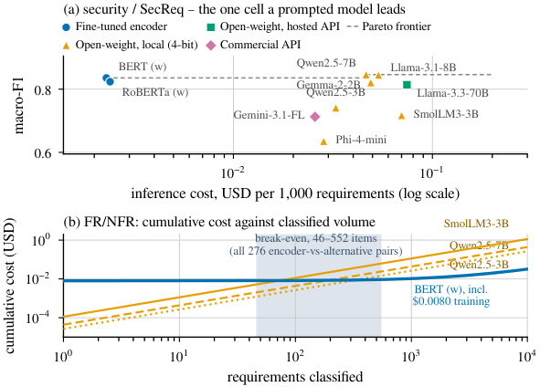

*الشكل 5 من البيبر: (a) الدقة مقابل التكلفة على SecReq، (b) التكلفة التراكمية ونقطة التعادل.*

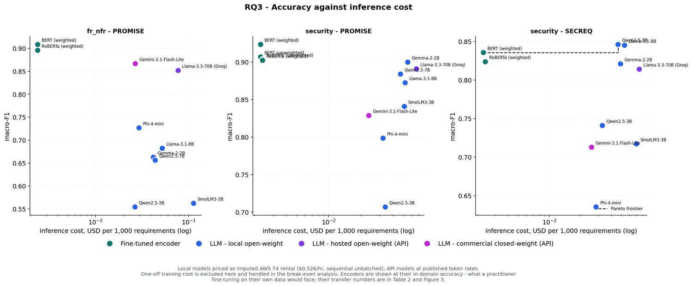

*من عرض الرسالة: RQ3 – الدقة مقابل تكلفة الاستدلال (3 لوحات).*

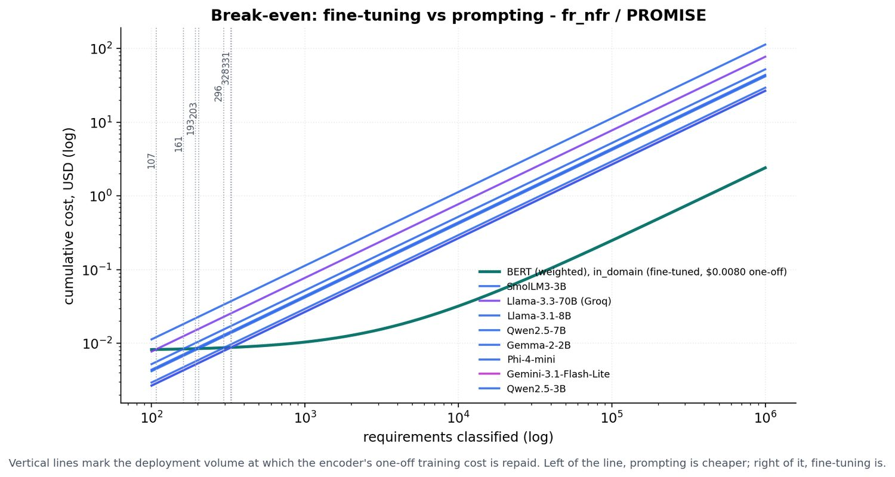

*من عرض الرسالة: نقطة التعادل (break-even) – FR/NFR على PROMISE.*

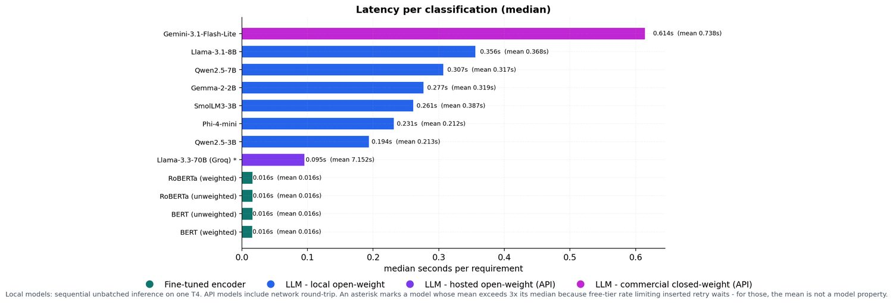

*من عرض الرسالة: زمن الاستجابة (latency) لكل تصنيف – الوسيط، والمتوسط بين قوسين.*


RQ3 هو السؤال التالت في الورقة: "إيه الـ trade-off بين الدقة والتكلفة، وإيه أرخص خيار مجاني كفاية؟". الفكرة هنا مش "مين أدق" (ده RQ1 وRQ2)، الفكرة "الدقة دي بتكلّف كام"، ولما تبقي عارفة التمن، نتيجة الـ transfer اللي شفناها في RQ2 بتتحوّل من "حكم" لـ "مقايضة" (trade-off) حقيقية. عشان تفهمي الشكل 5 والأرقام اللي فيه، لازم الأول نفهم إزاي الورقة بتحوّل "ثواني" و"tokens" لـ "دولارات". خدي بالك: كل الأرقام في القسم ده جاية من ملفات المرحلة الخامسة (Stage5_cost: cost1 لحد cost5) اللي بتتحسب من مخزن الـ predictions نفسه (76,115 صف = 24,280 encoder + 35,049 prompted binary + 16,786 prompted sub-type، زي ما مكتوب في stage5_provenance.json)، مش من جدول متكتوب بالإيد.

### 1) نموذج التكلفة (القسم III-G في الورقة): إزاي بنسعّر التصنيف الواحد

**إيه اللي متسجّل أصلاً؟** كل صف prediction في المخزن فيه: عدد الـ tokens (الوحدات اللي الموديل بيقرا وبيكتب بيها النص؛ الكلمة الإنجليزية العادية ≈ token أو اتنين)، والـ wall-clock latency (الوقت الحقيقي بالثواني من لحظة ما بعتنا الطلب لحد ما وصل الرد، بساعة الحيطة مش بساعة الـ CPU)، وللـ encoders كمان وقت التدريب (training time). الأسعار بتتحط جوّه الصف "متجمّدة" (frozen at generation time)، يعني لو جوجل غيّرت أسعارها بكرة أرقام الورقة مش هتتغيّر، وده مقصود عشان النتايج تفضل قابلة للتكرار (reproducible).

**الحوسبة المحلية (local) = إيجار مفترض (imputed rental).** الـ encoders والموديلات المفتوحة الستة اشتغلوا على كارت NVIDIA T4 مجاني (Kaggle). مجاني يعني تمنه صفر؟ لأ، الورقة بتقول: هنفترض إننا مستأجرين نفس الكارت من AWS، والـ instance اللي فيها T4 واحد اسمها g4dn.xlarge وسعرها **$0.5260 في الساعة** on-demand (يعني تأجير عادي مضمون). كلمة **imputed** معناها "منسوب/مفترض": إحنا ما دفعناش الفلوس دي فعلاً، بس بنحسب كأننا دفعناها عشان نحط المحلي والـ API على نفس المسطرة (الدولار). ليه إيجار سحابي بالذات؟ الورقة ما بتقولش صراحة، لكن ملف stage5_provenance.json بيسجّل مصدر السعر: "AWS EC2 g4dn.xlarge (1x T4), us-east-1, verified 2026-08-06"، وشرح الدفاع (وده تفسير مش نص من الورقة) إن السعر ده رقم عام قابل للتحقق منه، وأي سعر تاني هيغيّر المقدار مش الترتيب. الورقة نفسها بتحط التحفّظ ده في Threats to Validity (Construct): "GPU costs are imputed from a published rental rate, not billed... the ratios are more durable than the absolutes"، يعني النسب (9×، 47×) أهم من الأرقام المطلقة.

**تكلفة الـ item الواحد = الوقت × السعر.** السعر $0.5260 في الساعة، والساعة 3600 ثانية، يعني الثانية الواحدة من الـ T4 تمنها:
0.5260 ÷ 3600 = $0.000146 تقريباً (1.46e-4، يعني 1.46 × 10⁻⁴).

- **الـ encoder:** الوقت لكل item حوالي 0.016 ثانية (ده الـ latency اللي هنشوفها تحت). إذن:
  0.016 × 0.5260 ÷ 3600 = 0.016 × 0.000146 ≈ **$2.4e-6** لكل item (يعني حوالي 2.4 في المليون من الدولار؛ لو حسبتيها بالآلة بتطلع 2.34e-6، والملف بيكتب 2.4e-6 لأنه بيحسب من الـ latency الفعلي 0.0161 ثانية وبيقرّب لرقمين). اضربي في 1,000 → **$0.0024 لكل 1,000 تصنيف**. ده الرقم اللي هتشوفيه في كل مكان في الورقة (0.0024). في ملف cost1 بعض خلايا الـ encoder مكتوبة 0.0023 وبعضها 0.0024، لأن **متوسط** الـ latency (وهو اللي التسعير بيتحسب منه) بيتراوح بين 0.0159 و0.0166 ثانية على الـ 36 خلية إنكودر، والتقريب لأربع خانات عشرية بيطلع 0.0023 أو 0.0024؛ الـ median على الـ 36 خلية encoder = 0.0024 (ده enc_med في cost_stats.json).
- **موديل مفتوح محلي، مثلاً Qwen2.5-7B على FR/NFR:** الوقت لكل item ≈ 0.30 ثانية (في cost1 المتوسط 0.3007 ثانية). إذن:
  0.30 × 0.5260 ÷ 3600 ≈ **$4.4e-5** لكل item → **$0.044 لكل 1,000** (الملف بيقول 0.0439 بالظبط). لاحظي إن الرقم ده هو نفسه "c_alt" اللي هيدخل معادلة الـ break-even بعدين.
  ملحوظة تفسيرية (من الأرقام مش من نص الورقة): لما تعيدي الحسبة على خلايا كتير في cost1 هتلاقي إن السعر بيطلع من **متوسط** (mean) الـ latency مش الـ median (مثلاً Qwen2.5-7B على SecReq: 0.3177 mean × 1.46e-4 = 4.64e-5 → 0.0464 ✓)، لأن اللي بيتدفع فعلاً هو إجمالي وقت الـ GPU مقسوم على عدد الـ items؛ الـ median بيتستخدم بس في إسقاطات "الوقت" (هنشرح ليه تحت). ده ما بيعملش مشكلة للمحلي لأن مفيش طابور، الـ mean والـ median قريبين.
- **موديلات الـ API:** دي ما بتتسعّرش بالوقت، بتتسعّر بالـ tokens بسعر القائمة الرسمي (list price): Gemini 3.1 Flash-Lite **$0.25 لكل مليون token input و$1.50 لكل مليون token output**، وLlama-3.3-70B على Groq **$0.59 / $0.79**. كل خلية بتتحسب: (tokens_in × سعر الـ input + tokens_out × سعر الـ output) ÷ مليون ÷ عدد الـ items × 1,000. مثالين حقيقيين من cost1 على SecReq security:
  - Llama-3.3-70B: 35,161 token input و703 token output على 286 عنصر — دول من عينة الـ 300 الأساسية، مش من إطار الـ 436 (الإطار الكامل الموديلات المحلية بس هي اللي جاوبت عليه؛ المستضاف والتجاري بياخدوا العينة الأساسية zero-shot بس). يعني الـ free tier وقّع 14 طلب من الـ 300، والخلية عدّت الـ gate رغم كده. الحسبة: (35,161 × 0.59 + 703 × 0.79) ÷ 1,000,000 = (20,745 + 555) ÷ 1,000,000 = $0.0213 للـ 286 item → ÷ 286 × 1,000 = **$0.0745 لكل ألف** ✓.
  - Gemini: 5,599 input و96 output على 60 item بس (الذراع التجاري كله اشتغل بـ n ≈ 60 للخلية بسبب الحصة اليومية، وده مذكور في Threats). الحسبة: (5,599 × 0.25 + 96 × 1.50) ÷ 1,000,000 = (1,400 + 144) ÷ 1,000,000 = $0.00154 للـ 60 item → ÷ 60 × 1,000 = **$0.0257 لكل ألف** ✓.
  عشان كده الـ 70B، رغم إنه أسرع، طالع أغلى من الـ Gemini: سعره للـ token أكبر (0.59 مقابل 0.25 للـ input) وبيستهلك tokens أكتر لكل item (≈123 مقابل ≈93 input token للـ item، لأن الـ prompt نفسه بيتحسب كل مرة).

**حساسية السعر (cost4_sensitivity.csv):** سعر الـ spot (الإيجار الرخيص غير المضمون اللي AWS ممكن تسحبه منك في أي وقت) **$0.3162/h** اتحسب كتحليل حساسية — وخدي بالك إن الرقم ده مش في الورقة نفسها، هو في ملفات المرحلة 5 (`stage5_provenance.json` و`cost4_sensitivity.csv`) (sensitivity: نغيّر افتراض واحد ونشوف النتيجة بتتغيّر ولا لأ). النتيجة منطقية: تكلفة BERT(w) in-domain على FR/NFR بتنزل من 0.0024 لـ 0.00144 لكل ألف (0.0024 × 0.3162 ÷ 0.5260 = 0.00144، وده الرقم اللي في الملف)، ولو عملنا batching (نبعت 8 أو 32 items مرة واحدة للـ GPU بدل واحدة واحدة) بتنزل لـ 0.0003 و0.00007. ده مش بيغيّر أي استنتاج، لأن نفس التخفيض بينطبق على الموديلات المحلية المفتوحة كمان (كلهم على نفس الـ T4)، فالنسب بينهم ثابتة.

### 2) الشكل 5 في الورقة: لوحتين (a) و(b)

الشكل صغير (عرض عمود واحد IEEE) وفيه لوحتين فوق بعض.

#### اللوحة (a): security / SecReq، "الخلية الوحيدة اللي موديل prompted بيتقدم فيها"

**إيه المرسوم؟** scatter plot (كل موديل نقطة). المحور الأفقي (x) = تكلفة الـ inference بالدولار لكل 1,000 requirement، والمحور الرأسي (y) = macro-F1 (متوسط الـ F1 على الكلاسين بالتساوي، بغض النظر عن حجم كل كلاس؛ من 0.6 لـ 0.9 على المحور). الخلية المختارة هي task الأمن على كوربس SecReq، والـ encoders مرسومين بدرجتهم **in-domain** (اتدرّبوا واتقاسوا على SecReq نفسه بالـ 5-fold)، والـ prompted مرسومين بدرجتهم على نفس الـ SecReq (الكود بيفلتر: eval_regime in ['in_domain', 'prompted']).

**ليه المحور الأفقي log scale؟** log scale معناه إن المسافة المتساوية على الورق = مضاعفة بنفس النسبة، مش زيادة بنفس المقدار. الأرقام بتتراوح من 0.0023 لـ 0.0745، يعني حوالي 32 ضعف؛ على محور عادي الـ encoders هيتلزّقوا في الشمال خالص والباقي هيتكوّم في اليمين. على الـ log، المسافة من 0.0023 لـ 0.0046 (ضعف) بنفس مسافة من 0.05 لـ 0.10 (ضعف). في الرسم مكتوب علامة 10⁻² (= 0.01) و10⁻¹ (= 0.1)، والمحور بيبدأ من 0.0014 وينتهي عند 0.30 (xlim في الكود).

**العلامات (markers) والألوان (من make_figs.py وشكل الرسم):**

| المستوى (tier) | العلامة | اللون |
|---|---|---|
| Fine-tuned encoder | دايرة ● | أزرق |
| Open-weight, local (4-bit) | مثلث ▲ | برتقالي/أصفر |
| Open-weight, hosted API | مربع ■ | أخضر |
| Commercial API | معيّن ◆ | وردي |

**النقاط اللي في الرسم (من cost1_per_model.csv، صفوف security/secreq):**

| الموديل | macro-F1 | $ لكل 1,000 | منين التكلفة |
|---|---|---|---|
| BERT (w) | 0.8356 (≈0.836) | 0.0023 | 0.0159 ث × 0.5260/3600 |
| RoBERTa (w) | 0.8237 (≈0.824) | 0.0024 | 0.0166 ث × نفس السعر |
| Qwen2.5-7B | 0.8461 (≈0.846) | 0.0464 | 0.3177 ث × نفس السعر |
| Llama-3.1-8B | 0.8450 (≈0.845) | 0.0536 | 0.3669 ث |
| Gemma-2-2B | 0.8209 | 0.0490 | 0.3355 ث |
| Llama-3.3-70B (Groq، hosted) | 0.8140 (≈0.814) | 0.0745 | tokens: 35,161 in / 703 out بسعر 0.59/0.79 (الحسبة فوق) |
| Qwen2.5-3B | 0.7410 | 0.0327 | 0.2239 ث |
| SmolLM3-3B | 0.7172 (≈0.717) | 0.0700 | 0.4791 ث (بطيء لأنه بيكتب 2,746 token output على 436 item، أكتر من ضعف Qwen) |
| Gemini-3.1-FL (commercial) | 0.7128 (≈0.713) | 0.0257 | tokens: 5,599 in / 96 out بسعر 0.25/1.50 (الحسبة فوق) |
| Phi-4-mini | 0.6353 (≈0.635) | 0.0284 | 0.1943 ث |

**الـ Pareto frontier (الخط المتقطع الرمادي):** تعريفه: النقطة بتبقى على الـ frontier لو **مفيش نقطة تانية أرخص منها وأدق منها في نفس الوقت**. الكود بيرتّب النقاط من الأرخص للأغلى وبيمشي: أول ما يلاقي نقطة أدق من كل اللي قبلها بيرفع الخط لمستواها ("step"، خطوة). في اللوحة (a) الخط بيبدأ عند BERT(w) (0.836 بـ $0.0023) ويفضل أفقي لحد ما يوصل Qwen2.5-7B (0.846 بـ $0.0464) ويطلع درجة صغيرة ويكمل أفقي لآخر الرسم (الكود بيمدّه لحد x = 0.20). كل الباقي تحت الخط: RoBERTa(w) أغلى شوية من BERT وأقل دقة → مش على الـ frontier. Llama-3.1-8B 0.845 أغلى من Qwen (0.0536 مقابل 0.0464) وأقل منه بـ 0.001 → تحت الخط. الـ 70B (0.814 بـ $0.0745) أغلى من الكل وأقل من BERT → أبعد ما يكون عن الـ frontier.

**عنوان الشكل: "4-bit Qwen2.5-7B buys +0.011 macro-F1 for ≈19× the cost per item".** الحسبة:
- +0.011 = 0.8461 − 0.8356 = 0.0105 ≈ 0.011.
- 19× = 0.0464 ÷ 0.0024 = 19.3 (الورقة بتقسم على تكلفة مستوى الـ encoders 0.0024؛ لو قسمتي على 0.0023 بتاعة BERT بالذات تطلع 20.2، فعشان كده مكتوب "≈19×").
- وفاكرة من RQ1؟ الفرق ده **مش significant**: McNemar (اختبار paired بيعد الـ items اللي واحد بس من الاتنين صح فيها) على 436 item: BERT صح لوحده في 50 والـ Qwen صح لوحده في 55، p = 0.696. يعني بندفع 19 ضعف عشان نشتري فرق ممكن يكون صدفة.

ليه الخلية دي بالذات في الشكل؟ لأنها الخلية الوحيدة من الست خلايا اللي فيها نقطة prompted فوق الـ encoder (في التلات لوحات بتاعة الـ deck في image6 هتشوفي إن في FR/NFR وsecurity PROMISE الـ encoders فوق الكل، فالـ frontier هناك نقطة واحدة ومفيش خط بيطلع درجة). والورقة بتقول إنها "the one cell where transfer is what is measured": SecReq كوربس صغير (444 item) والدقة فيه أضعف، فأقوى موديل مجاني هناك هو أهم fallback لو ما عندكيش labels.

#### اللوحة (b): FR/NFR، التكلفة التراكمية مقابل عدد الـ items

**إيه المرسوم؟** المحور الأفقي = عدد الـ requirements اللي اتصنّفت (من 1 لـ 10,000 = 10⁰ لـ 10⁴)، والمحور الرأسي = التكلفة التراكمية (cumulative: مجموع اللي اتدفع لحد دلوقتي) بالدولار (من 10⁻⁵ لـ 2). **الاتنين log**، وده مهم: على محور log-log الخط "التكلفة = c × n" بيطلع خط مستقيم مايل، والخط اللي فيه تكلفة ثابتة "C0 + c × n" بيطلع مسطّح في الأول (لما n صغير التكلفة ≈ C0) وبعدين بيبدأ يميل لما c × n يبقى أكبر من C0.

**الخط الأزرق (BERT (w))**: معادلته: التكلفة = C0 + c_enc × n.
- **C0 = $0.0080**: تكلفة تدريب موديل واحد جاهز للنشر (deployable). جاي من: وقت أطول fold واحد في تدريب BERT(w) على FR/NFR in-domain = **54.9 ثانية** (عمود train_time_s_one_model في cost1)، × 0.5260 ÷ 3600 = **$0.00802** ≈ 0.0080. ليه أطول fold مش المتوسط؟ لأن اللي هتنشريه فعلاً موديل واحد، وبناخد الأسوأ حالة (أطول تدريب) عشان نبقى متحفظين (ده مكتوب في stage5_provenance: "one_off_training_usd prices ONE deployable model (the longest single fold)").
- **c_enc = $2.4e-6 لكل item** (شرحناها فوق: 0.016 ث × السعر). ده ميل الخط.
- فالخط بيبدأ عند 0.0080 (عند n = 1 التكلفة 0.0080 + 0.0000024 ≈ 0.0080) وبيفضل مسطّح تقريباً لحد حوالي ألف item (لأن c_enc × n ما بيوصلش لـ C₀ غير عند 0.0080 ÷ 2.4×10⁻⁶ ≈ 3,333 عنصر)، وبعدين يبدأ يطلع ببطء. عند n = 10,000: 0.0080 + 0.024 = $0.032. في الرسم مكتوب جنبه "BERT (w), incl. $0.0080 training".

**التلات خطوط البرتقالية (prompted، مفيش تدريب فبتبدأ من صفر):** الكود بيرتّب البدايل الـ 8 لـ BERT(w) في الخلية دي حسب c_alt وبياخد الأرخص، والنص، والأغلى:
- **Qwen2.5-3B (نقطي/dotted):** الأرخص، c_alt = 2.66e-5 لكل item (0.0266 لكل ألف).
- **Qwen2.5-7B (متقطع/dashed):** النص، c_alt = 4.39e-5.
- **SmolLM3-3B (متصل/solid):** الأغلى، c_alt = 1.132e-4 (0.1132 لكل ألف؛ ده أغلى خلية prompted في الورقة كلها: SmolLM3 بيكتب 10,400 token output على 960 item وبياخد 0.77 ثانية للـ item، رغم إن الـ prompt بيطلب كلمة واحدة).
- كلهم خطوط مستقيمة مايلة بميل أكبر بكتير من الأزرق (2.66e-5 ÷ 2.4e-6 ≈ 11×، و1.132e-4 ÷ 2.4e-6 ≈ 47×)، فمهما بدأوا تحت الخط الأزرق لازم يقطعوه.

**الشريط الرمادي-الأزرق المظلّل (46–552):** ده "المنطقة" اللي بتحصل فيها كل نقاط التقاطع (break-even) على مستوى الورقة كلها: الكود بيرسم axvspan من أقل N* في ملف cost3 كله (46) لأكبر واحد (552)، مش من الخلية دي بس. النص اللي جوّاه: "break-even, 46–552 items (all 276 encoder-vs-alternative pairs)". التلات خطوط البرتقالية اللي في الرسم بيقطعوا الأزرق عند 72 (SmolLM3)، 193 (Qwen2.5-7B)، و331 (Qwen2.5-3B)، والتلاتة جوّه الشريط لأن 46 ≤ 72 و331 ≤ 552؛ الشريط أوسع منهم لأنه بيلخّص كل الـ 276 زوج مش الخلية دي بس.

### 3) المعادلة (1): N* = C0 ÷ (c_alt − c_enc)، محسوبة بأرقام cost3 الحقيقية

**المعنى:** N* (اقريها N-star) = عدد الـ items اللي بعدها تكلفة الـ encoder التراكمية (C0 + c_enc × n) تساوي تكلفة البديل التراكمية (c_alt × n). حلّي المعادلة: C0 + c_enc·n = c_alt·n → C0 = (c_alt − c_enc)·n → n = C0 ÷ (c_alt − c_enc). يعني: "تكلفة التدريب" ÷ "الوفر لكل item". قبل N* الـ prompting أرخص (لسه ما دفعناش تمن التدريب)، بعد N* الـ encoder أرخص للأبد. الورقة بتسمّيها "break-even volume against any prompted alternative".

**الصفوف الحقيقية من cost3_breakeven.csv لـ BERT(w) in-domain على FR/NFR (C0 = 0.0080، c_enc = 2.4e-6):**

| البديل | c_alt ($/item) | الحسبة | N* |
|---|---|---|---|
| SmolLM3-3B | 1.132e-4 | 0.0080 ÷ (1.132e-4 − 2.4e-6) = 0.0080 ÷ 1.108e-4 | **72** |
| Llama-3.3-70B (Groq) | 7.74e-5 | 0.0080 ÷ 7.50e-5 | **107** |
| Llama-3.1-8B | 5.22e-5 | 0.0080 ÷ 4.98e-5 | **161** |
| Qwen2.5-7B | 4.39e-5 | 0.0080 ÷ 4.15e-5 | **193** |
| Gemma-2-2B | 4.19e-5 | 0.0080 ÷ 3.95e-5 | **203** |
| Phi-4-mini | 2.94e-5 | 0.0080 ÷ 2.70e-5 | **296** |
| Gemini-3.1-Flash-Lite | 2.68e-5 | 0.0080 ÷ 2.44e-5 | **328** |
| Qwen2.5-3B | 2.66e-5 | 0.0080 ÷ 2.42e-5 | **331** |

(الملف بيحسب بالأرقام غير المقرّبة، فلو حسبتيها بالآلة بالأرقام المقرّبة دي هتطلع فروق ±1، ده طبيعي.) لاحظي المنطق: كل ما البديل أغلى لكل item (SmolLM3)، الوفر أكبر والتدريب بيطلّع تمنه أسرع (72 item). وكل ما البديل أرخص (Qwen2.5-3B أو Gemini)، بنحتاج items أكتر (331).

**تحذير مهم جداً عن الرقم 107:** في الشكل 1 (المعمار) فيه "107 folds" (30 in-domain + 28 cross-project + 47 LOPO + 2 cross-dataset). وفي رسم الـ break-even في الـ deck (image7) فيه خط رأسي عند 107. **دول رقمين مختلفين تماماً بالصدفة:** الـ 107 في image7 هو N* لـ BERT(w) ضد Llama-3.3-70B (الحسبة فوق: 0.0080 ÷ 7.5e-5 = 106.7 → 107)، وحدته "items"، مش "folds". لو حد سألك في الدفاع "107 دي إيه؟" لازم تسألي: 107 folds ولا 107 items؟

**الأزواج الـ 276 كلها:** من فين 276؟ عندنا **36 خلية encoder** في cost1 (14 in-domain + 12 cross-project + 8 cross-dataset + 2 LOPO)، وكل خلية بتتقارن مع كل بديل prompted **reportable** (عدّى الـ gate: min class support ≥ 5، n ≥ 40، parse rate ≥ 0.5) في نفس الـ task/dataset: عادةً 8 موديلات LLM؛ على sub-type top-6 بس 7 (خلية Gemini سقطت في الـ gate لأن كلاس availability فيها 2 بس)؛ على all-11 بس 6 (Gemini وLlama-70B سقطوا). المجموع حسب الـ regime في cost3: 106 (in-domain) + 90 (cross-project) + 64 (cross-dataset) + 16 (LOPO: 2 خلية × 8) = **276**. لاحظي إن 106 + 90 + 64 = 260 هي بالظبط عدد اختبارات McNemar، لأن نفس منطق الأزواج؛ الفرق إن الـ LOPO مستبعد من McNemar (تجنّباً لتكرار الاختبارات) بس داخل في التكلفة.
- **المدى 46–552 والـ median 215** (cost_stats.json: be_min، be_max، be_med). الـ 46 = BERT(w) أو RoBERTa(w) cross-project على security/SecReq ضد Llama-3.3-70B: C0 = 0.0033 (تدريب أقصر، ≈22.5 ثانية، لأن SecReq أصغر)، c_alt = 7.45e-5 → 0.0033 ÷ (7.45e-5 − 2.4e-6) = 0.0033 ÷ 7.21e-5 ≈ 46. الـ 552 = RoBERTa(w) cross-project على top-4 ضد Gemini: C0 = 0.0106 (sub-types بتتدرّب 10 epochs فأطول)، c_alt = 2.16e-5 (أرخص خلية prompted في الورقة) → 0.0106 ÷ 1.92e-5 ≈ 552. الـ median 215 = الرقم اللي في نص الـ 276 بعد الترتيب.
- **الـ encoder أرخص في الـ 276 زوج كلهم عند 1,000 item وعند 100,000 item** (عمودين encoder_cheaper_at_1k / at_100k كلهم True). طبيعي: أكبر N* هو 552 < 1,000، فأي حجم فوق 552 الـ encoder فيه أرخص مهما كان البديل.

**التدريب "رخيص لدرجة الإهمال" (negligible):** رقمين لازم تفرّقي بينهم:
- **median $0.0093 لكل موديل deployable** (train_med في cost_stats.json): الـ median لعمود one_off_training_usd على الـ 36 خلية encoder (أقلها 0.0033 لـ SecReq، أكبرها 0.0158 لـ all-11). ده تمن **أطول fold واحد**.
- **≈277 GPU-seconds**: الـ median لعمود train_time_s_all_folds على نفس الـ 36 خلية (277.15 ثانية)، وده وقت تدريب **كل الـ folds** في العيلة (مثلاً BERT FR/NFR in-domain: 5 folds ≈ 273.5 ثانية، أطولهم 54.9). يعني C0 جزء من الـ 277 دي (fold واحد)، مش هي. الاتنين بيقولوا نفس الرسالة: التجربة كلها لعيلة كاملة أقل من 5 دقايق GPU وحوالي **4 سنت** (277 ثانية × 0.5260 ÷ 3600 = $0.0405، وده عمود `experiment_training_usd`)؛ اللي أقل من سنت هو تكلفة **موديل واحد قابل للنشر** (C₀، وسيطه $0.0093).

**النِسب اللي في نص الورقة (9–47×، 18×):**
- أرخص خلية prompted = **$0.0216** لكل ألف (Gemini على top-4؛ pr_min)، وأغلى = **$0.1132** (SmolLM3 على FR/NFR؛ pr_max). قسمة على تكلفة الـ encoder 0.0024: 0.0216 ÷ 0.0024 = **9×**، و0.1132 ÷ 0.0024 = **47×**.
- الـ median للـ prompted على الـ 45 خلية reportable (81 − 36) = **$0.0439** (pr_med)؛ 0.0439 ÷ 0.0024 = **18×** "at the medians".
- خدي بالك إن جدول "Cost and latency by tier" (موجود في paper/tables/tab_cost.tex وفي slide 37 من دفاعك، مش داخل نص الورقة النهائية) بيجمّع **بالمستوى**: local 0.0312–0.0522، hosted 0.0704، commercial 0.0248. دي أرقام لكل موديل مجمّعة على خلاياه، عشان كده شكلها مختلف عن 0.0216–0.1132 اللي بيغطي كل خلية على حدة. الاتنين صح، بس من مستويين تجميع مختلفين (وسلايد 37 من عرض الدفاع بتقول كده بالحرف — سلايد 19 هي بتاعة نموذج التكلفة).

**الـ Pareto frontier على مستوى الورقة كلها (cost2_pareto.csv): 10 خلايا، 9 encoders + 1 prompted.** الـ frontier مش محسوب مرة واحدة على الـ 81 خلية كلها: الكود بيحسبه **جوّه كل خلية (task × dataset) لوحدها** — `for (task, ds), g in cost1.groupby(["task","dataset"])` — وبياخد كل الأنظمة وكل الموديلات جوّه الخلية دي. فالـ 10 نقط هي **مجموع** ست جبهات: FR/NFR فيها 2، أمان PROMISE 1، أمان SecReq 2، all-11 اتنين، top-4 اتنين، top-6 واحدة:

| # | الـ task / الكوربس | الموديل | الـ regime | macro-F1 | $/1k |
|---|---|---|---|---|---|
| 1 | fr_nfr / PROMISE | BERT (w) | in_domain | 0.9083 | 0.0024 |
| 2 | fr_nfr / PROMISE | BERT (w) | cross_project | 0.8432 | 0.0023 |
| 3 | security / PROMISE | BERT (w) | in_domain | 0.9235 | 0.0023 |
| 4 | security / SecReq | **Qwen2.5-7B** (4-bit) | prompted | 0.8461 | 0.0464 |
| 5 | security / SecReq | BERT (w) | in_domain | 0.8356 | 0.0023 |
| 6 | subtype_all / PROMISE | RoBERTa (w) | in_domain | 0.7240 | 0.0024 |
| 7 | subtype_all / PROMISE | BERT (w) | cross_project | 0.5788 | 0.0023 |
| 8 | subtype_top4 / PROMISE | RoBERTa (w) | in_domain | 0.9356 | 0.0024 |
| 9 | subtype_top4 / PROMISE | BERT (w) | in_domain | 0.8780 | 0.0023 |
| 10 | subtype_top6 / PROMISE | RoBERTa (w) | in_domain | 0.8367 | 0.0024 |

نقطة الـ prompted الوحيدة هي Qwen2.5-7B على SecReq، ودي نفس النقطة اللي شرحناها في اللوحة (a). ليه ما فيش encoder cross-dataset على الـ frontier؟ لأن درجاتهم (0.5279 و0.6898 …) تحت درجات encoders تانية بنفس التكلفة تقريباً، فبيتغطّوا (dominated). وده عنوان slide 18 في الـ deck: "Encoders Hold 9 of the 10 Pareto Points".

### 4) الـ latency: "بتتصرف مختلف عن التكلفة"

**الـ latency** = الوقت بالثواني للطلب الواحد. الورقة بتبلّغ **median** (القيمة اللي في النص لما نرتّب كل الطلبات من الأسرع للأبطأ) مش mean (المتوسط الحسابي)، وهنعرف ليه.

- **الـ encoders: 0.016 ثانية** (كل الـ 36 خلية من 0.0157 لـ 0.0163). أسرع حاجة.
- **الـ 70B المستضاف (Groq): 0.095 ثانية** = الـ median على خلاياه (على الـ binary tasks 0.094–0.095، وعلى الـ sub-types 0.214–0.216 لأن الـ prompt أطول بسبب عدد الـ labels). أسرع مستوى prompted رغم إنه أكبر موديل (تفسيري أنا إن ده بسبب الـ hardware المتخصص عند Groq — مش مذكور في الورقة ولا في الملفات) (70.6 مليار parameter حسب cost1).
- **المحلية (4-bit على T4): 0.19–0.36 ثانية** لكل موديل (Qwen2.5-3B 0.194 لحد Llama-3.1-8B 0.356 في image8). الحجم بيفرق: 3B أسرع من 8B.
- **التجاري (Gemini): 0.61 ثانية** (0.601–0.631 على خلاياه؛ 0.614 في image8). أبطأ مستوى رغم إنه أرخص مستوى prompted في جدول المستويات. ده معنى "latency behaves differently": الترتيب بالسرعة مش هو الترتيب بالتمن.

**مشكلة الـ mean على الـ free tier:** لما بتشتغلي على free tier، المزوّد بيحطّك في طابور (queueing) أو بيرجّع "rate limit" وبتستني وتعيدي (retry). الطابور ده مش خاصية الموديل، بس بيدخل في الوقت المقاس. مثال حقيقي من cost1: Llama-3.3-70B على FR/NFR: **median 0.094 ثانية، لكن mean 2.07 ثانية**. وعلى top-4: median 0.216 لكن **mean 15.9 ثانية**؛ 15.9 ÷ 0.216 ≈ 74 ضعف، وده معنى "up to two orders of magnitude" (مرتبتين عشريتين = حوالي 100 ضعف). الـ median ما بيتأثرش بشوية طلبات بطيئة جداً، فهو اللي بيمثّل "سرعة الموديل"، والـ mean بيتبلّغ لوحده كعلامة (flag). في cost1 فيه عمود latency_inflated_by_queueing، وبيبقى True في 5 خلايا بس، كلها Groq (fr_nfr، security PROMISE، security SecReq، top-4، top-6). القاعدة في الكود: العلامة بتتحط لما الـ mean > 3 × الـ median. لاحظي إن Gemini ما اتعلّمش (mean 0.67–0.89 مقابل median 0.60–0.63، أقل من 3×).

### 5) رسومات الـ deck (slides 18–19، image6 / image7 / image8)

**image6 (slide 18): "RQ3 – Accuracy against inference cost"، تلات لوحات.** من الشمال لليمين: fr_nfr – PROMISE، security – PROMISE، security – SECREQ. المحور الأفقي في التلاتة = التكلفة لكل 1,000 (log)، الرأسي = macro-F1 (كل لوحة بمدى مختلف: 0.55–0.90، 0.70–0.92، 0.65–0.85). الألوان هنا مختلفة عن الورقة: الـ encoders دواير خضرا غامقة، المحلية زرقا، المستضاف بنفسجي، التجاري وردي/ماجنتا. اللي لازم تشوفيه:
- في التلات لوحات الـ encoders في **أقصى الشمال** (أرخص) وفي **الأعلى** في لوحتين. في FR/NFR: BERT(w) 0.908 وRoBERTa(w) 0.896 فوق، وأقرب prompted هو Gemini 0.867 بـ $0.0268 والـ 70B 0.852 بـ $0.0774؛ الموديلات الصغيرة (Qwen2.5-3B 0.554، SmolLM3 0.562) تحت خالص.
- في security PROMISE: BERT(w) 0.9235 فوق الكل، والأربع encoders (w وu) متكوّمين في الشمال عند ≈0.90–0.92.
- في security SecReq بس فيه خط الـ Pareto المتقطع من BERT(w) لـ Qwen2.5-7B، نفس اللوحة (a) بالظبط.
- الحاشية تحت الرسم بتقول: المحلي مسعّر كإيجار T4 مفترض ($0.526/hr، sequential unbatched)، والـ API بأسعار الـ tokens؛ التدريب مستبعد من الرسم ده (بيتعالج في الـ break-even)؛ والـ encoders مرسومين بدرجة الـ in-domain "اللي الممارس اللي بيعمل fine-tune على بياناته هيواجهها"، وأرقام الـ transfer بتاعتهم في Table 2 والشكل 3.

**image7 (slide 19، عنوان السلايد "Fine-Tuning Repays Itself Within 46–552 Requirements"): "Break-even: fine-tuning vs prompting – fr_nfr / PROMISE".** نفس اللوحة (b) بس مكبّرة ومن 100 لحد مليون item (10² لـ 10⁶). المحورين log. الخط الأخضر الغامق = BERT (weighted) in_domain مع "$0.0080 one-off" في الـ legend: مسطّح عند 0.008 لحد ≈1,000 item وبعدين بيميل ويوصل ≈$2.4 عند مليون item (0.0080 + 2.4e-6 × 10⁶ ≈ 2.41). التمن خطوط الباقية (SmolLM3، Llama-70B، Llama-8B، Qwen-7B، Gemma، Phi، Gemini، Qwen-3B، بنفس ترتيب الـ legend من الأغلى للأرخص) خطوط مستقيمة بتبدأ تحت الأخضر وبتعدّيه بدري وبتوصل من ≈$27 لـ ≈$113 عند مليون item (مثلاً SmolLM3: 1.132e-4 × 10⁶ = $113؛ Qwen2.5-3B: 2.66e-5 × 10⁶ = $27). **الخطوط الرأسية المنقّطة** عند 107، 161، 193، 203، 296، 328، 331 هي بالظبط N* بتاعة الجدول فوق؛ الـ 72 بتاع SmolLM3 مش ظاهر لأن المحور بيبدأ من 100 (10²). الحاشية تحت الرسم: "Vertical lines mark the deployment volume at which the encoder's one-off training cost is repaid. Left of the line, prompting is cheaper; right of it, fine-tuning is."

**image8 (slide 19): "Latency per classification (median)".** أعمدة أفقية، لكل موديل الـ median بالثواني، وبين قوسين الـ mean. من فوق لتحت: Gemini 0.614 (mean 0.738)؛ Llama-3.1-8B 0.356 (0.368)؛ Qwen2.5-7B 0.307 (0.317)؛ Gemma 0.277 (0.319)؛ SmolLM3 0.261 (mean 0.387، أكبر فرق بين المحليين لأن بيكتب كتير)؛ Phi-4-mini 0.231 (0.212)؛ Qwen2.5-3B 0.194 (0.213)؛ **Llama-3.3-70B (Groq) * 0.095 (mean 7.152)**؛ وأربع encoders 0.016 (mean 0.016). **النجمة (*)** جنب الـ Groq معناها: الـ mean أكبر من 3 × الـ median بسبب الـ rate limiting، فـ "الـ mean مش خاصية الموديل" (الحاشية: "for those, the mean is not a model property"). الـ 7.152 ده الـ mean على كل خلايا الـ Groq مجمّعة (خلايا بـ 1.6–2.6 ثانية وخلايا بـ 13.7–15.9 ثانية). لاحظي إن الأرقام هنا مجمّعة لكل موديل (على كل خلاياه)، عشان كده 0.307 لـ Qwen2.5-7B مش 0.3261 بتاعة خلية SecReq لوحدها.

### 6) قاعدة الممارس (من الـ Discussion)

الورقة بتختم بقاعدة قرار من تلات سطور، وكل سطر مبني على رقم من فوق:

1. **عندك كام مية requirement متعلّمين (labelled) من نفس الدومين اللي هتشتغلي فيه + أي حجم مش تافه من الشغل؟** اعملي fine-tune لـ encoder بـ 110 مليون parameter (BERT-base). هو الأدق in-domain (RQ1: كسب 67 من 106 اختبار وما خسرش ولا واحد) **وأرخص بكتير**: 9–47× أرخص لكل item، والتدريب بيطلّع تمنه بعد 46–552 item بس.
2. **داخلة دومين من غير labels أو دومين بيتغيّر؟** موديل مفتوح متوسط الحجم مضغوط (quantised، زي Qwen2.5-7B بـ 4-bit): بيضحّي بدقة in-domain، بس بيتدهور "بلطف" (degrades gracefully، RQ2) وبيشتغل مجاناً على GPU استهلاكي واحد.
3. **أسوأ اختيار:** اللي معظم الأبحاث الحديثة بتعمله ضمنياً: تعملي fine-tune على كوربس واحد وتفترضي إن النتيجة هتتنقل (RQ2: BERT وقع من 0.9235 لـ 0.5279 cross-dataset).

وآخر تحفّظ لازم تفتكريه لو اتسألتِ: N* "pure cost crossover"، يعني بيحسب التمن بس بغض النظر عن فرق الدقة، وبيسعّر الحوسبة بس: **تمن الـ annotation البشري** (إن حد يعلّم الـ requirements اللي الـ encoder محتاجها) مش محسوب، وده في صالح الـ encoder. الورقة بتقولها بنفسها في Threats to Validity (Construct).


## الحدود (Threats to validity)، المناقشة، الخلاصة، وأسئلة متوقعة مع إجاباتها

خدي نفَس. القسم ده هو آخر تلات أقسام في الورقة (V المناقشة، VI الحدود، VII الخلاصة)، وهو اللي اللجنة بتحب تسأل فيه أكتر، لأنه المكان اللي الورقة بتقول فيه بنفسها "إحنا مش متأكدين من إيه". الفكرة اللي عايزاكي تمسكيها من الأول: كل حدّ (threat) في الورقة مكتوب معاه **رقم** و**اتجاه** (يعني الحدّ ده بيخدم مين لو كان موجود فعلاً: إحنا ولا ضدنا). لما تفهمي الرقم والاتجاه، أي سؤال في الدفاع بيبقى سهل.

تذكير سريع بالتلات regimes (أنظمة التقييم) لأنها هتتكرر في كل سطر: **in-domain** = التدريب والاختبار من نفس الكوربس بتقسيم عشوائي؛ **cross-project** = بنحجز مشاريع كاملة للاختبار؛ **cross-dataset** = التدريب على كوربس والاختبار على كوربس تاني (PROMISE_exp ↔ SecReq، على task الـ security بس).

كلمة "threat to validity" نفسها يعني: إيه اللي ممكن يخلّي استنتاج الورقة غلط أو أضعف مما بيبان. وبيتقسم في الأبحاث التجريبية لأربع أنواع، وهنمشي عليهم بالترتيب اللي في الورقة:

- **Internal validity**: هل الفرق اللي شفناه سببه فعلاً اللي بنقول عليه، ولا حاجة في طريقة التجربة نفسها؟
- **Construct validity**: هل الحاجة اللي قسناها (التكلفة، الدقة) هي فعلاً الحاجة اللي بندّعي إننا قسناها؟
- **External validity**: هل النتيجة دي هتتعمّم برّه الداتا والإعداد اللي جربنا عليه؟
- **Conclusion validity**: هل الإحصاء اللي طلّعنا بيه الاستنتاج سليم؟

---

### أولاً: Internal validity (أربع حدود، كل واحد برقمه)

#### الحد 1: الذراع التجاري (Gemini) اشتغل على n ≈ 60 لكل خلية، و23 من 26 مقارنة فيه "غير حاسمة"

**إيه هو الرقم 60؟** عدد العناصر (requirements) اللي Gemini 3.1 Flash-Lite جاوب عليها في كل خلية. الخلية = موديل × task × dataset × regime.

**جاي منين؟** من الكود (stage3b): الـ free tier بتاع Gemini كان عنده سقف يومي 180 طلب، والتلات tasks اتقسّموا عليه: 180 ÷ 3 = 60 عنصر لكل task. قارني ده بالـ 300 عنصر اللي الموديلات التانية اتقيّمت عليها (هنرجع للـ 300 في الأسئلة تحت). في خلية top-4 الرقم 59 مش 60 (الورقة بتكتب "n = 59--968" في نص RQ1، وفي عنوان الجدول IV بتكتب "n = 59--960" للخلايا الـ prompted، والـ CSV بيقول n_paired = 59 لأربع اختبارات)، والورقة ما بتقولش ليه 59 بالظبط.

**إيه هي الـ 26؟** دي عدد اختبارات McNemar اللي Gemini طرف فيها من إجمالي الـ 260. (McNemar = اختبار إحصائي بيقارن موديلين على **نفس** العناصر بالظبط، وبيبص بس على العناصر اللي واحد فيهم صح والتاني غلط.) طلّعتهم من `tab4_mcnemar.csv` وقسّمتهم بالـ task:

| الخلية (task / dataset) | عدد الاختبارات | ليه العدد ده |
|---|---|---|
| FR/NFR على PROMISE_exp | 4 | encoderين (BERT_w, RoBERTa_w) × regimeين (in-domain, cross-project) = 2 × 2 |
| Security على PROMISE_exp | 10 | BERT_w و RoBERTa_w في 3 regimes (2 × 3 = 6) + النسختين unweighted في regimeين بس (in-domain و cross-dataset) (2 × 2 = 4) |
| Security على SecReq | 8 | BERT_w و RoBERTa_w في 3 regimes (6) + النسختين unweighted في cross-dataset بس (2) |
| Sub-types top-4 | 4 | 2 encoders × 2 regimes |
| **المجموع** | **26** | 4 + 10 + 8 + 4 |

ليه Gemini مالهاش اختبارات على top-6 و all-11؟ لأن الخليتين دول سقطوا في الـ gate (هنشوف بعد شوية): في all-11 كان فيه 7 كلاسات دعمها أقل من 5 عناصر (availability=1, maintainability=1, scalability=1, look_and_feel=2, portability=2, fault_tolerance=4, legal=4)، وفي top-6 كلاس availability كان فيه عنصرين بس.

**إيه هي الـ 23؟** من الـ 26 دول، الـ verdict (الحكم) طلع n.s. (not significant = مفيش فرق دال إحصائياً) في 23. الباقي 3: مرة واحدة الـ encoder كسب (BERT_w in-domain على SecReq security: 13 عنصر الـ encoder صح فيهم بس مقابل 2 لـ Gemini، p = 0.0074، وبعد تصحيح BH بقى 0.0126)، ومرتين Gemini كسبت (الاتنين cross-dataset على PROMISE security: 21 عنصر Gemini صح فيهم بس مقابل 2 لـ BERT_w، p = 0.000066؛ و21 مقابل 3 لـ BERT_u، p = 0.00028).

**يعني إيه "limited power" وليه n = 60 صغير؟** الـ power = قدرة الاختبار إنه يكتشف فرق حقيقي لو موجود. McNemar بيشتغل على العناصر "المختلف عليها" بس (b = الـ encoder صح والـ LLM غلط، c = العكس)، وبيحسب p = احتمال إن التقسيم ده يطلع بالصدفة لو الاتنين متساويين. على 60 عنصر بس، عدد العناصر المختلف عليها بيبقى صغير جداً، فحتى لو الـ encoder كسب **كل** العناصر المختلف عليها، الـ p ممكن ما ينزلش تحت 0.05. مثال حقيقي من الـ CSV: BERT_w in-domain على PROMISE security ضد Gemini: b = 5، c = 0، يعني الـ encoder كسب 5 من 5 والـ LLM كسب صفر، ومع ذلك p = 0.0625 (= 2 × 0.5^5، اختبار ثنائي الجانب) → n.s. عشان الفرق يبان لازم على الأقل 6 عناصر تروح كلها في اتجاه واحد (2 × 0.5^6 = 0.031). ده حسابي أنا من قاعدة الاختبار اللي في الكود (`binomtest(min(b,c), b+c, 0.5)`)، مش رقم في الورقة، بس هو اللي بيوضّح ليه 60 صغيرة. قارني بخلية 436 عنصر: BERT_w ضد Qwen2.5-7B على SecReq كان b = 50 و c = 55، يعني فيه 105 عنصر مختلف عليهم، ودي عينة تقدر تكشف فروق صغيرة.

**النتيجة على الادعاء:** لما الورقة تقول "الـ encoders عمرها ما اتغلبت بشكل دال in-domain"، الجزء الخاص بـ Gemini من الجملة دي فيه ضعف: مش لأن Gemini خسرت، لكن لأن العينة صغيرة لدرجة إن الاختبار ما يقدرش يقول حاجة. الورقة بتقولها بصراحة: "partly reflects limited power".

#### الحد 2: حصص الـ free tier عملت dropout "missing-not-at-random"، والـ gate بتستبعد مش بتعوّض

**إيه هو؟** بعض الموديلات المستضافة (hosted، يعني بتتنادى عبر API) ما كملتش كل العناصر لأن المزوّد وقّف الطلبات (rate limiting). الكود بيوثّق حالة محددة: 145 صف من Llama-3.3-70B (على Groq) ضاعوا في task الـ sub-types بسبب الـ rate limiting.

**يعني إيه missing-not-at-random (MNAR)؟** لو الفقد كان عشوائي (missing at random)، العناصر اللي ضاعت كانت هتبقى عينة ممثلة من الكل، وتقدري تكمّلي عادي. لكن هنا الفقد مش عشوائي: الكود بيقول إن كلاس maintainability بالذات خسر 60% من عناصره. ليه؟ الورقة والكود ما بيقولوش السبب بالظبط، بس المنطق إن الطلبات بتتقطع بترتيب زمني، فالكلاسات اللي جت في آخر الطابور بتضيع أكتر. النتيجة: الخلية اللي بقيت فيها maintainability = 4 عناصر بس (أقل من 5)، فخلية Llama-3.3-70B على all-11 سقطت في الـ gate.

**ليه الـ gate "بتستبعد" (exclude) مش "بتعوّض" (impute)؟** التعويض معناه إنك تملي الفراغات بتخمين (مثلاً تفترضي إن الموديل كان هيجاوب زي متوسطه). لكن لما الفقد بيركّز في كلاس معين، أي تعويض هيبقى تخمين متحيّز عن أصعب الكلاسات بالذات. فالورقة اختارت إن الخلية كلها تتشال من الجداول، والتنبؤات الخام تفضل في المخزن. الـ gate نفسها تلات شروط (من Section III-F): (1) كل كلاس فيه ≥ 5 عناصر اختبار، (2) الخلية فيها ≥ 40 عنصر، (3) الموديل قدر يتعمل له parse لـ ≥ 50% من ردوده. سقط فيها 6 من 87 خلية:

| الخلية | سبب السقوط |
|---|---|
| Gemini، all-11 | 7 كلاسات دعمها < 5 (سقف 180 طلب/يوم) |
| Gemini، top-6 | availability = 2 |
| Llama-3.3-70B، all-11 | maintainability = 4 (الـ 145 صف الضايعين) |
| Nemotron 3 Nano، FR/NFR | n = 21 < 40، وكمان parse = 0% |
| Nemotron 3 Nano، security PROMISE | n = 21 < 40، وكمان security = 2 |
| Nemotron 3 Nano، security SecReq | n = 21 < 40 |

الـ 87 = خلايا الـ 12 configuration + 3 خلايا Nemotron (الموديل التاسع اللي الورقة بتقول إنه "اتحاول وسقط"). 87 − 6 = 81 خلية قابلة للتبليغ (الرقم اللي في آخر شريحة في الـ deck: "81 / 87").

#### الحد 3: الموديلات المحلية اشتغلت 4-bit، وده ممكن يقلّل من دقتها الحقيقية

**إيه هو الـ 4-bit؟** الـ quantisation = ضغط أوزان الموديل من 16 bit للرقم إلى 4 bits (بطريقة NF4)، عشان موديل 7 أو 8 مليار parameter ينفع يشتغل على كارت T4 المجاني. الست موديلات المحلية (Gemma-2-2B، SmolLM3-3B، Qwen2.5-3B، Phi-4-mini، Qwen2.5-7B، Llama-3.1-8B، من 2.6 إلى 8.0 مليار parameter) كلها اشتغلت كده. الـ encoders (BERT، RoBERTa) اشتغلت full precision.

**الاتجاه:** الضغط ممكن يخسّر الموديل شوية دقة، فالأرقام اللي شفناها للموديلات المحلية ممكن تكون **أقل** من قدرتها الحقيقية بدقة كاملة. يعني الحد ده لو موجود فهو ضد الـ prompted models وفي صالح الـ encoders in-domain. الورقة ما بتقيسش قد إيه الفرق (ما فيش تجربة full-precision مقابلة)، فبتذكره كحد.

#### الحد 4: seed واحد لكل configuration، فالفروق الصغيرة بين encoder وencoder ما تتقراش بجدية

**إيه هو الـ seed؟** رقم البذرة العشوائية (42 في الورقة كلها) اللي بيحدد تهيئة الأوزان وترتيب الداتا في التدريب. لو غيّرتي الـ seed وأعدتي التدريب، الـ macro-F1 (المقياس الأساسي: متوسط الـ F1 لكل كلاس بالتساوي، فالكلاس النادر بيتحسب زي الكبير) بيتحرك شوية. الورقة درّبت كل configuration مرة واحدة.

**المثال اللي الورقة بتحذّر منه:** على PROMISE security in-domain (الجدول IV): BERT_w = 0.923، BERT_u = 0.907، RoBERTa_u = 0.903، RoBERTa_w = 0.902. الفرق بين الأول والأخير 0.021، وبين التلاتة الأخيرين 0.005 بس. هل ده معناه إن BERT_w "أحسن"؟ لأ، مش بالضرورة: فترة الثقة (95% bootstrap CI) بتاعة BERT_w نفسها من 0.8977 إلى 0.9463 (من `tab9_evaluability.csv`)، يعني عرضها 0.0486، وده أكبر من الفرق بين الأربعة كلهم. مع seed واحد ما تقدريش تفرّقي بين "الموديل أحسن" و"الحظ كان أحسن". (الـ bootstrap = بنعيد سحب العينة 2,000 مرة بـ seed 42 جوه كل كلاس حقيقي، ونحسب المقياس كل مرة، عشان نطلّع مدى الـ 95%.)

**ليه ده مش بيهدّ الورقة؟** لأن الاستنتاجات الأساسية مش مبنية على فرق encoder ضد encoder، لكن على 260 اختبار paired بين encoder وLLM بتصحيح متعدد، وعلى انهيار قدره 42.8% مش 2%.

---

### ثانياً: Construct validity (هل قسنا اللي بندّعيه؟)

#### الحد 5: تكلفة الـ GPU "imputed" مش "billed"، والأسعار أسعار قوائم 2026

**إيه المشكلة؟** الموديلات المحلية اشتغلت على T4 مجاني (free tier؛ الـ notebooks بتكتب مخرجاتها في مسار Kaggle)، يعني ما فيش فاتورة حقيقية. فالورقة **افترضت** إيجار: AWS g4dn.xlarge (كارت T4 واحد) بـ 0.5260 دولار/ساعة on-demand. وأسعار الـ API أسعار القوائم المعلنة في 2026: Gemini 3.1 Flash-Lite 0.25 دولار للمليون input token و1.50 للمليون output، وLlama-3.3-70B 0.59 / 0.79. الأسعار بتتجمّد جوه كل صف prediction وقت التوليد.

**ليه "النسب أمتن من الأرقام المطلقة"؟** لأن لو سعر الكارت اتغيّر، تكلفة الـ encoder (0.0024 دولار لكل 1,000 تصنيف) هتتغير، بس النسبة بينها وبين الـ prompted (0.0216 إلى 0.1132 لكل 1,000) هتفضل قريبة من 9× إلى 47× طالما الاتنين متسعّرين بنفس المنطق. الحسبة: 0.0216 ÷ 0.0024 = 9، و0.1132 ÷ 0.0024 = 47.2. وعشان كده الورقة عملت تحليل حساسية بسعر الـ spot (0.3162 دولار/ساعة) في `cost4_sensitivity.csv`.

#### الحد 6: N* بيحسب تقاطع التكلفة بس، وبيتجاهل فجوة الدقة

**إيه هو N*؟** عدد التصنيفات اللي بعده الـ encoder بيبقى أرخص من بديل prompted، لأنه دفع تكلفة تدريب مرة واحدة (C₀) وبعدها كل عنصر أرخص. المعادلة (Eq. 1): N* = C₀ ÷ (c_alt − c_enc). مثال محسوب من `cost3_breakeven.csv`: BERT_w على FR/NFR، C₀ = 0.0080 دولار (= 54.9 ثانية تدريب ÷ 3600 × 0.5260)، c_enc = 0.0000024 دولار/عنصر، البديل Llama-3.3-70B بـ 0.0000774 دولار/عنصر → N* = 0.0080 ÷ (0.0000774 − 0.0000024) = 0.0080 ÷ 0.000075 ≈ 107 عنصر. المدى عبر كل الـ 276 زوج: 46 إلى 552 (الوسيط 215).

**إيه الحد؟** المعادلة دي "عمياء" عن الدقة: بتقول "امتى الـ encoder بيبقى أرخص" مش "امتى بيبقى أحسن". مثلاً على SecReq security، Qwen2.5-7B أعلى بـ +0.011 macro-F1 (0.846 مقابل 0.836) بحوالي 19× التكلفة، وN* مش بيحسب الـ +0.011 دي خالص. وطبعاً في الـ cross-dataset، الـ encoder "الأرخص" هو نفسه اللي خسر 42.8%.

#### الحد 7: تكلفة الـ annotation البشري مش محسوبة، وده في صالح الـ encoder

**ليه؟** الـ encoder محتاج "بضع مئات" requirement معنونة يدوياً قبل ما يتدرّب (الورقة بتقول "a few hundred labelled requirements" في قاعدة القرار)، والـ prompted model مش محتاج ولا واحدة. نموذج التكلفة بيسعّر الحوسبة بس (GPU وtokens). لو أضفنا ساعات المعنون البشري، C₀ هتكبر كتير وN* هيكبر معاها. الورقة بتقول الحد ده صراحة وبتقول اتجاهه: "favours the encoder".

#### الحد 8: الـ scoring الصارم بيختلف عن البروتوكولات المتساهلة

**إيه القاعدة؟** الرد اللي ما فيهوش label واحد واضح (بيذكر الاتنين أو ولا واحد) بيتحسب **غلط**. البروتوكولات المتساهلة في أبحاث تانية بتعيد المحاولة أو تتجاهل الرد الغامض. الورقة اختارت الصرامة لأنها بتطابق الـ deployment (الرد الغير نافع مش "معدّي"). بس ده معناه إن أرقام الـ prompted هنا ممكن تطلع أقل من نفس الموديلات في أوراق تانية. في الواقع الأثر كان صغير على الموديلات اللي عدّت الـ gate: في sub-study الصياغة الـ parser قبل 99.98% من 11,518 رد.

---

### ثالثاً: External validity (هل هتتعمّم؟)

#### الحد 9: الكوربسات صغيرة، قديمة، وعامة

PROMISE_exp: 969 requirement خام من 47 مشروع (نُشر 2019 كتوسعة لـ PROMISE الأصلي)، SecReq: 510 خام من 3 مواصفات صناعية (2011). بعد إزالة 67 نص مكرر: 1,412 requirement. "صغيرة" واضحة من الأرقام؛ "قديمة وعامة" مهمة لسببين: احتمال التلوث (contamination، هنشرحه في المناقشة) وإن نفس الكوربسات دي وراء أغلب نتائج المجال.

#### الحد 10: تعريف الـ security label نفسه مختلف بين الكوربسين

ده أهم حد خارجي. في PROMISE_exp، الـ security مشتقة من الـ sub-class **SE** جوه الـ NFR، يعني بالبناء أي requirement أمني هو non-functional. في SecReq، المعنونين علّموا **أي** جملة ليها علاقة بالأمن، حتى لو functional (زي "النظام يشفّر الرسالة"). فلما BERT اتدرّب على SecReq واتقاس على PROMISE، هو ما واجهش بس نسبة مختلفة (39.9% مقابل 12.9%)، لكن كمان **تعريف** مختلف للكلمة. الورقة بتسمّي ده "definitional shift" جنب الـ "distributional shift". وكمان الـ cross-dataset اتعمل على زوج كوربسات **واحد** بس (لأنه الـ task الوحيد اللي الكوربسين بيعنونوه)، فما نقدرش نقول إن نفس الحجم هيتكرر مع أي زوج تاني.

#### الحد 11: إنجليزي بس، وtaxonomy واحدة

كل الـ requirements إنجليزي، والـ sub-types بتاعة NFR بتمشي على taxonomy واحدة (11 كلاس بتاعة Cleland-Huang 2007). نتايج على لغة تانية أو تصنيف تاني برّه نطاق الادعاء.

---

### رابعاً: Conclusion validity (هل الإحصاء سليم؟)

هنا الورقة مش بتذكر ضعف، بتذكر احتياطاتها:

- **الاختبارات exact**: McNemar محسوب كـ exact binomial test على العناصر المختلف عليها، مش تقريب chi-square، وده أنسب للأعداد الصغيرة (زي الـ 5 و0 عند Gemini).
- **عيلة واحدة (one family)**: الـ 260 اختبار اتصحّحوا مع بعض: 175 دال قبل التصحيح، 170 بعد Benjamini–Hochberg (BH)، 131 بعد Holm، عند α = 0.05. (التصحيح المتعدد = لما تعملي 260 اختبار، هيطلع منهم حوالي 13 دال بالصدفة لو مفيش فرق حقيقي؛ التصحيح بيرفع العتبة عشان يمنع ده.)
- **الـ splits مجمّدة**: اتولّدت مرة واحدة بـ seed 42، ومربوطة بالـ SHA-256 hash لكل ملف مصدر، وما بتتولدش تاني أبداً لأن عضوية الـ grouped folds بتتغير مع نسخة المكتبة (scikit-learn).

---

### المناقشة (Section V) بالتفصيل

#### 1. "The regime is part of the claim": ليه benchmark بيقيس in-distribution بس ممكن يطلّع الاستنتاج **المعاكس** مش بس أضعف؟

التمييز ده دقيق ومهم. لو الـ cross-dataset كان بيقلّل الفرق بس (مثلاً الـ encoder يكسب 67 in-domain و30 cross-dataset)، كنا هنقول إن الـ in-domain "مبالغ فيه" بس اتجاهه صح. لكن اللي حصل: in-domain 67 فوز للـ encoder / 39 تعادل / 0 خسارة، وcross-dataset 3 / 13 / 48. الاتجاه نفسه اتعكس على **نفس** الـ 12 موديل ونفس العناصر ونفس الـ scorer. يعني لو قريتي ورقة بتقيس in-domain بس وبتقول "الـ encoder أحسن"، وطبّقتيها في مجال جديد، هتاخدي القرار الغلط مش القرار "أقل أماناً". عشان كده الورقة بتطلب إن أي نتيجة تصنيف requirements تذكر الـ regime كجزء من الادعاء، وإن كلمة "generalisation" تعني مشاريع محجوزة أو كوربس مستقل، مش "نفس الكوربس بس task تاني".

في Fig. 3(b) ده مرسوم كتلات أفقية: الأزرق (encoder wins) بيملا 67 من 106 في الصف الأول ويختفي تقريباً في الصف الأخير، والبرتقالي المخطط (LLM wins) بيعمل العكس: 0 فوق و48 من 64 تحت.

#### 2. قاعدة القرار للممارسين

- **عندك بضع مئات requirement معنونة من نفس المجال اللي هتشتغلي فيه + حجم مش تافه؟** encoder صغير (110 مليون parameter زي BERT-base) هو الأدق (67–39–0) والأرخص بفارق (0.0024 دولار/1,000 مقابل 0.0216–0.1132)، وبيسدد تدريبه بعد 46–552 تصنيف.
- **داخلة مجال مش معنون أو بيتغير؟** موديل مفتوح متوسط مكمّم (4-bit) أأمن: بيتنازل عن شوية دقة in-domain، لكن بيتدهور بلطف (الـ prompted models اتحركت بين −0.034 و+0.163 بين الكوربسين) وبيشتغل مجاناً على كارت واحد. المثال: Qwen2.5-7B، النقطة الوحيدة الـ prompted على حافة Pareto (الـ Pareto frontier = مجموعة الخلايا اللي مفيش خلية تانية أدق منها وأرخص منها في نفس الوقت؛ فيها 10 خلايا، 9 منهم encoders)، على SecReq security بـ 0.846.
- **الأسوأ:** الافتراضي الضمني في الأبحاث الحديثة: تدرّبي على كوربس وتفترضي إن النتيجة بتنتقل. ده اللي عمل 0.923 → 0.528.

#### 3. "Contamination cuts in our favour": المنطق خطوة خطوة

الـ contamination = احتمال إن الـ LLM شاف الكوربس نفسه (بنصوصه وربما بلابلاته) في بيانات الـ pre-training، لأنه قديم وعام ومنشور على النت. لو حصل ده، الـ LLM "فاكر" الإجابة مش "بيفهم" السؤال. خلّينا نمشي المنطق ببطء:

1. **فين التلوث بيساعد؟** بيرفع درجات الـ prompted models على الكوربسات دي، وده يعني درجاتهم **in-domain** ممكن تكون متضخمة.
2. **إحنا قلنا إيه in-domain؟** إن الـ encoders بتكسب (67–39–0). يعني حتى لو الـ prompted models واخدة مساعدة غير مستحقة من التلوث، الـ encoders لسه كسبت. لو شلنا التلوث، الـ prompted هتنزل، والفارق لصالح الـ encoders هيكبر. فرقم الـ 67 ده **conservative** (تقدير من تحت للفرق الحقيقي).
3. **هل التلوث ممكن يفسّر الانقلاب في الـ cross-dataset؟** لأ. الـ prompted models ما بتتدربش على حاجة، فدرجتها على PROMISE هي نفسها في الـ regime الـ in-domain وفي الـ cross-dataset (هي بتشوف نفس العناصر بنفس الـ prompt). اللي اتحرك هو الـ **encoder** لما اتدرّب على كوربس تاني. التلوث كان هيرفع الـ prompted models في النظامين **بالتساوي**، فما يقدرش يخلق فرق بين النظامين. يعني: التلوث ممكن يشكّك في حجم الفارق in-domain (وده في صالحنا)، ومش ممكن يشكّك في الانقلاب.

خدي بالك إن الورقة ما بتدّعيش إن التلوث **مش موجود**؛ بتقول إنه لو موجود فهو بيخدم استنتاجها.

#### 4. Availability / reproducibility

كل الـ pipeline والـ splits المجمّدة ومخزن الـ 76,115 prediction والسكربتات اللي بتعيد توليد كل جدول وشكل منشورين. النقطة الجوهرية: الـ scoring "pure function" من المخرجات الخام المخزنة، يعني نفس المدخلات بتدي نفس الأرقام دايماً من غير ما حد يشغّل أي موديل تاني. وده اللي بيخلي مثلاً `tab4_mcnemar.csv` تتعاد بالظبط بالـ 260 صف بتوعها. والـ splits مربوطة بالـ hash والـ seed زي ما قلنا فوق.

---

### الخلاصة (Section VII) في نقاط بالأرقام

- **12 configuration**: 4 encoder variants (BERT وRoBERTa، كل واحد weighted وunweighted) + 8 LLMs (6 محلية 4-bit، واحد hosted 70B، وواحد تجاري).
- **3 tasks** (FR/NFR، security، NFR sub-types بتلات أحجام) × **3 regimes** (in-domain، cross-project، cross-dataset) على 1,412 requirement.
- **76,115 prediction** بقاعدة scoring صارمة واحدة = 24,280 encoder + 35,049 prompted binary + 16,786 prompted sub-type.
- **260 اختبار McNemar** مصحّحين كعيلة واحدة = 106 in-domain + 90 cross-project + 64 cross-dataset (175 دال خام، 170 بعد BH، 131 بعد Holm).
- **In-domain: 67–39–0**؛ الـ encoders عمرها ما اتغلبت بشكل دال. **Cross-dataset: 3–13–48**؛ الـ prompted models بتكسب 48 من 64.
- **أكبر انهيار −42.8%**: BERT_w على PROMISE security من 0.9235 إلى 0.5279 على نفس العناصر: (0.5279 − 0.9235) ÷ 0.9235 = −0.428.
- **السبب prior مش مفردات**: الـ encoder المنقول بيقول security على 44.2% من عناصر PROMISE، بينما الحقيقي 12.9%، لأنه جاي من كوربس فيه 39.9% security. الـ precision (من اللي قال عليهم security، كام واحد فعلاً security؟) وقعت من 0.847 لـ 0.210 والـ recall (من الـ security الحقيقيين، لقى كام واحد؟) وقع أقل بكتير (0.888 → 0.720): لسه بيلاقيهم، بس مش قادر يبطّل يلاقيهم.
- **نفس العيب عند الـ prompted models من مصدر تاني**: دقة FR/NFR بتاعتهم بتترتب مع قد إيه غلّطوا الـ prior (Spearman ρ = 0.95 على 8 موديلات)، وإعادة صياغة السؤال بس بتحرك macro-F1 لحد 0.485 (Gemma-2-2B على SecReq: 0.827 / 0.343 / 0.828).
- **التكلفة**: الـ encoders أرخص 9–47× (0.0024 مقابل 0.0216–0.1132 دولار لكل 1,000 تصنيف)، وبتسدد تدريبها بعد 46–552 عنصر (الوسيط 215) في كل الـ 276 زوج.
- **الرسالة**: بروتوكولين المجال بيعاملهم كأنهم واحد بيدّوا ترتيبين متعاكسين من نفس الداتا؛ درجة in-distribution مش إجابة ناقصة، ممكن تكون الإجابة الغلط. درّبي encoder لمجال ثابت ومعنون؛ استخدمي prompting لما التوزيع يتحرك.

---

### 12 سؤال متوقع من اللجنة عن الأرقام والأشكال

**1. ليه 5 folds في الـ in-domain؟**
الـ in-domain بيستخدم `StratifiedKFold(n_splits=5, shuffle=True, random_state=42)`: الكوربس بيتقسم 5 أجزاء متوازنة في نسب الكلاسات، وكل جزء بيبقى اختبار مرة واحدة والباقي (80%) تدريب. 6 عائلات in-domain × 5 = 30 fold من الـ 107. الورقة ما بتبرّرش الرقم 5 نفسه؛ الـ deck بيقول إن الـ in-domain "plain stratified 5-fold" عشان هو الـ reference اللي الأبحاث السابقة بتبلّغه، فبنعيده زي ما هو. والكود بيقلّل k بس لو كلاس فيه أقل من 5 عناصر، وده ما حصلش في العائلات المبلّغة.

**2. الـ 107 دي إيه؟**
عدد الـ folds المجمّدة في 14 عائلة splits: 30 (in-domain: 6 عائلات × 5) + 28 (cross-project: FR/NFR 5، security PROMISE 5، security SecReq 3 لأن فيه 3 مواصفات بس، sub-types 5 + 5 + 5) + 47 (leave-one-project-out على 47 مشروع PROMISE) + 2 (cross-dataset: اتجاهين) = 107. خدي بالك: فيه رقم 107 تاني في الـ deck هو N* بتاع BERT_w ضد Llama-3.3-70B على FR/NFR، ودي صدفة حسابية مالهاش علاقة بالـ folds.

**3. ليه 300 عنصر لكل خلية binary؟**
من الكود (stage3): الـ 300 هي أكبر n بحيث حصة يوم واحد مجانية عند مزوّد واحد (900 طلب) تغطي التلات مجموعات: 3 × 300 = 900. وعند n = 300 فرق macro-F1 حوالي 0.08 بيبان عند p < 0.05، وده أقل من التباعد الملحوظ بين الموديلات. الـ sub-types 200 (3 × 200 = 600 في نفس الحصة)، بس أرضية 10 عناصر لكل كلاس رفعت all-11 لـ 218. العينة proportional (بتحافظ على نسبة الكلاسات) مش balanced. الموديلات المحلية جاوبت كمان على الإطار الكامل (960 / 960 / 436).

**4. ليه macro-F1 مش accuracy؟**
لأن الداتا غير متوازنة. مثال محسوب: على PROMISE security، لو الموديل قال "مش security" لكل حاجة، الـ accuracy = 0.871 (نسبة الغير أمني)، لكن F1 لكلاس non-security = 2 × 0.871 ÷ (1 + 0.871) = 0.931، وF1 لكلاس security = 0، فالـ macro-F1 = (0.931 + 0) ÷ 2 = 0.466. الـ macro بيفضح الموديل اللي بيتجاهل الكلاس النادر. وكمان بيتحسب على **كل** الـ label set المعلنة، فالموديل بيتعاقب على أي كلاس عمره ما تنبّأ بيه (مهم في all-11).

**5. إيه معنى n.s.؟**
Not significant: الـ p بعد تصحيح BH ≥ 0.05، فما نقدرش نقول إن فيه فرق. مثال: Qwen2.5-7B 0.846 مقابل BERT_w 0.836 على SecReq؛ من 436 عنصر، الـ encoder صح لوحده في 50 والـ LLM صح لوحده في 55؛ p = 0.696، بعد BH = 0.774 → n.s. = تعادل، مش خسارة. من الـ 260: 39 n.s. in-domain، 38 cross-project، 13 cross-dataset (المجموع 90).

**6. ليه الحكم على BH مش Holm؟**
الاتنين اتحسبوا على نفس الـ 260: 170 دال بعد BH و131 بعد Holm. الورقة ما بتقولش ليه اختارت BH للـ verdict. تفسيري (مش من الورقة): Holm بيتحكم في احتمال **أي** خطأ من النوع الأول في العيلة كلها (FWER) فهو أشد، وBH بيتحكم في نسبة الاكتشافات الكاذبة (FDR) فهو أقل صرامة وأكتر power، وده أنسب لعيلة 260 اختبار. ولو سألوكي "والنتيجة تتغير تحت Holm؟" الإجابة من الـ CSV (حسبتها بنفسي من عمود sig_holm): in-domain 56 فوز encoder / 50 n.s. / 0 خسارة، وcross-dataset 0 / 24 / 40. الانقلاب موجود تحت الاتنين.

**7. ليه ما صلّحتيش الـ prior؟**
لأن سؤال البحث هو "إيه اللي بيحصل في الـ transfer الخام زي ما الممارسة بتعمله"، وتعديل الـ prior (threshold أو prior adjustment، Saerens 2002) كان هيغيّر الكمية اللي بنقيسها. الورقة بتقول إنه الخطوة الجاية الواضحة، وميزته إنه ما يحتاجش labels من الكوربس الهدف. والتشخيص نفسه (44.2% مقابل 12.9%، precision 0.847 → 0.210 مع recall 0.888 → 0.720) هو اللي بيقول إن التصحيح ده هينفع.

**8. الـ 0.485 دي إيه؟**
أكبر "spread" (فرق بين أعلى وأقل macro-F1 لنفس الموديل على نفس العناصر لما تتغير صياغة الـ prompt بس) في sub-study الصياغة: Gemma-2-2B على SecReq security: base 0.827، terse 0.343، verbose 0.828 → 0.828 − 0.343 = 0.485 (في الـ CSV 0.4846). السبب: الـ terse هي الصياغة الوحيدة على شكل سؤال نعم/لا، وتحتها Gemma بتقول "security" لـ 96.7% من عناصر SecReq مقابل حقيقي 39.7%. الوسيط عبر الـ 9 خلايا كان 0.044 بس؛ يعني الصياغة عادةً تفصيلة، لكن أقصاها كارثي.

**9. ليه SecReq cross-project وقع 30%؟**
BERT_w على SecReq: in-domain 0.8356، cross-project 0.5883 → (0.5883 − 0.8356) ÷ 0.8356 = −29.6% ≈ −30. السبب البنيوي: SecReq فيه 3 مجموعات مشاريع بس (المواصفات CEPS، CPN، GPS)، فالـ cross-project = 3 folds، وكل fold بيحجز مواصفة كاملة، يعني في كل fold الموديل بيتدرّب على مواصفتين بس من تلاتة، وبيتقاس على التالتة — والمواصفات مش متساوية (124 / 210 / 176 صف خام)، فاللي بيخرج من التدريب بيتراوح من الربع للخُمسين وبيتقاس على وثيقة مختلفة تماماً في الأسلوب. في PROMISE (47 مشروع، 5 folds) الخسارة 3–12% بس.

**10. ليه التكلفة imputed؟**
لأن الـ T4 المجاني ما بيطلّعش فاتورة، فالبديل الوحيد الصادق إننا نسعّر الوقت الفعلي بإيجار منشور لنفس الكارت: g4dn.xlarge بـ 0.5260 دولار/ساعة، ونجمّده في كل صف. وعشان الرقم المطلق ممكن يتغير، الورقة بتشدّد على النسب (9–47×) وبتعمل حساسية بسعر spot 0.3162 دولار/ساعة.

**11. ليه الـ mean latency مش مستخدم في التوقعات؟**
لأن على الـ free tier الـ mean بيقيس طابور المزوّد مش الموديل. مثال من ملف `cost1_per_model.csv`: Llama-3.3-70B على Groq في FR/NFR: median 0.094 ثانية، لكن mean 2.070 ثانية، p95 = 0.719، وأقصى طلب 59.194 ثانية. الورقة بتقول إن الـ means المستضافة متضخمة "لحد مرتبتين عشريتين" (الـ CSV: 1.6–15.9 ثانية). فالتوقعات بتستخدم الـ median (encoders 0.016، hosted 0.095، local 0.19–0.36، commercial 0.61 ثانية) والـ mean بيتبلّغ جنبه مع flag لما mean > 3 × median.

**12. إيه الفرق بين train gap وcorpus delta؟**
الاتنين في `tab3_generalisation_gap.csv` بس بيقيسوا حاجتين مختلفتين. **train gap** (للـ encoders) = macro-F1 in-domain − macro-F1 بعد النقل، على **نفس** عناصر الاختبار، والفرق سببه تغيير داتا التدريب بس: BERT_w على PROMISE security 0.9235 − 0.5279 = 0.3956 (−42.8%). **corpus delta** (للـ prompted models اللي ما عندهاش تدريب) = الدرجة على PROMISE − الدرجة على SecReq، والفرق سببه إن الكوربسين نفسهم مختلفين في الصعوبة: Gemini 0.8287 − 0.7128 = 0.1159 (14.0%)، Qwen2.5-3B −0.0343 (أحسن على SecReq)، Phi-4-mini 0.1632. ده مصدر عبارة "−0.034 إلى +0.163" في الورقة. الأول بيقيس هشاشة الموديل، التاني بيقيس فرق الداتا، وعشان كده لازم تتقارنوا مع بعض عشان نعرف إن الانهيار جاي من الموديل مش من الكوربس.


## فهرس الأرقام: أي رقم تقابليه، دوّري عليه هنا

الجزء ده مش للقراءة من الأول للآخر. ده **فهرس**: لو وقع عينك على رقم في البيبر أو في البرزنتيشن ومش فاكرة هو بتاع إيه، دوّري عليه هنا (Ctrl+F) وهتلاقي في سطر واحد: هو إيه، وجاي منين. والتفصيل الكامل في الأجزاء اللي فوق.

خدي بالك من حاجة واحدة مهمة قبل ما تبدئي: **الرقم لوحده مش هوية**. نفس الرقم ممكن يتكرر في مكانين ويكون معناه مختلف تماماً — أشهر حالة هي **107**: مرة معناها "عدد الـ folds" في الشكل 1، ومرة معناها "عدد المتطلبات اللي بعدها الـ fine-tuning يسدّد تمنه" في رسمة الـ break-even. فأول سؤال دايماً: الرقم ده في أنهي شكل/جدول؟

---

### أرقام الكوربس (البيانات)

| الرقم | معناه | جاي منين |
|---|---|---|
| **969** | عدد متطلبات PROMISE_exp الخام قبل أي تنضيف | ملف `stage1_manifest.json`، حقل `promise.raw_rows` |
| **968** | PROMISE_exp بعد شيل المكرر (صف واحد اتشال) | نفس الملف، `final_by_source.promise` |
| **510** | عدد متطلبات SecReq الخام | `secreq.raw_rows` (منهم صف واحد label بايظ اتشال) |
| **444** | SecReq بعد شيل المكرر (66 صف اتشالوا) | `final_by_source.secreq` |
| **1,479** | مجموع الكوربسين قبل التنضيف = 969 + 510 | `deduplication.rows_before` |
| **1,412** | الكوربس الموحّد النهائي = 1,479 − 67 | `deduplication.rows_after` |
| **67** | عدد النصوص المكررة اللي اتشالت (1 من PROMISE + 66 من SecReq) | `duplicate_texts_removed` |
| **0** | عدد النصوص المشتركة بين الكوربسين — يعني مفيش تسريب بينهم | `texts_appearing_in_BOTH_corpora` |
| **47** | عدد مشاريع PROMISE_exp (الـ groups اللي الـ cross-project بيشتغل عليها) | `promise.projects` |
| **3** | عدد مواصفات SecReq: CEPS و CPN و GPS — وهي الـ groups بتاعته | `secreq.per_source` |
| **50** | مجموعات المشاريع في الكوربس الموحّد = 47 + 3 | جدول 2 في البيبر |
| **124 / 210 / 176** | صفوف CEPS / CPN / GPS الخام | `secreq.per_source` |
| **124 / 147 / 173** | نفس التلاتة بعد التنضيف (CPN فقد 63، GPS فقد 3) | `unified.csv` |
| **444 / 524** | FR / NFR في PROMISE_exp | `label_fr_nfr` |
| **125** | متطلبات الأمان في PROMISE_exp (مشتقة من فئة SE الفرعية) | `label_security.security` |
| **843** | غير-الأمان في PROMISE_exp = 968 − 125 | نفس الحقل |
| **177 / 267** | أمان / غير-أمان في SecReq | نفس الحقل لـ secreq |
| **12.9%** | نسبة الأمان في PROMISE_exp = 125 ÷ 968 | جدول 2 |
| **39.9%** | نسبة الأمان في SecReq = 177 ÷ 444 — **تلات أضعاف اللي فوق، وده محرّك النتيجة كلها** | جدول 2 |
| **21.4%** | نسبة الأمان في الكوربس الموحّد = 302 ÷ 1,412 | جدول 2 |
| **302** | كل متطلبات الأمان = 125 + 177 | حسبة من الحقلين |
| **11** | عدد الأنواع الفرعية للـ NFR (تصنيف Cleland-Huang) | البيبر، القسم III-B |
| **125, 85, 77, 66, 49, 31, 24, 22, 18, 15, 12** | أحجام الأنواع الفرعية بالترتيب: security, usability, operational, performance, look&feel, availability, maintainability, scalability, fault tolerance, legal, portability | `label_nfr_subtype` |
| **524** | كل الـ NFR اللي عليها نوع فرعي (نسخة all-11) = مجموع الـ 11 فوق | حسبة |
| **433** | نسخة top-6 = أكبر 6 أنواع = 125+85+77+66+49+31 | حسبة |
| **353** | نسخة top-4 = أكبر 4 = 125+85+77+66 | حسبة |

---

### أرقام التقسيم (الـ splits والـ folds)

| الرقم | معناه | جاي منين |
|---|---|---|
| **14** | عدد "عيلات التقسيم" (split families) | `stage1_manifest.json`، بلوك `splits` |
| **107** | **مجموع** الـ folds في الـ 14 عيلة = 30 + 28 + 47 + 2 | نفس البلوك (اجمعي عمود `n_folds`) |
| **30** | folds الـ in-domain = 6 عيلات × 5 folds | نفس البلوك |
| **28** | folds الـ cross-project = 5+5+3+5+5+5 | نفس البلوك |
| **47** | folds الـ LOPO (اترك مشروع واحد بره) = مشروع لكل fold | `leave_project_out.n_folds` |
| **2** | folds الـ cross-dataset = اتجاهين (PROMISE←→SecReq) | `cross_dataset.n_folds` |
| **5** | عدد الـ folds في كل عيلة in-domain (وهو الـ convention الشائع، مش رقم البيبر بررته) | `n_folds_in_domain` في كود المرحلة 1 |
| **3** | folds الـ cross-project على SecReq — لأن عنده 3 مواصفات بس، فأقصى عدد folds ممكن هو 3 | كود المرحلة 1: `k = min(n_folds, n_groups)` |
| **42** | الـ seed اللي الخلط اتعمل بيه مرة واحدة وللأبد | كل المراحل |
| **24** | من الـ 47 fold بتاعة LOPO، دول اللي الـ test بتاعهم فيه فئة واحدة بس (عشان كده الحساب pooled) | تعليق الكود في المرحلة 1 |
| **~94%** | نسبة اتفاق الـ LOPO مع الـ cross-project العادي — عشان كده مش داخل في عيلة الـ 260 اختبار | تعليق كود المرحلة 4 |
| **228** | إجمالي عدد الموديلات اللي اتدرّبت = 2×107 (الموزونين) + 2×7 (الكنترول) | مجموع `n_folds` في `summary_finetuned.csv` |

---

### أرقام الموديلات والبرومبت

| الرقم | معناه | جاي منين |
|---|---|---|
| **12** | عدد التكوينات (4 إنكودر + 8 LLM) | جدول 3 |
| **0.11 / 0.13** | حجم BERT / RoBERTa بالمليار parameter | جدول 3 |
| **2.61 → 8.03** | مدى أحجام الـ 6 موديلات المفتوحة المحلية | جدول 3 |
| **70.6** | حجم Llama-3.3-70B (المستضاف) | جدول 3 |
| **2×10⁻⁵ / 16 / 128** | معدل التعلّم / حجم الدفعة / أقصى طول للنص عند تدريب الإنكودر | البيبر، III-D |
| **3 / 10** | عدد الـ epochs: 3 للتاسكات الثنائية، 10 للأنواع الفرعية | البيبر، III-D |
| **4-bit** | تكميم NF4 اللي الموديلات المحلية اشتغلت بيه على كارت T4 مجاني | البيبر، III-D |
| **0** | درجة الحرارة (greedy) — يعني الرد ثابت لو كررتيه | كود المرحلة 3 |
| **12** | أقصى عدد توكنات في رد الـ LLM (أطول اسم فئة ≈ 4 توكنات) | كود المرحلة 3 |
| **300** | حجم العينة الأساسية لكل خلية ثنائية — لأن 3 × 300 = 900 = الحصة اليومية المجانية لمزوّد واحد | تعليق كود المرحلة 3 |
| **900** | الحصة اليومية اللي الـ 300 اتحسبت عليها | نفس التعليق |
| **~0.08** | أصغر فرق في macro-F1 يبقى قابل للكشف عند n = 300 | نفس التعليق |
| **200 → 218** | حجم عينة الأنواع الفرعية؛ بقت 218 في نسخة all-11 بسبب حد أدنى 10 لكل فئة | كود المرحلة 3b |
| **10** | الحد الأدنى لعدد عناصر أي فئة في العينة (عشان macro-F1 يفضل معرّف) | `min_per_class` |
| **8** | عدد الأمثلة اللي بتتشال من كل إطار ثنائي قبل التقييم (4 لكل فئة) | `fewshot_pool_per_class: 4` |
| **960 / 960 / 436** | أحجام الإطارات الكاملة للموديلات المحلية = الكوربس ناقص الأمثلة | `tab9_evaluability.csv` |
| **491 / 415 / 341** | نفس الحاجة للأنواع الفرعية (all-11 / top-6 / top-4) | نفس الملف |
| **290 / 294 / 286** | اللي Llama-3.3-70B عرف يجاوب عليه فعلاً من الـ 300 (الباقي ضاع في rate limiting) | نفس الملف |
| **59 / 60** | اللي Gemini عرف يجاوب عليه — حصته المجانية 180 طلب/يوم ÷ 3 مجموعات = 60 | نفس الملف + كود المرحلة 3 |
| **21** | عدد العناصر اللي الموديل التاسع (Nemotron) جاوب عليها في كل خلية — وعشان كده سقط من البوابة | نفس الملف |
| **63** | إجمالي تنبؤات Nemotron (21 × 3) اللي فضلت في المخزن الخام وما دخلتش أي جدول | البرزنتيشن، شريحة 7 |

---

### أرقام التنبؤات والبوابة والإحصاء

| الرقم | معناه | جاي منين |
|---|---|---|
| **76,115** | كل التنبؤات اللي اتصححت = 24,280 + 35,049 + 16,786 | البيبر، III-F |
| **24,280** | تنبؤات الإنكودرز = 2×9,760 (الموزونين) + 2×2,380 (الكنترول) | حسبة من `predictions_finetuned` |
| **35,049** | تنبؤات الـ LLMs على التاسكات الثنائية | نفس المصدر |
| **16,786** | تنبؤات الـ LLMs على الأنواع الفرعية | نفس المصدر |
| **87** | عدد الخلايا (موديل × تاسك × كوربس × نظام) اللي اتحسبت | عدد صفوف `tab9_evaluability.csv` |
| **81** | الخلايا اللي عدّت البوابة واتبلّغت | نفس الملف، عمود `reportable` |
| **6** | الخلايا اللي سقطت: Gemini على all-11 و top-6، Llama-70B على all-11، و Nemotron في تلاتة | نفس الملف، عمود `exclusion_reason` |
| **5 / 40 / 50%** | شروط البوابة: كل فئة ≥ 5 عناصر، الخلية ≥ 40 عنصر، الموديل حلّل ≥ 50% من ردوده | كود المرحلة 4 |
| **2,000** | عدد إعادات العينة في الـ bootstrap اللي بيطلّع فترة الثقة 95% | البيبر، III-F |
| **260** | كل اختبارات McNemar المزدوجة = 106 + 90 + 64 | `tab4_mcnemar.csv` |
| **106 / 90 / 64** | الاختبارات في in-domain / cross-project / cross-dataset | نفس الملف |
| **175 / 170 / 131** | عدد النتايج الدالّة: خام / بعد BH / بعد Holm | نفس الملف |
| **0.05** | مستوى الدلالة α | البيبر، III-F |
| **99.98%** | نسبة ردود دراسة الصياغة اللي المحلّل الصارم قدر يفهمها (من 11,518 رد) | البيبر، IV-C |

---

### أرقام النتايج (RQ1: جوّه الدومين)

| الرقم | معناه | جاي منين |
|---|---|---|
| **0.908** | أحسن رقم على FR/NFR — BERT بأوزان | جدول 4 |
| **0.923** | أحسن رقم على أمان PROMISE — BERT بأوزان (وده الرقم اللي هينهار بعدين) | جدول 4 |
| **0.936 / 0.837 / 0.724** | أحسن أرقام الأنواع الفرعية (top-4 / top-6 / all-11) — RoBERTa بأوزان | جدول 4 |
| **0.846 مقابل 0.836** | الاستثناء الوحيد: Qwen2.5-7B أعلى من BERT على أمان SecReq | جدول 4 |
| **0.696 / 0.774** | قيمة p للاستثناء ده (خام / بعد تصحيح BH) — يعني الفرق **مش دالّ** | `tab4_mcnemar.csv` |
| **0.900 مقابل 0.891** | Gemma-2-2B (2.6 مليار) بيغلب المستضاف 70 مليار على أمان PROMISE — الحجم مش بيرتّب النتايج | جدول 4 |
| **0.554–0.727** | مدى انهيار الموديلات المفتوحة الصغيرة على FR/NFR | جدول 4 |
| **+0.014 / +0.013 / +0.095** | تفوّق أحسن إنكودر على أحسن LLM في top-4 / top-6 / all-11 — الفرق بيكبر مع عدد الفئات | البيبر، IV-A |
| **59** | عدد العناصر اللي كل الموديلات جاوبت عليها في top-4 (فحص like-for-like) | `tab10_like_for_like.csv` |
| **0.966 مقابل 0.930** | نفس الترتيب لما نحسب على الـ 59 عنصر المشتركين = +0.036 | نفس الملف |
| **0.351 / 0.466 / 0.376 / 0.131 / 0.075 / 0.035** | خطوط الأساس (الفئة الأغلبية) للست خلايا — كل موديل مبلّغ عدّاها | `tab0_baselines.csv` |
| **67 – 39 – 0** | نتيجة الـ 106 اختبار in-domain: فوز إنكودر – تعادل – فوز LLM | `tab4_mcnemar.csv` |

---

### أرقام النتايج (RQ2: الانقلاب)

| الرقم | معناه | جاي منين |
|---|---|---|
| **0.923 → 0.865 → 0.528** | BERT بأوزان على **نفس** عناصر أمان PROMISE عبر التلات محطات | جدول 5 + الشكل 3(أ) |
| **0.902 → 0.876 → 0.698** | نفس الحاجة لـ RoBERTa — أمتن بكتير | جدول 5 |
| **−42.8%** | خسارة BERT الكاملة = (0.5279 − 0.9235) ÷ 0.9235 | `tab3_generalisation_gap.csv` |
| **−0.3956** | نفس الخسارة بالقيمة المطلقة مش بالنسبة | نفس الملف |
| **−22.7% / −17.4%** | خسارة RoBERTa عبر الكوربسات، والاتجاه العكسي (أخف) | نفس الملف |
| **−29.6%** | خسارة BERT cross-project على SecReq (0.836 → 0.588) — أكبر خسارة cross-project | نفس الملف |
| **−3% لـ −12%** | مدى خسارة الـ cross-project على PROMISE (معتدلة) | جدول 5 |
| **0.707–0.900** | النطاق البرتقالي في الشكل 3(أ): أضعف وأقوى موديل prompted على نفس الخلية | `tab9_evaluability.csv` |
| **−0.034 لـ +0.163** | "فرق الكوربس" للموديلات الـ prompted — دي كمية **مختلفة** عن خسارة التدريب | `tab3_generalisation_gap.csv` |
| **38 – 38 – 14** | نتيجة الـ 90 اختبار cross-project | `tab4_mcnemar.csv` |
| **3 – 13 – 48** | نتيجة الـ 64 اختبار cross-dataset — **الانقلاب** | نفس الملف |
| **76 من 90** | الإنكودرز لسه متقدمة أو متعادلة في الـ cross-project = 38 + 38 | حسبة |
| **37** | عدد المشاريع اللي كل التكوينات غطّتها في تحليل LOPO | `tab11b_per_project_spread.csv` |
| **0.917** | وسيط دقة الإنكودر على مستوى المشروع الواحد | نفس الملف |
| **0.545–0.750** | نفس الوسيط للموديلات المفتوحة الصغيرة | نفس الملف |
| **0.000 و 1.000** | كل تكوين، من غير استثناء، عنده مشروع بياخد فيه صفر ومشروع بياخد فيه واحد صحيح | نفس الملف |

---

### أرقام الآلية (ليه بيحصل ده)

| الرقم | معناه | جاي منين |
|---|---|---|
| **44.2%** | نسبة عناصر PROMISE اللي الـ BERT المنقول قال عليها "أمان" | الشكل 4(أ) |
| **12.9%** | النسبة الحقيقية في PROMISE — قارنيها باللي فوق | جدول 2 |
| **39.9%** | نسبة الأمان في SecReq، الكوربس اللي اتدرّب عليه — **والـ 44.2% قريبة منها، مش من الحقيقة** | جدول 2 |
| **19.7%** | نفس النسبة لـ RoBERTa — شايل بريور أقل، فخسر أقل | الشكل 4(أ) |
| **33.6% / 29.1%** | الاتجاه العكسي: الإنكودرين بيتوقعوا **أقل** من النسبة الهدف (39.9%) | الشكل 4(أ) |
| **0.847 → 0.735 → 0.210** | دقة (precision) فئة الأمان عبر التلات محطات — **بتنهار** | `tab6_perclass.csv` |
| **0.888 → 0.800 → 0.720** | استدعاء (recall) نفس الفئة — **بيصمد** | نفس الملف |
| **~428** | عدد العناصر اللي الموديل قال عليها أمان = 44.2% × 968 | حسبة |
| **~90** | منهم الصح فعلاً = 0.21 × 428 ≈ 0.72 × 125 | حسبة |
| **54.2%** | نسبة NFR الحقيقية في تاسك FR/NFR | الشكل 4(ج) |
| **14.9% → 43.4%** | مدى ما توقّعته الموديلات الـ prompted — **كلها أقل من الحقيقة** | الشكل 4(ج) |
| **0.95** | معامل ارتباط Spearman بين "قد إيه بريور الموديل قريب من الصح" و"دقته" | الشكل 4(ج) |
| **0.044** | وسيط الفرق بين الصياغات التلاتة عبر الـ 9 خلايا — الصياغة عادةً تأثيرها ثانوي | `tab8_prompt_sensitivity.csv` |
| **0.485** | أقصى فرق: Gemma-2-2B على أمان SecReq (0.827 / 0.343 / 0.828) | نفس الملف |
| **96.7% و 51.3%** | تحت صياغة terse، Gemma قال "أمان" على النسب دي مقابل 39.7% و 12.7% حقيقية | البيبر، IV-C |
| **90 = 54 + 36** | مقارنات الـ few-shot: 54 على الثنائي + 36 على الأنواع الفرعية | `tab7_fewshot.csv` |
| **+0.024** | وسيط مكسب الـ few-shot إجمالاً | نفس الملف |
| **−0.007 / +0.062** | متوسط المكسب: سلبي على الثنائي، إيجابي على الأنواع الفرعية | نفس الملف |
| **−0.027 / +0.114** | متوسط التأثيرات الدالّة في كل مجموعة (30 دالّة كلها ضرر / 14 دالّة كلها مكسب) | نفس الملف |
| **44 = 26 + 18** | كل التأثيرات الدالّة: 26 مكسب و 18 خسارة | نفس الملف |

---

### أرقام التكلفة (RQ3)

| الرقم | معناه | جاي منين |
|---|---|---|
| **$0.0024** | تكلفة الإنكودر لكل 1000 تصنيف | `cost1_per_model.csv` |
| **$0.0216 – $0.1132** | مدى تكلفة الموديلات الـ prompted لكل 1000 | نفس الملف |
| **9× – 47×** | نسبة الغلاوة (0.0216÷0.0024 و 0.1132÷0.0024) | حسبة |
| **18×** | نفس النسبة عند الوسيطات (0.0439 ÷ 0.0024) | حسبة |
| **$0.5260** | سعر ساعة كارت T4 المفترض (AWS g4dn.xlarge) — الأساس اللي كل تكلفة محلية اتحسبت منه | كود المرحلة 3 |
| **$0.3162** | سعر الساعة spot — اتحسب كتحليل حساسية بس | نفس المصدر |
| **$0.25 / $1.50** | سعر مليون توكن دخل/خرج عند Gemini | نفس المصدر |
| **$0.59 / $0.79** | نفس الحاجة عند Llama-3.3-70B | نفس المصدر |
| **$0.0080** | تكلفة تدريب BERT مرة واحدة على FR/NFR = 54.9 ثانية × ($0.5260 ÷ 3600) | `cost1_per_model.csv` |
| **$0.0093** | وسيط تكلفة التدريب لمرة واحدة عبر كل العيلات | `cost_stats.json` |
| **277** | وسيط ثواني الكارت لتدريب عيلة كاملة | نفس الملف |
| **46 – 552** | مدى عدد المتطلبات اللي بعدها التدريب يسدّد تمنه، عبر كل الأزواج | `cost_stats.json` |
| **215** | وسيط نقطة التعادل دي | نفس الملف |
| **276** | عدد أزواج (إنكودر مقابل بديل) اللي النقطة دي اتحسبت عليها — والإنكودر أرخص في كلهم | `cost3_breakeven.csv` |
| **72, 107, 161, 193, 203, 296, 328, 331** | نقاط التعادل لـ BERT ضد كل بديل على FR/NFR — دي الخطوط الرأسية في رسمة الـ break-even. **الـ 107 هنا معناها "متطلب"، مش "fold"** | نفس الملف |
| **10** | عدد الخلايا على جبهة باريتو، 9 منهم إنكودرز | `cost2_pareto.csv` |
| **+0.011 مقابل ~19×** | Qwen2.5-7B بيشتري دقة أعلى بـ 0.011 على SecReq مقابل 19 ضعف التكلفة | الشكل 5(أ) |
| **0.016 ث** | وسيط زمن الإنكودر لكل تصنيف | `cost1_per_model.csv` |
| **0.095 / 0.19–0.36 / 0.61 ث** | وسيط الزمن: المستضاف / المحلية / التجاري | نفس الملف |
| **2.07 و 15.9 ث** | **متوسط** زمن المستضاف (مش الوسيط) — الطوابير بتضخّمه، وعشان كده كل التقديرات بتستخدم الوسيط | نفس الملف |

---

### أرقام الحدود (Threats)

| الرقم | معناه | جاي منين |
|---|---|---|
| **~60** | حجم خلية الذراع التجاري (Gemini) — صغير، فقوته الإحصائية ضعيفة | البيبر، VI |
| **23 من 26** | مقارنات Gemini اللي طلعت غير حاسمة — فـ"عمره ما اتغلب" جزئياً بسبب ضعف القوة مش بسبب تفوّقه | البيبر، VI |
| **1** | عدد الـ seeds لكل تكوين — فالفروق الصغيرة بين إنكودر وإنكودر ما تتقراش بجدية | البيبر، VI |

---

### ملخص في سطر واحد لكل جزء من البيبر

- **المشكلة:** كل الأبحاث بتقيس الموديل على نفس الكوربس اللي اتدرّب عليه، ومحدش بيقيس التكلفة.
- **التصميم:** 12 تكوين، 1,412 متطلّب، 3 تاسكات، 3 أنظمة تقييم، مصحّح واحد صارم، كل مقارنة على نفس العناصر بالظبط.
- **RQ1:** جوّه الدومين الإنكودرز بتكسب 67 من 106 وما بتخسرش ولا مرة.
- **RQ2:** عبر الكوربسات الحكم بينقلب: الـ LLMs بتكسب 48 من 64، وأقوى إنكودر بيخسر 42.8%.
- **الآلية:** مش مفردات غريبة — بريور غلط عن نسب الفئات، والعيب ده موجود في النوعين من مصادر مختلفة.
- **RQ3:** الإنكودرز أرخص 9 لـ 47 مرة، وبتسدّد تكلفة تدريبها بعد 46 لـ 552 تصنيف.
- **الخلاصة:** درّبي لو مجالك ثابت ومعنون؛ استخدمي prompting لو داخلة مجال جديد أو بيتغيّر.
